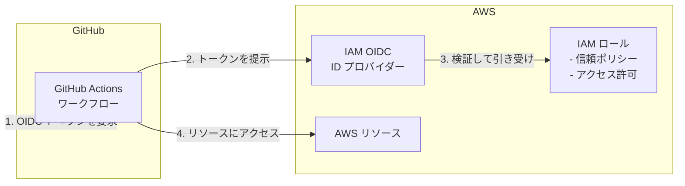

# AWS GitHub OIDC

この Terraform シナリオでは、GitHub Actions が OpenID Connect (OIDC) を使用して AWS で認証するために必要な AWS リソースを作成します。これにより、有効期間の長い AWS 資格情報を GitHub シークレットとして保存する必要がなくなります。

## アーキテクチャ



## 作成されるリソース

- **IAM OIDC ID プロバイダー**: GitHub Actions と AWS の間に信頼関係を確立します
- **IAM ロール**: GitHub Actions ワークフローが引き受けられるロールです
- **IAM ロールポリシーのアタッチメント**: 指定したポリシーをロールにアタッチします

## 前提条件

- IAM リソースを作成するための適切なアクセス許可を持つ AWS アカウント
- AWS の[プロバイダー認証](../../../docs/tips/provider-authentication.ja.md)を完了していること

## 使用方法

`SCENARIO=aws_github_oidc` を指定して、[Terraform ワークフロー](../../../docs/tips/terraform-workflow.ja.md)に従います。

### オプションの S3 バックエンド

S3 バックエンドを使用するには、このシナリオのディレクトリに `backend.tf` を作成します。

```bash
cat <<EOF > backend.tf
terraform {
  backend "s3" {
    bucket = "YOUR_S3_BUCKET_NAME"
    key    = "aws_github_oidc/terraform.tfstate"
    region = "ap-northeast-1"
  }
}
EOF
```

## 変数

| 名前                  | 説明                         | 既定値                                                   |
|-----------------------|------------------------------|----------------------------------------------------------|
| `aws_region`          | リソースをデプロイする AWS リージョン | `ap-northeast-1`                                         |
| `github_organization` | GitHub Organization 名       | `ks6088ts`                                               |
| `github_repository`   | GitHub リポジトリ名           | `template-terraform`                                     |
| `role_name`           | 作成する IAM ロールの名前     | `GitHubActionsRole`                                      |
| `policy_arns`         | アタッチする IAM ポリシー ARN の一覧 | `["arn:aws:iam::aws:policy/IAMReadOnlyAccess"]`         |
| `github_branches`     | 許可するブランチの一覧        | `[]` (すべてのブランチ)                                  |
| `github_environments` | 許可する環境の一覧            | `[]` (制限なし)                                          |
| `tags`                | リソースに適用するタグ        | variables.tf を参照                                      |

## GitHub Actions でのロールの使用

このシナリオをデプロイした後、OIDC 認証を使用するように GitHub Actions ワークフローを構成します。

```yaml
name: AWS OIDC の例

on:
  push:
    branches:
      - main

permissions:
  id-token: write  # OIDC に必要
  contents: read

jobs:
  deploy:
    runs-on: ubuntu-latest
    steps:
      - name: チェックアウト
        uses: actions/checkout@v4

      - name: AWS 資格情報を構成
        uses: aws-actions/configure-aws-credentials@v4
        with:
          role-to-assume: arn:aws:iam::YOUR_ACCOUNT_ID:role/GitHubActionsRole
          aws-region: ap-northeast-1

      - name: AWS 資格情報を確認
        run: aws sts get-caller-identity
```

## 出力

| 名前                | 説明                                      |
|---------------------|-------------------------------------------|
| `oidc_provider_arn` | GitHub Actions OIDC プロバイダーの ARN    |
| `oidc_provider_url` | GitHub Actions OIDC プロバイダーの URL    |
| `role_arn`          | GitHub Actions 用 IAM ロールの ARN        |
| `role_name`         | GitHub Actions 用 IAM ロールの名前        |
| `aws_account_id`    | AWS アカウント ID                         |

## セキュリティに関する考慮事項

- OIDC プロバイダーは、ロールを引き受けられる GitHub リポジトリを制限します
- `github_branches` または `github_environments` を指定すると、アクセスをさらに制限できます
- `policy_arns` を通じて、必要最小限のアクセス許可のみを付与します
- 環境 (開発、ステージング、本番) ごとに個別のロールを使用することを検討してください
