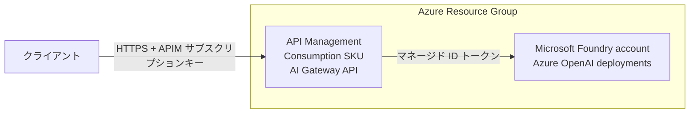

# Azure AI Gateway シナリオ

Microsoft Foundry の Azure OpenAI モデルデプロイの前段に Azure API Management を配置し、AI Gateway としてデプロイします。

## 概要

このシナリオでは次のリソースを作成します。

- **Resource Group**: すべてのリソースを格納します
- **Microsoft Foundry account**: ローカルキー認証を無効化した Azure OpenAI モデルデプロイをホストします
- **API Management (Consumption SKU)**: システム割り当てマネージド ID を持つ公開 AI Gateway エンドポイントです
- **APIM API、バックエンド、プロダクト、ポリシー**: チャット補完リクエストを Foundry の OpenAI エンドポイントへ転送し、マネージド ID で認証します
- **RBAC 割り当て**: API Management に Foundry アカウント上の Cognitive Services OpenAI User ロールを付与します

## 前提条件

[プロバイダー認証](../../../docs/tips/provider-authentication.ja.md)、
[標準 Terraform ワークフロー](../../../docs/tips/terraform-workflow.ja.md)、必要に応じた
[Azure Blob リモートステート](../../../docs/tips/azure-blob-backend.ja.md)は共通ガイドを参照してください。

リポジトリの Makefile を使う場合は `SCENARIO=azure_ai_gateway` を指定します。

## アーキテクチャ



## 使い方

[標準 Terraform ワークフロー](../../../docs/tips/terraform-workflow.ja.md)に従い、
`SCENARIO=azure_ai_gateway` を指定します。

デプロイ後、`AI Gateway` プロダクトの API Management サブスクリプションキーを作成または取得し、ゲートウェイエンドポイントを呼び出します。

```shell
GATEWAY_URL=$(terraform output -raw ai_gateway_openai_url)
DEPLOYMENT_NAME=$(terraform output -json model_deployment_names | jq -r '.[0]')

curl "${GATEWAY_URL}/deployments/${DEPLOYMENT_NAME}/chat/completions" \
  -H "Content-Type: application/json" \
  -H "Ocp-Apim-Subscription-Key: ${APIM_SUBSCRIPTION_KEY}" \
  -d '{"messages":[{"role":"user","content":"Say hello from the AI Gateway."}]}'
```

API ポリシーは、呼び出し元が `api-version` を省略した場合に既定値を追加します。既定値を上書きする場合は、リクエスト URL に `?api-version=<version>` を含めます。

## 変数

| 名前 | 説明 | 型 | 既定値 | 必須 |
|------|------|----|--------|------|
| `name` | リソース名のベース | `string` | `"azureaigateway"` | no |
| `location` | Azure リージョン | `string` | `"japaneast"` | no |
| `tags` | リソースへ適用するタグ | `map(string)` | variables.tf 参照 | no |
| `publisher_name` | APIM の発行者名 | `string` | `"Example Organization"` | no |
| `publisher_email` | APIM の発行者メール | `string` | `"admin@example.com"` | no |
| `gateway_api_path` | APIM で公開する API パスセグメント | `string` | `"openai"` | no |
| `openai_api_version` | 省略時に APIM が追加する Azure OpenAI API バージョン | `string` | `"2024-10-21"` | no |
| `model_deployments` | Microsoft Foundry のモデルデプロイ | `list(object)` | variables.tf 参照 | no |

## 出力

| 名前 | 説明 |
|------|------|
| `resource_group_name` | Resource Group の名前 |
| `api_management_id` | API Management インスタンスの ID |
| `api_management_name` | API Management インスタンスの名前 |
| `api_management_gateway_url` | API Management インスタンスの Gateway URL |
| `ai_gateway_openai_url` | Azure OpenAI リクエスト用の API Management URL プレフィックス |
| `api_management_principal_id` | API Management マネージド ID のプリンシパル ID |
| `microsoft_foundry_account_name` | Microsoft Foundry アカウント名 |
| `microsoft_foundry_openai_endpoint` | Microsoft Foundry アカウントの直接 Azure OpenAI エンドポイント |
| `model_deployment_names` | デプロイされた Azure OpenAI モデル名 |

## 注意事項

- Microsoft Foundry アカウントではローカル認証を無効化しているため、ゲートウェイは OpenAI API キーではなく Microsoft Entra ID トークンを使用します。
- APIM API は既定でサブスクリプションキーを要求します。ゲートウェイを利用するクライアント向けに API Management でサブスクリプションを作成してください。
- このシナリオでは `/openai/deployments/{deployment-id}/chat/completions` ルートを公開します。
