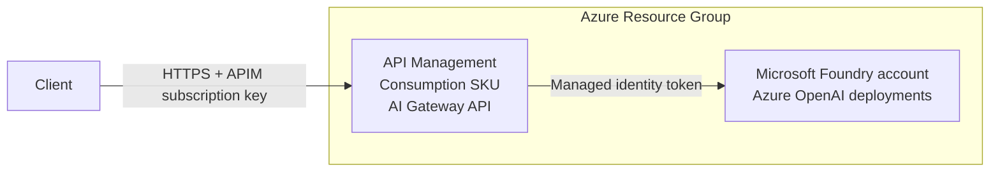

# Azure AI Gateway Scenario

Deploy Azure API Management as an AI Gateway in front of Microsoft Foundry Azure OpenAI model deployments.

## Overview

This scenario creates:

- **Resource Group**: Container for all resources
- **Microsoft Foundry account**: Hosts Azure OpenAI model deployments with local key authentication disabled
- **API Management (Consumption SKU)**: Public AI Gateway endpoint with a system-assigned managed identity
- **APIM API, backend, product, and policy**: Routes chat completions to the Foundry OpenAI endpoint and authenticates with managed identity
- **RBAC assignment**: Grants API Management the Cognitive Services OpenAI User role on the Foundry account

## Prerequisites

Use the shared guidance for [provider authentication](../../../docs/tips/provider-authentication.md),
the [standard Terraform workflow](../../../docs/tips/terraform-workflow.md), and optional
[Azure Blob remote state](../../../docs/tips/azure-blob-backend.md).

Set `SCENARIO=azure_ai_gateway` when using the repository Makefile.

## Architecture



## How to use

Follow the [standard Terraform workflow](../../../docs/tips/terraform-workflow.md) with
`SCENARIO=azure_ai_gateway`.

After deployment, create or retrieve an API Management subscription key for the `AI Gateway`
product, then call the gateway endpoint:

```shell
GATEWAY_URL=$(terraform output -raw ai_gateway_openai_url)
DEPLOYMENT_NAME=$(terraform output -json model_deployment_names | jq -r '.[0]')

curl "${GATEWAY_URL}/deployments/${DEPLOYMENT_NAME}/chat/completions" \
  -H "Content-Type: application/json" \
  -H "Ocp-Apim-Subscription-Key: ${APIM_SUBSCRIPTION_KEY}" \
  -d '{"messages":[{"role":"user","content":"Say hello from the AI Gateway."}]}'
```

The API policy adds `api-version` when callers omit it. To override the default, include
`?api-version=<version>` on the request URL.

## Variables

| Name | Description | Type | Default | Required |
|------|-------------|------|---------|----------|
| `name` | Base name for resources | `string` | `"azureaigateway"` | no |
| `location` | Azure region for resources | `string` | `"japaneast"` | no |
| `tags` | Tags to apply to resources | `map(string)` | See variables.tf | no |
| `publisher_name` | Publisher name for APIM | `string` | `"Example Organization"` | no |
| `publisher_email` | Publisher email for APIM | `string` | `"admin@example.com"` | no |
| `gateway_api_path` | Public API path segment exposed by APIM | `string` | `"openai"` | no |
| `openai_api_version` | Azure OpenAI API version added by APIM when omitted | `string` | `"2024-10-21"` | no |
| `model_deployments` | Microsoft Foundry model deployments | `list(object)` | See variables.tf | no |

## Outputs

| Name | Description |
|------|-------------|
| `resource_group_name` | Name of the resource group |
| `api_management_id` | ID of the API Management instance |
| `api_management_name` | Name of the API Management instance |
| `api_management_gateway_url` | Gateway URL of the API Management instance |
| `ai_gateway_openai_url` | API Management URL prefix for Azure OpenAI requests |
| `api_management_principal_id` | Principal ID of the API Management managed identity |
| `microsoft_foundry_account_name` | Name of the Microsoft Foundry account |
| `microsoft_foundry_openai_endpoint` | Direct Azure OpenAI endpoint of the Microsoft Foundry account |
| `model_deployment_names` | Names of the deployed Azure OpenAI models |

## Notes

- Local authentication is disabled on the Microsoft Foundry account, so the gateway uses Microsoft Entra ID tokens instead of OpenAI API keys.
- The APIM API requires a subscription key by default; create subscriptions in API Management for clients that should use the gateway.
- The scenario exposes the chat completions route: `/openai/deployments/{deployment-id}/chat/completions`.
