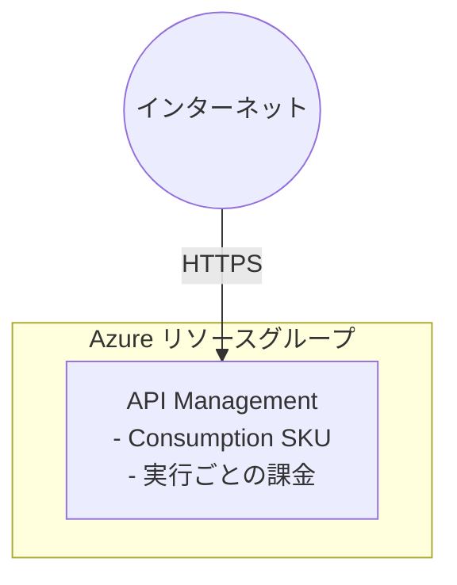

# API Management Playground シナリオ

API ゲートウェイの実験用に、Consumption SKU の Azure API Management をデプロイします。

## 概要

このシナリオでは、次のリソースを作成します。

- **リソースグループ**: すべてのリソースを格納します
- **API Management (Consumption SKU)**: 実行ごとの料金体系を採用したサーバーレス API ゲートウェイです

## 前提条件

共通ガイダンスの[プロバイダー認証](../../../docs/tips/provider-authentication.ja.md)、
[標準の Terraform ワークフロー](../../../docs/tips/terraform-workflow.ja.md)、およびオプションの
[Azure Blob リモートステート](../../../docs/tips/azure-blob-backend.ja.md)を使用します。

リポジトリの Makefile を使用する場合は、`SCENARIO=azure_apim_playground` を設定します。

## アーキテクチャ



## 使用方法

`SCENARIO=azure_apim_playground` を指定して、
[標準の Terraform ワークフロー](../../../docs/tips/terraform-workflow.ja.md)に従います。

### デプロイの確認

```shell
terraform output api_management_gateway_url
```

## 変数

| 名前                                | 説明                         | 型            | 既定値                   | 必須 |
|-------------------------------------|------------------------------|---------------|--------------------------|------|
| `name`                              | リソースのベース名           | `string`      | `"azureapimplayground"` | いいえ |
| `location`                          | リソースの Azure リージョン  | `string`      | `"japaneast"`           | いいえ |
| `tags`                              | リソースに適用するタグ       | `map(string)` | variables.tf を参照      | いいえ |
| `publisher_name`                    | APIM の発行元名              | `string`      | `"Example Organization"` | いいえ |
| `publisher_email`                   | APIM の発行元メールアドレス  | `string`      | `"admin@example.com"`   | いいえ |
| `sku_name`                          | APIM の SKU (`<tier>_<capacity>` 形式) | `string` | `"Consumption_0"`       | いいえ |

## 出力

| 名前                                | 説明                                      |
|-------------------------------------|-------------------------------------------|
| `resource_group_name`               | リソースグループの名前                    |
| `api_management_id`                 | API Management インスタンスの ID          |
| `api_management_name`               | API Management インスタンスの名前         |
| `api_management_gateway_url`        | API Management インスタンスのゲートウェイ URL |
| `api_management_management_api_url` | API Management インスタンスの管理 API URL |
| `api_management_portal_url`         | API Management インスタンスの発行者ポータル URL |
| `api_management_developer_portal_url` | API Management インスタンスの開発者ポータル URL |

## 注意事項

- **SKU**: 既定値は `Consumption_0` です。別のレベルを使う場合は `sku_name` を上書きしてください (例: `Developer_1`)
- **Consumption SKU**: アイドル時の最小コストが発生しないサーバーレス料金モデルです
- **コールドスタート**: Consumption レベルでは、最初のリクエストでコールドスタートにより待機時間が長くなる場合があります
- **制限事項**: Consumption レベルでは、開発者ポータルや VNet 統合など一部の機能を利用できません
