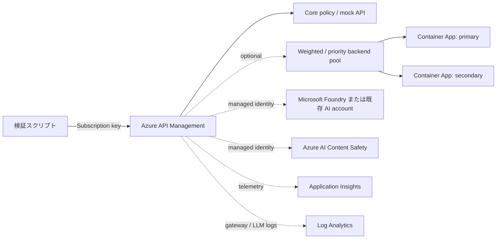

# API Management Playground シナリオ

[English](./README.md)

このシナリオは、空のゲートウェイではなく、実際に検証できる Azure API Management
環境を構築します。既定のデプロイは、`Consumption_0` 上で動く低コストかつ自己完結した
API です。回復性、Microsoft Foundry、Azure AI Content Safety、可観測性は nullable な
opt-in です。コントロールプレーンの変更はすべて Terraform で表現し、スクリプトは
デプロイ済みデータプレーンの呼び出しと telemetry query だけを実行します。

## アーキテクチャ



## 実行可能な機能

常時有効な core layer は、OpenAPI API と version set、2 つの operation、named value、
再利用可能な policy fragment、公開済み product、生成 key を持つ active subscription を
作成します。deterministic response、`mock-response`、response header、subscription rate
limit の各 policy を実行できます。

opt-in layer では次の機能を追加します。

| Layer | Terraform resource と動作 | データプレーン検証 |
| --- | --- | --- |
| Backend resilience | 2 つの Container Apps、weighted pool、任意の cookie affinity、deterministic 503 backend、circuit breaker、priority failover | weighted pool で両 backend を観測し、failover で secondary へ到達 |
| AI gateway | 新規 Foundry account/model または既存 OpenAI v1 endpoint、APIM managed identity、RBAC、keyless backend authentication | APIM 経由で chat completion を取得 |
| Token governance | `llm-token-limit` の rate/quota policy | 反復 request で HTTP 429 を確認 |
| Content Safety | 新規または既存 Content Safety account、RBAC、managed-identity backend、`llm-content-safety` | script で作成した blocklist の語を HTTP 403 で拒否 |
| Standard telemetry | Log Analytics、workspace-based Application Insights、managed-identity logger、APIM diagnostics、HTTP body 0 byte | Terraform test で control plane を検証 |
| LLM logs | Azure Monitor の AI gateway usage logs。prompt/completion 本文は既定で無効 | KQL で `ApiManagementGatewayLlmLog` を確認 |
| Token metrics | preview の `llm-emit-token-metric`、diagnostic metrics、dimension 付き custom metrics | KQL で直近の `AppMetrics` を確認 |

## 前提条件

- Terraform `>= 1.11.0`
- 対象 subscription に認証済みの Azure CLI
- データプレーン検証用の `curl` と `jq`
- 選択した Azure resource と role assignment を作成できる権限
- Foundry を新規作成する場合は、対象 region での model availability と quota

共通ガイダンスの[プロバイダー認証](../../../docs/tips/provider-authentication.ja.md)、
[標準の Terraform ワークフロー](../../../docs/tips/terraform-workflow.ja.md)、および任意の
[Azure Blob リモートステート](../../../docs/tips/azure-blob-backend.ja.md)も参照してください。

## ハンズオンチュートリアル

このチュートリアルは、Azure CLI と Terraform の基本操作を理解しているクラウドエンジニアを
対象とします。Core API を必修とし、backend resilience、AI gateway、Content Safety、可観測性を
独立した発展ラボとして選択できます。

| 経路 | Profile | 内容 | 目安 |
| --- | --- | --- | --- |
| 必修: Core | 既定値 | Policy response、mock、header、rate limit | 30～45 分 + APIM 作成時間 |
| 選択: Load balancing | `profiles/consumption_load_balancing.tfvars` | 3:1 weighted backend pool | 30～45 分 + 作成時間 |
| 選択: Resilience | `profiles/full_developer.tfvars` | Affinity、circuit breaker、priority failover、標準監視 | 45～60 分 + 作成時間 |
| 選択: AI gateway | `profiles/new_foundry.tfvars` または local copy | AI、token limit、Content Safety、LLM logs、token metrics | 60～90 分 + 作成時間 |

> [!IMPORTANT]
> `location` を変更した場合、または APIM SKU が Consumption tier の境界をまたぐ場合、Terraform は
> 生成 suffix を更新して playground 全体を置換します。apply 前に破壊的な plan を確認してください。
> resource 名、URL、managed identity、生成 key が変わります。既存 deployment をこの version の
> コードへ初めて移行する plan でも、新しい replacement keeper による 1 回限りの全置換が表示される
> 場合があります。

## クイックスタート

Lab 0 の backend 初期化を完了した後、既定の path では APIM と自己完結した core API だけを
デプロイします。

```shell
cd infra/scenarios/azure_apim_playground
terraform test
terraform apply
./scripts/run_all.sh
terraform destroy
```

APIM の作成には数分かかることがあります。Consumption の初回 request では cold start に
よって待機時間が長くなる場合もあります。

## Profiles

opt-in layer を使用するときは profile を指定します。`plan`、`apply`、`destroy` には
同じ `-var-file` を指定してください。

Azure は Consumption tier からの upgrade または Consumption tier への downgrade をサポート
しません。このシナリオは生成する resource suffix を `location` と APIM SKU family
（`consumption` または `dedicated`）に関連付けます。region の変更または Consumption 境界を
またぐ変更では、APIM SKU update ではなく playground 全体の置換が plan されます。random suffix
と APIM が作成または置換される場合だけ続行し、APIM が `~ update in-place` と表示される plan は
apply しないでください。dedicated tier 間の変更では suffix を維持します。

`ChangingSkuTypeNotSupported` または `ServiceModelDeprecating` で apply が失敗した後は、使用する
profile で plan をやり直します。残っている state に応じて suffix と APIM は新規作成または置換に
なります。再 apply 前に plan の `eastus2` と選択した model を確認してください。

| Profile | 用途 | 重要な注意点 |
| --- | --- | --- |
| `profiles/consumption_load_balancing.tfvars` | `Consumption_0` の core と 3:1 weighted pool | Circuit breaker は含まない |
| `profiles/full_developer.tfvars` | Weighted pool、affinity、circuit breaker、standard observability | 課金対象の Developer APIM と monitoring resource を作成 |
| `profiles/new_foundry.tfvars` | Foundry と Content Safety を新規作成する full resilience / AI path | apply 前に model lifecycle、quota、capacity を確認 |
| `profiles/existing_ai.tfvars` | 既存 AI と Content Safety resource を使用する full AI path | すべての `replace-me` を先に置換 |

実行例:

```shell
terraform plan -var-file=profiles/new_foundry.tfvars
terraform apply -parallelism=1 -var-file=profiles/new_foundry.tfvars
./scripts/run_all.sh

CONFIRM_CLEANUP=delete-apim-playground-data ./scripts/09_cleanup.sh
terraform destroy -var-file=profiles/new_foundry.tfvars
```

`09_cleanup.sh` が削除するのは script が作成した Content Safety blocklist だけです。
Terraform 管理 resource は変更しません。`run_all.sh` の最後に削除する場合は
`CLEANUP_AFTER_RUN=true` を設定します。

## 段階式ハンズオン

### Lab 0: 環境を準備する

#### 0.1 ツールと Azure session を確認する

リポジトリルートから、使用する subscription を明示します。

```bash
terraform version
az version
curl --version
jq --version

AZURE_SUBSCRIPTION="<subscription-name-or-id>"
az login
az account set --subscription "$AZURE_SUBSCRIPTION"
az account show --query '{name:name,id:id,tenantId:tenantId,user:user.name}' --output table

export ARM_SUBSCRIPTION_ID=$(az account show --query id --output tsv)
```

選択した Azure resource と role assignment を作成できる権限が必要です。credential、access token、
Terraform state、保存済み plan、APIM subscription key は commit や CI log に出力しないでください。

#### 0.2 Terraform state を初期化する

このシナリオの `backend.tf` にはリポジトリ管理者用の Azure Blob backend 値が入っています。
参加者は先に[Azure Blob Storage バックエンド](../../../docs/tips/azure-blob-backend.ja.md)を作成し、
container scope の `Storage Blob Data Contributor` を付与してから、4 つの値をすべて上書きします。

```bash
cd infra/scenarios/azure_apim_playground

BACKEND_RESOURCE_GROUP="<your-backend-resource-group>"
BACKEND_STORAGE_ACCOUNT="<your-storage-account>"
BACKEND_CONTAINER="<your-state-container>"
BACKEND_KEY="azure_apim_playground.<your-name>.tfstate"

terraform init -reconfigure \
    -backend-config="resource_group_name=${BACKEND_RESOURCE_GROUP}" \
    -backend-config="storage_account_name=${BACKEND_STORAGE_ACCOUNT}" \
    -backend-config="container_name=${BACKEND_CONTAINER}" \
    -backend-config="key=${BACKEND_KEY}"
```

初期化に失敗した場合は apply へ進みません。backend storage は、このシナリオの destroy が完了し、
state が不要になったことを確認するまで削除しないでください。

#### 0.3 AI 経路の model と quota を確認する

`profiles/new_foundry.tfvars` は `eastus2` に `DataZoneStandard` の `gpt-5.4-mini` version
`2026-03-17` を作成します。新規作成経路を選ぶ場合だけ、apply 前に現在の lifecycle、残り quota、
deployable capacity を確認します。

```bash
LOCATION="eastus2"
MODEL_NAME="gpt-5.4-mini"
MODEL_VERSION="2026-03-17"
DEPLOYMENT_SKU="DataZoneStandard"

az cognitiveservices model list \
    --location "$LOCATION" \
    --query "[?model.name=='${MODEL_NAME}' && model.version=='${MODEL_VERSION}'] | [0].{model:model.name,version:model.version,lifecycle:model.lifecycleStatus,inferenceRetirement:model.deprecation.inference,skus:join(',', model.skus[].name)}" \
    --output table

az cognitiveservices usage list \
    --location "$LOCATION" \
    --query "[?name.value=='OpenAI.${DEPLOYMENT_SKU}.${MODEL_NAME}'].{quota:name.value,used:currentValue,limit:limit}" \
    --output table

az rest --method get \
    --url "https://management.azure.com/subscriptions/${ARM_SUBSCRIPTION_ID}/providers/Microsoft.CognitiveServices/modelCapacities?api-version=2024-10-01&modelFormat=OpenAI&modelName=${MODEL_NAME}&modelVersion=${MODEL_VERSION}" \
    --query "value[?location=='${LOCATION}' && properties.skuName=='${DEPLOYMENT_SKU}'].{location:location,sku:properties.skuName,availableCapacity:properties.availableCapacity}" \
    --output table
```

model の行が表示されない、`Lifecycle` が `GenerallyAvailable` ではない、`Skus` に
`DataZoneStandard` が含まれない、未使用 quota が 10 未満、または `AvailableCapacity` が 10 未満の
場合は apply しません。model lifecycle、subscription quota、service capacity はリポジトリの変更
とは独立して変わります。現在デプロイ可能な設定の local tfvars を作るか、既存 AI 経路を選択します。
最新価格は
[Azure 料金計算ツール](https://azure.microsoft.com/pricing/calculator/)で確認してください。

### テストの読み方

| テスト | コマンド | 検証対象 | Azure resource |
| --- | --- | --- | --- |
| Control plane | `terraform test` | Mock provider を使った resource、policy、依存関係、precondition の plan assertion | 作成しない |
| Data plane | `./scripts/*.sh` | デプロイ済み endpoint の HTTP status、payload、telemetry | apply が必要 |

`terraform test` の成功だけでは live endpoint の動作を証明できません。逆に shell script は Terraform
resource 定義を網羅的には検証しないため、control plane test の後に data plane test を実行します。

### Lab 1: Core API を構築する

#### 1.1 静的検証、test、apply

```bash
terraform fmt -check
terraform validate
terraform test
terraform plan
terraform apply
```

plan の内容を確認してから apply を承認します。APIM の作成には時間がかかることがあります。
`terraform test` は、versioned API、published product、active subscription、deterministic response、
mock response、rate limit、および発展 layer が既定で無効であることを検証します。

#### 1.2 Core data plane を検証する

```bash
./scripts/00_validate_prerequisites.sh
./scripts/01_test_core.sh
```

期待する結果:

```text
Core hello policy returned the expected payload.
Core mock-response policy returned the expected payload.
Core subscription rate limit returned HTTP 429 as configured.
```

subscription key を表示せず、1 request を手動で確認できます。

```bash
PLAYGROUND_KEY=$(terraform output -raw playground_subscription_primary_key)
CORE_HELLO_URL=$(terraform output -raw core_hello_url)

curl --silent --show-error \
    --request GET \
    --header "Ocp-Apim-Subscription-Key: ${PLAYGROUND_KEY}" \
    --header "Accept: application/json" \
    "$CORE_HELLO_URL" | jq .

unset PLAYGROUND_KEY CORE_HELLO_URL
```

期待する payload:

```json
{
    "message": "hello from Azure API Management",
    "source": "policy"
}
```

既定の rate limit は 60 秒に 5 calls です。手動 request と script は同じ counter を使用するため、
続けて実行すると早めに HTTP 429 になる場合があります。

終了する場合、または発展ラボへ進む場合は既定構成を削除します。

```bash
terraform destroy
```

### Lab 2: Weighted routing を確認する

このラボは `Consumption_0` のまま、2 つの Container Apps と 3:1 weighted backend pool を
追加します。重みは確率的な比率であり、24 requests が厳密に 18:6 になる保証はありません。

```bash
PROFILE="profiles/consumption_load_balancing.tfvars"

terraform plan -var-file="$PROFILE"
terraform apply -parallelism=1 -var-file="$PROFILE"

./scripts/00_validate_prerequisites.sh
./scripts/01_test_core.sh
./scripts/02_test_weighted_routing.sh
```

期待する結果:

```text
Weighted routing reached both backends across 24 requests.
Primary responses: <1 以上>
Secondary responses: <1 以上>
```

片方だけが観測された場合は sample を増やします。

```bash
BACKEND_REQUESTS=60 ./scripts/02_test_weighted_routing.sh
```

```bash
terraform destroy -var-file="$PROFILE"
unset PROFILE
```

### Lab 3: Circuit breaker と priority failover を確認する

このラボは `Developer_1` を作成し、weighted pool、cookie affinity、deterministic 503 backend、
circuit breaker、priority secondary、標準 monitoring を有効にします。backend circuit breaker は
Consumption tier ではサポートされません。

```bash
PROFILE="profiles/full_developer.tfvars"

terraform plan -var-file="$PROFILE"
terraform apply -parallelism=1 -var-file="$PROFILE"

./scripts/00_validate_prerequisites.sh
./scripts/01_test_core.sh
./scripts/02_test_weighted_routing.sh
./scripts/03_test_failover.sh
```

期待する結果:

```text
Circuit-breaker failover reached the priority secondary backend.
Observed primary 503 responses before failover: <0 以上>
```

profile の failure count は 2、trip duration は 1 分です。circuit breaker の判定は gateway instance
間で完全には同期されないため、primary failure の正確な件数は assertion にしません。secondary が
観測されない場合だけ試行数を増やします。

```bash
FAILOVER_ATTEMPTS=20 ./scripts/03_test_failover.sh
```

`session_affinity_cookie_name` も設定されますが、付属 script は cookie 維持を検証しません。
stateful client は `Set-Cookie` を保存し、後続 request で送信する必要があります。

```bash
terraform destroy -var-file="$PROFILE"
unset PROFILE
```

### Lab 4: AI gateway と governance を確認する

#### 4.1 AI profile を選択する

新規 Foundry と Content Safety を作成する場合:

```bash
PROFILE="profiles/new_foundry.tfvars"
```

既存 AI と Content Safety を使う場合は、tracked profile を直接編集せず、git-ignored local file へ
コピーして `replace-me` を endpoint、resource ID、deployment name に置換します。credential や
API key は tfvars に保存しません。

```bash
cp profiles/existing_ai.tfvars existing_ai.local.tfvars
grep -n 'replace-me' existing_ai.local.tfvars

# エディターですべての replace-me を置換する
grep -n 'replace-me' existing_ai.local.tfvars

PROFILE="existing_ai.local.tfvars"
```

2 回目の `grep` が何も返さないことを確認します。

#### 4.2 Deploy と feature flag の確認

```bash
terraform plan -var-file="$PROFILE"
terraform apply -parallelism=1 -var-file="$PROFILE"

terraform output ai_backend_enabled
terraform output ai_backend_mode
terraform output ai_reasoning_effort
terraform output llm_token_limit_enabled
terraform output content_safety_enabled
terraform output observability_enabled
terraform output llm_logging_enabled
terraform output llm_token_metrics_enabled
```

APIM managed identity の role assignment が反映されるまで、apply 完了後にも短い待ち時間が発生する
場合があります。sensitive な subscription key は出力しません。

`new_foundry` profile は `ai_reasoning_effort` を `none` に設定し、低い token 上限の test でも
reasoning ではなく表示本文へ completion budget を使用します。validation script は output が non-null
の場合だけこの field を送ります。`AI_MAX_TOKENS` と `TOKEN_LIMIT_MAX_TOKENS` は request の
`max_completion_tokens` を制御します。

#### 4.3 すべての有効な test を実行する

```bash
./scripts/run_all.sh
```

`new_foundry` profile では 00～08 がすべて実行されます。既存 AI profile は backend pool を設定
しないため、weighted routing と circuit breaker は `Skip` になります。

| 検証 | Script | 成功条件 | 主な注意点 |
| --- | --- | --- | --- |
| AI gateway | `04_test_ai_gateway.sh` | Completion を返す HTTP 200 | Client は APIM key、backend は managed identity で認証 |
| Token limit | `05_test_token_limit.sh` | Rate limit の HTTP 429 | Quota 超過は HTTP 403。token count は model と推定方式に依存 |
| Content Safety | `06_test_content_safety.sh` | Blocklist 語を HTTP 403 で拒否 | Blocklist/item の伝播待ちがある |
| LLM logs | `07_test_llm_logs.sh` | `ApiManagementGatewayLlmLog` を 1 件以上取得 | Prompt/completion 本文は既定で無効。ingestion delay がある |
| Token metrics | `08_test_custom_metrics.sh` | `AppMetrics` を 1 件以上取得 | Custom dimension は最大 5。high cardinality を避ける |

個別 test を再実行する例:

```bash
AI_PROMPT="Reply with exactly: APIM gateway verified" \
AI_MAX_TOKENS=64 \
./scripts/04_test_ai_gateway.sh

TOKEN_LIMIT_ATTEMPTS=40 \
TOKEN_LIMIT_MAX_TOKENS=1 \
./scripts/05_test_token_limit.sh

CONTENT_SAFETY_PROPAGATION_SECONDS=10 \
./scripts/06_test_content_safety.sh

LOG_QUERY_ATTEMPTS=20 \
LOG_QUERY_INTERVAL_SECONDS=15 \
./scripts/07_test_llm_logs.sh

LOG_QUERY_ATTEMPTS=20 \
LOG_QUERY_INTERVAL_SECONDS=15 \
./scripts/08_test_custom_metrics.sh
```

### Cleanup

Content Safety を有効にした場合は、Terraform destroy の前に script が作成した blocklist を削除します。

```bash
CONFIRM_CLEANUP=delete-apim-playground-data ./scripts/09_cleanup.sh
```

期待する結果:

```text
Deleted Content Safety blocklist: apim-playground
Terraform-managed infrastructure was not changed.
```

既に blocklist がない場合も成功します。検証と data-plane cleanup を 1 回で行う場合:

```bash
CLEANUP_AFTER_RUN=true ./scripts/run_all.sh
```

最後に、現在の apply で使った同じ profile で Terraform resource を削除します。

```bash
terraform plan -destroy -var-file="$PROFILE"
terraform destroy -var-file="$PROFILE"
unset PROFILE
```

既定の Core 構成では `-var-file` を付けません。destroy plan に想定外の resource がある場合は承認せず、
Azure subscription、backend key、現在の profile を確認してください。

### トラブルシューティング

| 症状 | 主な原因 | 確認と対処 |
| --- | --- | --- |
| `terraform init` が Blob 403 | Backend 値または data-plane RBAC が不正 | 4 つの backend 値と container scope の `Storage Blob Data Contributor` を確認 |
| plan が別環境の resource を表示 | Subscription または backend key が不正 | `az account show`、`ARM_SUBSCRIPTION_ID`、`BACKEND_KEY` を確認し、apply しない |
| `Terraform output is empty` | 必要な profile を apply していない | Feature flag と active profile を確認 |
| Core が HTTP 401/403 | APIM subscription key がない、または不正 | Key を `terraform output -raw` から shell 変数へ再取得 |
| Core がすぐ HTTP 429 | 同じ renewal window で request 済み | Window の更新後に再実行 |
| Weighted test で片方だけ観測 | 少ない sample による確率的偏り | `BACKEND_REQUESTS` を増やす |
| Circuit breaker が disabled | Consumption または誤った profile | Developer profile を plan し、全置換を確認してから apply |
| AI が HTTP 401/403 | APIM identity の RBAC 未反映、resource ID 不正 | Role assignment を確認し、伝播後に再実行 |
| `ChangingSkuTypeNotSupported` | 古い構成が APIM の Consumption SKU を in-place update しようとした | 現在のコードと active profile を使い、suffix と APIM が作成または置換され、`~ update in-place` でないことを確認 |
| `ServiceModelDeprecating` | 設定した model が新規 deployment を受け付けない | Lab 0 を再実行し、quota と capacity がある `GenerallyAvailable` model/SKU を選択 |
| Model deployment が失敗 | Region、lifecycle、deployment SKU、quota、capacity が利用不可 | Lab 0 の model/usage/capacity query を確認 |
| Blocked term が HTTP 200 | Blocklist/item の伝播待ち | `CONTENT_SAFETY_PROPAGATION_SECONDS` を増やす |
| LLM log/metric がない | AI request 未実行、ingestion delay、feature disabled | `run_all.sh` 後に polling 回数と間隔を増やす |
| Token limit が HTTP 429 にならない | Counter window または model token usage の差 | `TOKEN_LIMIT_ATTEMPTS` を増やす |

### 本番採用前に決めること

この playground は public endpoint を使用し、Developer APIM には SLA がありません。本番採用前に、
client authentication/authorization、APIM tier と region、private network、backend quota、token の
counter key、Content Safety threshold、ログの retention/access control、metric dimensions の
cardinality と alert の所有者を決定してください。

## 検証スクリプト

| Script | 検証内容 |
| --- | --- |
| `00_validate_prerequisites.sh` | tool、Terraform output、Azure session、必要な token acquisition |
| `01_test_core.sh` | Hello payload、mock payload、marker header、HTTP 429 rate limit |
| `02_test_weighted_routing.sh` | Weighted pool から primary / secondary の response |
| `03_test_failover.sh` | Circuit breaker が開き priority secondary が traffic を処理 |
| `04_test_ai_gateway.sh` | Managed-identity authentication による OpenAI-compatible completion |
| `05_test_token_limit.sh` | LLM token policy の HTTP 429 |
| `06_test_content_safety.sh` | Blocklist 作成と HTTP 403 enforcement |
| `07_test_llm_logs.sh` | 直近の `ApiManagementGatewayLlmLog` record |
| `08_test_custom_metrics.sh` | 直近の Application Insights `AppMetrics` record |
| `09_cleanup.sh` | Script が作成した blocklist data の idempotent な削除 |
| `run_all.sh` | 有効な test を実行し、無効な layer を skip として表示 |

Telemetry ingestion は eventual consistency です。既定の 2 分間の polling で不足する場合は、
`LOG_QUERY_ATTEMPTS` と `LOG_QUERY_INTERVAL_SECONDS` を変更してください。token-limit profile
は短時間で 429 を確認するために低い limit を使用します。別の設定では
`TOKEN_LIMIT_ATTEMPTS` を調整できます。

## 構成

core rate limit を除く feature object の既定値はすべて `null` です。主な input は次のとおりです。

| Input | 動作 |
| --- | --- |
| `location` | 既定は `eastus2`。変更すると suffix を更新して playground 全体を置換 |
| `sku_name` | 既定は `Consumption_0`。Consumption 境界をまたぐ変更では playground 全体を置換 |
| `core_rate_limit` | Core API の calls と renewal period を設定 |
| `backend_pool` | Container Apps と weighted routing を有効化。nested `circuit_breaker` は任意 |
| `ai_backend` | `provision` または `existing` のどちらか一方が必須。新規 deployment の既定 SKU は `DataZoneStandard` |
| `ai_backend.reasoning_effort` | 任意の model 固有 request 値。`new_foundry` は `none` を使用し、null の場合は field を送信しない |
| `llm_token_limit` | 任意の token rate/quota policy。AI と non-Consumption APIM が必要 |
| `content_safety` | `provision` または `existing` のどちらか一方が必須。AI と non-Consumption APIM が必要 |
| `observability` | Log Analytics、Application Insights、logger、diagnostics を有効化 |
| `observability.llm_logging` | Usage logs を有効化。prompt/completion 本文は明示指定しない限り無効 |
| `llm_token_metrics` | Experimental custom metrics と最大 5 個の公式 dimension。AI と observability が必要 |
| `operator_principal_id` | Content Safety data を管理する principal。既定は Terraform caller |

script から利用する machine-readable contract は `terraform output -json` です。subscription
key は sensitive として扱われます。CI log に出力したり output snapshot を commit したりしないでください。

## IaC の境界

Terraform は API、product、subscription、policy、backend、pool、identity、RBAC、diagnostics、
Foundry deployment、Content Safety account、monitoring resource を所有します。`scripts/`
directory が実行するデータプレーン操作は次のものだけです。

- Gateway endpoint の呼び出し
- deterministic な Content Safety blocklist の作成と削除
- Log Analytics と Application Insights data の query

APIM、Foundry、RBAC、monitoring のコントロールプレーンを script から変更することはありません。

## SKU、Preview、Security の注意点

- Circuit breaker、`llm-token-limit`、`llm-content-safety` を `Consumption_0` で指定すると、
    Terraform precondition が拒否します。`Developer_1` または対応する上位 tier を使用してください。
- [APIM の upgrade と scale](https://learn.microsoft.com/azure/api-management/upgrade-and-scale)では、
    Consumption への移行と Consumption からの移行をサポートしません。この境界をまたぐ profile では
    scenario が suffix を更新して全置換を plan するため、apply 前に破壊的な変更を確認してください。
- Backend pool は stable API `2024-05-01` を使用します。Cookie affinity は
    `2024-10-01-preview`、AI diagnostics と Content Safety backend integration は
    `2024-06-01-preview` です。
- Token metrics は experimental です。公式の
    [Azure-Samples/AI-Gateway Application Insights module](https://github.com/Azure-Samples/AI-Gateway/blob/main/modules/monitor/v1/appinsights.bicep)
    と同じく、まだ公開 schema にない `CustomMetricsOptedInType = "WithDimensions"` を AzAPI で送信します。
- 新規作成する Foundry、Content Safety、Application Insights は local key authentication を
    無効化します。APIM は system-assigned identity と対象 scope の role assignment を使用します。
- tracked Foundry profile は `DataZoneStandard` を使用します。保存データは `eastus2` に残り、
    model inference は US data zone 内の任意の region で実行される場合があります。
- Prompt と completion の log には機密情報が含まれる場合があります。付属 profile では両方を
    無効化しており、有効化には明示的な指定が必要です。
- この playground は public endpoint を使用します。本番用の network boundary や
    data-exfiltration boundary を提供するものではありません。
- Developer APIM、Container Apps、Foundry model、Content Safety、Log Analytics、
    Application Insights には料金が発生する場合があります。検証後は profile を destroy してください。

## ドキュメントのみの拡張機能

次の重要な APIM 機能は、追加 service、組織固有の identity/network design、または preview
評価を必要とするため、このシナリオでは作成しません。

- [Semantic cache と scalability](https://learn.microsoft.com/azure/api-management/genai-gateway-capabilities#scalability-and-performance):
    Azure Managed Redis などの互換 cache と embeddings backend が必要
- [Unified model API](https://learn.microsoft.com/azure/api-management/unified-model-api): preview surface
- [その他の OpenAI-compatible LLM API の import](https://learn.microsoft.com/azure/api-management/openai-compatible-llm-api)
- [OAuth/JWT validation](https://learn.microsoft.com/azure/api-management/validate-jwt-policy)
- [Developer portal access design](https://learn.microsoft.com/azure/api-management/secure-developer-portal-access)
- [Private network integration](https://learn.microsoft.com/azure/api-management/api-management-howto-integrate-internal-vnet-appgateway)、
    [custom domain](https://learn.microsoft.com/azure/api-management/configure-custom-domain)、
    [self-hosted gateway](https://learn.microsoft.com/azure/api-management/self-hosted-gateway-overview)、
    multi-region production topology

## 一次資料

- [API Management backend、pool、circuit breaker](https://learn.microsoft.com/azure/api-management/backends)
- [AI gateway capabilities](https://learn.microsoft.com/azure/api-management/genai-gateway-capabilities)
- [`llm-token-limit` policy](https://learn.microsoft.com/azure/api-management/llm-token-limit-policy)
- [`llm-content-safety` policy](https://learn.microsoft.com/azure/api-management/llm-content-safety-policy)
- [Azure AI Content Safety blocklist](https://learn.microsoft.com/azure/ai-services/content-safety/quickstart-blocklist)
- [Application Insights integration](https://learn.microsoft.com/azure/api-management/api-management-howto-app-insights)
- [LLM logs と `ApiManagementGatewayLlmLog`](https://learn.microsoft.com/azure/api-management/api-management-howto-llm-logs)
- [`llm-emit-token-metric` policy](https://learn.microsoft.com/azure/api-management/llm-emit-token-metric-policy)
- [Azure OpenAI quota と capacity](https://learn.microsoft.com/azure/foundry/openai/how-to/quota)
- [AzureRM backend](https://developer.hashicorp.com/terraform/language/backend/azurerm)
