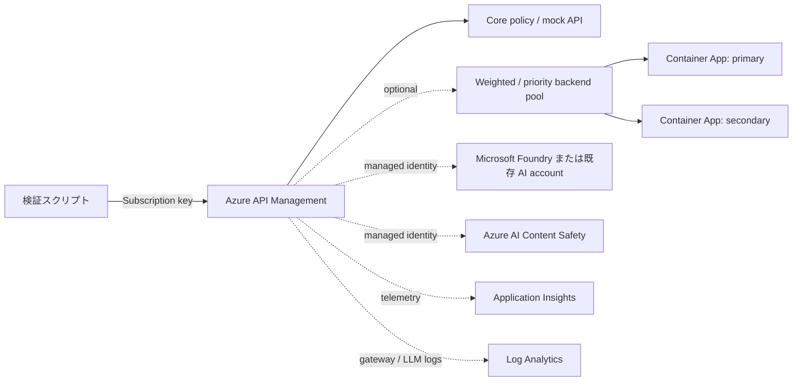

# API Management Playground シナリオ

[English](./README.md)

このシナリオは、空のゲートウェイではなく、実際に検証できる Azure API Management
環境を構築します。既定のデプロイは、`Consumption_0` 上で動く低コストかつ自己完結した
API です。回復性、Microsoft Foundry、Azure AI Content Safety、可観測性は nullable な
opt-in です。コントロールプレーンの変更はすべて Terraform で表現し、スクリプトは
デプロイ済みデータプレーンの呼び出しと telemetry query だけを実行します。

## アーキテクチャ



## 実行可能な機能

常時有効な core layer は、OpenAPI API と version set、2 つの operation、named value、
再利用可能な policy fragment、公開済み product、生成 key を持つ active subscription を
作成します。deterministic response、`mock-response`、response header、subscription rate
limit の各 policy を実行できます。

opt-in layer では次の機能を追加します。

| Layer | Terraform resource と動作 | データプレーン検証 |
| --- | --- | --- |
| Backend resilience | 2 つの Container Apps、weighted pool、任意の cookie affinity、deterministic 503 backend、circuit breaker、priority failover | weighted pool で両 backend を観測し、failover で secondary へ到達 |
| AI gateway | 新規 Foundry account/model または既存 OpenAI v1 endpoint、APIM managed identity、RBAC、keyless backend authentication | APIM 経由で chat completion を取得 |
| Token governance | `llm-token-limit` の rate/quota policy | 反復 request で HTTP 429 を確認 |
| Content Safety | 新規または既存 Content Safety account、RBAC、managed-identity backend、`llm-content-safety` | script で作成した blocklist の語を HTTP 403 で拒否 |
| Standard telemetry | Log Analytics、workspace-based Application Insights、managed-identity logger、APIM diagnostics、HTTP body 0 byte | Terraform test で control plane を検証 |
| LLM logs | Azure Monitor の AI gateway usage logs。prompt/completion 本文は既定で無効 | KQL で `ApiManagementGatewayLlmLog` を確認 |
| Token metrics | preview の `llm-emit-token-metric`、diagnostic metrics、dimension 付き custom metrics | KQL で直近の `AppMetrics` を確認 |

## 前提条件

- Terraform `>= 1.11.0`
- 対象 subscription に認証済みの Azure CLI
- データプレーン検証用の `curl` と `jq`
- 選択した Azure resource と role assignment を作成できる権限
- Foundry を新規作成する場合は、対象 region での model availability と quota

共通ガイダンスの[プロバイダー認証](../../../docs/tips/provider-authentication.ja.md)、
[標準の Terraform ワークフロー](../../../docs/tips/terraform-workflow.ja.md)、および任意の
[Azure Blob リモートステート](../../../docs/tips/azure-blob-backend.ja.md)も参照してください。

## クイックスタート

既定の path では APIM と自己完結した core API だけをデプロイします。

```shell
cd infra/scenarios/azure_apim_playground
terraform init
terraform test
terraform apply
./scripts/run_all.sh
terraform destroy
```

APIM の作成には数分かかることがあります。Consumption の初回 request では cold start に
よって待機時間が長くなる場合もあります。

## Profiles

opt-in layer を使用するときは profile を指定します。`plan`、`apply`、`destroy` には
同じ `-var-file` を指定してください。

最初の apply 前に APIM tier を選択してください。Azure は Consumption tier からの upgrade
または Consumption tier への downgrade をサポートしません。既定の Consumption deployment
がすでに存在する場合は、作成時と同じ構成で destroy してから、Developer profile を新規
deployment として apply します。Terraform plan に in-place SKU update と表示されても、
Azure API はその変更を受け付けません。

| Profile | 用途 | 重要な注意点 |
| --- | --- | --- |
| `profiles/consumption_load_balancing.tfvars` | `Consumption_0` の core と 3:1 weighted pool | Circuit breaker は含まない |
| `profiles/full_developer.tfvars` | Weighted pool、affinity、circuit breaker、standard observability | 課金対象の Developer APIM と monitoring resource を作成 |
| `profiles/new_foundry.tfvars` | Foundry と Content Safety を新規作成する full resilience / AI path | apply 前に model version、region availability、quota を確認 |
| `profiles/existing_ai.tfvars` | 既存 AI と Content Safety resource を使用する full AI path | すべての `replace-me` を先に置換 |

実行例:

```shell
terraform plan -var-file=profiles/new_foundry.tfvars
terraform apply -parallelism=1 -var-file=profiles/new_foundry.tfvars
./scripts/run_all.sh

CONFIRM_CLEANUP=delete-apim-playground-data ./scripts/09_cleanup.sh
terraform destroy -var-file=profiles/new_foundry.tfvars
```

`09_cleanup.sh` が削除するのは script が作成した Content Safety blocklist だけです。
Terraform 管理 resource は変更しません。`run_all.sh` の最後に削除する場合は
`CLEANUP_AFTER_RUN=true` を設定します。

## 検証スクリプト

| Script | 検証内容 |
| --- | --- |
| `00_validate_prerequisites.sh` | tool、Terraform output、Azure session、必要な token acquisition |
| `01_test_core.sh` | Hello payload、mock payload、marker header、HTTP 429 rate limit |
| `02_test_weighted_routing.sh` | Weighted pool から primary / secondary の response |
| `03_test_failover.sh` | Circuit breaker が開き priority secondary が traffic を処理 |
| `04_test_ai_gateway.sh` | Managed-identity authentication による OpenAI-compatible completion |
| `05_test_token_limit.sh` | LLM token policy の HTTP 429 |
| `06_test_content_safety.sh` | Blocklist 作成と HTTP 403 enforcement |
| `07_test_llm_logs.sh` | 直近の `ApiManagementGatewayLlmLog` record |
| `08_test_custom_metrics.sh` | 直近の Application Insights `AppMetrics` record |
| `09_cleanup.sh` | Script が作成した blocklist data の idempotent な削除 |
| `run_all.sh` | 有効な test を実行し、無効な layer を skip として表示 |

Telemetry ingestion は eventual consistency です。既定の 2 分間の polling で不足する場合は、
`LOG_QUERY_ATTEMPTS` と `LOG_QUERY_INTERVAL_SECONDS` を変更してください。token-limit profile
は短時間で 429 を確認するために低い limit を使用します。別の設定では
`TOKEN_LIMIT_ATTEMPTS` を調整できます。

## 構成

core rate limit を除く feature object の既定値はすべて `null` です。主な input は次のとおりです。

| Input | 動作 |
| --- | --- |
| `sku_name` | 既定は `Consumption_0`。全機能の検証には `Developer_1` を使用 |
| `core_rate_limit` | Core API の calls と renewal period を設定 |
| `backend_pool` | Container Apps と weighted routing を有効化。nested `circuit_breaker` は任意 |
| `ai_backend` | `provision` または `existing` のどちらか一方が必須 |
| `llm_token_limit` | 任意の token rate/quota policy。AI と non-Consumption APIM が必要 |
| `content_safety` | `provision` または `existing` のどちらか一方が必須。AI と non-Consumption APIM が必要 |
| `observability` | Log Analytics、Application Insights、logger、diagnostics を有効化 |
| `observability.llm_logging` | Usage logs を有効化。prompt/completion 本文は明示指定しない限り無効 |
| `llm_token_metrics` | Experimental custom metrics と最大 5 個の公式 dimension。AI と observability が必要 |
| `operator_principal_id` | Content Safety data を管理する principal。既定は Terraform caller |

script から利用する machine-readable contract は `terraform output -json` です。subscription
key は sensitive として扱われます。CI log に出力したり output snapshot を commit したりしないでください。

## IaC の境界

Terraform は API、product、subscription、policy、backend、pool、identity、RBAC、diagnostics、
Foundry deployment、Content Safety account、monitoring resource を所有します。`scripts/`
directory が実行するデータプレーン操作は次のものだけです。

- Gateway endpoint の呼び出し
- deterministic な Content Safety blocklist の作成と削除
- Log Analytics と Application Insights data の query

APIM、Foundry、RBAC、monitoring のコントロールプレーンを script から変更することはありません。

## SKU、Preview、Security の注意点

- Circuit breaker、`llm-token-limit`、`llm-content-safety` を `Consumption_0` で指定すると、
    Terraform precondition が拒否します。`Developer_1` または対応する上位 tier を使用してください。
- [APIM の upgrade と scale](https://learn.microsoft.com/azure/api-management/upgrade-and-scale)では、
    Consumption への移行と Consumption からの移行をサポートしません。これら profile の切り替えは
    in-place SKU update ではなく、destroy と再作成が必要です。
- Backend pool は stable API `2024-05-01` を使用します。Cookie affinity は
    `2024-10-01-preview`、AI diagnostics と Content Safety backend integration は
    `2024-06-01-preview` です。
- Token metrics は experimental です。公式の
    [Azure-Samples/AI-Gateway Application Insights module](https://github.com/Azure-Samples/AI-Gateway/blob/main/modules/monitor/v1/appinsights.bicep)
    と同じく、まだ公開 schema にない `CustomMetricsOptedInType = "WithDimensions"` を AzAPI で送信します。
- 新規作成する Foundry、Content Safety、Application Insights は local key authentication を
    無効化します。APIM は system-assigned identity と対象 scope の role assignment を使用します。
- Prompt と completion の log には機密情報が含まれる場合があります。付属 profile では両方を
    無効化しており、有効化には明示的な指定が必要です。
- この playground は public endpoint を使用します。本番用の network boundary や
    data-exfiltration boundary を提供するものではありません。
- Developer APIM、Container Apps、Foundry model、Content Safety、Log Analytics、
    Application Insights には料金が発生する場合があります。検証後は profile を destroy してください。

## ドキュメントのみの拡張機能

次の重要な APIM 機能は、追加 service、組織固有の identity/network design、または preview
評価を必要とするため、このシナリオでは作成しません。

- [Semantic cache と scalability](https://learn.microsoft.com/azure/api-management/genai-gateway-capabilities#scalability-and-performance):
    Azure Managed Redis などの互換 cache と embeddings backend が必要
- [Unified model API](https://learn.microsoft.com/azure/api-management/unified-model-api): preview surface
- [その他の OpenAI-compatible LLM API の import](https://learn.microsoft.com/azure/api-management/openai-compatible-llm-api)
- [OAuth/JWT validation](https://learn.microsoft.com/azure/api-management/validate-jwt-policy)
- [Developer portal access design](https://learn.microsoft.com/azure/api-management/secure-developer-portal-access)
- [Private network integration](https://learn.microsoft.com/azure/api-management/api-management-howto-integrate-internal-vnet-appgateway)、
    [custom domain](https://learn.microsoft.com/azure/api-management/configure-custom-domain)、
    [self-hosted gateway](https://learn.microsoft.com/azure/api-management/self-hosted-gateway-overview)、
    multi-region production topology

## 一次資料

- [API Management backend、pool、circuit breaker](https://learn.microsoft.com/azure/api-management/backends)
- [AI gateway capabilities](https://learn.microsoft.com/azure/api-management/genai-gateway-capabilities)
- [`llm-token-limit` policy](https://learn.microsoft.com/azure/api-management/llm-token-limit-policy)
- [`llm-content-safety` policy](https://learn.microsoft.com/azure/api-management/llm-content-safety-policy)
- [Azure AI Content Safety blocklist](https://learn.microsoft.com/azure/ai-services/content-safety/quickstart-blocklist)
- [Application Insights integration](https://learn.microsoft.com/azure/api-management/api-management-howto-app-insights)
- [LLM logs と `ApiManagementGatewayLlmLog`](https://learn.microsoft.com/azure/api-management/api-management-howto-llm-logs)
- [`llm-emit-token-metric` policy](https://learn.microsoft.com/azure/api-management/llm-emit-token-metric-policy)
