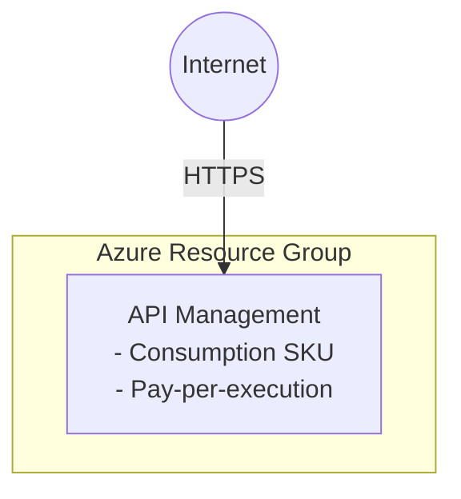

# API Management Playground Scenario

Deploy Azure API Management with Consumption SKU for API gateway experimentation.

## Overview

This scenario creates:

- **Resource Group**: Container for all resources
- **API Management (Consumption SKU)**: Serverless API gateway with pay-per-execution pricing

## Prerequisites

- Terraform CLI installed (>= 1.6.0)
- Azure CLI installed and logged in (`az login`)
- Azure subscription with permissions to create resources

## Architecture



## How to use

```shell
# Login to Azure
az login

# Initialize Terraform
terraform init

# Plan the deployment
terraform plan

# Apply the deployment
terraform apply -auto-approve

# Get the gateway URL
terraform output api_management_gateway_url

# Destroy the deployment
terraform destroy -auto-approve
```

## Variables

| Name | Description | Type | Default | Required |
|------|-------------|------|---------|----------|
| `name` | Base name for resources | `string` | `"azureapimplayground"` | no |
| `location` | Azure region for resources | `string` | `"japaneast"` | no |
| `tags` | Tags to apply to resources | `map(string)` | See variables.tf | no |
| `publisher_name` | Publisher name for APIM | `string` | `"Example Organization"` | no |
| `publisher_email` | Publisher email for APIM | `string` | `"admin@example.com"` | no |

## Outputs

| Name | Description |
|------|-------------|
| `resource_group_name` | Name of the resource group |
| `api_management_id` | ID of the API Management instance |
| `api_management_name` | Name of the API Management instance |
| `api_management_gateway_url` | Gateway URL of the API Management instance |
| `api_management_management_api_url` | Management API URL of the API Management instance |
| `api_management_portal_url` | Developer Portal URL of the API Management instance |

## Notes

- **Consumption SKU**: Serverless pricing model with no minimum cost when idle
- **Cold Start**: First request may have higher latency due to cold start
- **Limitations**: Some features like VNet integration are not available in Consumption tier
