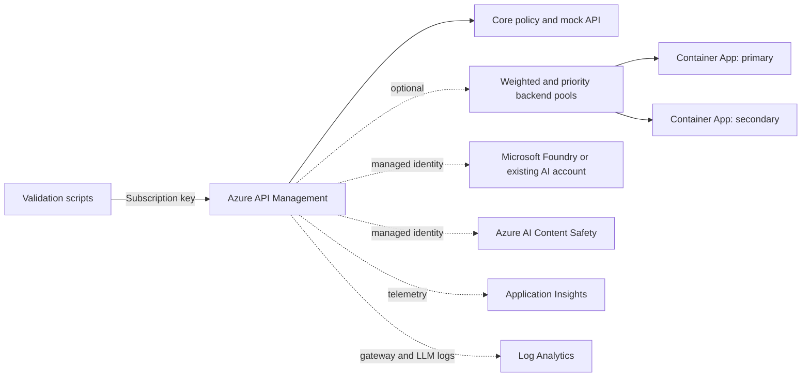

# API Management Playground Scenario

[日本語](./README.ja.md)

This scenario provides a runnable Azure API Management playground instead of an empty
gateway. The default deployment is a low-cost, self-contained API on `Consumption_0`.
Resilience, Microsoft Foundry, Azure AI Content Safety, and observability are nullable
opt-ins. Every control-plane change is represented in Terraform; scripts only call
deployed data planes and query telemetry.

## Architecture


```mermaid
flowchart LR
        Client["Validation scripts"] -->|Subscription key| APIM["Azure API Management"]
        APIM --> Core["Core policy and mock API"]
        APIM -. optional .-> Pool["Weighted and priority backend pools"]
        Pool --> Primary["Container App: primary"]
        Pool --> Secondary["Container App: secondary"]
        APIM -. managed identity .-> AI["Microsoft Foundry or existing AI account"]
        APIM -. managed identity .-> Safety["Azure AI Content Safety"]
        APIM -. telemetry .-> AppInsights["Application Insights"]
        APIM -. gateway and LLM logs .-> LogAnalytics["Log Analytics"]
```

## Runnable Features

The always-on core creates an OpenAPI API and version set, two operations, a named
value, a reusable policy fragment, a published product, and an active subscription
with generated keys. Its policies demonstrate deterministic responses,
`mock-response`, response headers, and subscription rate limiting.

The opt-in layers add:

| Layer | Terraform resources and behavior | Data-plane check |
| --- | --- | --- |
| Backend resilience | Two Container Apps, weighted pool, optional cookie affinity, deterministic 503 backend, circuit breaker, and priority failover | Both weighted backends are observed; failover reaches the secondary |
| AI gateway | Provisioned Foundry account/model or an existing OpenAI v1 endpoint, APIM managed identity, RBAC, and keyless backend authentication | A chat completion returns through APIM |
| Token governance | `llm-token-limit` rate/quota policy | Repeated requests reach HTTP 429 |
| Content Safety | Provisioned or existing Content Safety account, RBAC, managed-identity backend, and `llm-content-safety` | A script-created blocklist term returns HTTP 403 |
| Standard telemetry | Log Analytics, workspace-based Application Insights, managed-identity logger, APIM diagnostics, zero-byte HTTP body capture | Terraform tests verify the control plane |
| LLM logs | Azure Monitor AI gateway usage logs; prompt/completion content is disabled by default | KQL finds `ApiManagementGatewayLlmLog` records |
| Token metrics | Preview `llm-emit-token-metric`, diagnostic metrics, and custom metrics with dimensions | KQL finds recent `AppMetrics` records |

## Prerequisites

- Terraform `>= 1.11.0`
- Azure CLI authenticated to the target subscription
- `curl` and `jq` for data-plane checks
- Permissions to create the selected Azure resources and role assignments
- Model availability and quota in the selected region when provisioning Foundry

Use the shared guidance for [provider authentication](../../../docs/tips/provider-authentication.md),
the [standard Terraform workflow](../../../docs/tips/terraform-workflow.md), and optional
[Azure Blob remote state](../../../docs/tips/azure-blob-backend.md).

## Quick Start

The default path deploys only APIM and the self-contained core API:

```shell
cd infra/scenarios/azure_apim_playground
terraform init
terraform test
terraform apply
./scripts/run_all.sh
terraform destroy
```

APIM provisioning can take several minutes. The first Consumption request can also
have cold-start latency.

## Profiles

Use a profile for an opt-in layer. Use the same `-var-file` for `plan`, `apply`, and
`destroy`.

Choose the APIM tier before the first apply. Azure does not support an in-place
upgrade from or downgrade to the Consumption tier. If the default Consumption
deployment already exists, destroy it with the same configuration that created it,
then apply the Developer profile as a new deployment. A Terraform plan can otherwise
show an in-place SKU update that the Azure API rejects.

| Profile | Purpose | Important notes |
| --- | --- | --- |
| `profiles/consumption_load_balancing.tfvars` | Core plus a 3:1 weighted pool on `Consumption_0` | No circuit breaker |
| `profiles/full_developer.tfvars` | Weighted pool, affinity, circuit breaker, and standard observability | Creates billable Developer APIM and monitoring resources |
| `profiles/new_foundry.tfvars` | Full resilience and AI path with provisioned Foundry and Content Safety | Verify model version, regional availability, and quota before apply |
| `profiles/existing_ai.tfvars` | Full AI path using existing AI and Content Safety resources | Replace every `replace-me` value first |

Example:

```shell
terraform plan -var-file=profiles/new_foundry.tfvars
terraform apply -parallelism=1 -var-file=profiles/new_foundry.tfvars
./scripts/run_all.sh

CONFIRM_CLEANUP=delete-apim-playground-data ./scripts/09_cleanup.sh
terraform destroy -var-file=profiles/new_foundry.tfvars
```

`09_cleanup.sh` deletes only the Content Safety blocklist created by the scripts.
It never changes Terraform-managed resources. Set `CLEANUP_AFTER_RUN=true` to perform
that cleanup at the end of `run_all.sh`.

## Validation Scripts

| Script | Assertion |
| --- | --- |
| `00_validate_prerequisites.sh` | Tools, Terraform outputs, Azure session, and required token acquisition |
| `01_test_core.sh` | Hello payload, mock payload, marker header, and HTTP 429 rate limit |
| `02_test_weighted_routing.sh` | Primary and secondary responses from the weighted pool |
| `03_test_failover.sh` | Circuit breaker opens and the priority secondary serves traffic |
| `04_test_ai_gateway.sh` | OpenAI-compatible completion through managed-identity authentication |
| `05_test_token_limit.sh` | LLM token policy returns HTTP 429 |
| `06_test_content_safety.sh` | Blocklist creation and HTTP 403 enforcement |
| `07_test_llm_logs.sh` | Recent `ApiManagementGatewayLlmLog` records |
| `08_test_custom_metrics.sh` | Recent Application Insights `AppMetrics` records |
| `09_cleanup.sh` | Idempotent deletion of script-created blocklist data |
| `run_all.sh` | Runs applicable checks and reports disabled layers as skipped |

Telemetry ingestion is eventually consistent. Override `LOG_QUERY_ATTEMPTS` and
`LOG_QUERY_INTERVAL_SECONDS` when the default two-minute polling window is too short.
The token-limit profile intentionally uses a low limit for a quick 429 check; override
`TOKEN_LIMIT_ATTEMPTS` for a different configuration.

## Configuration

All feature objects default to `null`, except the core rate limit. Important inputs are:

| Input | Behavior |
| --- | --- |
| `sku_name` | Defaults to `Consumption_0`; use `Developer_1` for the complete exercise |
| `core_rate_limit` | Configures core API calls and renewal period |
| `backend_pool` | Enables Container Apps and weighted routing; nested `circuit_breaker` is optional |
| `ai_backend` | Requires exactly one of `provision` or `existing` |
| `llm_token_limit` | Optional token rate/quota policy; requires AI and non-Consumption APIM |
| `content_safety` | Requires exactly one of `provision` or `existing`; requires AI and non-Consumption APIM |
| `observability` | Enables Log Analytics, Application Insights, logger, and diagnostics |
| `observability.llm_logging` | Enables usage logs; prompt/completion bodies remain off unless explicitly selected |
| `llm_token_metrics` | Experimental custom metrics and up to five documented dimensions; requires AI and observability |
| `operator_principal_id` | Principal allowed to manage Content Safety data; defaults to the Terraform caller |

Use `terraform output -json` as the machine-readable contract for scripts. Subscription
keys are marked sensitive. Do not print them into CI logs or commit output snapshots.

## IaC Boundary

Terraform owns APIs, products, subscriptions, policies, backends, pools, identities,
RBAC, diagnostics, Foundry deployments, Content Safety accounts, and monitoring
resources. The `scripts/` directory performs only these data-plane actions:

- invoke gateway endpoints;
- create/delete the deterministic Content Safety blocklist;
- query Log Analytics and Application Insights data.

No script mutates the APIM, Foundry, RBAC, or monitoring control plane.

## SKU, Preview, and Security Notes

- Circuit breaker, `llm-token-limit`, and `llm-content-safety` profiles are rejected on
    `Consumption_0` by Terraform preconditions. Use `Developer_1` or a supported higher tier.
- [Upgrading and scaling APIM](https://learn.microsoft.com/azure/api-management/upgrade-and-scale)
    does not support moving to or from Consumption. Switching between these profiles
    requires destroy and recreate, not an in-place SKU update.
- Backend pools use stable API `2024-05-01`. Cookie affinity uses
    `2024-10-01-preview`. AI diagnostics and Content Safety backend integration use
    `2024-06-01-preview`.
- Token metrics are experimental. The scenario follows the official
    [Azure-Samples/AI-Gateway Application Insights module](https://github.com/Azure-Samples/AI-Gateway/blob/main/modules/monitor/v1/appinsights.bicep)
    and sends the not-yet-published `CustomMetricsOptedInType = "WithDimensions"`
    property through AzAPI.
- Provisioned Foundry, Content Safety, and Application Insights disable local key
    authentication. APIM uses its system-assigned identity and least-scope role assignments.
- Prompt and completion logging can contain sensitive data. Both are disabled in the
    supplied profiles; enabling them is an explicit choice.
- This playground uses public endpoints. It does not claim a production network or
    data-exfiltration boundary.
- Developer APIM, Container Apps, Foundry models, Content Safety, Log Analytics, and
    Application Insights can incur charges. Destroy the profile when finished.

## Documentation-Only Extensions

The following important APIM capabilities are intentionally not provisioned by this
scenario because they require additional services, organization-specific identity or
network design, or preview evaluation:

- [Semantic caching and scalability](https://learn.microsoft.com/azure/api-management/genai-gateway-capabilities#scalability-and-performance),
    which requires a compatible external cache such as Azure Managed Redis and an embeddings backend
- [Unified model API](https://learn.microsoft.com/azure/api-management/unified-model-api),
    currently a preview surface
- [Importing other OpenAI-compatible LLM APIs](https://learn.microsoft.com/azure/api-management/openai-compatible-llm-api)
- [OAuth/JWT validation](https://learn.microsoft.com/azure/api-management/validate-jwt-policy)
- [Developer portal access design](https://learn.microsoft.com/azure/api-management/secure-developer-portal-access)
- [Private network integration](https://learn.microsoft.com/azure/api-management/api-management-howto-integrate-internal-vnet-appgateway),
    [custom domains](https://learn.microsoft.com/azure/api-management/configure-custom-domain),
    [self-hosted gateways](https://learn.microsoft.com/azure/api-management/self-hosted-gateway-overview),
    and multi-region production topology

## Primary Sources

- [API Management backends, pools, and circuit breaker](https://learn.microsoft.com/azure/api-management/backends)
- [AI gateway capabilities](https://learn.microsoft.com/azure/api-management/genai-gateway-capabilities)
- [`llm-token-limit` policy](https://learn.microsoft.com/azure/api-management/llm-token-limit-policy)
- [`llm-content-safety` policy](https://learn.microsoft.com/azure/api-management/llm-content-safety-policy)
- [Azure AI Content Safety blocklists](https://learn.microsoft.com/azure/ai-services/content-safety/quickstart-blocklist)
- [Application Insights integration](https://learn.microsoft.com/azure/api-management/api-management-howto-app-insights)
- [LLM logs and `ApiManagementGatewayLlmLog`](https://learn.microsoft.com/azure/api-management/api-management-howto-llm-logs)
- [`llm-emit-token-metric` policy](https://learn.microsoft.com/azure/api-management/llm-emit-token-metric-policy)
