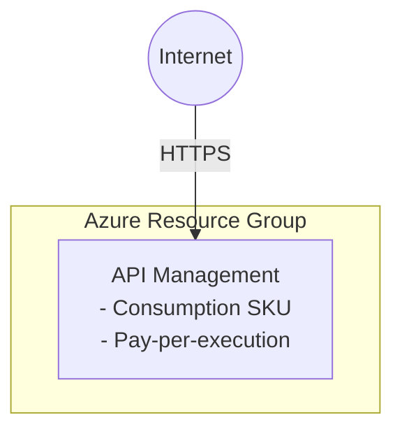

# API Management Playground Scenario

Deploy Azure API Management with Consumption SKU for API gateway experimentation.

## Overview

This scenario creates:

- **Resource Group**: Container for all resources
- **API Management (Consumption SKU)**: Serverless API gateway with pay-per-execution pricing

## Prerequisites

Use the shared guidance for [provider authentication](../../../docs/tips/provider-authentication.md),
the [standard Terraform workflow](../../../docs/tips/terraform-workflow.md), and optional
[Azure Blob remote state](../../../docs/tips/azure-blob-backend.md).

Set `SCENARIO=azure_apim_playground` when using the repository Makefile.

## Architecture


```mermaid
flowchart TB
    Internet((Internet))

    subgraph Azure["Azure Resource Group"]
        APIM["API Management<br/>- Consumption SKU<br/>- Pay-per-execution"]
    end

    Internet -->|HTTPS| APIM
```

## How to use

Follow the [standard Terraform workflow](../../../docs/tips/terraform-workflow.md) with
`SCENARIO=azure_apim_playground`.

### Verify the deployment

```shell
terraform output api_management_gateway_url
```

## Variables

| Name | Description | Type | Default | Required |
| ------ | ------------- | ------ | --------- | ---------- |
| `name` | Base name for resources | `string` | `"azureapimplayground"` | no |
| `location` | Azure region for resources | `string` | `"japaneast"` | no |
| `tags` | Tags to apply to resources | `map(string)` | See variables.tf | no |
| `publisher_name` | Publisher name for APIM | `string` | `"Example Organization"` | no |
| `publisher_email` | Publisher email for APIM | `string` | `"admin@example.com"` | no |
| `sku_name` | SKU tier and capacity for APIM, in `<tier>_<capacity>` format | `string` | `"Consumption_0"` | no |

## Outputs

| Name | Description |
| ------ | ------------- |
| `resource_group_name` | Name of the resource group |
| `api_management_id` | ID of the API Management instance |
| `api_management_name` | Name of the API Management instance |
| `api_management_gateway_url` | Gateway URL of the API Management instance |
| `api_management_management_api_url` | Management API URL of the API Management instance |
| `api_management_portal_url` | Publisher portal URL of the API Management instance |
| `api_management_developer_portal_url` | Developer portal URL of the API Management instance |

## Notes

- **SKU**: Defaults to `Consumption_0`; override `sku_name` to use a different tier (e.g. `Developer_1`)
- **Consumption SKU**: Serverless pricing model with no minimum cost when idle
- **Cold Start**: First request may have higher latency due to cold start on the Consumption tier
- **Limitations**: The Consumption tier doesn't support the developer portal, VNet integration, or several other features available on higher tiers
