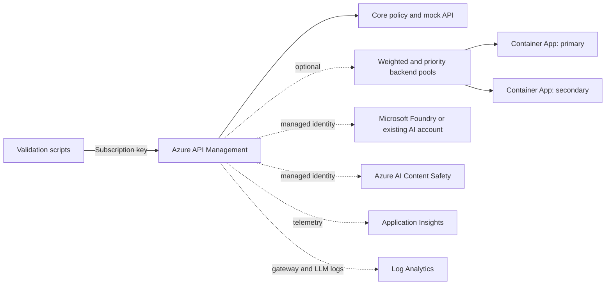

# API Management Playground Scenario

[日本語](./README.ja.md)

This scenario provides a runnable Azure API Management playground instead of an empty
gateway. The default deployment is a low-cost, self-contained API on `Consumption_0`.
Resilience, Microsoft Foundry, Azure AI Content Safety, and observability are nullable
opt-ins. Every control-plane change is represented in Terraform; scripts only call
deployed data planes and query telemetry.

## Architecture


```mermaid
flowchart LR
        Client["Validation scripts"] -->|Subscription key| APIM["Azure API Management"]
        APIM --> Core["Core policy and mock API"]
        APIM -. optional .-> Pool["Weighted and priority backend pools"]
        Pool --> Primary["Container App: primary"]
        Pool --> Secondary["Container App: secondary"]
        APIM -. managed identity .-> AI["Microsoft Foundry or existing AI account"]
        APIM -. managed identity .-> Safety["Azure AI Content Safety"]
        APIM -. telemetry .-> AppInsights["Application Insights"]
        APIM -. gateway and LLM logs .-> LogAnalytics["Log Analytics"]
```

## Runnable Features

The always-on core creates an OpenAPI API and version set, two operations, a named
value, a reusable policy fragment, a published product, and an active subscription
with generated keys. Its policies demonstrate deterministic responses,
`mock-response`, response headers, and subscription rate limiting.

The opt-in layers add:

| Layer | Terraform resources and behavior | Data-plane check |
| --- | --- | --- |
| Backend resilience | Two Container Apps, weighted pool, optional cookie affinity, deterministic 503 backend, circuit breaker, and priority failover | Both weighted backends are observed; failover reaches the secondary |
| AI gateway | Provisioned Foundry account/model or an existing OpenAI v1 endpoint, APIM managed identity, RBAC, and keyless backend authentication | A chat completion returns through APIM |
| Token governance | `llm-token-limit` rate/quota policy | Repeated requests reach HTTP 429 |
| Content Safety | Provisioned or existing Content Safety account, RBAC, managed-identity backend, and `llm-content-safety` | A script-created blocklist term returns HTTP 403 |
| Standard telemetry | Log Analytics, workspace-based Application Insights, managed-identity logger, APIM diagnostics, zero-byte HTTP body capture | Terraform tests verify the control plane |
| LLM logs | Azure Monitor AI gateway usage logs; prompt/completion content is disabled by default | KQL finds `ApiManagementGatewayLlmLog` records |
| Token metrics | Preview `llm-emit-token-metric`, diagnostic metrics, and custom metrics with dimensions | KQL finds recent `AppMetrics` records |

## Prerequisites

- Terraform `>= 1.11.0`
- Azure CLI authenticated to the target subscription
- `curl` and `jq` for data-plane checks
- Permissions to create the selected Azure resources and role assignments
- Model availability and quota in the selected region when provisioning Foundry

Use the shared guidance for [provider authentication](../../../docs/tips/provider-authentication.md),
the [standard Terraform workflow](../../../docs/tips/terraform-workflow.md), and optional
[Azure Blob remote state](../../../docs/tips/azure-blob-backend.md).

## Hands-on Tutorial

This tutorial is for cloud engineers who know the basics of Azure CLI and Terraform. The core API
is required; backend resilience, the AI gateway, Content Safety, and observability are independent
optional labs.

| Path | Profile | Scope | Estimated time |
| --- | --- | --- | --- |
| Required: Core | Defaults | Policy response, mock, header, and rate limit | 30-45 minutes plus APIM provisioning |
| Optional: Load balancing | `profiles/consumption_load_balancing.tfvars` | 3:1 weighted backend pool | 30-45 minutes plus provisioning |
| Optional: Resilience | `profiles/full_developer.tfvars` | Affinity, circuit breaker, priority failover, and standard monitoring | 45-60 minutes plus provisioning |
| Optional: AI gateway | `profiles/new_foundry.tfvars` or a local copy | AI, token limits, Content Safety, LLM logs, and token metrics | 60-90 minutes plus provisioning |

> [!IMPORTANT]
> Start every optional lab from a clean deployment. Before changing profiles, destroy the current
> deployment with the same `-var-file` that created it. Upgrades from the Consumption tier and
> downgrades to the Consumption tier aren't supported.

## Quick Start

After completing the backend initialization in Lab 0, the default path deploys only APIM and the
self-contained core API:

```shell
cd infra/scenarios/azure_apim_playground
terraform test
terraform apply
./scripts/run_all.sh
terraform destroy
```

APIM provisioning can take several minutes. The first Consumption request can also
have cold-start latency.

## Profiles

Use a profile for an opt-in layer. Use the same `-var-file` for `plan`, `apply`, and
`destroy`.

Choose the APIM tier before the first apply. Azure does not support an in-place
upgrade from or downgrade to the Consumption tier. If the default Consumption
deployment already exists, destroy it with the same configuration that created it,
then apply the Developer profile as a new deployment. A Terraform plan can otherwise
show an in-place SKU update that the Azure API rejects.

| Profile | Purpose | Important notes |
| --- | --- | --- |
| `profiles/consumption_load_balancing.tfvars` | Core plus a 3:1 weighted pool on `Consumption_0` | No circuit breaker |
| `profiles/full_developer.tfvars` | Weighted pool, affinity, circuit breaker, and standard observability | Creates billable Developer APIM and monitoring resources |
| `profiles/new_foundry.tfvars` | Full resilience and AI path with provisioned Foundry and Content Safety | Verify model version, regional availability, and quota before apply |
| `profiles/existing_ai.tfvars` | Full AI path using existing AI and Content Safety resources | Replace every `replace-me` value first |

Example:

```shell
terraform plan -var-file=profiles/new_foundry.tfvars
terraform apply -parallelism=1 -var-file=profiles/new_foundry.tfvars
./scripts/run_all.sh

CONFIRM_CLEANUP=delete-apim-playground-data ./scripts/09_cleanup.sh
terraform destroy -var-file=profiles/new_foundry.tfvars
```

`09_cleanup.sh` deletes only the Content Safety blocklist created by the scripts.
It never changes Terraform-managed resources. Set `CLEANUP_AFTER_RUN=true` to perform
that cleanup at the end of `run_all.sh`.

## Progressive Hands-on Labs

### Lab 0: Prepare the environment

#### 0.1 Check tools and the Azure session

From the repository root, explicitly select the subscription you will use.

```bash
terraform version
az version
curl --version
jq --version

AZURE_SUBSCRIPTION="<subscription-name-or-id>"
az login
az account set --subscription "$AZURE_SUBSCRIPTION"
az account show --query '{name:name,id:id,tenantId:tenantId,user:user.name}' --output table

export ARM_SUBSCRIPTION_ID=$(az account show --query id --output tsv)
```

You need permission to create the selected Azure resources and role assignments. Don't expose
credentials, access tokens, Terraform state, saved plans, or APIM subscription keys in commits or
CI logs.

#### 0.2 Initialize Terraform state

This scenario's `backend.tf` contains Azure Blob backend values for the repository maintainer.
First create your own [Azure Blob Storage backend](../../../docs/tips/azure-blob-backend.md) and
grant `Storage Blob Data Contributor` at container scope, then override all four values.

```bash
cd infra/scenarios/azure_apim_playground

BACKEND_RESOURCE_GROUP="<your-backend-resource-group>"
BACKEND_STORAGE_ACCOUNT="<your-storage-account>"
BACKEND_CONTAINER="<your-state-container>"
BACKEND_KEY="azure_apim_playground.<your-name>.tfstate"

terraform init -reconfigure \
    -backend-config="resource_group_name=${BACKEND_RESOURCE_GROUP}" \
    -backend-config="storage_account_name=${BACKEND_STORAGE_ACCOUNT}" \
    -backend-config="container_name=${BACKEND_CONTAINER}" \
    -backend-config="key=${BACKEND_KEY}"
```

Don't continue to apply if initialization fails. Keep the backend storage until this scenario is
destroyed and you have confirmed that its state is no longer needed.

#### 0.3 Check model availability and quota for the AI path

`profiles/new_foundry.tfvars` creates `gpt-4o-mini` version `2024-07-18` in `japaneast`.
Only when selecting the provisioning path, verify availability and quota before apply.

```bash
LOCATION="japaneast"

az cognitiveservices model list \
    --location "$LOCATION" \
    --kind OpenAI \
    --query "[?name=='gpt-4o-mini' && version=='2024-07-18'].{name:name,version:version,format:format}" \
    --output table

az cognitiveservices usage list \
    --location "$LOCATION" \
    --output table
```

Don't apply if the model isn't listed or quota is unavailable. Create local tfvars for an available
configuration or select the existing-AI path. Check current prices in the
[Azure pricing calculator](https://azure.microsoft.com/pricing/calculator/).

### Understand the tests

| Test | Command | What it verifies | Azure resources |
| --- | --- | --- | --- |
| Control plane | `terraform test` | Mock-provider plan assertions for resources, policies, dependencies, and preconditions | Creates none |
| Data plane | `./scripts/*.sh` | HTTP status, payloads, and telemetry from deployed endpoints | Requires apply |

A successful `terraform test` doesn't prove that a live endpoint works. Conversely, the shell
scripts aren't a complete validation of every Terraform resource declaration. Run the data-plane
tests after the control-plane tests.

### Lab 1: Build the core API

#### 1.1 Run static checks, tests, and apply

```bash
terraform fmt -check
terraform validate
terraform test
terraform plan
terraform apply
```

Review the plan before approving apply. APIM provisioning can take time. `terraform test` verifies
the versioned API, published product, active subscription, deterministic response, mock response,
rate limit, and that optional layers are disabled by default.

#### 1.2 Validate the core data plane

```bash
./scripts/00_validate_prerequisites.sh
./scripts/01_test_core.sh
```

Expected result:

```text
Core hello policy returned the expected payload.
Core mock-response policy returned the expected payload.
Core subscription rate limit returned HTTP 429 as configured.
```

Inspect one request without printing the subscription key.

```bash
PLAYGROUND_KEY=$(terraform output -raw playground_subscription_primary_key)
CORE_HELLO_URL=$(terraform output -raw core_hello_url)

curl --silent --show-error \
    --request GET \
    --header "Ocp-Apim-Subscription-Key: ${PLAYGROUND_KEY}" \
    --header "Accept: application/json" \
    "$CORE_HELLO_URL" | jq .

unset PLAYGROUND_KEY CORE_HELLO_URL
```

Expected payload:

```json
{
    "message": "hello from Azure API Management",
    "source": "policy"
}
```

The default rate limit is five calls per 60 seconds. Manual requests and the script share the same
counter, so HTTP 429 can occur earlier when you run them consecutively.

Destroy the default configuration when you finish or before starting an optional lab.

```bash
terraform destroy
```

### Lab 2: Validate weighted routing

This lab stays on `Consumption_0` and adds two Container Apps and a 3:1 weighted backend pool.
Weights are probabilistic; 24 requests aren't guaranteed to produce exactly 18:6.

```bash
PROFILE="profiles/consumption_load_balancing.tfvars"

terraform plan -var-file="$PROFILE"
terraform apply -parallelism=1 -var-file="$PROFILE"

./scripts/00_validate_prerequisites.sh
./scripts/01_test_core.sh
./scripts/02_test_weighted_routing.sh
```

Expected result:

```text
Weighted routing reached both backends across 24 requests.
Primary responses: <one or more>
Secondary responses: <one or more>
```

Increase the sample size if only one backend is observed.

```bash
BACKEND_REQUESTS=60 ./scripts/02_test_weighted_routing.sh
```

```bash
terraform destroy -var-file="$PROFILE"
unset PROFILE
```

### Lab 3: Validate circuit breaker priority failover

This lab creates `Developer_1` and enables a weighted pool, cookie affinity, a deterministic 503
backend, a circuit breaker, a priority secondary, and standard monitoring. Backend circuit breakers
aren't supported in the Consumption tier.

```bash
PROFILE="profiles/full_developer.tfvars"

terraform plan -var-file="$PROFILE"
terraform apply -parallelism=1 -var-file="$PROFILE"

./scripts/00_validate_prerequisites.sh
./scripts/01_test_core.sh
./scripts/02_test_weighted_routing.sh
./scripts/03_test_failover.sh
```

Expected result:

```text
Circuit-breaker failover reached the priority secondary backend.
Observed primary 503 responses before failover: <zero or more>
```

The profile uses a failure count of two and a one-minute trip duration. Circuit-breaker state isn't
fully synchronized across gateway instances, so the test doesn't assert an exact number of primary
failures. Increase attempts only if the secondary isn't observed.

```bash
FAILOVER_ATTEMPTS=20 ./scripts/03_test_failover.sh
```

The profile also sets `session_affinity_cookie_name`, but the included script doesn't verify cookie
retention. A stateful client must retain `Set-Cookie` and send it with later requests.

```bash
terraform destroy -var-file="$PROFILE"
unset PROFILE
```

### Lab 4: Validate the AI gateway and governance

#### 4.1 Select an AI profile

To provision new Foundry and Content Safety resources:

```bash
PROFILE="profiles/new_foundry.tfvars"
```

To use existing AI and Content Safety resources, don't edit the tracked profile. Copy it to a
git-ignored local file, then replace each `replace-me` endpoint, resource ID, and deployment name.
Don't store credentials or API keys in tfvars.

```bash
cp profiles/existing_ai.tfvars existing_ai.local.tfvars
grep -n 'replace-me' existing_ai.local.tfvars

# Replace every replace-me value in your editor.
grep -n 'replace-me' existing_ai.local.tfvars

PROFILE="existing_ai.local.tfvars"
```

The second `grep` must return nothing.

#### 4.2 Deploy and check feature flags

```bash
terraform plan -var-file="$PROFILE"
terraform apply -parallelism=1 -var-file="$PROFILE"

terraform output ai_backend_enabled
terraform output ai_backend_mode
terraform output llm_token_limit_enabled
terraform output content_safety_enabled
terraform output observability_enabled
terraform output llm_logging_enabled
terraform output llm_token_metrics_enabled
```

There can be a short delay after apply before the APIM managed-identity role assignments become
effective. Don't print the sensitive subscription key.

#### 4.3 Run all enabled tests

```bash
./scripts/run_all.sh
```

The `new_foundry` profile runs scripts 00 through 08. An existing-AI profile doesn't configure a
backend pool, so weighted routing and circuit breaker checks appear as `Skip`.

| Check | Script | Success | Main consideration |
| --- | --- | --- | --- |
| AI gateway | `04_test_ai_gateway.sh` | HTTP 200 with a completion | Client uses an APIM key; backend uses managed identity |
| Token limit | `05_test_token_limit.sh` | HTTP 429 for the rate limit | Quota violations return HTTP 403; counts depend on model and estimation mode |
| Content Safety | `06_test_content_safety.sh` | Blocklist term rejected with HTTP 403 | Blocklist and item propagation takes time |
| LLM logs | `07_test_llm_logs.sh` | At least one `ApiManagementGatewayLlmLog` record | Prompt/completion bodies are off by default; ingestion is delayed |
| Token metrics | `08_test_custom_metrics.sh` | At least one `AppMetrics` record | Maximum five custom dimensions; avoid high cardinality |

Examples for rerunning individual checks:

```bash
AI_PROMPT="Reply with exactly: APIM gateway verified" \
AI_MAX_TOKENS=32 \
./scripts/04_test_ai_gateway.sh

TOKEN_LIMIT_ATTEMPTS=40 \
TOKEN_LIMIT_MAX_TOKENS=1 \
./scripts/05_test_token_limit.sh

CONTENT_SAFETY_PROPAGATION_SECONDS=10 \
./scripts/06_test_content_safety.sh

LOG_QUERY_ATTEMPTS=20 \
LOG_QUERY_INTERVAL_SECONDS=15 \
./scripts/07_test_llm_logs.sh

LOG_QUERY_ATTEMPTS=20 \
LOG_QUERY_INTERVAL_SECONDS=15 \
./scripts/08_test_custom_metrics.sh
```

### Cleanup

For a profile with Content Safety, delete the script-created blocklist before Terraform destroy.

```bash
CONFIRM_CLEANUP=delete-apim-playground-data ./scripts/09_cleanup.sh
```

Expected result:

```text
Deleted Content Safety blocklist: apim-playground
Terraform-managed infrastructure was not changed.
```

An already-absent blocklist is also successful. To validate and clean data in one run:

```bash
CLEANUP_AFTER_RUN=true ./scripts/run_all.sh
```

Finally, delete Terraform resources with the same profile used by the current apply.

```bash
terraform plan -destroy -var-file="$PROFILE"
terraform destroy -var-file="$PROFILE"
unset PROFILE
```

Omit `-var-file` for the default core configuration. If the destroy plan contains unexpected
resources, don't approve it. Check the Azure subscription, backend key, and current profile.

### Troubleshooting

| Symptom | Likely cause | Check and resolution |
| --- | --- | --- |
| `terraform init` returns Blob 403 | Incorrect backend values or data-plane RBAC | Check all four backend values and `Storage Blob Data Contributor` at container scope |
| Plan shows another environment's resources | Incorrect subscription or backend key | Check `az account show`, `ARM_SUBSCRIPTION_ID`, and `BACKEND_KEY`; don't apply |
| `Terraform output is empty` | Required profile wasn't applied | Check feature flags and the active profile |
| Core returns HTTP 401/403 | APIM subscription key is missing or invalid | Reload the key into a shell variable with `terraform output -raw` |
| Core immediately returns HTTP 429 | Requests already used the renewal window | Retry after the window renews |
| Weighted test sees one backend | Probabilistic skew in a small sample | Increase `BACKEND_REQUESTS` |
| Circuit breaker is disabled | Consumption or the wrong profile is active | Apply the Developer profile to clean state |
| AI returns HTTP 401/403 | APIM identity RBAC hasn't propagated or resource ID is wrong | Check role assignments and retry after propagation |
| Model deployment fails | Region, version, or quota isn't available | Repeat the model and usage queries from Lab 0 |
| Blocked term returns HTTP 200 | Blocklist or item is propagating | Increase `CONTENT_SAFETY_PROPAGATION_SECONDS` |
| LLM log or metric is missing | No AI request, ingestion delay, or disabled feature | Run `run_all.sh`, then increase polling attempts and interval |
| Token limit doesn't return HTTP 429 | Counter window or model token usage differs | Increase `TOKEN_LIMIT_ATTEMPTS` |

### Decisions before production adoption

This playground uses public endpoints, and Developer APIM has no SLA. Before production adoption,
decide client authentication and authorization, APIM tier and regions, private networking, backend
quota, token counter keys, Content Safety thresholds, log retention and access controls, metric
dimension cardinality, and alert ownership.

## Validation Scripts

| Script | Assertion |
| --- | --- |
| `00_validate_prerequisites.sh` | Tools, Terraform outputs, Azure session, and required token acquisition |
| `01_test_core.sh` | Hello payload, mock payload, marker header, and HTTP 429 rate limit |
| `02_test_weighted_routing.sh` | Primary and secondary responses from the weighted pool |
| `03_test_failover.sh` | Circuit breaker opens and the priority secondary serves traffic |
| `04_test_ai_gateway.sh` | OpenAI-compatible completion through managed-identity authentication |
| `05_test_token_limit.sh` | LLM token policy returns HTTP 429 |
| `06_test_content_safety.sh` | Blocklist creation and HTTP 403 enforcement |
| `07_test_llm_logs.sh` | Recent `ApiManagementGatewayLlmLog` records |
| `08_test_custom_metrics.sh` | Recent Application Insights `AppMetrics` records |
| `09_cleanup.sh` | Idempotent deletion of script-created blocklist data |
| `run_all.sh` | Runs applicable checks and reports disabled layers as skipped |

Telemetry ingestion is eventually consistent. Override `LOG_QUERY_ATTEMPTS` and
`LOG_QUERY_INTERVAL_SECONDS` when the default two-minute polling window is too short.
The token-limit profile intentionally uses a low limit for a quick 429 check; override
`TOKEN_LIMIT_ATTEMPTS` for a different configuration.

## Configuration

All feature objects default to `null`, except the core rate limit. Important inputs are:

| Input | Behavior |
| --- | --- |
| `sku_name` | Defaults to `Consumption_0`; use `Developer_1` for the complete exercise |
| `core_rate_limit` | Configures core API calls and renewal period |
| `backend_pool` | Enables Container Apps and weighted routing; nested `circuit_breaker` is optional |
| `ai_backend` | Requires exactly one of `provision` or `existing` |
| `llm_token_limit` | Optional token rate/quota policy; requires AI and non-Consumption APIM |
| `content_safety` | Requires exactly one of `provision` or `existing`; requires AI and non-Consumption APIM |
| `observability` | Enables Log Analytics, Application Insights, logger, and diagnostics |
| `observability.llm_logging` | Enables usage logs; prompt/completion bodies remain off unless explicitly selected |
| `llm_token_metrics` | Experimental custom metrics and up to five documented dimensions; requires AI and observability |
| `operator_principal_id` | Principal allowed to manage Content Safety data; defaults to the Terraform caller |

Use `terraform output -json` as the machine-readable contract for scripts. Subscription
keys are marked sensitive. Do not print them into CI logs or commit output snapshots.

## IaC Boundary

Terraform owns APIs, products, subscriptions, policies, backends, pools, identities,
RBAC, diagnostics, Foundry deployments, Content Safety accounts, and monitoring
resources. The `scripts/` directory performs only these data-plane actions:

- invoke gateway endpoints;
- create/delete the deterministic Content Safety blocklist;
- query Log Analytics and Application Insights data.

No script mutates the APIM, Foundry, RBAC, or monitoring control plane.

## SKU, Preview, and Security Notes

- Circuit breaker, `llm-token-limit`, and `llm-content-safety` profiles are rejected on
    `Consumption_0` by Terraform preconditions. Use `Developer_1` or a supported higher tier.
- [Upgrading and scaling APIM](https://learn.microsoft.com/azure/api-management/upgrade-and-scale)
    does not support moving to or from Consumption. Switching between these profiles
    requires destroy and recreate, not an in-place SKU update.
- Backend pools use stable API `2024-05-01`. Cookie affinity uses
    `2024-10-01-preview`. AI diagnostics and Content Safety backend integration use
    `2024-06-01-preview`.
- Token metrics are experimental. The scenario follows the official
    [Azure-Samples/AI-Gateway Application Insights module](https://github.com/Azure-Samples/AI-Gateway/blob/main/modules/monitor/v1/appinsights.bicep)
    and sends the not-yet-published `CustomMetricsOptedInType = "WithDimensions"`
    property through AzAPI.
- Provisioned Foundry, Content Safety, and Application Insights disable local key
    authentication. APIM uses its system-assigned identity and least-scope role assignments.
- Prompt and completion logging can contain sensitive data. Both are disabled in the
    supplied profiles; enabling them is an explicit choice.
- This playground uses public endpoints. It does not claim a production network or
    data-exfiltration boundary.
- Developer APIM, Container Apps, Foundry models, Content Safety, Log Analytics, and
    Application Insights can incur charges. Destroy the profile when finished.

## Documentation-Only Extensions

The following important APIM capabilities are intentionally not provisioned by this
scenario because they require additional services, organization-specific identity or
network design, or preview evaluation:

- [Semantic caching and scalability](https://learn.microsoft.com/azure/api-management/genai-gateway-capabilities#scalability-and-performance),
    which requires a compatible external cache such as Azure Managed Redis and an embeddings backend
- [Unified model API](https://learn.microsoft.com/azure/api-management/unified-model-api),
    currently a preview surface
- [Importing other OpenAI-compatible LLM APIs](https://learn.microsoft.com/azure/api-management/openai-compatible-llm-api)
- [OAuth/JWT validation](https://learn.microsoft.com/azure/api-management/validate-jwt-policy)
- [Developer portal access design](https://learn.microsoft.com/azure/api-management/secure-developer-portal-access)
- [Private network integration](https://learn.microsoft.com/azure/api-management/api-management-howto-integrate-internal-vnet-appgateway),
    [custom domains](https://learn.microsoft.com/azure/api-management/configure-custom-domain),
    [self-hosted gateways](https://learn.microsoft.com/azure/api-management/self-hosted-gateway-overview),
    and multi-region production topology

## Primary Sources

- [API Management backends, pools, and circuit breaker](https://learn.microsoft.com/azure/api-management/backends)
- [AI gateway capabilities](https://learn.microsoft.com/azure/api-management/genai-gateway-capabilities)
- [`llm-token-limit` policy](https://learn.microsoft.com/azure/api-management/llm-token-limit-policy)
- [`llm-content-safety` policy](https://learn.microsoft.com/azure/api-management/llm-content-safety-policy)
- [Azure AI Content Safety blocklists](https://learn.microsoft.com/azure/ai-services/content-safety/quickstart-blocklist)
- [Application Insights integration](https://learn.microsoft.com/azure/api-management/api-management-howto-app-insights)
- [LLM logs and `ApiManagementGatewayLlmLog`](https://learn.microsoft.com/azure/api-management/api-management-howto-llm-logs)
- [`llm-emit-token-metric` policy](https://learn.microsoft.com/azure/api-management/llm-emit-token-metric-policy)
- [Azure OpenAI quota and capacity](https://learn.microsoft.com/azure/foundry/openai/how-to/quota)
- [AzureRM backend](https://developer.hashicorp.com/terraform/language/backend/azurerm)
