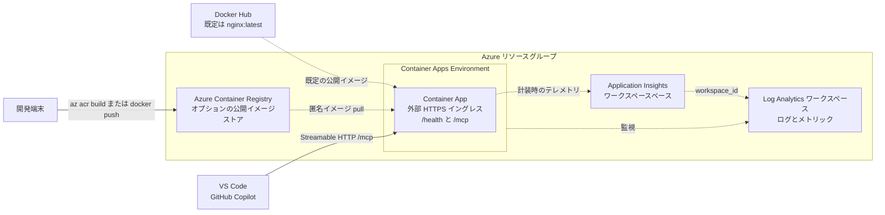

## 概要

既定のデプロイでは、公開イメージ `nginx:latest` を実行します。`src/` に含まれる
Python アプリケーションは MCP タスクサーバーです。ローカルで開発し、コンテナー
イメージとしてパッケージ化し、オプションの公開 Azure Container Registry (ACR)
へ発行して、同じ Container App にデプロイできます。

このシナリオでは、次のリソースを作成します。

- すべてのシナリオリソースを格納するリソースグループ
- オプションのレジストリ全体の匿名 pull を有効にした Standard または Premium ACR
- Container Apps Environment のログとメトリックを格納する Log Analytics ワークスペース
- 既定で有効になるワークスペースベースの Application Insights
- Container Apps Environment
- 外部イングレスとシステム割り当てマネージド ID を持つ Container App

Application Insights の接続文字列は Container App のシークレットに保存され、
`APPLICATIONINSIGHTS_CONNECTION_STRING` 環境変数から参照されます。Application
Insights へテレメトリを送信するには、アプリケーション側の計装も必要です。

## 前提条件

共通ガイダンスの[プロバイダー認証](../../../docs/tips/provider-authentication.ja.md)、
[標準の Terraform ワークフロー](../../../docs/tips/terraform-workflow.ja.md)、およびオプションの
[Azure Blob リモートステート](../../../docs/tips/azure-blob-backend.ja.md)を使用します。

MCP ワークフローでは、次のツールも必要です。

- Azure CLI 2.62.0 以降と、リソース作成および ACR ビルドを実行できるサインイン済みアカウント
- Python 3.10 以降
- Copilot Chat から MCP ツールをテストする場合は、GitHub Copilot を導入した Visual Studio Code
- イメージをローカルでビルドまたはテストする場合のみ Docker

`az acr build` は Azure 上でイメージをビルドするため、ローカルの Docker デーモンを
必要としません。リポジトリの Makefile を使用する場合は、
`SCENARIO=azure_container_apps` を設定します。

## アーキテクチャ



## 既定イメージのデプロイ

`SCENARIO=azure_container_apps` を指定して、
[標準の Terraform ワークフロー](../../../docs/tips/terraform-workflow.ja.md)に従います。

リポジトリのルートから既定の公開イメージをデプロイします。

```bash
make deploy SCENARIO=azure_container_apps
```

nginx エンドポイントを確認します。

```bash
cd infra/scenarios/azure_container_apps
APP_URL=$(terraform output -raw container_app_url)
curl --fail "$APP_URL"
```

## MCP サーバーのローカル開発

サーバーは `list_tasks`、`get_task`、`create_task`、
`toggle_task_complete`、`delete_task` を公開します。Streamable HTTP エンドポイントは
`/mcp`、正常性確認用エンドポイントは `/health` です。

### Python 環境の作成

```bash
cd infra/scenarios/azure_container_apps/src
python -m venv .venv
source .venv/bin/activate
python -m pip install -r requirements.txt
python -m uvicorn app:app --reload --host 127.0.0.1 --port 8080
```

別のターミナルから正常性確認用エンドポイントを呼び出します。

```bash
curl --fail http://localhost:8080/health
```

期待される応答は次のとおりです。

```json
{"status":"healthy"}
```

### VS Code からローカルサーバーへの接続

ワークスペースの `.vscode/mcp.json` にある `servers` の下へ `tasks-mcp` を
追加します。既存のサーバー設定を削除せず、次のエントリをマージしてください。

```json
{
  "servers": {
    "tasks-mcp": {
      "url": "http://localhost:8080/mcp",
      "type": "http"
    }
  }
}
```

Copilot Chat をエージェントモードで開き、`tasks-mcp` を有効にして、タスクの一覧を
依頼します。タスクを変更または削除するツール呼び出しは、ほかの外部ツール操作と同様に
内容を確認してから許可してください。

## コンテナーのローカルビルドとテスト

この手順の Docker はオプションです。MCP ソースディレクトリからイメージをビルドして
実行します。

```bash
cd infra/scenarios/azure_container_apps/src
docker build --tag tasks-mcp-server:local .
docker run --rm --name tasks-mcp-server --publish 8080:8080 tasks-mcp-server:local
```

別のターミナルからコンテナーを確認します。接続には、同じローカル `mcp.json` 設定を
使用できます。

```bash
curl --fail http://localhost:8080/health
```

## 公開 ACR を使用した MCP サーバーのデプロイ

> [!NOTE]
> ACR はコンテナーイメージを格納します。MCP クライアントはレジストリではなく、
> 実行中の Container App の `/mcp` に接続します。

> [!WARNING]
> 匿名 pull はレジストリ内のすべてのリポジトリに適用されます。このオプションを
> 有効にした ACR へ非公開イメージやシークレットを発行しないでください。

### レジストリの作成

最初の apply では nginx を実行したまま、オプションの ACR を作成します。匿名 pull
には Standard または Premium SKU が必要です。既定値は Standard です。

```bash
cd infra/scenarios/azure_container_apps
terraform init
terraform apply -var="enable_public_acr=true"

ACR_NAME=$(terraform output -raw acr_name)
ACR_LOGIN_SERVER=$(terraform output -raw acr_login_server)
IMAGE_REPOSITORY="tasks-mcp-server"
IMAGE_TAG="v1"
```

### Azure 上でのビルドと push

推奨手順では、ACR ビルドをキューに登録し、ローカル Docker デーモンを使用せずに
生成されたイメージを push します。

```bash
az acr build \
  --registry "$ACR_NAME" \
  --image "$IMAGE_REPOSITORY:$IMAGE_TAG" \
  ./src
```

匿名アクセスで許可されるのは pull のみです。このコマンドを実行する ID には、ビルドの
キュー登録とイメージの push に必要な権限が引き続き必要です。

### ローカル Docker を使用したビルドと push

ローカルで Docker を利用できる場合は、次の代替手順を使用します。

```bash
az acr login --name "$ACR_NAME"
docker build \
  --tag "$ACR_LOGIN_SERVER/$IMAGE_REPOSITORY:$IMAGE_TAG" \
  ./src
docker push "$ACR_LOGIN_SERVER/$IMAGE_REPOSITORY:$IMAGE_TAG"
```

### Container App の更新

発行した MCP イメージをポート 8080 でデプロイします。最小レプリカ数を 1 にすると、
対話時のコールドスタートを回避できます。最大レプリカ数を 1 にすると、デモ用の
インメモリストアがレプリカ間で分岐することを防げます。

```bash
MCP_IMAGE="$ACR_LOGIN_SERVER/$IMAGE_REPOSITORY:$IMAGE_TAG"

terraform apply \
  -var="enable_public_acr=true" \
  -var="container_image=$MCP_IMAGE" \
  -var="container_port=8080" \
  -var="min_replicas=1" \
  -var="max_replicas=1"
```

以降の Terraform コマンドでもこれらの変数を指定するか、`terraform.tfvars` に保存します。

```hcl
enable_public_acr = true
acr_sku           = "Standard"
container_image   = "<acr-login-server>/tasks-mcp-server:v1"
container_port    = 8080
min_replicas      = 1
max_replicas      = 1
```

デプロイしたサーバーを確認します。

```bash
APP_URL=$(terraform output -raw container_app_url)
curl --fail "$APP_URL/health"
printf 'MCP endpoint: %s/mcp\n' "$APP_URL"
```

`.vscode/mcp.json` のプレースホルダーを `container_app_url` の値に置き換えて、
デプロイしたエンドポイントを設定します。

```json
{
  "servers": {
    "tasks-mcp": {
      "url": "https://<container-app-fqdn>/mcp",
      "type": "http"
    }
  }
}
```

[Microsoft Learn の Python MCP サーバーチュートリアル](https://learn.microsoft.com/ja-jp/azure/container-apps/tutorial-mcp-server-python)
では、同じローカル開発から Container Apps までの流れを確認できます。チュートリアルでは
MCP Python SDK v1 の `FastMCP` API が使われている場合がありますが、このサンプルは
移行済みの SDK v2 `MCPServer` API を使用します。

## 変数

| 名前                                           | 説明                                                             | 型                  | 既定値                         |
|----------------------------------------------|----------------------------------------------------------------|--------------------|-----------------------------|
| `name`                                       | 生成するリソースのベース名                                                  | `string`           | `"azurecontainerapps"`      |
| `location`                                   | リソースの Azure リージョン                                              | `string`           | `"japaneast"`               |
| `tags`                                       | リソースに適用するタグ                                                    | `map(string)`      | `variables.tf` を参照          |
| `container_image`                            | Container App にデプロイする公開 OCI イメージ                               | `string`           | `"nginx:latest"`            |
| `enable_public_acr`                          | レジストリ全体の匿名 pull を有効にした ACR をデプロイするか                            | `bool`             | `false`                     |
| `acr_sku`                                    | 公開 ACR の SKU (`Standard` または `Premium`)                        | `string`           | `"Standard"`                |
| `container_command`                          | イメージのエントリポイントを上書きするコマンド                                        | `list(string)`     | `[]`                        |
| `container_port`                             | コンテナーが公開するポート                                                  | `number`           | `80`                        |
| `cpu`                                        | コンテナーに割り当てる CPU コア数                                            | `number`           | `0.25`                      |
| `memory`                                     | コンテナーに割り当てるメモリ                                                 | `string`           | `"0.5Gi"`                   |
| `min_replicas`                               | レプリカの最小数                                                       | `number`           | `0`                         |
| `max_replicas`                               | レプリカの最大数                                                       | `number`           | `3`                         |
| `env_vars`                                   | プレーン値またはシークレット参照を持つ環境変数                                        | `list(object)`     | `[]`                        |
| `secrets`                                    | `env_vars` から参照する Container App シークレット                         | `list(object)`     | `[]`                        |
| `enable_application_insights`                | Application Insights を作成し、接続文字列を挿入するか                          | `bool`             | `true`                      |
| `application_insights_type`                  | Application Insights のアプリケーション種別                               | `string`           | `"web"`                     |
| `application_insights_sampling_percentage`   | 0 から 100 までのテレメトリサンプリング率                                       | `number`           | `100`                       |

## 出力

| 名前                                              | 説明                                                             |
|-------------------------------------------------|----------------------------------------------------------------|
| `resource_group_name`                           | リソースグループの名前                                                    |
| `acr_id`                                        | ACR の ID。無効な場合は `null`                                         |
| `acr_name`                                      | ACR の名前。無効な場合は `null`                                          |
| `acr_login_server`                              | ACR のログインサーバー。無効な場合は `null`                                    |
| `container_app_environment_id`                  | Container Apps Environment の ID                                |
| `container_app_environment_name`                | Container Apps Environment の名前                                 |
| `container_app_id`                              | Container App の ID                                             |
| `container_app_name`                            | Container App の名前                                              |
| `container_app_fqdn`                            | Container App の FQDN                                           |
| `container_app_url`                             | Container App の HTTPS URL                                      |
| `container_app_identity_principal_id`           | Container App マネージド ID のプリンシパル ID                              |
| `application_insights_id`                       | Application Insights の ID。無効な場合は `null`                        |
| `application_insights_name`                     | Application Insights の名前。無効な場合は `null`                         |
| `application_insights_connection_string`        | 機密の接続文字列。無効な場合は `null`                                         |
| `application_insights_instrumentation_key`      | 機密のインストルメンテーションキー。無効な場合は `null`                                |

## その他の例

### カスタムアプリケーションのデプロイ

```hcl
# terraform.tfvars
name            = "myapp"
container_image = "myusername/myapp:v1.0.0"
container_port  = 8080
cpu             = 0.5
memory          = "1Gi"
min_replicas    = 1
max_replicas    = 5
```

### タグを指定したデプロイ

```hcl
# terraform.tfvars
name            = "api"
container_image = "hashicorp/http-echo:latest"
container_port  = 5678

tags = {
  environment = "production"
  team        = "platform"
  cost-center = "12345"
}
```

### カスタム起動コマンドを使用した ks6088ts/concierge のデプロイ

```shell
export ARM_SUBSCRIPTION_ID=$(az account show --query id --output tsv)

terraform apply -auto-approve \
  -var="container_image=ks6088ts/concierge:latest" \
  -var='container_command=["python","scripts/playgrounds/tts.py","--host","0.0.0.0","--port","80"]'
```

または、`terraform.tfvars` ファイルを使用します。

```hcl
# terraform.tfvars
container_image   = "ks6088ts/concierge:latest"

container_command = ["python", "scripts/playgrounds/tts.py", "--host", "0.0.0.0", "--port", "80"]
# container_command = ["uvicorn", "concierge.chat.infrastructure.web.app:create_app", "--factory", "--host", "0.0.0.0", "--port", "80"]
```

```shell
terraform apply -auto-approve

# アプリケーションの URL を取得
terraform output container_app_url
```

### 環境変数の挿入

```hcl
# terraform.tfvars
container_image = "myusername/myapp:v1.0.0"
container_port  = 8080

# プレーンな環境変数と、シークレットを参照する環境変数。
env_vars = [
  { name = "LOG_LEVEL", value = "INFO" },
  { name = "APP_ENV", value = "production" },
  { name = "API_KEY", secret_name = "api-key" },
]

# env_vars が `secret_name` を介して参照するシークレット値。
secrets = [
  { name = "api-key", value = "super-secret-value" },
]
```

各 `env_vars` エントリには、`value` (プレーンテキスト) または `secret_name`
(`secrets` 内のエントリへの参照) のどちらか一方だけを設定する必要があります。機密値には
`secrets` を使用し、プレーンな環境変数ではなく Container App のシークレットとして保存してください。

## クリーンアップ

シナリオを削除するときも同じ変数または保存済みの `terraform.tfvars` を使用します。

```bash
terraform destroy -var="enable_public_acr=true"
```

## セキュリティと運用上の注意事項

- Container Apps は HTTPS エンドポイントを自動的に提供します
- 認証のない MCP エンドポイントはデモ用であり、運用環境で信頼できない利用者へ公開しないでください
- タスクストアはインメモリでスレッドセーフではなく、プロセスの再起動時にすべての変更が失われます
- `min_replicas = 0` ではゼロへスケールできますが、対話型 MCP クライアントでコールドスタートが発生します
- ACR の匿名 pull はレジストリ全体に適用され、認証されていない大量の要求はスロットルされる場合があります
- プライベート ACR 認証、マネージド ID によるイメージ pull、Entra 認証、タスクの永続化は対象外です

## 参考資料

- [Python MCP サーバーを Azure Container Apps にデプロイする](https://learn.microsoft.com/ja-jp/azure/container-apps/tutorial-mcp-server-python)
- [Azure Container Registry で匿名 pull アクセスを有効にする](https://learn.microsoft.com/ja-jp/azure/container-registry/anonymous-pull-access)
- [MCP Python SDK](https://github.com/modelcontextprotocol/python-sdk)
