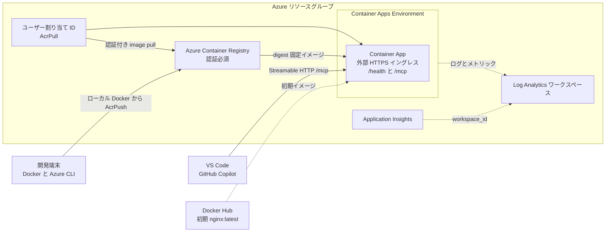

## 概要

このシナリオは、ローカルでビルドしたコンテナーイメージを Azure Container Registry
(ACR) へ発行し、Azure Container Apps で実行するための Azure リソースを構築します。
最初のデプロイでは `nginx:latest` を使用するため、アプリケーションイメージが
存在しない段階でインフラストラクチャとレジストリ権限を作成できます。その後、
`scripts/` 以下のスクリプトで `src/` の MCP タスクサーバーをビルド、push、
デプロイ、検証します。

このシナリオでは、次のリソースを作成します。

- リソースグループ
- admin と匿名アクセスを無効にした認証必須の ACR
- ACR に対する `AcrPull` を持つユーザー割り当てマネージド ID
- Terraform 実行主体または指定した主体に対する `AcrPush` ロール割り当て
- Log Analytics ワークスペースとオプションの Application Insights
- Container Apps Environment と外部公開される Container App
- オプションの受信要求向け Microsoft Entra ID 組み込み認証

ローカルの Docker クライアントから push できるよう、ACR のパブリックネットワーク
エンドポイントは有効なままです。このシナリオで「プライベート ACR」とは認証が
必須であることを示し、Private Link のみで到達できる構成を意味しません。

## 前提条件

共通ガイダンスの[プロバイダー認証](../../../docs/tips/provider-authentication.ja.md)、
[標準の Terraform ワークフロー](../../../docs/tips/terraform-workflow.ja.md)、およびオプションの
[Azure Blob リモートステート](../../../docs/tips/azure-blob-backend.ja.md)を参照してください。

デプロイには次のツールと権限が必要です。

- Terraform 1.6 以降
- サインイン済みの Azure CLI 2.62.0 以降
- 起動中の Docker デーモン
- `jq` と `curl`
- Azure リソースとロール割り当てを作成する権限

検証用サブスクリプションでは `Owner` があれば実行できます。権限を分離する場合は、
リソース作成権限と、レジストリスコープの `Role Based Access Control Administrator`
または `User Access Administrator` を組み合わせます。

既定では Terraform を実行する ID に `AcrPush` を付与します。Azure CLI に
サインインしている ID が異なる場合は、最初の apply の前にそのオブジェクト ID を
`acr_push_principal_id` に設定してください。

## アーキテクチャ



## デプロイ

### 1. インフラストラクチャの初期構築

シナリオディレクトリで Terraform を初期化して適用します。Container App は
`nginx:latest` で起動し、後続のイメージデプロイに必要な ACR、マネージド ID、
ロール割り当てが作成されます。

```bash
cd infra/scenarios/azure_container_apps
terraform init
terraform apply
```

### 2. ローカルの前提条件を確認

```bash
./scripts/validate_prerequisites.sh
```

必要なコマンド、Azure サインイン、Docker デーモン、Terraform output、作成済み
ACR へのアクセスを確認します。

### 3. イメージをローカルでビルド

既定のリポジトリは `tasks-mcp-server`、タグは `latest`、プラットフォームは
`linux/amd64` です。プラットフォームを明示するため、Apple Silicon の開発端末からも
Container Apps 向けのイメージをビルドできます。

```bash
export IMAGE_REPOSITORY=tasks-mcp-server
export IMAGE_TAG=v1
export IMAGE_PLATFORM=linux/amd64
./scripts/build_image.sh
```

### 4. イメージを ACR へ push

```bash
./scripts/push_image.sh
```

`az acr login` でサインインし、完全修飾したローカルイメージの存在を確認してから
Docker で push します。

### 5. push 済みイメージをデプロイ

```bash
./scripts/deploy_image.sh
```

通常の Terraform apply オプションはそのまま渡せます。

```bash
./scripts/deploy_image.sh -auto-approve
```

スクリプトは push 済みタグの digest を解決し、変更されないイメージ参照と MCP の
実行設定を、Git から除外される `deployment.auto.tfvars.json` に保存してから
`terraform apply` を実行します。生成ファイルはポート `8080`、最小および最大
レプリカ数 `1` を設定します。このファイルを残すことで、後続の apply が初期
イメージへ戻ることを防ぎます。

別のリポジトリ、タグ、プラットフォームを使う場合は、対象のスクリプトを実行する前に
同じ環境変数を export します。各スクリプトは独立して実行でき、一括実行用の
スクリプトはありません。

### 6. デプロイを検証

```bash
./scripts/verify_deployment.sh
./scripts/verify_deployment.sh --verbose
```

`/health` を確認し、`/mcp` へ MCP `tools/list` 要求を送信します。Microsoft Entra
認証が有効な場合は、構成済みのアプリケーション ID URI を対象とする Azure CLI の
アクセストークンを自動的に取得します。`-v` または `--verbose` を指定すると、各要求、
HTTP status、MCP 応答形式、返された tool 名を表示します。verbose モードでも bearer
token は表示しません。

問題の診断と復旧手順は、[トラブルシューティング](troubleshooting.ja.md)を参照してください。

## スクリプト一覧

| スクリプト | 目的 |
| --- | --- |
| `validate_prerequisites.sh` | ツール、認証、Docker、Terraform output、ACR アクセスの確認 |
| `build_image.sh` | `src/` をローカルでビルドし、ACR ログインサーバーを含むタグを付与 |
| `push_image.sh` | ACR に認証してローカルイメージを push |
| `deploy_image.sh` | digest の解決、デプロイ変数の保存、Terraform apply |
| `verify_deployment.sh` | health と MCP エンドポイントの確認。verbose 出力に対応 |

## ローカル開発

同梱のサーバーは `list_tasks`、`get_task`、`create_task`、
`toggle_task_complete`、`delete_task` をステートレスな Streamable HTTP で公開します。

```bash
cd infra/scenarios/azure_container_apps/src
python -m venv .venv
source .venv/bin/activate
python -m pip install -r requirements.txt
python -m uvicorn app:app --reload --host 127.0.0.1 --port 8080
```

別のターミナルから確認します。

```bash
curl --fail http://localhost:8080/health
curl --fail --show-error --no-buffer \
  --header "Content-Type: application/json" \
  --header "Accept: application/json, text/event-stream" \
  --data '{"jsonrpc":"2.0","id":1,"method":"tools/list"}' \
  http://localhost:8080/mcp
```

## Microsoft Entra 認証

最初の apply の前に、ローカルの `terraform.tfvars` で
`enable_authentication = true` を設定すると、Container Apps の組み込み認証で
すべての受信パスを保護できます。Microsoft Entra アプリケーション、サービス
プリンシパル、Azure CLI の事前承認、Container App の `authConfig` が作成されます。

```hcl
enable_authentication = true
```

`deploy_image.sh` の実行時にも設定を維持してください。引数で渡すこともできます。

```bash
./scripts/deploy_image.sh -var="enable_authentication=true"
```

組み込み認証は `/health` も保護します。認証が有効な場合、検証スクリプトは両方の
エンドポイントへベアラートークンを送信します。

## 変数

| 名前 | 説明 | 型 | 既定値 |
| --- | --- | --- | --- |
| `name` | 生成するリソースのベース名 | `string` | `"azurecontainerapps"` |
| `location` | リソースの Azure リージョン | `string` | `"japaneast"` |
| `tags` | リソースに適用するタグ | `map(string)` | `variables.tf` を参照 |
| `container_image` | Container App にデプロイする OCI イメージ | `string` | `"nginx:latest"` |
| `acr_sku` | ACR の SKU (`Basic`、`Standard`、`Premium`) | `string` | `"Basic"` |
| `acr_push_principal_id` | `AcrPush` を付与するオブジェクト ID。null の場合は Terraform 実行主体 | `string` | `null` |
| `container_command` | イメージのエントリポイントを上書きするコマンド | `list(string)` | `[]` |
| `container_port` | コンテナーが公開するポート | `number` | `80` |
| `cpu` | コンテナーに割り当てる CPU コア数 | `number` | `0.25` |
| `memory` | コンテナーに割り当てるメモリ | `string` | `"0.5Gi"` |
| `min_replicas` | レプリカの最小数 | `number` | `0` |
| `max_replicas` | レプリカの最大数 | `number` | `3` |
| `env_vars` | プレーン値またはシークレット参照を持つ環境変数 | `list(object)` | `[]` |
| `secrets` | `env_vars` から参照する Container App シークレット | `list(object)` | `[]` |
| `enable_authentication` | Microsoft Entra 認証を必須にするか | `bool` | `false` |
| `azure_cli_client_id` | トークン取得のために事前承認する Azure CLI client ID | `string` | Azure CLI client ID |
| `enable_application_insights` | Application Insights を作成して接続文字列を挿入するか | `bool` | `true` |
| `application_insights_type` | Application Insights のアプリケーション種別 | `string` | `"web"` |
| `application_insights_sampling_percentage` | テレメトリのサンプリング率 | `number` | `100` |

## 出力

| 名前 | 説明 |
| --- | --- |
| `resource_group_name` | リソースグループ名 |
| `acr_id` | ACR のリソース ID |
| `acr_name` | ACR 名 |
| `acr_login_server` | ACR ログインサーバー |
| `acr_push_principal_id` | `AcrPush` を付与したオブジェクト ID |
| `container_app_environment_id` | Container Apps Environment の ID |
| `container_app_environment_name` | Container Apps Environment 名 |
| `container_app_id` | Container App のリソース ID |
| `container_app_name` | Container App 名 |
| `container_app_fqdn` | Container App の FQDN |
| `container_app_url` | Container App の HTTPS URL |
| `container_app_identity_id` | pull 用 ID のリソース ID |
| `container_app_identity_client_id` | pull 用 ID のクライアント ID |
| `container_app_identity_principal_id` | pull 用 ID のプリンシパル ID |
| `container_app_authentication_client_id` | 認証アプリケーションのクライアント ID。無効時は `null` |
| `container_app_authentication_identifier_uri` | トークンの対象 URI。無効時は `null` |
| `container_app_authentication_tenant_id` | 認証テナント ID。無効時は `null` |
| `application_insights_id` | Application Insights ID。無効時は `null` |
| `application_insights_name` | Application Insights 名。無効時は `null` |
| `application_insights_connection_string` | 機密の接続文字列。無効時は `null` |
| `application_insights_instrumentation_key` | 機密の instrumentation key。無効時は `null` |

## 初期状態への復帰とクリーンアップ

Container App を公開の初期イメージへ戻すには、生成ファイルを削除して apply します。

```bash
rm -f deployment.auto.tfvars.json
terraform apply
```

destroy の実行中は生成ファイルを残しておけます。

```bash
terraform destroy
rm -f deployment.auto.tfvars.json
```

## セキュリティと運用上の注意事項

- ACR の admin credential と匿名 pull は無効です。
- `AcrPull` と `AcrPush` の意味を固定するため、`LegacyRegistryPermissions` を明示します。
- Container Apps はユーザー割り当てマネージド ID で pull し、レジストリパスワードを Terraform state に保存しません。
- build と push では読みやすいタグを使い、デプロイ時は digest に固定します。
- ACR のパブリックエンドポイントは有効です。Private Link、ファイアウォール制限、VNet 内だけのレジストリアクセスは対象外です。
- MCP エンドポイントは既定では認証されません。信頼できない利用者へ公開する前に Microsoft Entra 認証を有効にしてください。
- デモ用タスクストアはインメモリであり、プロセスの再起動時に変更が失われます。

## 参考資料

- [Python MCP サーバーを Azure Container Apps にデプロイする](https://learn.microsoft.com/ja-jp/azure/container-apps/tutorial-mcp-server-python)
- [マネージド ID を使って Azure Container Registry からイメージを pull する](https://learn.microsoft.com/ja-jp/azure/container-apps/containers#use-a-managed-identity)
- [Azure Container Registry のロールとアクセス許可](https://learn.microsoft.com/ja-jp/azure/container-registry/container-registry-rbac-built-in-roles-overview)
- [Azure Container Apps 上の MCP サーバーを保護する](https://learn.microsoft.com/ja-jp/azure/container-apps/mcp-authentication)
- [MCP Python SDK](https://github.com/modelcontextprotocol/python-sdk)
