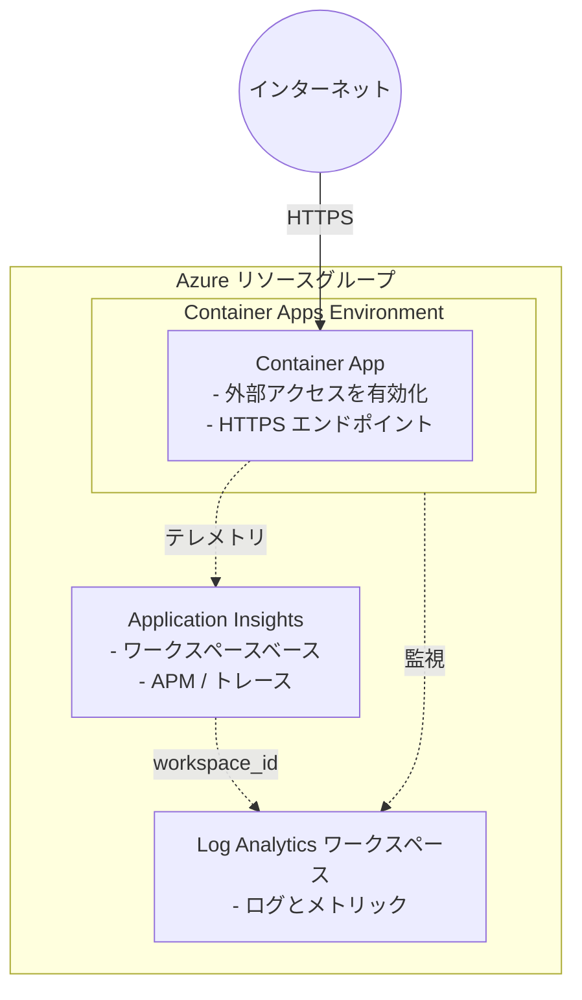

# Container Apps シナリオ

Docker Hub イメージを使用し、外部からアクセスできる Azure Container Apps をデプロイします。

## 概要

このシナリオでは、次のリソースを作成します。

- **リソースグループ**: すべてのリソースを格納します
- **Log Analytics ワークスペース**: Container Apps Environment の監視に必要です
- **Application Insights**: アプリケーションの可観測性に使用するワークスペースベースの Application Insights です (既定で有効)。その接続文字列は、シークレットを参照する `APPLICATIONINSIGHTS_CONNECTION_STRING` 環境変数として Container App に挿入されます。
- **Container Apps Environment**: コンテナーアプリを実行するためのマネージド環境です
- **Container App**: 外部イングレスを有効にして Docker Hub イメージを実行し、システム割り当てマネージド ID を使用します (既定で有効)

## 前提条件

共通ガイダンスの[プロバイダー認証](../../../docs/tips/provider-authentication.ja.md)、
[標準の Terraform ワークフロー](../../../docs/tips/terraform-workflow.ja.md)、およびオプションの
[Azure Blob リモートステート](../../../docs/tips/azure-blob-backend.ja.md)を使用します。

リポジトリの Makefile を使用する場合は、`SCENARIO=azure_container_apps` を設定します。

## アーキテクチャ



## 使用方法

`SCENARIO=azure_container_apps` を指定して、
[標準の Terraform ワークフロー](../../../docs/tips/terraform-workflow.ja.md)に従います。

### デプロイの確認

```shell
terraform output container_app_url

curl $(terraform output -raw container_app_url)
```

## 変数

| 名前                                       | 説明                                                         | 型             | 既定値           | 必須   |
|--------------------------------------------|--------------------------------------------------------------|----------------|------------------|--------|
| `resource_group_name`                      | リソースグループの名前                                       | `string`       | -                | はい   |
| `location`                                 | リソースの Azure リージョン                                  | `string`       | `"japaneast"`   | いいえ |
| `log_analytics_workspace_name`             | Log Analytics ワークスペースの名前                           | `string`       | -                | はい   |
| `container_app_environment_name`           | Container Apps Environment の名前                            | `string`       | -                | はい   |
| `container_app_name`                       | Container App の名前                                         | `string`       | -                | はい   |
| `container_image`                          | デプロイする Docker Hub イメージ                             | `string`       | `"nginx:latest"` | いいえ |
| `container_command`                        | コンテナーで実行するコマンド (エントリポイントを上書き)      | `list(string)` | `[]`             | いいえ |
| `container_port`                           | コンテナーが公開するポート                                   | `number`       | `80`             | いいえ |
| `cpu`                                      | コンテナーに割り当てる CPU コア数                            | `number`       | `0.25`           | いいえ |
| `memory`                                   | コンテナーに割り当てるメモリ                                 | `string`       | `"0.5Gi"`       | いいえ |
| `min_replicas`                             | レプリカの最小数                                             | `number`       | `0`              | いいえ |
| `max_replicas`                             | レプリカの最大数                                             | `number`       | `3`              | いいえ |
| `env_vars`                                 | 挿入する環境変数 (プレーン値は `value`、シークレット参照は `secret_name`) | `list(object)` | `[]` | いいえ |
| `secrets`                                  | Container App に定義し、`env_vars` から参照するシークレット  | `list(object)` | `[]`             | いいえ |
| `enable_application_insights`              | Application Insights をデプロイし、その接続文字列を Container App に挿入するかどうか | `bool` | `true` | いいえ |
| `application_insights_type`                | 作成する Application Insights の種類 (`web`、`java`、`MobileCenter`、`Node.JS`、`other`) | `string` | `"web"` | いいえ |
| `application_insights_sampling_percentage` | テレメトリのサンプリング率 (0～100、100 はサンプリングなし)   | `number`       | `100`            | いいえ |
| `tags`                                     | リソースに適用するタグ                                       | `map(string)`  | `{}`             | いいえ |

## 出力

| 名前                                          | 説明                                                             |
|-----------------------------------------------|------------------------------------------------------------------|
| `resource_group_name`                         | リソースグループの名前                                           |
| `container_app_environment_id`                | Container Apps Environment の ID                                 |
| `container_app_environment_name`              | Container Apps Environment の名前                                |
| `container_app_id`                            | Container App の ID                                              |
| `container_app_name`                          | Container App の名前                                             |
| `container_app_fqdn`                          | Container App の FQDN                                            |
| `container_app_url`                           | Container App にアクセスするための完全な URL                     |
| `container_app_identity_principal_id`         | Container App のシステム割り当てマネージド ID のプリンシパル ID  |
| `application_insights_id`                     | Application Insights リソースの ID (無効な場合は null)           |
| `application_insights_name`                   | Application Insights リソースの名前 (無効な場合は null)          |
| `application_insights_connection_string`      | Application Insights リソースの接続文字列 (機密、無効な場合は null) |
| `application_insights_instrumentation_key`    | Application Insights リソースのインストルメンテーションキー (機密、無効な場合は null) |

## 例

### カスタムアプリケーションのデプロイ

```hcl
# terraform.tfvars
resource_group_name            = "rg-myapp"
log_analytics_workspace_name   = "law-myapp"
container_app_environment_name = "cae-myapp"
container_app_name             = "ca-myapp"
container_image                = "myusername/myapp:v1.0.0"
container_port                 = 8080
cpu                            = 0.5
memory                         = "1Gi"
min_replicas                   = 1
max_replicas                   = 5
```

### タグを指定したデプロイ

```hcl
# terraform.tfvars
resource_group_name            = "rg-production"
log_analytics_workspace_name   = "law-production"
container_app_environment_name = "cae-production"
container_app_name             = "ca-api"
container_image                = "hashicorp/http-echo:latest"
container_port                 = 5678

tags = {
  environment = "production"
  team        = "platform"
  cost-center = "12345"
}
```

### カスタム起動コマンドを使用した ks6088ts/concierge のデプロイ

```shell
export ARM_SUBSCRIPTION_ID=$(az account show --query id --output tsv)

terraform apply -auto-approve \
  -var="container_image=ks6088ts/concierge:latest" \
  -var='container_command=["python","scripts/playgrounds/tts.py","--host","0.0.0.0","--port","80"]'
```

または、`terraform.tfvars` ファイルを使用します。

```hcl
# terraform.tfvars
container_image   = "ks6088ts/concierge:latest"

container_command = ["python", "scripts/playgrounds/tts.py", "--host", "0.0.0.0", "--port", "80"]
# container_command = ["uvicorn", "concierge.chat.infrastructure.web.app:create_app", "--factory", "--host", "0.0.0.0", "--port", "80"]
```

```shell
terraform apply -auto-approve

# アプリケーションの URL を取得
terraform output container_app_url
```

### 環境変数の挿入

```hcl
# terraform.tfvars
container_image = "myusername/myapp:v1.0.0"
container_port  = 8080

# プレーンな環境変数と、シークレットを参照する環境変数。
env_vars = [
  { name = "LOG_LEVEL", value = "INFO" },
  { name = "APP_ENV", value = "production" },
  { name = "API_KEY", secret_name = "api-key" },
]

# env_vars が `secret_name` を介して参照するシークレット値。
secrets = [
  { name = "api-key", value = "super-secret-value" },
]
```

各 `env_vars` エントリには、`value` (プレーンテキスト) または `secret_name`
(`secrets` 内のエントリへの参照) のどちらか一方だけを設定する必要があります。機密値には
`secrets` を使用し、プレーンな環境変数ではなく Container App のシークレットとして保存してください。

## 注意事項

- Container Apps は HTTPS エンドポイントを自動的に提供します
- 使用されていない場合、環境はコンテナーをゼロまでスケールします (`min_replicas = 0` の場合)
- Docker Hub のパブリックイメージはそのまま利用できます
- プライベートレジストリには追加の構成が必要です (Azure のドキュメントを参照)
