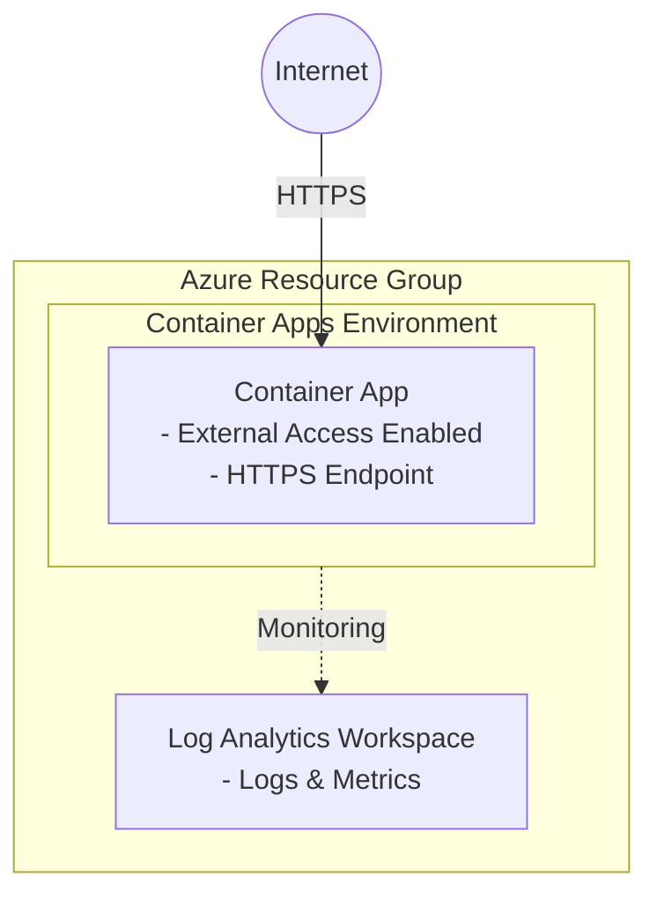

# Container Apps Scenario

Deploy Azure Container Apps with a Docker Hub image, externally accessible.

## Overview

This scenario creates:

- **Resource Group**: Container for all resources
- **Log Analytics Workspace**: Required for Container Apps Environment monitoring
- **Container Apps Environment**: Managed environment for running container apps
- **Container App**: Runs a Docker Hub image with external ingress enabled

## Prerequisites

- Terraform CLI installed (>= 1.6.0)
- Azure CLI installed and logged in (`az login`)
- Azure subscription with permissions to create resources

## Architecture



## How to use

```shell
# Login to Azure
az login

# Initialize Terraform
terraform init

# Plan the deployment
terraform plan

# Apply the deployment
terraform apply -auto-approve

# Get the application URL
terraform output container_app_url

# Test the deployment
curl $(terraform output -raw container_app_url)

# Destroy the deployment
terraform destroy -auto-approve
```

## Variables

| Name | Description | Type | Default | Required |
|------|-------------|------|---------|----------|
| `resource_group_name` | Name of the resource group | `string` | - | yes |
| `location` | Azure region for resources | `string` | `"japaneast"` | no |
| `log_analytics_workspace_name` | Name of the Log Analytics workspace | `string` | - | yes |
| `container_app_environment_name` | Name of the Container Apps Environment | `string` | - | yes |
| `container_app_name` | Name of the Container App | `string` | - | yes |
| `container_image` | Docker Hub image to deploy | `string` | `"nginx:latest"` | no |
| `container_port` | Port exposed by the container | `number` | `80` | no |
| `cpu` | CPU cores allocated to the container | `number` | `0.25` | no |
| `memory` | Memory allocated to the container | `string` | `"0.5Gi"` | no |
| `min_replicas` | Minimum number of replicas | `number` | `0` | no |
| `max_replicas` | Maximum number of replicas | `number` | `3` | no |
| `tags` | Tags to apply to resources | `map(string)` | `{}` | no |

## Outputs

| Name | Description |
|------|-------------|
| `resource_group_name` | Name of the resource group |
| `container_app_environment_id` | ID of the Container Apps Environment |
| `container_app_environment_name` | Name of the Container Apps Environment |
| `container_app_id` | ID of the Container App |
| `container_app_name` | Name of the Container App |
| `container_app_fqdn` | FQDN of the Container App |
| `container_app_url` | Full URL to access the Container App |

## Examples

### Deploy custom application

```hcl
# terraform.tfvars
resource_group_name            = "rg-myapp"
log_analytics_workspace_name   = "law-myapp"
container_app_environment_name = "cae-myapp"
container_app_name             = "ca-myapp"
container_image                = "myusername/myapp:v1.0.0"
container_port                 = 8080
cpu                            = 0.5
memory                         = "1Gi"
min_replicas                   = 1
max_replicas                   = 5
```

### Deploy with tags

```hcl
# terraform.tfvars
resource_group_name            = "rg-production"
log_analytics_workspace_name   = "law-production"
container_app_environment_name = "cae-production"
container_app_name             = "ca-api"
container_image                = "hashicorp/http-echo:latest"
container_port                 = 5678

tags = {
  environment = "production"
  team        = "platform"
  cost-center = "12345"
}
```

## Notes

- Container Apps automatically provides HTTPS endpoints
- The environment scales containers to zero when not in use (if `min_replicas = 0`)
- Docker Hub public images are supported out of the box
- For private registries, additional configuration is required (see Azure documentation)
