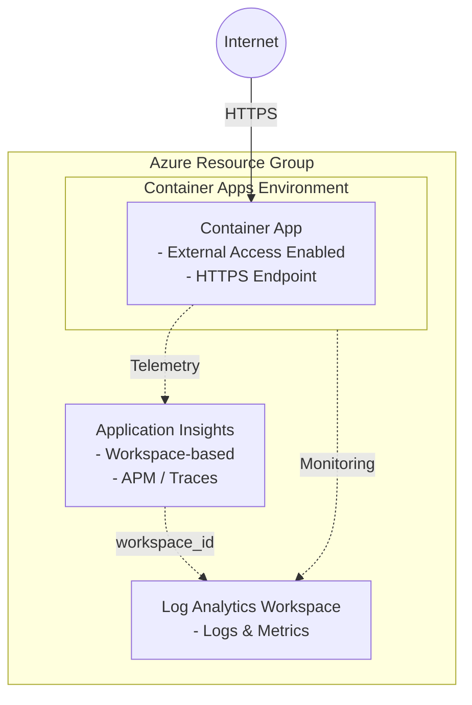

# Container Apps Scenario

Deploy Azure Container Apps with a Docker Hub image, externally accessible.

## Overview

This scenario creates:

- **Resource Group**: Container for all resources
- **Log Analytics Workspace**: Required for Container Apps Environment monitoring
- **Application Insights**: Workspace-based Application Insights for application observability (enabled by default). Its connection string is injected into the Container App as a secret-backed `APPLICATIONINSIGHTS_CONNECTION_STRING` environment variable.
- **Container Apps Environment**: Managed environment for running container apps
- **Container App**: Runs a Docker Hub image with external ingress enabled and a system-assigned managed identity (enabled by default)

## Prerequisites

- Terraform CLI installed (>= 1.6.0)
- Azure CLI installed and logged in (`az login`)
- Azure subscription with permissions to create resources

## Architecture


```mermaid
flowchart TB
    Internet((Internet))

    subgraph Azure["Azure Resource Group"]
        subgraph CAE["Container Apps Environment"]
            CA["Container App<br/>- External Access Enabled<br/>- HTTPS Endpoint"]
        end
        LAW["Log Analytics Workspace<br/>- Logs & Metrics"]
        APPI["Application Insights<br/>- Workspace-based<br/>- APM / Traces"]
    end

    Internet -->|HTTPS| CA
    CAE -.->|Monitoring| LAW
    APPI -.->|workspace_id| LAW
    CA -.->|Telemetry| APPI
```

## How to use

```shell
# Login to Azure
az login

# Initialize Terraform
terraform init

# Plan the deployment
terraform plan

# Apply the deployment
terraform apply -auto-approve

# Get the application URL
terraform output container_app_url

# Test the deployment
curl $(terraform output -raw container_app_url)

# Destroy the deployment
terraform destroy -auto-approve
```

## Variables

| Name | Description | Type | Default | Required |
|------|-------------|------|---------|----------|
| `resource_group_name` | Name of the resource group | `string` | - | yes |
| `location` | Azure region for resources | `string` | `"japaneast"` | no |
| `log_analytics_workspace_name` | Name of the Log Analytics workspace | `string` | - | yes |
| `container_app_environment_name` | Name of the Container Apps Environment | `string` | - | yes |
| `container_app_name` | Name of the Container App | `string` | - | yes |
| `container_image` | Docker Hub image to deploy | `string` | `"nginx:latest"` | no |
| `container_command` | Command to run in the container (overrides entrypoint) | `list(string)` | `[]` | no |
| `container_port` | Port exposed by the container | `number` | `80` | no |
| `cpu` | CPU cores allocated to the container | `number` | `0.25` | no |
| `memory` | Memory allocated to the container | `string` | `"0.5Gi"` | no |
| `min_replicas` | Minimum number of replicas | `number` | `0` | no |
| `max_replicas` | Maximum number of replicas | `number` | `3` | no |
| `env_vars` | Environment variables to inject (`value` for plain, `secret_name` to reference a secret) | `list(object)` | `[]` | no |
| `secrets` | Secrets defined on the Container App, referenced by `env_vars` | `list(object)` | `[]` | no |
| `enable_application_insights` | Whether to deploy Application Insights and inject its connection string into the Container App | `bool` | `true` | no |
| `application_insights_type` | Type of Application Insights to create (`web`, `java`, `MobileCenter`, `Node.JS`, `other`) | `string` | `"web"` | no |
| `application_insights_sampling_percentage` | Telemetry sampling percentage (0-100, 100 = no sampling) | `number` | `100` | no |
| `tags` | Tags to apply to resources | `map(string)` | `{}` | no |

## Outputs

| Name | Description |
|------|-------------|
| `resource_group_name` | Name of the resource group |
| `container_app_environment_id` | ID of the Container Apps Environment |
| `container_app_environment_name` | Name of the Container Apps Environment |
| `container_app_id` | ID of the Container App |
| `container_app_name` | Name of the Container App |
| `container_app_fqdn` | FQDN of the Container App |
| `container_app_url` | Full URL to access the Container App |
| `container_app_identity_principal_id` | Principal ID of the Container App's system assigned managed identity |
| `application_insights_id` | ID of the Application Insights resource (null when disabled) |
| `application_insights_name` | Name of the Application Insights resource (null when disabled) |
| `application_insights_connection_string` | Connection string of the Application Insights resource (sensitive, null when disabled) |
| `application_insights_instrumentation_key` | Instrumentation key of the Application Insights resource (sensitive, null when disabled) |

## Examples

### Deploy custom application

```hcl
# terraform.tfvars
resource_group_name            = "rg-myapp"
log_analytics_workspace_name   = "law-myapp"
container_app_environment_name = "cae-myapp"
container_app_name             = "ca-myapp"
container_image                = "myusername/myapp:v1.0.0"
container_port                 = 8080
cpu                            = 0.5
memory                         = "1Gi"
min_replicas                   = 1
max_replicas                   = 5
```

### Deploy with tags

```hcl
# terraform.tfvars
resource_group_name            = "rg-production"
log_analytics_workspace_name   = "law-production"
container_app_environment_name = "cae-production"
container_app_name             = "ca-api"
container_image                = "hashicorp/http-echo:latest"
container_port                 = 5678

tags = {
  environment = "production"
  team        = "platform"
  cost-center = "12345"
}
```

### Deploy ks6088ts/concierge with custom startup command

```shell
export ARM_SUBSCRIPTION_ID=$(az account show --query id --output tsv)

terraform apply -auto-approve \
  -var="container_image=ks6088ts/concierge:latest" \
  -var='container_command=["python","scripts/playgrounds/tts.py","--host","0.0.0.0","--port","80"]'
```

Or using a `terraform.tfvars` file:

```hcl
# terraform.tfvars
container_image   = "ks6088ts/concierge:latest"

container_command = ["python", "scripts/playgrounds/tts.py", "--host", "0.0.0.0", "--port", "80"]
# container_command = ["uvicorn", "concierge.chat.infrastructure.web.app:create_app", "--factory", "--host", "0.0.0.0", "--port", "80"]
```

```shell
terraform apply -auto-approve

# Get the application URL
terraform output container_app_url
```

### Inject environment variables

```hcl
# terraform.tfvars
container_image = "myusername/myapp:v1.0.0"
container_port  = 8080

# Plain environment variables, and secret-backed ones.
env_vars = [
  { name = "LOG_LEVEL", value = "INFO" },
  { name = "APP_ENV", value = "production" },
  { name = "API_KEY", secret_name = "api-key" },
]

# Secret values referenced by env_vars via `secret_name`.
secrets = [
  { name = "api-key", value = "super-secret-value" },
]
```

Each `env_vars` entry must set exactly one of `value` (plain text) or `secret_name`
(a reference to an entry in `secrets`). Prefer `secrets` for sensitive values so
they are stored as Container App secrets rather than plain environment values.

## Notes

- Container Apps automatically provides HTTPS endpoints
- The environment scales containers to zero when not in use (if `min_replicas = 0`)
- Docker Hub public images are supported out of the box
- For private registries, additional configuration is required (see Azure documentation)
