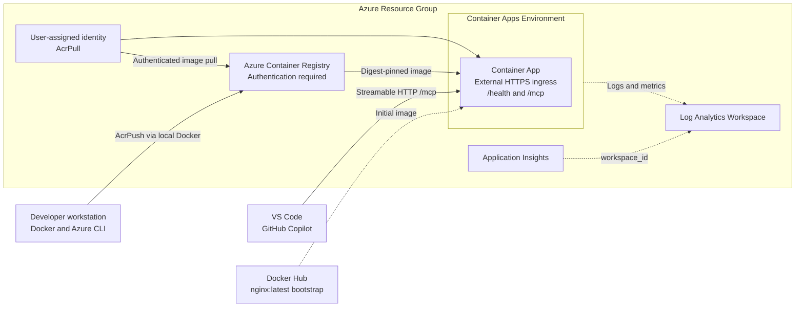

## Overview

This scenario provisions the Azure infrastructure needed to publish a locally
built container image to Azure Container Registry (ACR) and run it on Azure
Container Apps. The initial deployment uses `nginx:latest`, so Terraform can
create the infrastructure and registry permissions before the application image
exists. Scripts under `scripts/` then build, push, deploy, and verify the MCP task
server included under `src/`.

The scenario creates:

- A resource group
- An authentication-required ACR with admin and anonymous access disabled
- A user-assigned managed identity with `AcrPull` on the registry
- An `AcrPush` role assignment for the Terraform principal or a configured principal
- A Log Analytics workspace and optional Application Insights resource
- A Container Apps environment and externally accessible Container App
- Optional Microsoft Entra ID built-in authentication for incoming requests

The ACR public network endpoint remains enabled so a local Docker client can push
images. Here, "private ACR" means authentication is required; it does not mean
the registry is reachable only through Private Link.

## Prerequisites

Follow the shared guidance for [provider authentication](../../../docs/tips/provider-authentication.md),
the [standard Terraform workflow](../../../docs/tips/terraform-workflow.md), and optional
[Azure Blob remote state](../../../docs/tips/azure-blob-backend.md).

The deployment workflow requires:

- Terraform 1.6 or later
- Azure CLI 2.62.0 or later, signed in
- Docker with a running daemon
- `jq` and `curl`
- Permission to create the Azure resources and role assignments

`Owner` is sufficient for a demonstration subscription. A more restricted setup
can combine resource creation permissions with `Role Based Access Control
Administrator` or `User Access Administrator` at the registry scope.

Terraform grants `AcrPush` to the identity running Terraform by default. If the
identity signed in to Azure CLI is different, set `acr_push_principal_id` to that
identity's object ID before the first apply.

## Architecture


```mermaid
flowchart LR
    Developer["Developer workstation<br/>Docker and Azure CLI"]
    Copilot["VS Code<br/>GitHub Copilot"]
    Bootstrap["Docker Hub<br/>nginx:latest bootstrap"]

    subgraph Azure["Azure Resource Group"]
        ACR["Azure Container Registry<br/>Authentication required"]
        Identity["User-assigned identity<br/>AcrPull"]
        subgraph CAE["Container Apps Environment"]
            CA["Container App<br/>External HTTPS ingress<br/>/health and /mcp"]
        end
        LAW["Log Analytics Workspace"]
        APPI["Application Insights"]
    end

    Developer -->|AcrPush via local Docker| ACR
    Bootstrap -.->|Initial image| CA
    Identity -->|Authenticated image pull| ACR
    Identity --> CA
    ACR -->|Digest-pinned image| CA
    Copilot -->|Streamable HTTP /mcp| CA
    CAE -.->|Logs and metrics| LAW
    APPI -.->|workspace_id| LAW
```

## Deploy

### 1. Bootstrap the infrastructure

From the scenario directory, initialize and apply Terraform. The Container App
starts with `nginx:latest`; ACR, managed identity, and role assignments are ready
for the later image deployment.

```bash
cd infra/scenarios/azure_container_apps
terraform init
terraform apply
```

### 2. Validate local prerequisites

```bash
./scripts/validate_prerequisites.sh
```

This checks the required commands, Azure sign-in, Docker daemon, Terraform
outputs, and access to the provisioned registry.

### 3. Build the image locally

The default repository is `tasks-mcp-server`, the tag is `latest`, and the
platform is `linux/amd64`. The explicit platform also supports building from an
Apple Silicon workstation for the Container Apps runtime.

```bash
export IMAGE_REPOSITORY=tasks-mcp-server
export IMAGE_TAG=v1
export IMAGE_PLATFORM=linux/amd64
./scripts/build_image.sh
```

### 4. Push the image to ACR

```bash
./scripts/push_image.sh
```

The script signs in with `az acr login`, verifies that the fully qualified image
exists locally, and pushes it with Docker.

### 5. Deploy the pushed image

```bash
./scripts/deploy_image.sh
```

Normal Terraform apply options can be passed directly:

```bash
./scripts/deploy_image.sh -auto-approve
```

The script resolves the pushed tag to its registry digest, writes the immutable
image reference and MCP runtime settings to the ignored
`deployment.auto.tfvars.json`, and runs `terraform apply`. The generated file
sets port `8080` and one minimum and maximum replica. Keeping it prevents a later
Terraform apply from reverting the app to the bootstrap image.

To deploy another repository, tag, or platform, export the same values before
running the relevant scripts. Each script is independently runnable; there is no
combined runner.

### 6. Verify the deployment

```bash
./scripts/verify_deployment.sh
./scripts/verify_deployment.sh --verbose
```

The script checks `/health` and sends an MCP `tools/list` request to `/mcp`. If
Microsoft Entra authentication is enabled, it obtains an Azure CLI access token
for the configured application ID URI automatically. Use `-v` or `--verbose` to
show each request, its HTTP status, the MCP response format, and the returned tool
names. Verbose mode does not print the bearer token.

For failure diagnosis and recovery steps, see [Troubleshooting](troubleshooting.md).

## Script reference

| Script | Purpose |
| --- | --- |
| `validate_prerequisites.sh` | Validate tools, authentication, Docker, Terraform outputs, and ACR access |
| `build_image.sh` | Build `src/` locally and tag it with the ACR login server |
| `push_image.sh` | Authenticate to ACR and push the local image |
| `deploy_image.sh` | Resolve the digest, persist deployment variables, and apply Terraform |
| `verify_deployment.sh` | Verify the health and MCP endpoints, with optional verbose output |

## Develop locally

The bundled server exposes `list_tasks`, `get_task`, `create_task`,
`toggle_task_complete`, and `delete_task` through stateless Streamable HTTP.

```bash
cd infra/scenarios/azure_container_apps/src
python -m venv .venv
source .venv/bin/activate
python -m pip install -r requirements.txt
python -m uvicorn app:app --reload --host 127.0.0.1 --port 8080
```

In another terminal:

```bash
curl --fail http://localhost:8080/health
curl --fail --show-error --no-buffer \
  --header "Content-Type: application/json" \
  --header "Accept: application/json, text/event-stream" \
  --data '{"jsonrpc":"2.0","id":1,"method":"tools/list"}' \
  http://localhost:8080/mcp
```

## Microsoft Entra authentication

Set `enable_authentication = true` in a local `terraform.tfvars` before the
bootstrap apply to protect all incoming paths with Container Apps built-in
authentication. This creates a Microsoft Entra application, service principal,
Azure CLI pre-authorization, and Container App `authConfig`.

```hcl
enable_authentication = true
```

The setting must remain present when `deploy_image.sh` runs. Alternatively, pass
it directly:

```bash
./scripts/deploy_image.sh -var="enable_authentication=true"
```

Built-in authentication also protects `/health`. The verification script sends
the bearer token to both endpoints when authentication is enabled.

## Variables

| Name | Description | Type | Default |
| --- | --- | --- | --- |
| `name` | Base name for generated resources | `string` | `"azurecontainerapps"` |
| `location` | Azure region for resources | `string` | `"japaneast"` |
| `tags` | Tags applied to resources | `map(string)` | See `variables.tf` |
| `container_image` | OCI image deployed to the Container App | `string` | `"nginx:latest"` |
| `acr_sku` | ACR SKU (`Basic`, `Standard`, or `Premium`) | `string` | `"Basic"` |
| `acr_push_principal_id` | Object ID granted `AcrPush`; Terraform principal when null | `string` | `null` |
| `container_command` | Command overriding the image entrypoint | `list(string)` | `[]` |
| `container_port` | Port exposed by the container | `number` | `80` |
| `cpu` | CPU cores allocated to the container | `number` | `0.25` |
| `memory` | Memory allocated to the container | `string` | `"0.5Gi"` |
| `min_replicas` | Minimum replicas | `number` | `0` |
| `max_replicas` | Maximum replicas | `number` | `3` |
| `env_vars` | Plain or secret-backed environment variables | `list(object)` | `[]` |
| `secrets` | Container App secrets referenced by `env_vars` | `list(object)` | `[]` |
| `enable_authentication` | Require Microsoft Entra authentication | `bool` | `false` |
| `azure_cli_client_id` | Azure CLI public client ID pre-authorized for tokens | `string` | Azure CLI client ID |
| `enable_application_insights` | Deploy Application Insights and inject its connection string | `bool` | `true` |
| `application_insights_type` | Application Insights application type | `string` | `"web"` |
| `application_insights_sampling_percentage` | Telemetry sampling percentage | `number` | `100` |

## Outputs

| Name | Description |
| --- | --- |
| `resource_group_name` | Resource group name |
| `acr_id` | ACR resource ID |
| `acr_name` | ACR name |
| `acr_login_server` | ACR login server |
| `acr_push_principal_id` | Object ID granted `AcrPush` |
| `container_app_environment_id` | Container Apps environment ID |
| `container_app_environment_name` | Container Apps environment name |
| `container_app_id` | Container App resource ID |
| `container_app_name` | Container App name |
| `container_app_fqdn` | Container App FQDN |
| `container_app_url` | Container App HTTPS URL |
| `container_app_identity_id` | Pull identity resource ID |
| `container_app_identity_client_id` | Pull identity client ID |
| `container_app_identity_principal_id` | Pull identity principal ID |
| `container_app_authentication_client_id` | Authentication application client ID, or `null` |
| `container_app_authentication_identifier_uri` | Token audience, or `null` |
| `container_app_authentication_tenant_id` | Authentication tenant ID, or `null` |
| `application_insights_id` | Application Insights ID, or `null` |
| `application_insights_name` | Application Insights name, or `null` |
| `application_insights_connection_string` | Sensitive connection string, or `null` |
| `application_insights_instrumentation_key` | Sensitive instrumentation key, or `null` |

## Reset or clean up

To return the Container App to the public bootstrap image, delete the generated
deployment file and apply again:

```bash
rm -f deployment.auto.tfvars.json
terraform apply
```

The generated file can remain present during destroy:

```bash
terraform destroy
rm -f deployment.auto.tfvars.json
```

## Security and operational notes

- ACR admin credentials and anonymous pull are disabled.
- `LegacyRegistryPermissions` is explicit so `AcrPull` and `AcrPush` retain their expected semantics.
- Container Apps pulls through a user-assigned managed identity; no registry password is stored in Terraform state.
- Images are deployed by digest even though local build and push use a readable tag.
- The ACR public endpoint is enabled. Private Link, firewall restrictions, and VNet-only registry access are outside this scenario.
- The MCP endpoint is unauthenticated by default; enable Microsoft Entra authentication before exposing it to untrusted users.
- The demonstration task store is in-memory and loses changes when the process restarts.

## References

- [Deploy a Python MCP server to Azure Container Apps](https://learn.microsoft.com/en-us/azure/container-apps/tutorial-mcp-server-python)
- [Pull images from Azure Container Registry with managed identity](https://learn.microsoft.com/en-us/azure/container-apps/containers#use-a-managed-identity)
- [Azure Container Registry roles and permissions](https://learn.microsoft.com/en-us/azure/container-registry/container-registry-rbac-built-in-roles-overview)
- [Secure MCP servers on Azure Container Apps](https://learn.microsoft.com/en-us/azure/container-apps/mcp-authentication)
- [MCP Python SDK](https://github.com/modelcontextprotocol/python-sdk)
