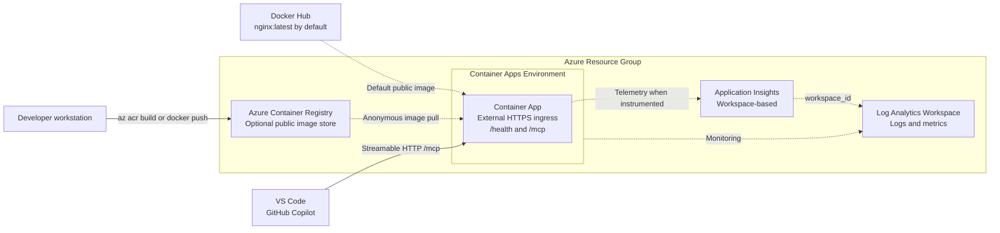

## Overview

The default deployment runs the public `nginx:latest` image. The included Python
application under `src/` is an MCP task server that can also be developed locally,
packaged as a container image, published to an optional public Azure Container
Registry (ACR), and deployed to the same Container App.

> [!NOTE]
> The MCP server implementation, containerization, local verification, and
> Container Apps deployment workflow are based on the
> [Microsoft Learn Python MCP server tutorial](https://learn.microsoft.com/en-us/azure/container-apps/tutorial-mcp-server-python).
> This scenario adapts that workflow to Terraform, the MCP Python SDK v2,
> ACR Tasks, anonymous image pull, and the explicit Host and Origin allowlists
> required by the SDK's DNS rebinding protection on Container Apps.

This scenario creates the following resources:

- A resource group for all scenario resources
- An optional Standard or Premium ACR with registry-wide anonymous pull access
- A Log Analytics workspace for Container Apps environment logs and metrics
- Workspace-based Application Insights, enabled by default
- A Container Apps environment
- A Container App with external ingress and a system-assigned managed identity
- An optional Microsoft Entra application and Container App authentication configuration

The Application Insights connection string is stored as a Container App secret and
referenced by the `APPLICATIONINSIGHTS_CONNECTION_STRING` environment variable.
The application must still be instrumented before it emits Application Insights
telemetry.

## Prerequisites

Use the shared guidance for [provider authentication](../../../docs/tips/provider-authentication.md),
the [standard Terraform workflow](../../../docs/tips/terraform-workflow.md), and optional
[Azure Blob remote state](../../../docs/tips/azure-blob-backend.md).

The MCP workflow also requires:

- Azure CLI 2.62.0 or later, signed in with permission to create the resources and queue ACR builds
- Python 3.10 or later
- Visual Studio Code with GitHub Copilot when testing the MCP tools through Copilot Chat
- Docker only when building or testing the image locally

`az acr build` performs the image build in Azure and does not require a local Docker
daemon. Set `SCENARIO=azure_container_apps` when using the repository Makefile.

## Architecture


```mermaid
flowchart LR
    Developer["Developer workstation"]
    Copilot["VS Code<br/>GitHub Copilot"]
    DockerHub["Docker Hub<br/>nginx:latest by default"]

    subgraph Azure["Azure Resource Group"]
        ACR["Azure Container Registry<br/>Optional public image store"]
        subgraph CAE["Container Apps Environment"]
            CA["Container App<br/>External HTTPS ingress<br/>/health and /mcp"]
        end
        LAW["Log Analytics Workspace<br/>Logs and metrics"]
        APPI["Application Insights<br/>Workspace-based"]
    end

    Developer -->|az acr build or docker push| ACR
    DockerHub -.->|Default public image| CA
    ACR -.->|Anonymous image pull| CA
    Copilot -->|Streamable HTTP /mcp| CA
    CAE -.->|Monitoring| LAW
    APPI -.->|workspace_id| LAW
    CA -.->|Telemetry when instrumented| APPI
```

## Deploy the default image

Follow the [standard Terraform workflow](../../../docs/tips/terraform-workflow.md) with
`SCENARIO=azure_container_apps`.

From the repository root, deploy the default public image:

```bash
make deploy SCENARIO=azure_container_apps
```

Verify the nginx endpoint:

```bash
cd infra/scenarios/azure_container_apps
APP_URL=$(terraform output -raw container_app_url)
curl --fail "$APP_URL"
```

## Develop the MCP server locally

The server exposes `list_tasks`, `get_task`, `create_task`,
`toggle_task_complete`, and `delete_task`. Its Streamable HTTP endpoint is
`/mcp`, and `/health` is available for health checks.

### Create the Python environment

```bash
cd infra/scenarios/azure_container_apps/src
python -m venv .venv
source .venv/bin/activate
python -m pip install -r requirements.txt
python -m uvicorn app:app --reload --host 127.0.0.1 --port 8080
```

In another terminal, verify the health endpoint:

```bash
curl --fail http://localhost:8080/health
```

The expected response is:

```json
{"status":"healthy"}
```

### Verify MCP connectivity

The server uses stateless Streamable HTTP, so you can send `tools/list` and
`tools/call` requests directly. Keep the server running and execute the
following commands in another terminal:

```bash
export MCP_URL="${MCP_URL:-http://localhost:8080/mcp}"

curl --fail --show-error --no-buffer \
  --header "Content-Type: application/json" \
  --header "Accept: application/json, text/event-stream" \
  --data '{"jsonrpc":"2.0","id":1,"method":"tools/list"}' \
  "$MCP_URL"

curl --fail --show-error --no-buffer \
  --header "Content-Type: application/json" \
  --header "Accept: application/json, text/event-stream" \
  --data '{"jsonrpc":"2.0","id":2,"method":"tools/call","params":{"name":"list_tasks","arguments":{}}}' \
  "$MCP_URL"
```

The first response contains the five task tool names. The second response
contains the task records returned by `list_tasks`. Responses use the
`text/event-stream` format, so each JSON-RPC result appears on a `data:` line.

### Connect VS Code to the local server

Add the `tasks-mcp` entry under `servers` in the workspace `.vscode/mcp.json`.
Merge it with any existing server entries instead of replacing the file:

```json
{
  "servers": {
    "tasks-mcp": {
      "url": "http://localhost:8080/mcp",
      "type": "http"
    }
  }
}
```

Open Copilot Chat in agent mode, enable `tasks-mcp`, and ask it to list the
tasks. Tool calls that modify or delete tasks require the same review as any
other external tool action.

## Build and run the bundled MCP image locally

Docker is optional for this workflow. From the MCP source directory, build and
run the image:

```bash
cd infra/scenarios/azure_container_apps/src
docker build --tag tasks-mcp-server:local .
docker run --rm --name tasks-mcp-server --publish 8080:8080 tasks-mcp-server:local
```

Use another terminal to check the container and connect through the same local
`mcp.json` entry:

```bash
curl --fail http://localhost:8080/health
```

Run the commands under **Verify MCP connectivity** again. The default
`MCP_URL` remains `http://localhost:8080/mcp` for the local container.

## Deploy the MCP server through public ACR

> [!NOTE]
> ACR stores the container image. MCP clients connect to the running Container
> App at `/mcp`, not to the registry endpoint.

> [!WARNING]
> Anonymous pull access applies to every repository in the registry. Do not
> publish private images or secrets to an ACR created with this option.

### Create the registry

The first apply keeps nginx running while it creates the optional ACR. Anonymous
pull requires the Standard or Premium SKU; Standard is the default.

```bash
cd infra/scenarios/azure_container_apps
terraform init
terraform apply -var="enable_public_acr=true"

ACR_NAME=$(terraform output -raw acr_name)
ACR_LOGIN_SERVER=$(terraform output -raw acr_login_server)
IMAGE_REPOSITORY="tasks-mcp-server"
IMAGE_TAG="v1"
```

### Build and push in Azure

The recommended path queues an ACR build and pushes the resulting image without
using a local Docker daemon:

```bash
az acr build \
  --registry "$ACR_NAME" \
  --image "$IMAGE_REPOSITORY:$IMAGE_TAG" \
  ./src
```

Anonymous access is pull-only. The identity running this command must still be
authorized to queue builds and push images to the registry.

### Build and push with local Docker

Use this alternative when Docker is available locally:

```bash
az acr login --name "$ACR_NAME"
docker build \
  --tag "$ACR_LOGIN_SERVER/$IMAGE_REPOSITORY:$IMAGE_TAG" \
  ./src
docker push "$ACR_LOGIN_SERVER/$IMAGE_REPOSITORY:$IMAGE_TAG"
```

### Update the Container App

Deploy the published MCP image on port 8080. One minimum replica avoids an
interactive cold start. One maximum replica prevents the demonstration-only
in-memory store from diverging across replicas.

```bash
MCP_IMAGE="$ACR_LOGIN_SERVER/$IMAGE_REPOSITORY:$IMAGE_TAG"

terraform apply \
  -var="enable_public_acr=true" \
  -var="container_image=$MCP_IMAGE" \
  -var="container_port=8080" \
  -var="min_replicas=1" \
  -var="max_replicas=1"
```

Repeat these variables on later Terraform commands or persist them in a
`terraform.tfvars` file:

```hcl
enable_public_acr = true
acr_sku           = "Standard"
container_image   = "<acr-login-server>/tasks-mcp-server:v1"
container_port    = 8080
min_replicas      = 1
max_replicas      = 1
```

Verify the deployed server:

```bash
APP_URL=$(terraform output -raw container_app_url)
curl --fail "$APP_URL/health"
export MCP_URL="$APP_URL/mcp"

curl --fail --show-error --no-buffer \
  --header "Content-Type: application/json" \
  --header "Accept: application/json, text/event-stream" \
  --data '{"jsonrpc":"2.0","id":1,"method":"tools/list"}' \
  "$MCP_URL"

curl --fail --show-error --no-buffer \
  --header "Content-Type: application/json" \
  --header "Accept: application/json, text/event-stream" \
  --data '{"jsonrpc":"2.0","id":2,"method":"tools/call","params":{"name":"list_tasks","arguments":{}}}' \
  "$MCP_URL"
```

Configure the deployed endpoint in `.vscode/mcp.json` by replacing the
placeholder with the value from `container_app_url`:

```json
{
  "servers": {
    "tasks-mcp": {
      "url": "https://<container-app-fqdn>/mcp",
      "type": "http"
    }
  }
}
```

## Protect the MCP server with Microsoft Entra ID

Authentication is opt-in and disabled by default. Set `enable_authentication = true`
to put Container Apps [built-in authentication](https://learn.microsoft.com/en-us/azure/container-apps/authentication)
in front of the container. Unauthenticated requests receive HTTP 401 instead of a
login redirect, which is the behavior MCP clients expect.

Enabling the option creates the following additional resources:

- A Microsoft Entra application that exposes the `user_impersonation` scope and the `api://<client-id>` Application ID URI
- A service principal for that application
- A pre-authorization for the Azure CLI public client so that `az account get-access-token` can issue tokens for the API
- A Container App `authConfig` that requires a Microsoft Entra bearer token and returns 401 to anonymous callers

The identity running Terraform needs permission to create Microsoft Entra
applications and service principals.

```bash
terraform apply \
  -var="enable_authentication=true" \
  -var="enable_public_acr=true" \
  -var="container_image=$MCP_IMAGE" \
  -var="container_port=8080" \
  -var="min_replicas=1" \
  -var="max_replicas=1"
```

> [!NOTE]
> Built-in authentication applies to every path, including `/health`, so anonymous
> health checks return 401 while it is enabled.

Verify that anonymous requests are rejected and authenticated requests succeed:

```bash
APP_URL=$(terraform output -raw container_app_url)
AUDIENCE=$(terraform output -raw container_app_authentication_identifier_uri)
ACCESS_TOKEN=$(az account get-access-token --resource "$AUDIENCE" --query accessToken --output tsv)

curl --include "$APP_URL/mcp"

curl --fail --show-error --no-buffer \
  --header "Authorization: Bearer $ACCESS_TOKEN" \
  --header "Content-Type: application/json" \
  --header "Accept: application/json, text/event-stream" \
  --data '{"jsonrpc":"2.0","id":1,"method":"tools/list"}' \
  "$APP_URL/mcp"
```

The first request returns `401 Unauthorized`. The second returns the tool list.

Configure VS Code to send the token. When prompted, paste the token string
produced by `az account get-access-token --resource "$AUDIENCE" --query accessToken --output tsv`:

```json
{
  "servers": {
    "tasks-mcp": {
      "url": "https://<container-app-fqdn>/mcp",
      "type": "http",
      "headers": {
        "Authorization": "Bearer ${input:mcpBearerToken}"
      }
    }
  },
  "inputs": [
    {
      "id": "mcpBearerToken",
      "type": "promptString",
      "description": "Enter your bearer token for the MCP server",
      "password": true
    }
  ]
}
```

Access tokens expire, so the prompt must be answered again with a fresh token
after expiry.

## Variables

| Name                                         | Description                                                    | Type               | Default                    |
|----------------------------------------------|----------------------------------------------------------------|--------------------|----------------------------|
| `name`                                       | Base name for generated resources                              | `string`           | `"azurecontainerapps"`     |
| `location`                                   | Azure region for resources                                     | `string`           | `"japaneast"`              |
| `tags`                                       | Tags applied to resources                                      | `map(string)`      | See `variables.tf`         |
| `container_image`                            | Public OCI image deployed to the Container App                 | `string`           | `"nginx:latest"`           |
| `enable_public_acr`                          | Deploy an ACR with registry-wide anonymous pull                | `bool`             | `false`                    |
| `acr_sku`                                    | SKU for the public ACR (`Standard` or `Premium`)               | `string`           | `"Standard"`               |
| `container_command`                          | Command that overrides the image entrypoint                    | `list(string)`     | `[]`                       |
| `container_port`                             | Port exposed by the container                                  | `number`           | `80`                       |
| `cpu`                                        | CPU cores allocated to the container                           | `number`           | `0.25`                     |
| `memory`                                     | Memory allocated to the container                              | `string`           | `"0.5Gi"`                  |
| `min_replicas`                               | Minimum number of replicas                                     | `number`           | `0`                        |
| `max_replicas`                               | Maximum number of replicas                                     | `number`           | `3`                        |
| `env_vars`                                   | Plain or secret-backed environment variables                   | `list(object)`     | `[]`                       |
| `secrets`                                    | Container App secrets referenced by `env_vars`                 | `list(object)`     | `[]`                       |
| `enable_authentication`                      | Require Microsoft Entra ID authentication on the Container App  | `bool`             | `false`                    |
| `azure_cli_client_id`                        | Azure CLI public client ID pre-authorized for token requests   | `string`           | `"04b07795-8ddb-461a-bbee-02f9e1bf7b46"` |
| `enable_application_insights`                | Deploy Application Insights and inject its connection string   | `bool`             | `true`                     |
| `application_insights_type`                  | Application Insights application type                          | `string`           | `"web"`                    |
| `application_insights_sampling_percentage`   | Telemetry sampling percentage from 0 to 100                    | `number`           | `100`                      |

## Outputs

| Name                                        | Description                                                          |
|---------------------------------------------|----------------------------------------------------------------------|
| `resource_group_name`                       | Name of the resource group                                           |
| `acr_id`                                    | ID of ACR, or `null` when disabled                                   |
| `acr_name`                                  | Name of ACR, or `null` when disabled                                 |
| `acr_login_server`                          | Login server of ACR, or `null` when disabled                         |
| `container_app_environment_id`              | ID of the Container Apps environment                                 |
| `container_app_environment_name`            | Name of the Container Apps environment                               |
| `container_app_id`                          | ID of the Container App                                              |
| `container_app_name`                        | Name of the Container App                                            |
| `container_app_fqdn`                        | FQDN of the Container App                                            |
| `container_app_url`                         | HTTPS URL of the Container App                                       |
| `container_app_identity_principal_id`       | Principal ID of the Container App managed identity                   |
| `container_app_authentication_client_id`    | Client ID of the Microsoft Entra application, or `null` when disabled |
| `container_app_authentication_identifier_uri` | Application ID URI used as the token audience, or `null` when disabled |
| `container_app_authentication_tenant_id`    | Microsoft Entra tenant ID, or `null` when disabled                   |
| `application_insights_id`                   | ID of Application Insights, or `null` when disabled                  |
| `application_insights_name`                 | Name of Application Insights, or `null` when disabled                |
| `application_insights_connection_string`    | Sensitive connection string, or `null` when disabled                 |
| `application_insights_instrumentation_key`  | Sensitive instrumentation key, or `null` when disabled               |

## Clean up

Use the same variables or saved `terraform.tfvars` when removing the scenario:

```bash
terraform destroy -var="enable_public_acr=true" -var="enable_authentication=true"
```

## Security and operational notes

- Container Apps provides an HTTPS endpoint automatically
- The MCP endpoint is unauthenticated by default; set `enable_authentication = true` before exposing it beyond trusted users
- Built-in authentication validates Microsoft Entra tokens at the platform edge, so the application still receives every allowed request without its own authorization checks
- The task store is in-memory, is not thread-safe, and loses all changes when the process restarts
- `min_replicas = 0` enables scale-to-zero but introduces a cold start for interactive MCP clients
- Anonymous ACR pull is registry-wide and can be throttled for high unauthenticated request rates
- Private ACR authentication, managed-identity image pull, and persistent task storage are outside this scenario

## References

- [Deploy a Python MCP server to Azure Container Apps](https://learn.microsoft.com/en-us/azure/container-apps/tutorial-mcp-server-python)
- [Secure MCP servers on Azure Container Apps](https://learn.microsoft.com/en-us/azure/container-apps/mcp-authentication)
- [Build a container image with Azure ACR Tasks](https://learn.microsoft.com/en-us/azure/container-registry/container-registry-tutorial-quick-task)
- [Enable anonymous pull access in Azure Container Registry](https://learn.microsoft.com/en-us/azure/container-registry/anonymous-pull-access)
- [MCP Python SDK](https://github.com/modelcontextprotocol/python-sdk)
