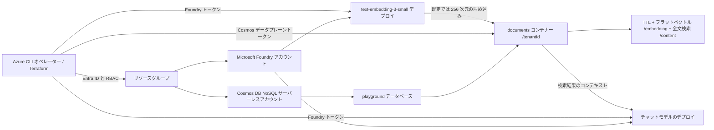

# Azure Cosmos DB Playground

[English](./README.md)

Azure Cosmos DB for NoSQL のサーバーレスアカウントと、埋め込み・チャットモデルをデプロイする Microsoft Foundry アカウントを作成します。番号付きスクリプトで CRUD、TTL、変更フィード、ベクトル検索、全文検索、ハイブリッド検索、検索拡張生成（RAG）を体験できます。**課金対象**の学習環境であり、閉域・本番構成ではありません。エンドポイントは公開されていますが、Cosmos DB のローカル認証（キー）と Foundry のローカル認証は無効です。スクリプトはリソースキーではなく Microsoft Entra トークンを使用します。

## 構成



Terraform がリソースとオペレーターのロール割り当てを作成し、シェルスクリプトはタグ付きサンプルドキュメントだけを書き込み・削除します。データベースは `playground`、コンテナーは `documents`。パーティションキーは `/tenantId` で、TTL、`/embedding` の cosine フラットベクトルインデックス（既定で 256 次元）、`/content` の英語全文インデックスを有効にします。オペレーターにはデータベーススコープで Cosmos DB Built-in Data Contributor、Foundry で Cognitive Services OpenAI User を割り当てます。Foundry エージェント、アプリケーションホスト、プライベートエンドポイント、リモートバックエンドは作成しません。

リソース名は、競合を避ける共通のベース名 `<name>-<random-suffix>` から生成します。既定では、リソースグループは `rg-azurecosmosdbplayground-<suffix>`、Cosmos DB アカウントは `cosmos-azurecosmosdbplayground-<suffix>`、Foundry アカウントは `azurecosmosdbplayground-<suffix>` です。

## 前提条件

- Terraform **>= 1.11**、Azure CLI、`curl`、`jq`、POSIX シェル。リソースグループ、Cosmos DB、Foundry、モデルデプロイ、および Azure/Cosmos データプレーンのロール割り当てを作成できる ID でログインしてください。同じ ID でスクリプトを実行するか、適用前にスクリプト実行者の Entra オブジェクト ID を `operator_principal_id` に指定します。
- Microsoft.DocumentDB と Microsoft.CognitiveServices が登録済みで、選択したリージョンで Cosmos DB サーバーレス・ベクトル/全文検索と **両方** のモデルの指定バージョン、SKU、容量のクォータを利用できるサブスクリプション。既定値は `japaneast`、`text-embedding-3-small` バージョン `1`（`GlobalStandard`、容量 `30`）、`gpt-5.4-mini` バージョン `2026-03-17`（`GlobalStandard`、容量 `100`）です。提供状況とクォータは変わるため、作成前に [Foundry のモデルとデプロイ方式](https://learn.microsoft.com/azure/foundry/foundry-models/concepts/deployment-types) とサブスクリプションを確認してください。必要なら `-var` や `.tfvars` で `embedding_model` / `chat_model` のオブジェクト全体を上書きします。スクリプトを使う場合は `text-embedding-3-small` を維持し、`vector_dimensions` をフラットインデックスと埋め込みリクエストに対応した **1～505** の値に設定してください。
- 使い捨てのサブスクリプション/リソースグループを推奨します。[Cosmos DB の料金](https://azure.microsoft.com/pricing/details/cosmos-db/) と [Azure OpenAI の料金](https://azure.microsoft.com/pricing/details/cognitive-services/openai-service/) を事前に確認してください。サーバーレスの操作・ストレージと Foundry のモデルデプロイ・推論には短時間でも費用がかかり得ます。料金とクォータは環境に依存します。予算を設定し、利用状況を確認して早めに破棄してください。

共通手順は [Azure プロバイダーの認証](../../../docs/tips/provider-authentication.ja.md)と[Terraform ワークフロー](../../../docs/tips/terraform-workflow.ja.md)を参照してください。

## 1. ログインと事前確認

リポジトリのルートから実行します。

```sh
cd infra/scenarios/azure_cosmosdb_playground
az login
az account set --subscription "<your-subscription-id>"
az account show --query '{name:name,id:id,tenantId:tenantId}' -o table
terraform version
az provider show --namespace Microsoft.DocumentDB --query registrationState -o tsv
az provider show --namespace Microsoft.CognitiveServices --query registrationState -o tsv
az cognitiveservices usage list --location japaneast -o table
```

未登録のプロバイダーは、権限のあるサブスクリプション管理者に登録してもらいます（`az provider register --namespace Microsoft.DocumentDB` と `az provider register --namespace Microsoft.CognitiveServices`）。`Registered` になるまで待ってください。選択リージョンの Foundry でモデル・バージョンの提供状況と**埋め込み・チャットそれぞれのクォータ**を確認します。CLI の使用量表示だけではモデルの提供状況を確認できません。実行者に Azure RBAC と Cosmos DB データプレーンのロールを割り当てる権限が必要です。スクリプトで使用する Azure CLI の ID は `operator_principal_id`（既定では Terraform 実行者のオブジェクト ID）と一致させ、割り当ての反映に数分待ってください。

## 2. Terraform で作成

このシナリオには **`backend.tf` もリモートステートの設定もありません**。ローカルの `terraform.tfstate` を安全に保管し、破棄まで*同じディレクトリ・変数・ステート*を使用してください。機密性のあるリソース情報が含まれ得るため、ステートをコミットしないでください。`-backend=false` はバックエンドの初期化を行わず、リモートバックエンドを作成するものではありません。

```sh
terraform init -backend=false
terraform plan
terraform apply -parallelism=1
terraform output -json
```

プランを確認し、適用時の確認に回答します。`-parallelism=1` は Foundry のモデルデプロイを含むリソースの作成を直列化し、同時デプロイの競合を避けます。モデル/リージョン/クォータが利用できない場合は、適用**前**に `location`、`embedding_model`、`chat_model` を調整し、破棄時にも同じ変数を使用してください。出力は `resource_group_name`、`cosmos_account_name`、`cosmos_endpoint`、`cosmos_database_name`、`cosmos_container_name`、`foundry_endpoint`、`embedding_deployment_name`、`chat_deployment_name`、`vector_dimensions` です。エンドポイントは公開 URL であり認証情報ではありません。出力全体やステートは公開しないでください。

| 変数 | 既定値 | 用途 |
| --- | --- | --- |
| `name` | `azurecosmosdbplayground` | 共通のリソースベース名。8 文字のランダム接尾辞を追加 |
| `location` | `japaneast` | リソースを配置する Azure リージョン |
| `tags` | `scenario`、`owner`、`SecurityControl`、`CostControl` タグ | 他の Azure シナリオに合わせたリソースタグ |
| `operator_principal_id` | Terraform 実行者のオブジェクト ID | データプレーンへのアクセスを付与する Entra プリンシパル |
| `vector_dimensions` | `256` | フラットベクトルインデックスと埋め込みの次元。スクリプトは出力値（1～505）を使用 |
| `embedding_model`, `chat_model` | 上記のモデル/バージョン/SKU/容量 | Foundry デプロイの設定。リージョンとクォータを確認 |

## 3. ラボを実行

`apply` 後、ロールを割り当てた実行者でログインし、シナリオディレクトリから実行します。スクリプトは `terraform output -json` の形式を `TF_OUTPUT_JSON` または `TF_OUTPUT_FILE`（もしくは出力に対応する環境変数）から読み込みます。API キーは不要です。

```sh
export TF_OUTPUT_JSON="$(terraform output -json)"
sh scripts/00_validate_prerequisites.sh
sh scripts/01_test_crud.sh
sh scripts/02_test_ttl.sh
sh scripts/03_test_change_feed.sh
sh scripts/04_test_vector_search.sh
sh scripts/05_test_full_text.sh
sh scripts/06_test_hybrid_search.sh
sh scripts/07_test_rag.sh
sh scripts/08_cleanup.sh
```

スクリプト内では Terraform を呼び出しません。適用後に必要に応じて自分で `TF_OUTPUT_JSON` を生成・更新してください。既に生成した `terraform output -json` のデータを指す `TF_OUTPUT_FILE` も使用できます。そのようなファイルは非公開に保ち、バージョン管理に含めないでください。埋め込みとチャットには Foundry の OpenAI 互換 `/openai/v1/embeddings` と `/openai/v1/chat/completions` エンドポイントを使い、デプロイ名を `model` として送信します。チャットリクエストでは `max_completion_tokens` を指定します。

まとめて実行する場合は `sh scripts/run_all.sh` で手順 00–07 を順番に実行します。既定では確認用のタグ付きドキュメントが残ります。`CLEANUP_AFTER_RUN=true sh scripts/run_all.sh` では成功時**または失敗時**に手順 08 を試行します。後から `sh scripts/08_cleanup.sh` を実行することもできます。削除対象は既定の `PLAYGROUND_TENANT=cosmos-playground-demo`、`PLAYGROUND_TAG=cosmos-playground-v1`（変更した場合はラボ実行時の値）に一致するドキュメントだけです。Terraform 管理リソースは削除しません。全手順でこの 2 つの値を揃え、無関係なデータと同じ tenant/tag を使わないでください。

| スクリプト | 実行内容と期待結果 |
| --- | --- |
| `00_validate_prerequisites.sh` | データベース/コンテナーへの接続（HTTP 200）と 2 種類の Entra トークン取得を確認します。トークンは表示しません。 |
| `01_test_crud.sh` | タグ付きドキュメントの作成（201、再実行時は 200）、取得・更新・検索（200）、削除（204）、削除後の 404 を確認します。 |
| `02_test_ttl.sh` | 項目の TTL を 30 秒に設定し、取得が HTTP 404 になるまでポーリングします。 |
| `03_test_change_feed.sh` | フィードを読み切り（200/304）、初回 304 で返る ETag も継続位置として保持し、挿入・更新（200）を確認します。最新バージョンのフィードでは削除と TTL 期限切れのイベントが出ないことを確認します（変更がなければ 304）。 |
| `04_test_vector_search.sh` | サンプルを埋め込み（Foundry 200）、cosine ベクトル近傍検索を実行します（Cosmos 200）。 |
| `05_test_full_text.sh` | `FullTextContains` / `FullTextScore` で全文検索します（Cosmos 200、埋め込み登録は Foundry 200）。 |
| `06_test_hybrid_search.sh` | `RRF` でベクトル距離と全文ランキングを統合します（Cosmos 200、埋め込みは Foundry 200）。 |
| `07_test_rag.sh` | タグ付き結果を取得（Cosmos 200）してチャットモデルに渡し（Foundry 200）、回答と検索したドキュメント ID を照合します。 |
| `08_cleanup.sh` | 一致するタグ付きドキュメントだけを削除します（204）。アカウントや他のデータは削除しません。 |

手順 04–07 は同じサンプル ID を再利用できるように登録しますが、繰り返すと検索とモデル呼び出しの費用がかかります。RAG では回答に検索したドキュメント ID が含まれるかを確認します。これは**基本的な引用有無の確認であり、事実の正確さを証明しません**。TTL・変更フィード・インデックスの確認には反映の遅延を考慮したポーリングを使います。既定では `POLL_ATTEMPTS=12` 回、`POLL_INTERVAL=5` 秒です。必要に応じて増やしてください。シェルトレース（`set -x`）を有効にしたり bearer トークンを表示したりしないでください。

## 4. リソースを削除

```sh
sh scripts/08_cleanup.sh
terraform plan -destroy
terraform destroy
unset TF_OUTPUT_JSON
```

適用時に `-var-file` / `-var` を指定した場合、破棄時にも**同じ**フラグを付けてください。承認前に対象を確認します。継続するインフラ費用を止めるには destroy が必要で、サンプルドキュメントの削除だけでは不十分です。適用や破棄が途中で失敗したら、Azure ポータルで残存リソースを確認してください。破棄完了までローカルステートを保管します。

## トラブルシューティングと検証状況

| 症状 | 確認事項 |
| --- | --- |
| モデル/バージョン、SKU、クォータ、リージョンが使用不可で apply に失敗 | Foundry でリージョンの対応とクォータを確認し、モデルオブジェクト全体を適切な値に変更して `plan` を再実行します。既定値がどのサブスクリプションでも使えるとは限りません。 |
| スクリプトで `403` またはトークンエラー | `az account show` / `az login` で実行者を確認します。データベーススコープの Cosmos DB Built-in Data Contributor と Foundry の Cognitive Services OpenAI User を確認し、ロール反映を待ちます。Cosmos と Foundry ではトークンの audience が異なります。 |
| データベース/コンテナー確認で `400` と `x-ms-documentdb-partitionkey header cannot be specified` | 同梱の最新スクリプトを使用します。独自の REST ラッパーでは、パーティションキーヘッダーをドキュメント・変更フィード要求だけに付け、データベース/コンテナー要求には付けません。 |
| クエリで `400`、`SC1001`、または `incorrect syntax near '{'` | クエリ要求が単一の `Content-Type: application/query+json` を送ることを確認します。通常のドキュメント書き込みは `application/json` です。共通 HTTP ラッパーやプロキシによる Content-Type の重複を避けます。 |
| `404` または Terraform 出力がない | このディレクトリで `apply` が完了したか確認し、`terraform output -json` と `TF_OUTPUT_JSON` を更新して再実行します。 |
| TTL、変更フィード、ベクトル・全文検索でドキュメントが見つからない | インデックス/TTL の反映を待ち、`POLL_ATTEMPTS` / `POLL_INTERVAL` を増やします。リージョンの機能と tenant/tag も確認します。独自の変更フィード実装では、初回 304 応答の ETag も次の `If-None-Match` に使用します。 |
| モデルの応答が予想外、またはレート制限 | デプロイと残クォータを確認し、`VECTOR_DIMENSIONS` が Terraform の `vector_dimensions` 出力（既定 256）と一致するか確認します。RAG には chat completions 対応デプロイが必要です。 |
| 独自に追加したリモートバックエンドで state blob がロックされ、`terraformlockid` が空 | 所有者が不明なまま force-unlock しません。同時実行がないと確認できた読み取り専用の検証に限り `terraform plan -lock=false` を使用できますが、`apply` / `destroy` ではロックを無効にしません。 |
| ローカルステートを紛失 | 既存リソースへの安易な再適用を避け、ステートの復旧やリソースの突き合わせを行ってから破棄します。 |

**検証状況（2026-09-30）:** Terraform 1.14.7、Azure CLI 2.85.0 と既存のデプロイ済み環境で、シェル構文・オフライン契約テスト・`terraform fmt -check`・`terraform validate`・プロバイダー登録/クォータ表示・手順 00–08 を確認しました。ライブテストには専用の tenant/tag を使い、最後に一致するサンプルドキュメントが 0 件になることを確認しています。リソースの `apply` / `destroy` は実行していません。読み取り専用 plan ではサービスが返す `/embedding/*` の除外パスにより 1 件の in-place 差分が表示されたため、適用していません。新規作成、破棄、料金計測は今回の検証範囲外です。応用する際は公式の [ARM コンテナーリソース（2026-03-15）](https://learn.microsoft.com/azure/templates/microsoft.documentdb/2026-03-15/databaseaccounts/sqldatabases/containers)、[Cosmos DB REST 認証](https://learn.microsoft.com/rest/api/cosmos-db/access-control-on-cosmosdb-resources)、[REST ドキュメントクエリ](https://learn.microsoft.com/rest/api/cosmos-db/query-documents)、[ベクトル検索](https://learn.microsoft.com/azure/cosmos-db/nosql/vector-search)、[全文・ハイブリッド検索](https://learn.microsoft.com/azure/cosmos-db/gen-ai/full-text-search)、[変更フィード](https://learn.microsoft.com/azure/cosmos-db/nosql/change-feed)、[TTL](https://learn.microsoft.com/azure/cosmos-db/nosql/time-to-live)、[Cosmos DB データプレーン RBAC](https://learn.microsoft.com/azure/cosmos-db/nosql/security/how-to-grant-data-plane-role-based-access)、[Foundry 認証](https://learn.microsoft.com/azure/foundry/concepts/authentication-authorization-foundry)を参照してください。
