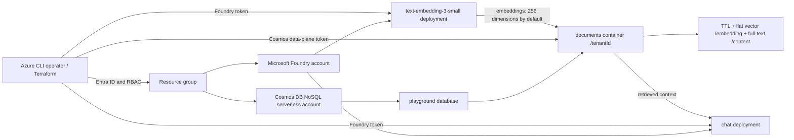

# Azure Cosmos DB Playground

[日本語](./README.ja.md)

Deploy a small, **billable** Azure Cosmos DB for NoSQL serverless account and a Microsoft Foundry account with embedding and chat model deployments. Numbered scripts exercise CRUD, TTL, change feed, vector search, full-text search, hybrid search, and retrieval-augmented generation (RAG). This is a learning environment, **not** a private or production deployment: the endpoints are public, although Cosmos DB local/key authentication and Foundry local authentication are disabled. Scripts use Microsoft Entra tokens, not resource keys.

## Architecture



Terraform creates the resources and operator role assignments; shell scripts write and remove only tagged sample documents. The default Cosmos database and container names are `playground` and `documents`. The partition key is `/tenantId`; the container enables TTL, a cosine flat vector index on `/embedding` (256 dimensions by default), and an English full-text index on `/content`. The operator receives Cosmos DB Built-in Data Contributor at database scope and Cognitive Services OpenAI User on Foundry. No Foundry agent, application hosting, private endpoint, or remote backend is created.

Resource names share `<name>-<random-suffix>` as their collision-resistant base. With the defaults, the resource group is `rg-azurecosmosdbplayground-<suffix>`, the Cosmos DB account is `cosmos-azurecosmosdbplayground-<suffix>`, and the Foundry account is `azurecosmosdbplayground-<suffix>`.

## Before you begin

- Terraform **>= 1.11**, Azure CLI, `curl`, `jq`, and a POSIX shell. Sign in with an identity allowed to create resource groups, Cosmos DB and Foundry accounts, model deployments, and Azure/Cosmos data-plane role assignments. The same identity must run the scripts, or set `operator_principal_id` to the script operator's Entra object ID before applying.
- An Azure subscription with Microsoft.DocumentDB and Microsoft.CognitiveServices registered, serverless Cosmos DB and vector/full-text search available in the selected region, and quota for **both** requested model versions, SKUs, and capacities. Defaults are `japaneast`, `text-embedding-3-small` version `1` (`GlobalStandard`, capacity `30`), and `gpt-5.4-mini` version `2026-03-17` (`GlobalStandard`, capacity `100`). Availability and quotas change: check the [Foundry model catalog and deployment types](https://learn.microsoft.com/azure/foundry/foundry-models/concepts/deployment-types) and your subscription before provisioning. Override the complete `embedding_model` or `chat_model` object with `-var`/a `.tfvars` file if necessary; retain `text-embedding-3-small` and set `vector_dimensions` to a supported value from **1 to 505** for the flat index and embedding requests.
- A disposable subscription/resource group is recommended. Estimate charges using [Cosmos DB pricing](https://azure.microsoft.com/pricing/details/cosmos-db/) and [Azure OpenAI pricing](https://azure.microsoft.com/pricing/details/cognitive-services/openai-service/). Serverless Cosmos operations/storage and Foundry model deployments/inference can incur charges even for a short lab; quotas and pricing are subscription/region specific. Set a budget, monitor usage, and destroy promptly.

For general guidance, see [Azure provider authentication](../../../docs/tips/provider-authentication.md) and the [Terraform workflow](../../../docs/tips/terraform-workflow.md).

## 1. Login and preflight

From the repository root:

```sh
cd infra/scenarios/azure_cosmosdb_playground
az login
az account set --subscription "<your-subscription-id>"
az account show --query '{name:name,id:id,tenantId:tenantId}' -o table
terraform version
az provider show --namespace Microsoft.DocumentDB --query registrationState -o tsv
az provider show --namespace Microsoft.CognitiveServices --query registrationState -o tsv
az cognitiveservices usage list --location japaneast -o table
```

If a provider is unregistered, ask an authorized subscription administrator to register it (`az provider register --namespace Microsoft.DocumentDB` and `az provider register --namespace Microsoft.CognitiveServices`), and wait until it reports `Registered`. Check model/version availability and **separate embedding/chat quotas** in Foundry for your chosen region; CLI usage alone does not establish model availability. Verify your identity can assign both resource RBAC and Cosmos DB data-plane roles. The Azure CLI identity used by the scripts must match `operator_principal_id` (default: the Terraform caller's object ID); allow a few minutes for new assignments to propagate.

## 2. Provision with Terraform

There is **no `backend.tf` or remote state configured** for this scenario. Keep the local `terraform.tfstate` safe and use the *same directory, variables, and state* for destroy. Do not commit state; it may contain sensitive resource details. `-backend=false` explicitly prevents backend initialization; it does not create a remote backend.

```sh
terraform init -backend=false
terraform plan
terraform apply -parallelism=1
terraform output -json
```

Review the plan and confirm the apply prompt. `-parallelism=1` serializes provisioning, including Foundry model deployments, to avoid concurrent deployment conflicts. If a model/region/quota combination is unavailable, adjust `location`, `embedding_model`, or `chat_model` **before** applying, and reuse the same variables for `destroy`. Outputs include `resource_group_name`, `cosmos_account_name`, `cosmos_endpoint`, `cosmos_database_name`, `cosmos_container_name`, `foundry_endpoint`, `embedding_deployment_name`, `chat_deployment_name`, and `vector_dimensions`. Endpoints are public URLs, not credentials. Avoid posting full output or state publicly.

| Input | Default | Purpose |
| --- | --- | --- |
| `name` | `azurecosmosdbplayground` | Shared resource base name; an eight-character random suffix is appended |
| `location` | `japaneast` | Azure region for the resources |
| `tags` | `scenario`, `owner`, `SecurityControl`, and `CostControl` tags | Resource tags following the other Azure scenarios |
| `operator_principal_id` | Terraform caller's object ID | Entra principal granted data-plane access |
| `vector_dimensions` | `256` | Flat vector index and embedding request size; scripts read the output (1–505) |
| `embedding_model`, `chat_model` | Models/versions/SKUs/capacities above | Foundry deployment configuration; confirm regional availability and quota |

## 3. Run the labs

Run from the scenario directory after `apply`, while authenticated as the assigned operator. Scripts accept the exact shape of `terraform output -json` through `TF_OUTPUT_JSON` or `TF_OUTPUT_FILE` (or explicit output-named environment variables). No API keys are needed:

```sh
export TF_OUTPUT_JSON="$(terraform output -json)"
sh scripts/00_validate_prerequisites.sh
sh scripts/01_test_crud.sh
sh scripts/02_test_ttl.sh
sh scripts/03_test_change_feed.sh
sh scripts/04_test_vector_search.sh
sh scripts/05_test_full_text.sh
sh scripts/06_test_hybrid_search.sh
sh scripts/07_test_rag.sh
sh scripts/08_cleanup.sh
```

The scripts do not invoke Terraform; generate or refresh `TF_OUTPUT_JSON` yourself after an apply. They also accept `TF_OUTPUT_FILE` pointing to previously generated `terraform output -json` data; keep any such file private and out of version control. Embedding and chat requests use Foundry's OpenAI-compatible `/openai/v1/embeddings` and `/openai/v1/chat/completions` endpoints, with deployment names passed as `model`; the chat request uses `max_completion_tokens`.

Or run steps 00–07 in order with `sh scripts/run_all.sh`. By default, `run_all.sh` leaves tagged sample documents for inspection; `CLEANUP_AFTER_RUN=true sh scripts/run_all.sh` attempts step 08 after success **or failure**. You can also run `sh scripts/08_cleanup.sh` later; it removes only documents matching the default `PLAYGROUND_TENANT=cosmos-playground-demo` and `PLAYGROUND_TAG=cosmos-playground-v1` (or the values you used for the labs). It does not delete the Terraform resources. Keep those two values consistent across steps; never use a shared tenant/tag for unrelated data.

| Script | Exercise / expected result |
| --- | --- |
| `00_validate_prerequisites.sh` | Checks Cosmos database/container (HTTP 200) and acquires both Entra tokens without displaying them. |
| `01_test_crud.sh` | Creates (201, or 200 on repeat), reads/updates/queries (200), deletes (204), then confirms 404 for a tagged document. |
| `02_test_ttl.sh` | Sets item TTL to 30 seconds and polls until the read returns HTTP 404. |
| `03_test_change_feed.sh` | Drains the feed (200/304), retains the ETag returned by the initial 304 as its continuation, then observes insert/update (200); verifies no delete or TTL expiry event in the latest-version feed (304 when unchanged). |
| `04_test_vector_search.sh` | Embeds sample text (Foundry 200) and performs cosine vector-nearest-neighbor retrieval (Cosmos 200). |
| `05_test_full_text.sh` | Finds indexed content with `FullTextContains` / `FullTextScore` (Cosmos 200; seed embeddings: Foundry 200). |
| `06_test_hybrid_search.sh` | Combines vector distance and full-text ranking with `RRF` (Cosmos 200; embeddings: Foundry 200). |
| `07_test_rag.sh` | Retrieves tagged context (Cosmos 200), sends it to the chat deployment (Foundry 200), and checks the answer against retrieved document IDs. |
| `08_cleanup.sh` | Deletes only matching tagged documents (204), not accounts or unrelated data. |

Steps 04–07 seed the same sample IDs safely for repeated runs; querying and model calls still cost money. The RAG check looks for a retrieved document ID in the response; this is a **basic citation-presence check, not proof of factual correctness**. The TTL, change feed, and index checks poll for eventual consistency; `POLL_ATTEMPTS=12` and `POLL_INTERVAL=5` seconds by default. Increase them if necessary. Never enable shell tracing (`set -x`) or print bearer tokens.

## 4. Remove resources

```sh
sh scripts/08_cleanup.sh
terraform plan -destroy
terraform destroy
unset TF_OUTPUT_JSON
```

Use the **same** `-var-file`/`-var` flags on the destroy commands if you supplied them at apply time. Confirm the target resources before approving. Destroy is the step that stops ongoing infrastructure charges; deleting only sample documents does not. Check the Azure portal for leftovers if a partial apply/destroy failed. Retain local state until destruction has completed.

## Troubleshooting and validation status

| Symptom | Check |
| --- | --- |
| Apply reports model/version, SKU, quota, or region unavailable | Check regional deployment availability and quota in Foundry; choose supported complete model objects and rerun `plan`. Do not assume default versions are universally deployable. |
| `403` or token errors in scripts | Run `az account show` and `az login` for the assigned operator; check Cosmos DB Built-in Data Contributor at database scope and Cognitive Services OpenAI User on Foundry; wait for RBAC propagation. Tokens for Cosmos and Foundry have different audiences. |
| Database/container validation returns `400` with `x-ms-documentdb-partitionkey header cannot be specified` | Use the latest bundled scripts. In a custom REST wrapper, send the partition-key header only for document and change-feed requests, not database/container requests. |
| A query returns `400`, `SC1001`, or `incorrect syntax near '{'` | Confirm the query request sends one `Content-Type: application/query+json` header. Normal document writes use `application/json`; avoid duplicate Content-Type headers from a shared HTTP wrapper or proxy. |
| `404` or missing Terraform outputs | Confirm `apply` completed, run `terraform output -json` in this directory, then refresh `TF_OUTPUT_JSON` before rerunning scripts. |
| TTL, change feed, vector, or full-text query sees no document | Allow indexing/TTL propagation; raise `POLL_ATTEMPTS`/`POLL_INTERVAL`, verify region capabilities and tagged tenant, then retry. In a custom change-feed client, also use the initial 304 response ETag for the next `If-None-Match`. |
| Unexpected model response or rate limit | Verify deployments and remaining quota, and compare `VECTOR_DIMENSIONS` with the Terraform `vector_dimensions` output (default 256). RAG calls require a chat-completions-compatible deployment. |
| A custom remote backend reports a locked state blob with an empty `terraformlockid` | Do not force-unlock until ownership is known. `terraform plan -lock=false` is acceptable only for read-only validation after confirming no concurrent writer; never disable locking for `apply` or `destroy`. |
| Local state lost | Do not blindly reapply into existing resources; recover state or reconcile resources before destroy to avoid leaks. |

**Validation status (2026-09-30):** Using Terraform 1.14.7, Azure CLI 2.85.0, and an existing deployed environment, validation covered shell syntax, offline contract tests, `terraform fmt -check`, `terraform validate`, provider registration/quota display, and steps 00–08. The live run used a dedicated tenant/tag and finished with zero matching sample documents. No resource `apply` or `destroy` was run. A read-only plan showed one in-place difference for the service-reported `/embedding/*` excluded path, so it was not applied. New provisioning, destruction, and pricing measurement were outside this validation. Consult the official [ARM container resource (2026-03-15)](https://learn.microsoft.com/azure/templates/microsoft.documentdb/2026-03-15/databaseaccounts/sqldatabases/containers), [Cosmos DB REST authentication](https://learn.microsoft.com/rest/api/cosmos-db/access-control-on-cosmosdb-resources), [REST query documents](https://learn.microsoft.com/rest/api/cosmos-db/query-documents), [vector search](https://learn.microsoft.com/azure/cosmos-db/nosql/vector-search), [full-text and hybrid search](https://learn.microsoft.com/azure/cosmos-db/gen-ai/full-text-search), [change feed](https://learn.microsoft.com/azure/cosmos-db/nosql/change-feed), [TTL](https://learn.microsoft.com/azure/cosmos-db/nosql/time-to-live), [Cosmos DB data-plane RBAC](https://learn.microsoft.com/azure/cosmos-db/nosql/security/how-to-grant-data-plane-role-based-access), and [Foundry authentication](https://learn.microsoft.com/azure/foundry/concepts/authentication-authorization-foundry) documentation when adapting this lab.
