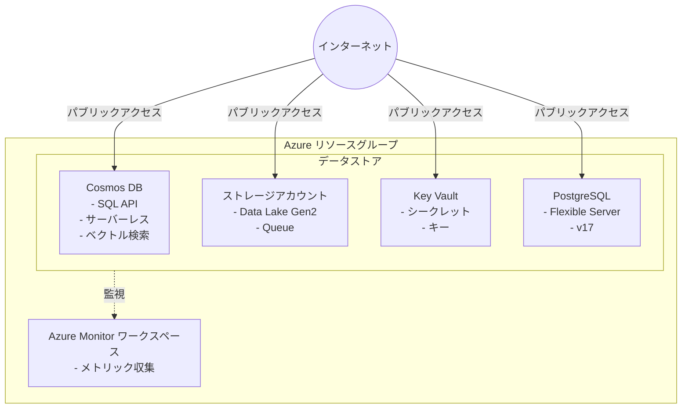

# Azure Datastore シナリオ

パブリックインターネットアクセスを有効にした、さまざまな Azure データストアを簡易テスト用にデプロイします。

## 概要

このシナリオでは、次のデータストアを作成します (それぞれ個別に有効化または無効化できます)。

- **Cosmos DB**: SQL API、サーバーレス容量、ベクトル検索機能を備えた NoSQL データベースです
- **ストレージアカウント**: Queue を備えた Data Lake Storage Gen2 (HNS 有効) です
- **Key Vault**: シークレットとキーを管理します
- **PostgreSQL Flexible Server**: マネージド PostgreSQL データベースです
- **Azure Monitor ワークスペース**: 監視とメトリック収集を一元化します

> **注記**: このシナリオは簡易テスト向けに設計されており、すべてのリソースへのパブリックインターネットアクセスを許可します。**この構成を本番環境で使用しないでください。**

## 前提条件

共通ガイダンスの[プロバイダー認証](../../../docs/tips/provider-authentication.ja.md)、
[標準の Terraform ワークフロー](../../../docs/tips/terraform-workflow.ja.md)、およびオプションの
[Azure Blob リモートステート](../../../docs/tips/azure-blob-backend.ja.md)を使用します。

リポジトリの Makefile を使用する場合は、`SCENARIO=azure_datastore` を設定します。

## アーキテクチャ



## 使用方法

`SCENARIO=azure_datastore` を指定して、
[標準の Terraform ワークフロー](../../../docs/tips/terraform-workflow.ja.md)に従います。既定ではすべてのリソースが無効なため、構成を適用するときに必要なリソースを有効にしてください。

### 特定のリソースのデプロイ

```shell
terraform apply -auto-approve \
  -var="deploy_cosmosdb=true" \
  -var="deploy_storage_account=true" \
  -var="deploy_keyvault=true" \
  -var="deploy_postgresql=true" \
  -var="deploy_monitor_workspace=true" \
  -var="postgresql_administrator_password=YourSecurePassword123!"
```

または、`terraform.tfvars` ファイルを使用します。

```shell
cat > terraform.tfvars <<EOF
deploy_cosmosdb          = true
deploy_storage_account   = true
deploy_keyvault          = true
deploy_postgresql        = true
deploy_monitor_workspace = true
postgresql_administrator_password = "YourSecurePassword123!"
EOF
terraform apply -auto-approve
```

### デプロイの確認

```shell
terraform output
```

## 変数

### 全般

| 名前       | 説明                         | 型            | 既定値             | 必須   |
|------------|------------------------------|---------------|--------------------|--------|
| `name`     | リソースのベース名           | `string`      | `"azuredatastore"` | いいえ |
| `location` | リソースの Azure リージョン  | `string`      | `"japaneast"`     | いいえ |
| `tags`     | リソースに適用するタグ       | `map(string)` | variables.tf を参照 | いいえ |

### デプロイフラグ

| 名前                       | 説明                               | 型     | 既定値  | 必須   |
|----------------------------|------------------------------------|--------|---------|--------|
| `deploy_cosmosdb`          | Cosmos DB をデプロイする           | `bool` | `false` | いいえ |
| `deploy_storage_account`   | ストレージアカウントをデプロイする | `bool` | `false` | いいえ |
| `deploy_keyvault`          | Key Vault をデプロイする           | `bool` | `false` | いいえ |
| `deploy_postgresql`        | PostgreSQL Flexible Server をデプロイする | `bool` | `false` | いいえ |
| `deploy_monitor_workspace` | Azure Monitor ワークスペースをデプロイする | `bool` | `false` | いいえ |

### Cosmos DB の構成

| 名前                              | 説明                   | 型       | 既定値               | 必須   |
|-----------------------------------|------------------------|----------|----------------------|--------|
| `cosmosdb_consistency_level`      | 整合性レベル           | `string` | `"BoundedStaleness"` | いいえ |
| `cosmosdb_partition_key_path`     | パーティションキーパス | `string` | `"/partitionKey"`    | いいえ |

### ストレージアカウントの構成

| 名前                               | 説明             | 型       | 既定値       | 必須   |
|------------------------------------|------------------|----------|--------------|--------|
| `storage_account_tier`             | アカウントレベル | `string` | `"Standard"` | いいえ |
| `storage_account_replication_type` | レプリケーションの種類 | `string` | `"LRS"` | いいえ |

### Key Vault の構成

| 名前                | 説明     | 型       | 既定値       | 必須   |
|---------------------|----------|----------|--------------|--------|
| `keyvault_sku_name` | SKU 名   | `string` | `"standard"` | いいえ |

### PostgreSQL の構成

| 名前                                | 説明                 | 型       | 既定値              | 必須                              |
|-------------------------------------|----------------------|----------|---------------------|-----------------------------------|
| `postgresql_administrator_login`    | 管理者ログイン       | `string` | `"psqladmin"`       | いいえ                            |
| `postgresql_administrator_password` | 管理者パスワード     | `string` | -                   | はい (`deploy_postgresql=true` の場合) |
| `postgresql_version`                | PostgreSQL バージョン | `string` | `"17"`              | いいえ                            |
| `postgresql_sku_name`               | SKU 名               | `string` | `"B_Standard_B1ms"` | いいえ                            |
| `postgresql_zone`                   | 可用性ゾーン         | `string` | `"2"`               | いいえ                            |

## 出力

### リソースグループ

| 名前                  | 説明                   |
|-----------------------|------------------------|
| `resource_group_name` | リソースグループの名前 |
| `resource_group_id`   | リソースグループの ID  |

### Cosmos DB

| 名前                          | 説明                          |
|-------------------------------|-------------------------------|
| `cosmosdb_account_id`         | Cosmos DB アカウントの ID     |
| `cosmosdb_account_name`       | Cosmos DB アカウントの名前    |
| `cosmosdb_account_endpoint`   | Cosmos DB アカウントのエンドポイント |
| `cosmosdb_primary_key`        | プライマリキー (機密)         |
| `cosmosdb_sql_database_name`  | SQL データベースの名前        |
| `cosmosdb_sql_container_name` | SQL コンテナーの名前          |

### ストレージアカウント

| 名前                                 | 説明                                |
|--------------------------------------|-------------------------------------|
| `storage_account_id`                 | ストレージアカウントの ID           |
| `storage_account_name`               | ストレージアカウントの名前          |
| `storage_account_primary_access_key` | プライマリアクセスキー (機密)       |
| `storage_account_primary_blob_endpoint` | プライマリ Blob エンドポイント   |
| `storage_account_primary_dfs_endpoint`  | プライマリ DFS エンドポイント    |
| `storage_queue_name`                 | Storage Queue の名前                |

### Key Vault

| 名前            | 説明               |
|-----------------|--------------------|
| `keyvault_id`   | Key Vault の ID    |
| `keyvault_name` | Key Vault の名前   |
| `keyvault_uri`  | Key Vault の URI   |

### PostgreSQL

| 名前                               | 説明                          |
|------------------------------------|-------------------------------|
| `postgresql_server_id`             | PostgreSQL サーバーの ID      |
| `postgresql_server_name`           | PostgreSQL サーバーの名前     |
| `postgresql_server_fqdn`           | PostgreSQL サーバーの FQDN    |
| `postgresql_administrator_login`   | 管理者ログイン                |

### Azure Monitor ワークスペース

| 名前                     | 説明                              |
|--------------------------|-----------------------------------|
| `monitor_workspace_id`   | Monitor ワークスペースの ID       |
| `monitor_workspace_name` | Monitor ワークスペースの名前      |

## 例

### Cosmos DB とストレージアカウントのみをデプロイ

```hcl
# terraform.tfvars
deploy_cosmosdb        = true
deploy_storage_account = true
```

### すべてのリソースをデプロイ

```hcl
# terraform.tfvars
name                              = "myproject"
location                          = "eastus"
deploy_cosmosdb                   = true
deploy_storage_account            = true
deploy_keyvault                   = true
deploy_postgresql                 = true
deploy_monitor_workspace          = true
postgresql_administrator_password = "YourSecurePassword123!"
```

## セキュリティに関する注意

⚠️ **警告**: このシナリオは、簡易テストのためにすべてのリソースでパブリックネットワークアクセスを有効にします。本番環境へのデプロイでは、次の対応を検討してください。

- パブリックネットワークアクセスを無効にする
- Private Endpoint を使用する
- 仮想ネットワーク統合を構成する
- 適切なファイアウォール規則を実装する
- 可能な場合は Azure AD 認証を使用する
