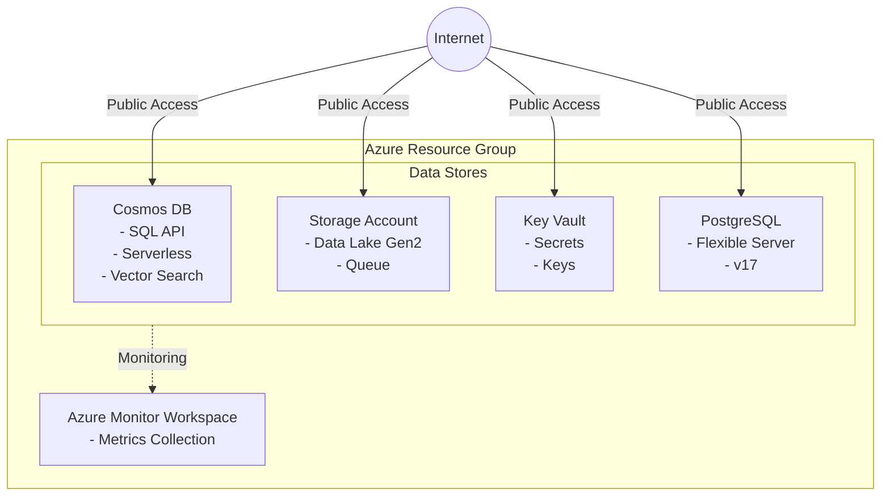

# Azure Datastore Scenario

Deploy various Azure data stores for simplified testing with public internet access enabled.

## Overview

This scenario creates the following data stores (each can be individually enabled/disabled):

- **Cosmos DB**: NoSQL database with SQL API, Serverless capacity, and Vector Search capability
- **Storage Account**: Data Lake Storage Gen2 (HNS enabled) with Queue
- **Key Vault**: Secret and key management
- **PostgreSQL Flexible Server**: Managed PostgreSQL database
- **Azure Monitor Workspace**: Centralized monitoring and metrics collection

> **Note**: This scenario is designed for simplified testing and allows public internet access to all resources. **Do not use this configuration in production environments.**

## Prerequisites

- Terraform CLI installed (>= 1.6.0)
- Azure CLI installed and logged in (`az login`)
- Azure subscription with permissions to create resources

## Architecture



## How to use

```shell
# Login to Azure
az login

# Initialize Terraform
terraform init

# Plan the deployment (all resources disabled by default)
terraform plan

# Deploy specific resources using flags
terraform apply -auto-approve \
  -var="deploy_cosmosdb=true" \
  -var="deploy_storage_account=true" \
  -var="deploy_keyvault=true" \
  -var="deploy_postgresql=true" \
  -var="deploy_monitor_workspace=true" \
  -var="postgresql_administrator_password=YourSecurePassword123!"

# Or use a terraform.tfvars file
cat > terraform.tfvars <<EOF
deploy_cosmosdb          = true
deploy_storage_account   = true
deploy_keyvault          = true
deploy_postgresql        = true
deploy_monitor_workspace = true
postgresql_administrator_password = "YourSecurePassword123!"
EOF
terraform apply -auto-approve

# Get outputs
terraform output

# Destroy the deployment
terraform destroy -auto-approve
```

## Variables

### General

| Name | Description | Type | Default | Required |
|------|-------------|------|---------|----------|
| `name` | Base name for resources | `string` | `"azuredatastore"` | no |
| `location` | Azure region for resources | `string` | `"japaneast"` | no |
| `tags` | Tags to apply to resources | `map(string)` | See variables.tf | no |

### Deploy Flags

| Name | Description | Type | Default | Required |
|------|-------------|------|---------|----------|
| `deploy_cosmosdb` | Deploy Cosmos DB | `bool` | `false` | no |
| `deploy_storage_account` | Deploy Storage Account | `bool` | `false` | no |
| `deploy_keyvault` | Deploy Key Vault | `bool` | `false` | no |
| `deploy_postgresql` | Deploy PostgreSQL Flexible Server | `bool` | `false` | no |
| `deploy_monitor_workspace` | Deploy Azure Monitor Workspace | `bool` | `false` | no |

### Cosmos DB Configuration

| Name | Description | Type | Default | Required |
|------|-------------|------|---------|----------|
| `cosmosdb_consistency_level` | Consistency level | `string` | `"BoundedStaleness"` | no |
| `cosmosdb_partition_key_path` | Partition key path | `string` | `"/partitionKey"` | no |

### Storage Account Configuration

| Name | Description | Type | Default | Required |
|------|-------------|------|---------|----------|
| `storage_account_tier` | Account tier | `string` | `"Standard"` | no |
| `storage_account_replication_type` | Replication type | `string` | `"LRS"` | no |

### Key Vault Configuration

| Name | Description | Type | Default | Required |
|------|-------------|------|---------|----------|
| `keyvault_sku_name` | SKU name | `string` | `"standard"` | no |

### PostgreSQL Configuration

| Name | Description | Type | Default | Required |
|------|-------------|------|---------|----------|
| `postgresql_administrator_login` | Admin login | `string` | `"psqladmin"` | no |
| `postgresql_administrator_password` | Admin password | `string` | - | yes (if deploy_postgresql=true) |
| `postgresql_version` | PostgreSQL version | `string` | `"17"` | no |
| `postgresql_sku_name` | SKU name | `string` | `"B_Standard_B1ms"` | no |
| `postgresql_zone` | Availability zone | `string` | `"2"` | no |

## Outputs

### Resource Group

| Name | Description |
|------|-------------|
| `resource_group_name` | Name of the resource group |
| `resource_group_id` | ID of the resource group |

### Cosmos DB

| Name | Description |
|------|-------------|
| `cosmosdb_account_id` | ID of the Cosmos DB account |
| `cosmosdb_account_name` | Name of the Cosmos DB account |
| `cosmosdb_account_endpoint` | Endpoint of the Cosmos DB account |
| `cosmosdb_primary_key` | Primary key (sensitive) |
| `cosmosdb_sql_database_name` | Name of the SQL database |
| `cosmosdb_sql_container_name` | Name of the SQL container |

### Storage Account

| Name | Description |
|------|-------------|
| `storage_account_id` | ID of the Storage Account |
| `storage_account_name` | Name of the Storage Account |
| `storage_account_primary_access_key` | Primary access key (sensitive) |
| `storage_account_primary_blob_endpoint` | Primary blob endpoint |
| `storage_account_primary_dfs_endpoint` | Primary DFS endpoint |
| `storage_queue_name` | Name of the Storage Queue |

### Key Vault

| Name | Description |
|------|-------------|
| `keyvault_id` | ID of the Key Vault |
| `keyvault_name` | Name of the Key Vault |
| `keyvault_uri` | URI of the Key Vault |

### PostgreSQL

| Name | Description |
|------|-------------|
| `postgresql_server_id` | ID of the PostgreSQL server |
| `postgresql_server_name` | Name of the PostgreSQL server |
| `postgresql_server_fqdn` | FQDN of the PostgreSQL server |
| `postgresql_administrator_login` | Administrator login |

### Azure Monitor Workspace

| Name | Description |
|------|-------------|
| `monitor_workspace_id` | ID of the Monitor Workspace |
| `monitor_workspace_name` | Name of the Monitor Workspace |

## Examples

### Deploy only Cosmos DB and Storage Account

```hcl
# terraform.tfvars
deploy_cosmosdb        = true
deploy_storage_account = true
```

### Deploy all resources

```hcl
# terraform.tfvars
name                              = "myproject"
location                          = "eastus"
deploy_cosmosdb                   = true
deploy_storage_account            = true
deploy_keyvault                   = true
deploy_postgresql                 = true
deploy_monitor_workspace          = true
postgresql_administrator_password = "YourSecurePassword123!"
```

## Security Notice

⚠️ **Warning**: This scenario enables public network access on all resources for simplified testing. For production deployments, consider:

- Disabling public network access
- Using Private Endpoints
- Configuring Virtual Network integration
- Implementing proper firewall rules
- Using Azure AD authentication where possible
