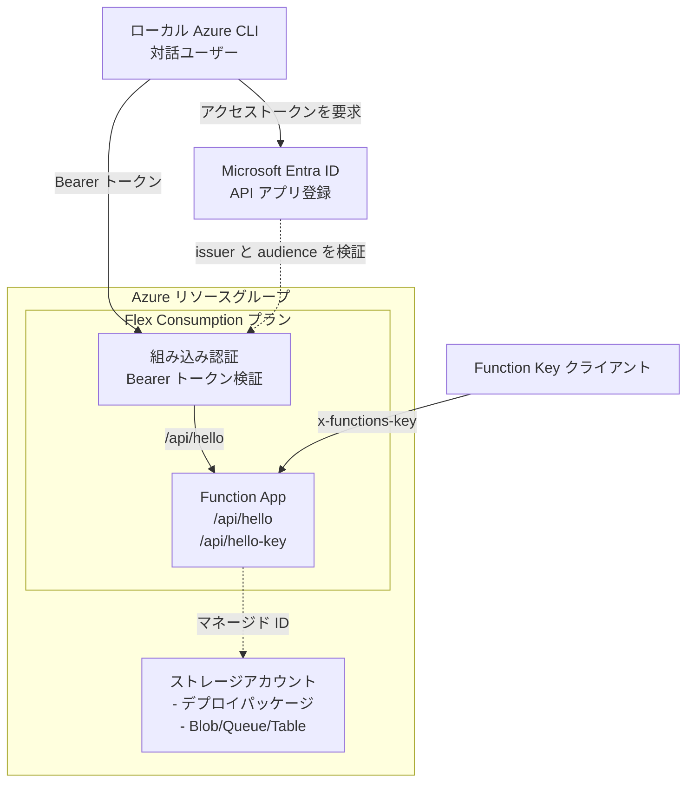

# Azure Functions Flex Consumption シナリオ

Azure Functions の Flex Consumption プランをデプロイします。サーバーレス関数の実行環境を最小構成で構築します。

## 概要

このシナリオでは、以下のリソースを作成します。

* **リソースグループ**: すべてのリソースを格納するコンテナー
* **ストレージアカウント**: Functions の実行に必要なストレージ（デプロイパッケージ用コンテナーを含む）
* **サービスプラン（Flex Consumption）**: FC1 SKU の Flex Consumption プラン
* **Function App**: Flex Consumption で動作するシステム割り当てマネージド ID 付き Function App
* **RBAC ロール割り当て**: Storage に対するマネージド ID の権限設定
* 組み込み認証用の Microsoft Entra アプリ登録とサービスプリンシパル

## 前提条件

[プロバイダー認証](../../../docs/tips/provider-authentication.ja.md)、
[標準 Terraform ワークフロー](../../../docs/tips/terraform-workflow.ja.md)、およびオプションの
[Azure Blob リモートステート](../../../docs/tips/azure-blob-backend.ja.md)については、共通ガイダンスを参照してください。

リポジトリの Makefile を使用する場合は、`SCENARIO=azure_functions_flex_consumption` を指定します。

Terraform を実行する ID には、Microsoft Entra のアプリ登録を作成および管理する権限が必要です。
Azure CLI を事前承認済みクライアントとして設定するには、Application Administrator または
Global Administrator のディレクトリロールが必要になる場合があります。

このシナリオは、Microsoft Azure CLI のパブリッククライアントに発行された
トークンを許可します。`az login` で対話ユーザーとしてサインインしてください。
サービスプリンシパルでのログインには別のクライアントアプリケーション ID が
使用されるため、この例の対象外です。

## アーキテクチャ



## 機能

* **Flex Consumption プラン**: 従量課金制でコスト効率の良いサーバーレス実行環境
* **Microsoft Entra 組み込み認証**: 未認証リクエストを関数ランタイムへ到達する前に拒否
* **キーなし HTTP 呼び出し**: Function キーの代わりに Azure CLI ユーザートークンを使用
* **Function Key 呼び出し**: `/api/hello-key` を組み込み認証の対象外にし、
  Functions ホストが Function Key を独立して検証
* **システム割り当てマネージド ID**: 接続文字列を使わず、Storage への送信アクセスを認証
* **RBAC ベースのアクセス**: Storage への最小権限アクセス
* **ゾーン冗長**: オプションでゾーン冗長を有効化可能
* **Application Insights 不要**: 監視なしの最小構成

## 使用方法

[標準 Terraform ワークフロー](../../../docs/tips/terraform-workflow.ja.md)に従い、
`SCENARIO=azure_functions_flex_consumption` を指定します。

### デプロイの確認

```shell
terraform output function_app_url
```

## 変数

<!-- markdownlint-disable MD013 MD060 -->

| 名前                     | 説明                                      | 型            | 既定値            | 必須   |
|--------------------------|-------------------------------------------|---------------|-------------------|--------|
| `name`                   | リソースのベース名                        | `string`      | `"azurefuncflex"` | いいえ |
| `location`               | リソースを配置する Azure リージョン       | `string`      | `"japaneast"`     | いいえ |
| `azure_cli_client_id` | 対話型 Azure CLI ユーザーとして組み込み認証エンドポイントを呼ぶクライアント ID | `string` | `"04b07795-8ddb-461a-bbee-02f9e1bf7b46"` | いいえ |
| `tags`                   | リソースに適用するタグ                    | `map(string)` | 既定値を参照      | いいえ |
| `runtime_name`           | アプリのランタイム                        | `string`      | `"python"`        | いいえ |
| `runtime_version`        | アプリのランタイムバージョン              | `string`      | `"3.11"`          | いいえ |
| `maximum_instance_count` | インスタンスの最大数（40～1000）          | `number`      | `100`             | いいえ |
| `instance_memory_in_mb`  | インスタンスメモリ（512、2048、4096）     | `number`      | `2048`            | いいえ |
| `zone_redundant`         | アプリでゾーン冗長を有効にするかどうか    | `bool`        | `false`           | いいえ |
| `app_settings`           | 追加のアプリ設定                          | `map(string)` | `{}`              | いいえ |

<!-- markdownlint-enable MD013 MD060 -->

### Azure CLI クライアント ID

既定値 `04b07795-8ddb-461a-bbee-02f9e1bf7b46` は、Microsoft が公開している
Azure CLI のアプリケーション ID です。テナント、サブスクリプション、端末、
Function App ごとに生成される値ではありません。Azure CLI は対話ユーザー認証で
このパブリッククライアント ID を使用し、組み込み認証はアクセストークンの
`azp` または `appid` クレームと照合します。

呼び出し元のパブリッククライアントが異なるアプリケーション ID を使う場合のみ、
`azure_cli_client_id` を変更してください。端末の現在のログイン方法によって
Terraform plan が変わらないよう、自動検出は行いません。サービスプリンシパル対応には
アプリケーション権限とアプリロールの設計が必要であり、この変数の変更だけでは
対応できません。

> [!NOTE]
> クライアント ID 自体はテナント固有ではありません。ただし、このシナリオの
> issuer は `login.microsoftonline.com` を使うため Azure Public 向けです。
> Sovereign Cloud へ移す場合は、対応する authority host と Terraform
> プロバイダー環境も変更する必要があります。`azure_cli_client_id` の変更だけでは
> 対応できません。

### ランタイムの選択肢

| runtime_name      | サポートされる runtime_version |
|-------------------|--------------------------------|
| `dotnet-isolated` | `7.0`, `8.0`, `9.0`            |
| `python`          | `3.10`, `3.11`, `3.12`         |
| `java`            | `11`, `17`, `21`               |
| `node`            | `18`, `20`, `22`               |
| `powershell`      | `7.4`                          |

## 出力

<!-- markdownlint-disable MD013 MD060 -->

| 名前                            | 説明                                           |
|---------------------------------|------------------------------------------------|
| `resource_group_name`           | リソースグループ名                             |
| `function_app_id`               | Function App の ID                             |
| `function_app_name`             | Function App 名                                |
| `function_app_default_hostname` | Function App の既定ホスト名                    |
| `function_app_url`              | Function App にアクセスするための完全な URL    |
| `function_app_principal_id`     | Function App のマネージド ID のプリンシパル ID |
| `function_app_authentication_client_id` | Microsoft Entra 認証アプリケーションのクライアント ID |
| `function_app_authentication_identifier_uri` | アクセストークンのリソースとして使う Application ID URI |
| `function_app_authentication_tenant_id` | 認証に使う Microsoft Entra テナント ID |
| `service_plan_id`               | サービスプランの ID                            |
| `service_plan_name`             | サービスプラン名                               |
| `storage_account_id`            | ストレージアカウントの ID                      |
| `storage_account_name`          | ストレージアカウント名                         |

<!-- markdownlint-enable MD013 MD060 -->

## 例

### Python 関数アプリ

```hcl
# terraform.tfvars
name            = "mypythonfunc"
runtime_name    = "python"
runtime_version = "3.11"
```

### .NET 関数アプリ

```hcl
# terraform.tfvars
name            = "mydotnetfunc"
runtime_name    = "dotnet-isolated"
runtime_version = "8.0"
```

### カスタム設定を使用する Node.js 関数アプリ

```hcl
# terraform.tfvars
name                   = "mynodefunc"
runtime_name           = "node"
runtime_version        = "20"
maximum_instance_count = 200
instance_memory_in_mb  = 4096
zone_redundant         = true
```

## 関数コードのデプロイ

Terraform でインフラストラクチャをデプロイした後、以下のいずれかの方法で関数コードをデプロイします。

> **注記**: Azure Functions Flex Consumption プランでは、Terraform の `zip_deploy_file` は正常に動作しないため、コードを別途デプロイする必要があります。Flex Consumption は「One Deploy」という独自のデプロイメカニズムを使用しています。

### Azure Functions Core Tools を使用する方法（推奨）

```shell
FUNCTION_APP_NAME=$(terraform output -raw function_app_name)

# src ディレクトリに移動
cd src

# Function App にデプロイ
func azure functionapp publish $FUNCTION_APP_NAME
```

### Azure CLI を使用する方法

```shell
# src ディレクトリを zip 化
cd src && zip -r ../function_app.zip . && cd ..

# Azure CLI でデプロイ
az functionapp deployment source config-zip \
  --resource-group $(terraform output -raw resource_group_name) \
  --name $(terraform output -raw function_app_name) \
  --src function_app.zip
```

### デプロイの確認

```shell
# Function App のログをストリーミング
az webapp log tail \
  --name $(terraform output -raw function_app_name) \
  --resource-group $(terraform output -raw resource_group_name)
```

## 関数の動作確認

### Microsoft Entra 組み込み認証のテスト

```shell
# Function App URL とトークンの audience を取得
FUNCTION_APP_URL=$(terraform output -raw function_app_url)
FUNCTION_APP_AUDIENCE=$(terraform output -raw function_app_authentication_identifier_uri)

# Azure CLI でサインイン中のユーザー用アクセストークンを取得
ACCESS_TOKEN=$(az account get-access-token \
  --resource "$FUNCTION_APP_AUDIENCE" \
  --query accessToken \
  --output tsv)

# トークンなしのリクエストが HTTP 401 を返すことを確認
curl -i "${FUNCTION_APP_URL}/api/hello"

# Function キーなしで HTTP トリガー関数を呼び出し
curl \
  -H "Authorization: Bearer ${ACCESS_TOKEN}" \
  "${FUNCTION_APP_URL}/api/hello?name=Azure"

# POST リクエストで呼び出し
curl -X POST \
  -H "Authorization: Bearer ${ACCESS_TOKEN}" \
  -H "Content-Type: application/json" \
  -d '{"name": "World"}' \
  "${FUNCTION_APP_URL}/api/hello"
```

> [!NOTE]
> アクセストークンには有効期限があります。401 が返るようになった場合は、
> `az account get-access-token` を再実行してください。

### Function Key 認証のテスト

`/api/hello-key` は組み込み認証の対象外です。組み込み認証ではなく、
Functions ホストが `function` 認証レベルを強制します。

```shell
FUNCTION_APP_URL=$(terraform output -raw function_app_url)
FUNCTION_APP_NAME=$(terraform output -raw function_app_name)
RESOURCE_GROUP_NAME=$(terraform output -raw resource_group_name)

FUNCTION_KEY=$(az functionapp function keys list \
  --name "$FUNCTION_APP_NAME" \
  --resource-group "$RESOURCE_GROUP_NAME" \
  --function-name hello_world_http_with_function_key \
  --query default \
  --output tsv)

# Function Key なしのリクエストが HTTP 401 を返すことを確認
curl -i "${FUNCTION_APP_URL}/api/hello-key"

# Bearer トークンだけでは Function Key エンドポイントを呼び出せない
curl -i \
  -H "Authorization: Bearer ${ACCESS_TOKEN}" \
  "${FUNCTION_APP_URL}/api/hello-key"

# Function Key でエンドポイントを呼び出し
curl \
  -H "x-functions-key: ${FUNCTION_KEY}" \
  "${FUNCTION_APP_URL}/api/hello-key?name=Azure"
```

<!-- markdownlint-disable MD013 MD060 -->

| エンドポイント | 認証情報 | 期待結果 |
|----------------|----------|----------|
| `/api/hello` | なし | 組み込み認証が `401 Unauthorized` を返す |
| `/api/hello` | Azure CLI Bearer トークン | `200 OK` |
| `/api/hello-key` | なし、または Bearer トークンのみ | Functions ホストが `401 Unauthorized` を返す |
| `/api/hello-key` | Function Key | `200 OK` |

<!-- markdownlint-enable MD013 MD060 -->

> [!WARNING]
> 認証方式を比較するため、Function Key エンドポイントは組み込み認証の対象外です。
> Function Key は共有シークレットであり、呼び出し元の ID を識別しません。

### タイマートリガー関数の確認

タイマートリガー関数は 1 時間ごと（毎時 0 分）に自動実行されます。ログで実行を確認できます。

```shell
# ログをストリーミングして "hello world" の出力を確認
az webapp log tail \
  --name $(terraform output -raw function_app_name) \
  --resource-group $(terraform output -raw resource_group_name)
```

## 既知の問題とトラブルシューティング

### Terraform によるコードデプロイの制限

Azure Functions Flex Consumption プランでは、Terraform の `zip_deploy_file` 属性を使用したコードデプロイは**サポートされていません**（404 Not Found エラーが発生します）。これは、Flex Consumption が従来の App Service とは異なる「One Deploy」メカニズムを使用しているためです。

**対処法**: インフラストラクチャのデプロイ後、Azure Functions Core Tools（`func`）または Azure CLI を使用してコードをデプロイしてください。上記の「関数コードのデプロイ」セクションを参照してください。

### 403 エラー: "This request is not authorized to perform this operation using this permission."

初回デプロイ時に 403 エラーが発生することがあります。

**原因**: このモジュールでは、ストレージアカウントのセキュリティを強化するために `shared_access_key_enabled = false` を設定し、RBAC（Role-Based Access Control）による認証を使用しています。**Azure の RBAC ロール割り当ては伝播に最大数分かかる**ことがあります。

**対処法**: エラーが発生した場合は、1～2 分待ってから `terraform apply` を再度実行してください。

```shell
# 初回でエラーが発生した場合は、しばらく待ってから再実行
terraform apply -auto-approve
```

### Bearer トークンを指定しても 401 が返る

Azure CLI が `function_app_authentication_tenant_id` の出力と同じテナントへ
サインインしていることを確認します。また、
`function_app_authentication_identifier_uri` の出力を正確に指定して
トークンを取得してください。Terraform の変更を適用した後、関数コードも
再デプロイします。組み込み認証がプラットフォーム境界で認証するため、
デプロイされた HTTP トリガーは Functions の認証レベルに `anonymous` を
使う必要があります。

## 参考資料

<!-- markdownlint-disable MD013 -->

### Microsoft と Azure の一次情報

* [Azure App Service と Azure Functions での認証と承認](https://learn.microsoft.com/ja-jp/azure/app-service/overview-authentication-authorization)。プラットフォームの認証境界と未認証リクエストの処理を説明しています。
* [Microsoft Entra 認証を構成する](https://learn.microsoft.com/ja-jp/azure/app-service/configure-authentication-provider-aad)。許可する audience と、`allowedApplications` がアクセストークンの `appid` または `azp` クレームを評価することを定義しています。
* [Microsoft.Web `authsettingsV2` リファレンス](https://learn.microsoft.com/azure/templates/microsoft.web/sites/config-authsettingsv2)。`requireAuthentication`、`unauthenticatedClientAction`、`excludedPaths`、issuer、audience、許可アプリケーションを定義しています。
* [Azure Functions HTTP トリガー](https://learn.microsoft.com/ja-jp/azure/azure-functions/functions-bindings-http-webhook-trigger#authorization-level)。`anonymous` と `function` の認証レベルを定義しています。
* [Azure Functions のアクセスキーを操作する](https://learn.microsoft.com/ja-jp/azure/azure-functions/function-keys-how-to#call-endpoints-with-access-keys)。`code` と `x-functions-key` を使った呼び出しを説明しています。
* [Microsoft ファーストパーティーアプリケーション ID](https://learn.microsoft.com/power-platform/admin/apps-to-allow)。Microsoft Azure CLI の ID として `04b07795-8ddb-461a-bbee-02f9e1bf7b46` を掲載しています。
* [Azure CLI 認証のソースコード](https://github.com/Azure/azure-cli/blob/dev/src/azure-cli-core/azure/cli/core/auth/constants.py)。公式実装で同じ値を `AZURE_CLI_CLIENT_ID` として定義しています。
* [`az account get-access-token`](https://learn.microsoft.com/ja-jp/cli/azure/account?view=azure-cli-latest#az-account-get-access-token)。リソース用アクセストークンの取得方法を説明しています。

### Terraform プロバイダーの一次情報

* [`azurerm_function_app_flex_consumption` 5.0.1](https://registry.terraform.io/providers/hashicorp/azurerm/5.0.1/docs/resources/function_app_flex_consumption)。このシナリオで使う `auth_settings_v2` と `active_directory_v2` を定義しています。
* [`azuread_application` 3.7.0](https://registry.terraform.io/providers/hashicorp/azuread/3.7.0/docs/resources/application)。API アプリケーションと委任された `user_impersonation` スコープを定義しています。
* [`azuread_application_pre_authorized` 3.7.0](https://registry.terraform.io/providers/hashicorp/azuread/3.7.0/docs/resources/application_pre_authorized)。Azure CLI クライアントアプリケーションの事前承認を定義しています。

<!-- markdownlint-enable MD013 -->
