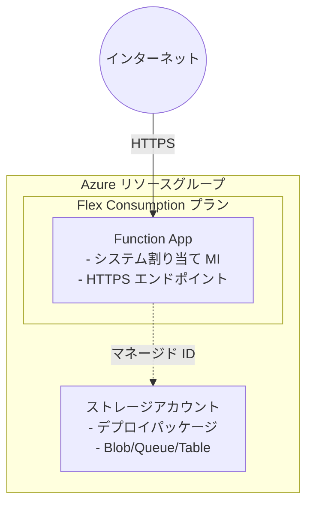

# Azure Functions Flex Consumption シナリオ

Azure Functions の Flex Consumption プランをデプロイします。サーバーレス関数の実行環境を最小構成で構築します。

## 概要

このシナリオでは、以下のリソースを作成します。

* **リソースグループ**: すべてのリソースを格納するコンテナー
* **ストレージアカウント**: Functions の実行に必要なストレージ（デプロイパッケージ用コンテナーを含む）
* **サービスプラン（Flex Consumption）**: FC1 SKU の Flex Consumption プラン
* **Function App**: Flex Consumption で動作するシステム割り当てマネージド ID 付き Function App
* **RBAC ロール割り当て**: Storage に対するマネージド ID の権限設定

## 前提条件

[プロバイダー認証](../../../docs/tips/provider-authentication.ja.md)、
[標準 Terraform ワークフロー](../../../docs/tips/terraform-workflow.ja.md)、およびオプションの
[Azure Blob リモートステート](../../../docs/tips/azure-blob-backend.ja.md)については、共通ガイダンスを参照してください。

リポジトリの Makefile を使用する場合は、`SCENARIO=azure_functions_flex_consumption` を指定します。

## アーキテクチャ



## 機能

* **Flex Consumption プラン**: 従量課金制でコスト効率の良いサーバーレス実行環境
* **システム割り当てマネージド ID**: 接続文字列を使用しないセキュアな認証
* **RBAC ベースのアクセス**: Storage への最小権限アクセス
* **ゾーン冗長**: オプションでゾーン冗長を有効化可能
* **Application Insights 不要**: 監視なしの最小構成

## 使用方法

[標準 Terraform ワークフロー](../../../docs/tips/terraform-workflow.ja.md)に従い、
`SCENARIO=azure_functions_flex_consumption` を指定します。

### デプロイの確認

```shell
terraform output function_app_url
```

## 変数

| 名前                     | 説明                                      | 型            | 既定値            | 必須   |
|--------------------------|-------------------------------------------|---------------|-------------------|--------|
| `name`                   | リソースのベース名                        | `string`      | `"azurefuncflex"` | いいえ |
| `location`               | リソースを配置する Azure リージョン       | `string`      | `"japaneast"`     | いいえ |
| `tags`                   | リソースに適用するタグ                    | `map(string)` | 既定値を参照      | いいえ |
| `runtime_name`           | アプリのランタイム                        | `string`      | `"python"`        | いいえ |
| `runtime_version`        | アプリのランタイムバージョン              | `string`      | `"3.11"`          | いいえ |
| `maximum_instance_count` | インスタンスの最大数（40～1000）          | `number`      | `100`             | いいえ |
| `instance_memory_in_mb`  | インスタンスメモリ（512、2048、4096）     | `number`      | `2048`            | いいえ |
| `zone_redundant`         | アプリでゾーン冗長を有効にするかどうか    | `bool`        | `false`           | いいえ |
| `app_settings`           | 追加のアプリ設定                          | `map(string)` | `{}`              | いいえ |

### ランタイムの選択肢

| runtime_name      | サポートされる runtime_version |
|-------------------|--------------------------------|
| `dotnet-isolated` | `7.0`, `8.0`, `9.0`            |
| `python`          | `3.10`, `3.11`, `3.12`         |
| `java`            | `11`, `17`, `21`               |
| `node`            | `18`, `20`, `22`               |
| `powershell`      | `7.4`                          |

## 出力

| 名前                            | 説明                                           |
|---------------------------------|------------------------------------------------|
| `resource_group_name`           | リソースグループ名                             |
| `function_app_id`               | Function App の ID                             |
| `function_app_name`             | Function App 名                                |
| `function_app_default_hostname` | Function App の既定ホスト名                    |
| `function_app_url`              | Function App にアクセスするための完全な URL    |
| `function_app_principal_id`     | Function App のマネージド ID のプリンシパル ID |
| `service_plan_id`               | サービスプランの ID                            |
| `service_plan_name`             | サービスプラン名                               |
| `storage_account_id`            | ストレージアカウントの ID                      |
| `storage_account_name`          | ストレージアカウント名                         |

## 例

### Python 関数アプリ

```hcl
# terraform.tfvars
name            = "mypythonfunc"
runtime_name    = "python"
runtime_version = "3.11"
```

### .NET 関数アプリ

```hcl
# terraform.tfvars
name            = "mydotnetfunc"
runtime_name    = "dotnet-isolated"
runtime_version = "8.0"
```

### カスタム設定を使用する Node.js 関数アプリ

```hcl
# terraform.tfvars
name                   = "mynodefunc"
runtime_name           = "node"
runtime_version        = "20"
maximum_instance_count = 200
instance_memory_in_mb  = 4096
zone_redundant         = true
```

## 関数コードのデプロイ

Terraform でインフラストラクチャをデプロイした後、以下のいずれかの方法で関数コードをデプロイします。

> **注記**: Azure Functions Flex Consumption プランでは、Terraform の `zip_deploy_file` は正常に動作しないため、コードを別途デプロイする必要があります。Flex Consumption は「One Deploy」という独自のデプロイメカニズムを使用しています。

### Azure Functions Core Tools を使用する方法（推奨）

```shell
FUNCTION_APP_NAME=$(terraform output -raw function_app_name)

# src ディレクトリに移動
cd src

# Function App にデプロイ
func azure functionapp publish $FUNCTION_APP_NAME
```

### Azure CLI を使用する方法

```shell
# src ディレクトリを zip 化
cd src && zip -r ../function_app.zip . && cd ..

# Azure CLI でデプロイ
az functionapp deployment source config-zip \
  --resource-group $(terraform output -raw resource_group_name) \
  --name $(terraform output -raw function_app_name) \
  --src function_app.zip
```

### デプロイの確認

```shell
# Function App のログをストリーミング
az webapp log tail \
  --name $(terraform output -raw function_app_name) \
  --resource-group $(terraform output -raw resource_group_name)
```

## 関数の動作確認

### HTTP トリガー関数のテスト

```shell
# Function App 名と関数キーを取得
FUNCTION_APP_NAME=$(terraform output -raw function_app_name)
RESOURCE_GROUP_NAME=$(terraform output -raw resource_group_name)

# 関数キーを取得
FUNCTION_KEY=$(az functionapp function keys list \
  --name $FUNCTION_APP_NAME \
  --resource-group $RESOURCE_GROUP_NAME \
  --function-name hello_world_http \
  --query default -o tsv)

# HTTP トリガー関数を呼び出し（基本）
curl "https://${FUNCTION_APP_NAME}.azurewebsites.net/api/hello?code=${FUNCTION_KEY}"

# HTTP トリガー関数を呼び出し（name パラメーター付き）
curl "https://${FUNCTION_APP_NAME}.azurewebsites.net/api/hello?code=${FUNCTION_KEY}&name=Azure"

# POST リクエストで呼び出し
curl -X POST "https://${FUNCTION_APP_NAME}.azurewebsites.net/api/hello?code=${FUNCTION_KEY}" \
  -H "Content-Type: application/json" \
  -d '{"name": "World"}'
```

### タイマートリガー関数の確認

タイマートリガー関数は 1 時間ごと（毎時 0 分）に自動実行されます。ログで実行を確認できます。

```shell
# ログをストリーミングして "hello world" の出力を確認
az webapp log tail \
  --name $(terraform output -raw function_app_name) \
  --resource-group $(terraform output -raw resource_group_name)
```

## 既知の問題とトラブルシューティング

### Terraform によるコードデプロイの制限

Azure Functions Flex Consumption プランでは、Terraform の `zip_deploy_file` 属性を使用したコードデプロイは**サポートされていません**（404 Not Found エラーが発生します）。これは、Flex Consumption が従来の App Service とは異なる「One Deploy」メカニズムを使用しているためです。

**対処法**: インフラストラクチャのデプロイ後、Azure Functions Core Tools（`func`）または Azure CLI を使用してコードをデプロイしてください。上記の「関数コードのデプロイ」セクションを参照してください。

### 403 エラー: "This request is not authorized to perform this operation using this permission."

初回デプロイ時に 403 エラーが発生することがあります。

**原因**: このモジュールでは、ストレージアカウントのセキュリティを強化するために `shared_access_key_enabled = false` を設定し、RBAC（Role-Based Access Control）による認証を使用しています。**Azure の RBAC ロール割り当ては伝播に最大数分かかる**ことがあります。

**対処法**: エラーが発生した場合は、1～2 分待ってから `terraform apply` を再度実行してください。

```shell
# 初回でエラーが発生した場合は、しばらく待ってから再実行
terraform apply -auto-approve
```

## 参考資料

* [Azure Functions Flex Consumption プラン](https://learn.microsoft.com/ja-jp/azure/azure-functions/flex-consumption-plan)
* [azurerm_function_app_flex_consumption](https://registry.terraform.io/providers/hashicorp/azurerm/latest/docs/resources/function_app_flex_consumption)
* [Azure Functions Flex Consumption のサンプル](https://github.com/Azure-Samples/azure-functions-flex-consumption-samples)
* [クイックスタート: Terraform から Azure Functions リソースを作成してデプロイする](https://learn.microsoft.com/en-us/azure/azure-functions/functions-create-first-function-terraform)
* [Azure RBAC ロール割り当ての伝播時間](https://learn.microsoft.com/en-us/azure/role-based-access-control/troubleshoot-limits#symptom---role-assignment-changes-are-not-being-detected)
