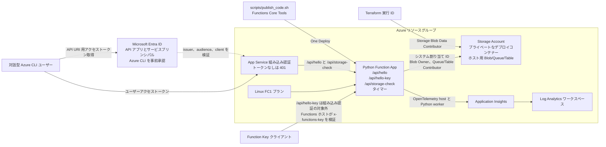

# Azure Functions Flex Consumption（Python）

Linux FC1 Flex Consumption の Function App を構築し、Python サンプルを明示的に公開して、2 種類の HTTP 認証、マネージド ID での Storage アクセス、タイマー、OpenTelemetry トレースを検証します。Terraform が構築するのは**インフラのみ**です。apply だけでは関数コードは公開されません。

## アーキテクチャ


```mermaid
flowchart LR
  User["対話型 Azure CLI ユーザー"] -->|API URI 用アクセストークン取得| Entra["Microsoft Entra ID<br/>API アプリとサービスプリンシパル<br/>Azure CLI を事前承認"]
  User -->|ユーザーアクセストークン| Auth
  Entra -.->|issuer、audience、client を検証| Auth
  Key["Function Key クライアント"] -->|/api/hello-key は組み込み認証の対象外<br/>Functions ホストが x-functions-key を検証| App
  subgraph RG["Azure リソースグループ"]
    Auth["App Service 組み込み認証<br/>トークンなしは 401"]
    Plan["Linux FC1 プラン"] --> App["Python Function App<br/>/api/hello<br/>/api/hello-key<br/>/api/storage-check<br/>タイマー"]
    Auth -->|/api/hello と /api/storage-check| App
    App -->|システム割り当て ID<br/>Blob Owner、Queue/Table Contributor| Storage["Storage Account<br/>プライベートなデプロイコンテナー<br/>ホスト用 Blob/Queue/Table"]
    App -->|OpenTelemetry host と Python worker| AI["Application Insights"]
    AI --> LA["Log Analytics ワークスペース"]
  end
  Operator["Terraform 実行 ID"] -->|Storage Blob Data Contributor| Storage
  Publisher["scripts/publish_code.sh<br/>Functions Core Tools"] -->|One Deploy| App
```

組み込み認証は Python ランタイムに到達する前に `/api/hello` と `/api/storage-check` を保護します。`/api/hello-key` は認証方式の比較のため対象外とし、Functions ホストが `function` 認証レベルを強制します。Python タイマーは `TIMER_SCHEDULE` アプリ設定に従います。Storage プローブは `STORAGE_ACCOUNT_BLOB_ENDPOINT`（Blob サービスの URI）と `STORAGE_CONTAINER_NAME`（デプロイコンテナー）のアプリ設定を使用し、`ManagedIdentityCredential` でコンテナーの属性を読み取ります。Blob の内容は公開しません。Functions ホストは `telemetryMode: OpenTelemetry` でテレメトリを送信し、`PYTHON_APPLICATIONINSIGHTS_ENABLE_TELEMETRY=true` により Python worker が Azure Monitor OpenTelemetry Distro を初期化します。`/api/hello` は `flex-otel-check` span を生成します。Application Insights の接続文字列はテレメトリ専用です。Storage には接続文字列ではなくマネージド ID でアクセスします。

## 前提条件

* Azure Public のサブスクリプションと Microsoft Entra テナント。**Linux Flex Consumption** と選択する Python ランタイムに対応したリージョン（既定値は `japaneast`、Python `3.13`）を使用します。[リージョン対応状況](https://learn.microsoft.com/azure/azure-functions/flex-consumption-how-to#regional-subscription-quotas)とサブスクリプションのクォータを確認してください。
* `mock_provider` を使うプランのみのテストには Terraform **1.7+**（シナリオの [`versions.tf`](versions.tf) ではデプロイ用に **1.6+** を許可）、Azure CLI **2.x** (`az`)、Azure Functions Core Tools **4.x** (`func`)、ローカル作業用 Python **3.13**、`curl`、`jq`、スクリプト実行用 `bash`。プロバイダーの制約は `versions.tf`、ロック済みバージョンは [`.terraform.lock.hcl`](.terraform.lock.hcl) を参照してください。Core Tools は[公式手順](https://learn.microsoft.com/ja-jp/azure/azure-functions/functions-run-local#install-the-azure-functions-core-tools)で導入し、`terraform version`、`az version`、`func --version`、`python3 --version`、`jq --version` で確認します。
* `az login` で対話的にサインインし、`az account set --subscription <subscription-id>` で対象を選択して `az account show` で確認します。Terraform CLI を直接使う場合は以下の `ARM_SUBSCRIPTION_ID` を設定します。Terraform 実行 ID には、リソースグループ、プラン、ストレージ、監視リソース、ロール割り当てを作成する権限（対象スコープの `Microsoft.Authorization/roleAssignments/write`、例: Owner または Contributor と Role Based Access Control Administrator）、および [`providers.tf`](providers.tf) に列挙された未登録リソースプロバイダーを登録する権限が必要です。Entra アプリ登録、サービスプリンシパル作成、Azure CLI の事前承認にはディレクトリ権限が必要です。テナントのポリシーによっては Application Administrator または Global Administrator が必要です。公開担当者には Function App へのデプロイ権限が必要です。[プロバイダー認証ガイド](../../../docs/tips/provider-authentication.ja.md)も参照してください。
* Storage は `shared_access_key_enabled = false` です。Terraform 実行 ID にはシナリオのストレージアカウントに対する Storage Blob Data Contributor、Function App には Storage Blob Data Owner、Storage Queue Data Contributor、Storage Table Data Contributor が付与されます。RBAC の反映には数分かかることがあります。使用する場合、ステート用バックエンドは**別の**ストレージアカウントにします。バックエンド固有のデータプレーン権限を含め、[Azure Blob バックエンドガイド](../../../docs/tips/azure-blob-backend.ja.md)を参照してください。

この例で許可するのは、Azure CLI の**対話型パブリッククライアント**向けのアクセストークンです。サービスプリンシパルで Azure CLI にログインしても Entra 保護エンドポイントの呼び出しには使えません。

## 構築とコード公開

リポジトリのルートから、単独の評価にはローカルステートを使用し、共有環境では先にリモートバックエンドを構成します。このシナリオはバックエンド自体を作成しません。既存ステートの移動時はバックアップを取り、`terraform init -migrate-state` を使用します。既存ステートへの接続を失う目的で `-reconfigure` を使用しないでください。機密情報を含み得るステートやプランを安全に管理し、コミットしないでください。destroy 対象のリソースグループ内にバックエンドを置かないでください。

### デプロイせずに構成を確認

デプロイ用ステートに初期化済みの作業ディレクトリとは**別の新しいチェックアウト**から、ローカルのプランのみのモックテストを実行します。`-backend=false` は設定済みのリモートバックエンドの初期化を防ぎます。既存ステートの移行や削除は行いません。以下の確認ではコードを公開せず、Azure リソースも作成しません。

```bash
SCENARIO=azure_functions_flex_consumption
cd "infra/scenarios/$SCENARIO"
terraform fmt -check
terraform init -backend=false
terraform validate
terraform test
```

[`azure_functions_flex_consumption.tftest.hcl`](azure_functions_flex_consumption.tftest.hcl) のすべての run はモックプロバイダーと `command = plan` を使用します。ここでの `terraform test` にはデプロイ済み環境は不要で、実環境のインフラステートも作成しません。初期化済みのローカル/リモートステートを参照する `terraform plan` は実際の Azure 構成を読み、Azure 認証を必要とする場合があります。また、デプロイ後の検証スクリプトは適用済み Terraform 出力と公開済み Function App が必要です。

### インフラの適用

```bash
SCENARIO=azure_functions_flex_consumption
cd "infra/scenarios/$SCENARIO"
export ARM_SUBSCRIPTION_ID="$(az account show --query id -o tsv)"
terraform init
umask 077
terraform plan -out=.terraform/flex-plan.tfplan
terraform apply .terraform/flex-plan.tfplan
rm -f .terraform/flex-plan.tfplan
terraform output -raw function_app_name
```

選択したサブスクリプションを確認し、特に Python 3.11 から 3.13 へ変更するときは、**保存した**プランに予期しないリソースの置換がないか確認します。確認済みのプランだけを適用してください。`.terraform/` は gitignore 対象で `terraform init` が作成するため、ルートに無視対象外の `tfplan` ファイルを残しません。プランには機密情報が含まれ得ます。厳重に保管し、apply の失敗や中断時にも削除してください。追跡対象の `.terraform.lock.hcl` には AzureRM **5.7.0** を含むプロバイダーバージョンが固定されています。制約に一致すれば `terraform init` はロックファイルを再利用し、新規チェックアウトで `-lockfile=readonly` を強制しません。必要な機密情報ではない出力のみを個別に取得してください。検証スクリプトは JSON 出力を内部で解析しますが、出力全体は表示しません。ステートや全出力を画面に表示・公開しないでください。リモートステートを使用する場合は上記ガイドに従い `terraform init` **前に**バックエンドを設定し、以降も同じバックエンドを使用します。成果物を保存しないプランのみの確認は `terraform plan` を実行して適用せずに停止します。Makefile の手順（`SCENARIO=azure_functions_flex_consumption`）は[共通ワークフロー](../../../docs/tips/terraform-workflow.ja.md)を参照してください。

apply 後、このシナリオディレクトリから Python コードを**別途公開**します。

```bash
bash scripts/publish_code.sh
```

このスクリプトは Functions Core Tools を使って Python サンプルを公開します（Flex の One Deploy）。`src/` から `function_app.py`、`requirements.txt`、`host.json` だけをステージングします。remote build はオブザーバビリティ用の唯一の直接依存 `azure-monitor-opentelemetry==1.8.10` を導入します。worker の app setting がこれを初期化するため、アプリから `configure_azure_monitor()` を重複して呼び出しません。追跡対象の `src/local.settings.json` は `src/.funcignore` で除外され、公開用の許可リストにも含まれません。この追跡対象ファイルに実際の認証情報を追加しないでください。ホストの起動を待ってから検証してください。Python コード変更後も再公開が必要です。Terraform はソースをデプロイしません。Flex への公開を `zip_deploy_file` や従来の App Service zip デプロイで代用しないでください。

## 検証

`infra/scenarios/azure_functions_flex_consumption` から、同じ初期化済みステートと対話型 Azure CLI ログインを使用して個別または順番に実行します。

```bash
bash scripts/00_validate_prerequisites.sh
bash scripts/01_test_entra_http.sh
bash scripts/02_test_function_key.sh
bash scripts/03_test_storage_identity.sh
bash scripts/04_test_timer.sh
bash scripts/05_test_http_telemetry.sh
```

6 件を一度に確認する場合は、代わりに `bash scripts/run_all.sh` を実行します。`00_validate_prerequisites.sh` は `az`、`curl`、`terraform`、`jq`、必要な Terraform 出力、および Azure CLI の**現在の既定サブスクリプション**が `subscription_id` と一致することを確認します。Core Tools やローカル Python は確認しません。残りのスクリプトを実行する前に Python コードを公開してください。`run_all.sh` はコードを公開せず、各検証を順番に実行します。アサーション失敗時、スクリプトはゼロ以外で終了します。OpenTelemetry span とタイマーの確認には実行や取り込みの待ち時間が必要な場合があります。Storage エンドポイントの JSON 応答（既定では `{"status":"ok","container":"deploymentpackage"}`）は **Function App の**マネージド ID でデプロイコンテナーにアクセスできることを示します。503 はプローブ失敗を意味します（テレメトリと RBAC の反映を調べてください）。検証スクリプトの標準出力には応答 JSON ではなく結果概要が表示されます。

テレメトリ照会は Application Insights Query API を `az rest` で呼び出すため、任意導入の Azure CLI `application-insights` 拡張機能は不要です。

| 検証 | 認証情報と期待結果 |
| --- | --- |
| `/api/hello`、トークンなし | 組み込み認証による HTTP **401** |
| `/api/hello?name=Azure`、`function_app_authentication_identifier_uri` 用の Azure CLI アクセストークン | Function Key なしで HTTP **200**、本文 `Hello, Azure!` |
| `/api/hello`、`{"name":"World"}` の POST とアクセストークン | HTTP **200**、本文 `Hello, World!` |
| `/api/hello-key`、Function Key なし（アクセストークンのみを含む） | Functions ホストによる HTTP **401** |
| `/api/hello-key?name=Azure`、`x-functions-key` | HTTP **200**、本文 `Hello, Azure!` |
| `/api/storage-check`、トークンなし / 有効なアクセストークンあり | HTTP **401** / HTTP **200** と `status: "ok"` とコンテナー名の JSON |
| タイマー | 既定値 `0 * * * * *` は毎分 0 秒（既定で UTC）。スクリプトはデプロイ済みの `%TIMER_SCHEDULE%` バインディング、Terraform 出力と一致するアプリ設定、過去 24 時間の対象アプリの `flex-timer-check: completed` トレースを検証します。初回実行とテレメトリの取り込みを待ってください。クエリは最大 1 分間再試行します。 |
| OpenTelemetry span | スクリプトは認証付き `/api/hello?name=Telemetry` を呼び出し（HTTP **200**、`Hello, Telemetry!`）、**この呼び出し以降**の `flex-otel-check` span を Application Insights の `dependencies` テーブルで確認します。span は Functions invocation の trace context を継承するため、相関と sampling decision がホスト生成 request と一致します。取り込みを最大 1 分間再試行し、ホスト生成 request telemetry だけでなく Python worker が生成したテレメトリを検証します。 |

OpenTelemetry の確認に成功すると `OpenTelemetry span verified for Application Insights app ...` と表示されます。同じ worker span を **Application Insights > ログ**から手動確認する場合は、次の KQL を実行します。

```kusto
dependencies
| where name == "flex-otel-check"
| project timestamp, name, operation_Id, id, duration, success
| order by timestamp desc
```

Entra 検証スクリプトは Terraform 出力の**正確な** URI を対象にトークンを取得します。トークンを出力せずに audience を確認する方法:

```bash
terraform output -raw function_app_authentication_identifier_uri
bash scripts/01_test_entra_http.sh
```

トークンが期限切れなら `az account get-access-token` で更新します。認証方式の比較のため Function Key エンドポイントは組み込み認証を通りません。Function Key は共有シークレットであり呼び出し元を識別しません。

## 変数と出力

<!-- markdownlint-disable MD013 MD060 -->

| 変数 | 既定値 | 用途 |
| --- | --- | --- |
| `name` | `"azurefuncflex"` | リソース名のベース（ランダムなサフィックスをステートに保持） |
| `location` | `"japaneast"` | Azure リージョン。Flex とランタイムの対応を確認 |
| `azure_cli_client_id` | `"04b07795-8ddb-461a-bbee-02f9e1bf7b46"` | 許可する対話型 Azure CLI パブリッククライアント |
| `runtime_name` / `runtime_version` | `"python"` / `"3.13"` | インフラのランタイム。付属サンプルは Python のみ |
| `timer_schedule` | `"0 * * * * *"` | 6 フィールド NCRONTAB（秒、分、時、日、月、曜日） |
| `maximum_instance_count` / `instance_memory_in_mb` | `100` / `2048` | Flex の最大スケール / メモリ（512、2048、4096 MiB） |
| `zone_redundant` | `false` | 対応リージョンで任意にゾーン冗長を有効化 |
| `tags` / `app_settings` | [`variables.tf`](variables.tf)を参照 / `{}` | タグ / 追加のアプリ設定。タイマーや ID 用の設定を意図せず上書きしないこと |

| 出力 | 内容 |
| --- | --- |
| `subscription_id`, `resource_group_name` | 対象サブスクリプションとリソースグループ |
| `function_app_name`, `function_app_id`, `function_app_url`, `function_app_default_hostname`, `function_app_principal_id` | Function App の識別子と HTTPS エンドポイント |
| `function_app_authentication_client_id`, `function_app_authentication_identifier_uri`, `function_app_authentication_tenant_id` | Entra API アプリ、トークンの audience、テナント |
| `storage_account_name`, `storage_account_id`, `deployment_container_name` | ID 保護された Storage と非公開デプロイコンテナー |
| `log_analytics_workspace_customer_id`, `log_analytics_workspace_id`, `log_analytics_workspace_name` | ワークスペース ID、Azure リソース ID、名前 |
| `application_insights_app_id`, `application_insights_id`, `application_insights_name` | Application Insights のアプリ ID、Azure リソース ID、名前 |
| `service_plan_id`, `service_plan_name`, `timer_schedule` | FC1 プランと設定されたタイマースケジュール |

<!-- markdownlint-enable MD013 MD060 -->

### `azure_cli_client_id` を固定する理由

既定値 `04b07795-8ddb-461a-bbee-02f9e1bf7b46` は Microsoft が公開する Azure CLI のアプリケーション ID です。テナント、サブスクリプション、端末、Function App ごとに生成される値では**ありません**。Azure CLI は対話型ユーザー認証にこのパブリッククライアント ID を使用し、組み込み認証はアクセストークンの `azp` または `appid` クレームを許可されたアプリと照合します。

別のパブリッククライアントから呼ぶ場合にのみ `azure_cli_client_id` を変更してください。自動検出を行うと端末のログイン方法によって Terraform plan が変わります。サービスプリンシパルへの対応にはアプリケーション権限とアプリロールの設計も必要で、ID の変更だけでは不十分です。この ID はテナント固有ではありませんが、設定した issuer は `login.microsoftonline.com`（Azure Public）です。Sovereign Cloud では対応する authority とプロバイダー環境も必要です。

### 既存の Python 3.11 デプロイからの移行

この **Python 専用**サンプルの既定値は `3.11` から `3.13` に変わりました。対象リージョンでの 3.13 対応と Python 依存関係の互換性を確認してください。既定値の変更のみで既存ステートが消えることはありませんが、Terraform は構成に応じてリソースを更新または置換する可能性があります。同じステート/バックエンドを維持し、`terraform plan` で提案される変更を確認してから適用します。ランタイム変更を延期する場合は既存の変数ファイルに `runtime_version = "3.11"` を明示します。移行する場合は確認済みの 3.13 プランを適用し、`bash scripts/publish_code.sh` で再公開してから検証します。ステート削除や空のバックエンドへの再初期化は移行手順ではありません。

## トラブルシューティング、費用、削除

* **アクセストークン付きで 401:** `function_app_authentication_tenant_id` のテナントに Azure CLI の対話型ユーザーでログインし、正確な識別子 URI を対象に新しいトークンを取得します。組み込み認証の背後にある Python の `/api/hello` トリガーは `anonymous` です。アクセストークンだけでは `/api/hello-key` の Function Key を代替できません。
* **apply / 公開後に 403 または 503:** Keyless Storage と Terraform 実行 ID 用 RBAC の反映に数分かかる場合があります。待ってから再試行し、Azure ロール割り当てと Application Insights の例外を確認します。Storage の共有キーは無効です。
* **apply 後に関数がない:** `scripts/publish_code.sh` でコードを公開します。`terraform apply` はアプリのインフラ構築のみです。
* **タイマー / OpenTelemetry span がない:** タイマーの既定値は毎時ではなく毎分です。`timer_schedule`、公開状況、`host.json` の `telemetryMode`、`PYTHON_APPLICATIONINSIGHTS_ENABLE_TELEMETRY` app setting、選択したサブスクリプション、ワークスペースと App Insights の出力を確認し、取り込みを待ちます。
* Flex の実行、Storage、Application Insights / Log Analytics の取り込みと保持には、低負荷でも費用が発生し得ます。[Flex の課金](https://learn.microsoft.com/ja-jp/azure/azure-functions/flex-consumption-plan#billing)と[Azure Monitor の価格](https://azure.microsoft.com/ja-jp/pricing/details/monitor/)を確認してください。削除時は**同じ初期化済みステート**から `terraform plan -destroy` を確認し、`terraform destroy` を実行します。リソースグループとシナリオの Entra アプリが削除されます。稼働中の別シナリオが使用するバックエンドは削除せず、削除結果とステート/バックアップの扱いを確認します。

## 一次資料

* [Flex Consumption の概要と対応ランタイム](https://learn.microsoft.com/ja-jp/azure/azure-functions/flex-consumption-plan)、[Flex へのデプロイ](https://learn.microsoft.com/azure/azure-functions/flex-consumption-how-to#deploy-to-flex-consumption)、[Python 開発者ガイド](https://learn.microsoft.com/ja-jp/azure/azure-functions/functions-reference-python)、[タイマーの NCRONTAB](https://learn.microsoft.com/ja-jp/azure/azure-functions/functions-bindings-timer#ncrontab-expressions)。
* [App Service 認証](https://learn.microsoft.com/ja-jp/azure/app-service/overview-authentication-authorization)、[Entra プロバイダーの許可アプリ](https://learn.microsoft.com/ja-jp/azure/app-service/configure-authentication-provider-aad)、[authsettingsV2](https://learn.microsoft.com/azure/templates/microsoft.web/sites/config-authsettingsv2)、[HTTP の認証レベル](https://learn.microsoft.com/ja-jp/azure/azure-functions/functions-bindings-http-webhook-trigger#authorization-level)、[Function Key](https://learn.microsoft.com/ja-jp/azure/azure-functions/function-keys-how-to#call-endpoints-with-access-keys)。
* [ID ベースのホスト用 Storage](https://learn.microsoft.com/azure/azure-functions/functions-reference?tabs=blob#connecting-to-host-storage-with-an-identity)、[マネージド ID と Blob SDK](https://learn.microsoft.com/azure/storage/blobs/storage-quickstart-blobs-python)、[ワークスペース連携 Application Insights](https://learn.microsoft.com/azure/azure-monitor/app/create-workspace-resource)、[Azure CLI のトークン取得](https://learn.microsoft.com/ja-jp/cli/azure/account#az-account-get-access-token)。
* [Azure Functions で OpenTelemetry を使用する](https://learn.microsoft.com/ja-jp/azure/azure-functions/opentelemetry-howto)、[Azure Functions OpenTelemetry 分散トレーシングのチュートリアル](https://learn.microsoft.com/ja-jp/azure/azure-functions/monitor-functions-opentelemetry-distributed-tracing)、[Python 用 Azure Monitor OpenTelemetry Distro](https://learn.microsoft.com/ja-jp/python/api/overview/azure/monitor-opentelemetry-readme)。
* [Azure CLI の公開アプリ ID](https://learn.microsoft.com/power-platform/admin/apps-to-allow)、[Azure CLI のソースコード](https://github.com/Azure/azure-cli/blob/dev/src/azure-cli-core/azure/cli/core/auth/constants.py)、[AzureRM プロバイダーの Flex リソース、バージョン 5.7.0](https://registry.terraform.io/providers/hashicorp/azurerm/5.7.0/docs/resources/function_app_flex_consumption)、[AzureAD アプリ事前承認](https://registry.terraform.io/providers/hashicorp/azuread/latest/docs/resources/application_pre_authorized)。
* 一次資料の課題/実装議論: [Flex zip デプロイの issue #29630](https://github.com/hashicorp/terraform-provider-azurerm/issues/29630)、[AzureRM Flex の ID ベース Storage 回避策（PR #29099）](https://github.com/hashicorp/terraform-provider-azurerm/pull/29099)。従来の `zip_deploy_file` が Flex で利用できるとは限りません。
* [Azure-Samples Flex Consumption Terraform AzureRM の例、固定リビジョン `46c638a8f1053f6863f478e736290ba0646504fa`](https://github.com/Azure-Samples/azure-functions-flex-consumption-samples/tree/46c638a8f1053f6863f478e736290ba0646504fa/IaC/terraformazurerm)。どちらも AzureRM で Flex Function App、デプロイコンテナー、Application Insights、Log Analytics ワークスペースを構築します。このシナリオではさらに AzureAD と組み込み認証を設定し、Entra トークンと Function Key を比較し、マネージド ID による Storage アクセスとテレメトリを検証し、Python コードを `scripts/publish_code.sh` で明示的に公開します。参照先サンプルのランタイム対応バージョン一覧は固定リビジョン時点のもので、このシナリオの Python 3.13 の既定値は掲載されていません。
