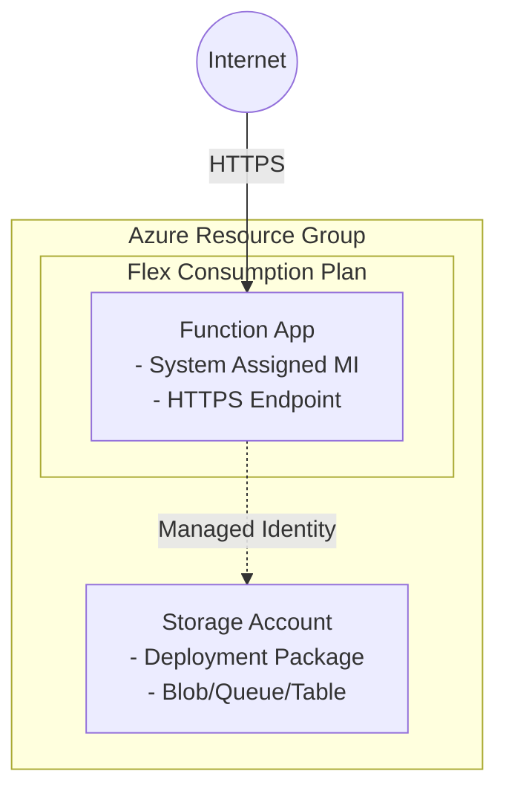

# Azure Functions Flex Consumption Scenario

Azure Functions の Flex Consumption プランをデプロイします。サーバーレス関数の実行環境を最小構成で構築します。

## Overview

このシナリオは以下のリソースを作成します：

- **Resource Group**: 全リソースのコンテナ
- **Storage Account**: Functions の実行に必要なストレージ（デプロイメントパッケージ用コンテナを含む）
- **Service Plan (Flex Consumption)**: FC1 SKU の Flex Consumption プラン
- **Function App**: Flex Consumption で動作する Function App（System Assigned Managed Identity 付き）
- **RBAC Role Assignments**: Storage に対する Managed Identity の権限設定

## Prerequisites

- Terraform CLI installed (>= 1.6.0)
- Azure CLI installed and logged in (`az login`)
- Azure subscription with permissions to create resources

## Architecture



## Features

- **Flex Consumption Plan**: 従量課金制でコスト効率の良いサーバーレス実行環境
- **System Assigned Managed Identity**: セキュアな認証（接続文字列不要）
- **RBAC-based Access**: Storage への最小権限アクセス
- **Zone Redundancy**: オプションでゾーン冗長を有効化可能
- **Application Insights 不要**: 監視なしの最小構成

## How to use

```shell
# Login to Azure
az login

# Initialize Terraform
terraform init

# Plan the deployment
terraform plan

# Apply the deployment
terraform apply -auto-approve

# Get the Function App URL
terraform output function_app_url

# Destroy the deployment
terraform destroy -auto-approve
```

## Variables

| Name | Description | Type | Default | Required |
|------|-------------|------|---------|----------|
| `name` | Specifies the base name for resources | `string` | `"azurefuncflex"` | no |
| `location` | Azure region for resources | `string` | `"japaneast"` | no |
| `tags` | Tags to apply to resources | `map(string)` | See default | no |
| `runtime_name` | The runtime for your app | `string` | `"python"` | no |
| `runtime_version` | The runtime version for your app | `string` | `"3.11"` | no |
| `maximum_instance_count` | The maximum instance count (40-1000) | `number` | `100` | no |
| `instance_memory_in_mb` | Instance memory: 512, 2048, or 4096 | `number` | `2048` | no |
| `zone_redundant` | Whether the app is zone redundant | `bool` | `false` | no |
| `app_settings` | Additional app settings | `map(string)` | `{}` | no |

### Runtime Options

| runtime_name | Supported runtime_version |
|--------------|---------------------------|
| `dotnet-isolated` | `7.0`, `8.0`, `9.0` |
| `python` | `3.10`, `3.11`, `3.12` |
| `java` | `11`, `17`, `21` |
| `node` | `18`, `20`, `22` |
| `powershell` | `7.4` |

## Outputs

| Name | Description |
|------|-------------|
| `resource_group_name` | Name of the resource group |
| `function_app_id` | ID of the Function App |
| `function_app_name` | Name of the Function App |
| `function_app_default_hostname` | Default hostname of the Function App |
| `function_app_url` | Full URL to access the Function App |
| `function_app_principal_id` | Principal ID of the Function App's Managed Identity |
| `service_plan_id` | ID of the Service Plan |
| `service_plan_name` | Name of the Service Plan |
| `storage_account_id` | ID of the Storage Account |
| `storage_account_name` | Name of the Storage Account |

## Examples

### Python Function App

```hcl
# terraform.tfvars
name            = "mypythonfunc"
runtime_name    = "python"
runtime_version = "3.11"
```

### .NET Function App

```hcl
# terraform.tfvars
name            = "mydotnetfunc"
runtime_name    = "dotnet-isolated"
runtime_version = "8.0"
```

### Node.js Function App with custom settings

```hcl
# terraform.tfvars
name                   = "mynodefunc"
runtime_name           = "node"
runtime_version        = "20"
maximum_instance_count = 200
instance_memory_in_mb  = 4096
zone_redundant         = true
```

## Deploy Function Code

デプロイ後、以下の方法で関数コードをデプロイできます：

```shell
# Azure Functions Core Tools を使用
func azure functionapp publish <function_app_name>

# VS Code Azure Functions 拡張機能を使用
# または Azure CLI を使用
az functionapp deployment source config-zip \
  --resource-group <resource_group_name> \
  --name <function_app_name> \
  --src <zip_file_path>
```

## References

- [Azure Functions Flex Consumption Plan](https://learn.microsoft.com/ja-jp/azure/azure-functions/flex-consumption-plan)
- [azurerm_function_app_flex_consumption](https://registry.terraform.io/providers/hashicorp/azurerm/latest/docs/resources/function_app_flex_consumption)
- [Azure Functions Flex Consumption Samples](https://github.com/Azure-Samples/azure-functions-flex-consumption-samples)
- [Quickstart: Create and deploy Azure Functions resources from Terraform](https://learn.microsoft.com/en-us/azure/azure-functions/functions-create-first-function-terraform)
