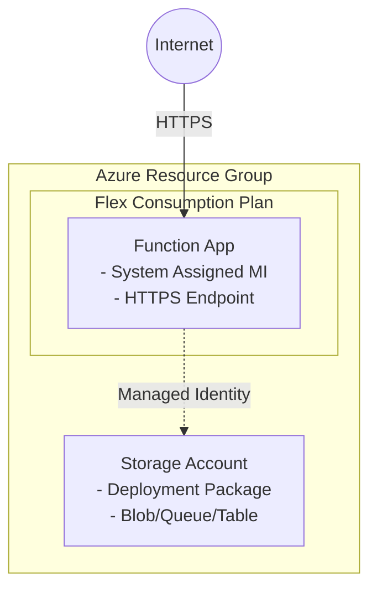

# Azure Functions Flex Consumption Scenario

This scenario deploys an Azure Functions Flex Consumption plan. It creates a minimal serverless function execution environment.

## Overview

This scenario creates the following resources:

* **Resource Group**: Container for all resources
* **Storage Account**: Storage required to run Functions, including a container for deployment packages
* **Service Plan (Flex Consumption)**: Flex Consumption plan with the FC1 SKU
* **Function App**: Function App running on Flex Consumption with a system-assigned managed identity
* **RBAC Role Assignments**: Managed identity permissions for Storage

## Prerequisites

See the shared guidance for [provider authentication](../../../docs/tips/provider-authentication.md),
the [standard Terraform workflow](../../../docs/tips/terraform-workflow.md), and the optional
[Azure Blob remote state](../../../docs/tips/azure-blob-backend.md).

When using the repository Makefile, specify `SCENARIO=azure_functions_flex_consumption`.

## Architecture


```mermaid
flowchart TB
    Internet((Internet))

    subgraph Azure["Azure Resource Group"]
        subgraph FlexConsumption["Flex Consumption Plan"]
            FA["Function App<br/>- System Assigned MI<br/>- HTTPS Endpoint"]
        end
        ST["Storage Account<br/>- Deployment Package<br/>- Blob/Queue/Table"]
    end

    Internet -->|HTTPS| FA
    FA -.->|Managed Identity| ST
```

## Features

* **Flex Consumption Plan**: Cost-effective, consumption-based serverless execution environment
* **System Assigned Managed Identity**: Secure authentication without connection strings
* **RBAC-based Access**: Least-privilege access to Storage
* **Zone Redundancy**: Optional zone redundancy
* **No Application Insights**: Minimal configuration without monitoring

## How to use

Follow the [standard Terraform workflow](../../../docs/tips/terraform-workflow.md) and specify
`SCENARIO=azure_functions_flex_consumption`.

### Verify the deployment

```shell
terraform output function_app_url
```

## Variables

| Name | Description | Type | Default | Required |
|------|-------------|------|---------|----------|
| `name` | Specifies the base name for resources | `string` | `"azurefuncflex"` | no |
| `location` | Azure region for resources | `string` | `"japaneast"` | no |
| `tags` | Tags to apply to resources | `map(string)` | See default | no |
| `runtime_name` | The runtime for your app | `string` | `"python"` | no |
| `runtime_version` | The runtime version for your app | `string` | `"3.11"` | no |
| `maximum_instance_count` | The maximum instance count (40-1000) | `number` | `100` | no |
| `instance_memory_in_mb` | Instance memory: 512, 2048, or 4096 | `number` | `2048` | no |
| `zone_redundant` | Whether the app is zone redundant | `bool` | `false` | no |
| `app_settings` | Additional app settings | `map(string)` | `{}` | no |

### Runtime Options

| runtime_name | Supported runtime_version |
|--------------|---------------------------|
| `dotnet-isolated` | `7.0`, `8.0`, `9.0` |
| `python` | `3.10`, `3.11`, `3.12` |
| `java` | `11`, `17`, `21` |
| `node` | `18`, `20`, `22` |
| `powershell` | `7.4` |

## Outputs

| Name | Description |
|------|-------------|
| `resource_group_name` | Name of the resource group |
| `function_app_id` | ID of the Function App |
| `function_app_name` | Name of the Function App |
| `function_app_default_hostname` | Default hostname of the Function App |
| `function_app_url` | Full URL to access the Function App |
| `function_app_principal_id` | Principal ID of the Function App's Managed Identity |
| `service_plan_id` | ID of the Service Plan |
| `service_plan_name` | Name of the Service Plan |
| `storage_account_id` | ID of the Storage Account |
| `storage_account_name` | Name of the Storage Account |

## Examples

### Python Function App

```hcl
# terraform.tfvars
name            = "mypythonfunc"
runtime_name    = "python"
runtime_version = "3.11"
```

### .NET Function App

```hcl
# terraform.tfvars
name            = "mydotnetfunc"
runtime_name    = "dotnet-isolated"
runtime_version = "8.0"
```

### Node.js Function App with custom settings

```hcl
# terraform.tfvars
name                   = "mynodefunc"
runtime_name           = "node"
runtime_version        = "20"
maximum_instance_count = 200
instance_memory_in_mb  = 4096
zone_redundant         = true
```

## Deploy Function Code

After deploying the infrastructure with Terraform, deploy the function code using one of the following methods.

> **Note**: Terraform's `zip_deploy_file` does not work correctly with the Azure Functions Flex Consumption plan, so you must deploy the code separately. Flex Consumption uses a dedicated deployment mechanism called "One Deploy."

### Use Azure Functions Core Tools (recommended)

```shell
FUNCTION_APP_NAME=$(terraform output -raw function_app_name)

# Move to the src directory
cd src

# Deploy to the Function App
func azure functionapp publish $FUNCTION_APP_NAME
```

### Use Azure CLI

```shell
# Create a zip archive of the src directory
cd src && zip -r ../function_app.zip . && cd ..

# Deploy with Azure CLI
az functionapp deployment source config-zip \
  --resource-group $(terraform output -raw resource_group_name) \
  --name $(terraform output -raw function_app_name) \
  --src function_app.zip
```

### Verify the deployment

```shell
# Stream the Function App logs
az webapp log tail \
  --name $(terraform output -raw function_app_name) \
  --resource-group $(terraform output -raw resource_group_name)
```

## Verify Function Behavior

### Test the HTTP trigger function

```shell
# Get the Function App name and Function key
FUNCTION_APP_NAME=$(terraform output -raw function_app_name)
RESOURCE_GROUP_NAME=$(terraform output -raw resource_group_name)

# Get the Function key
FUNCTION_KEY=$(az functionapp function keys list \
  --name $FUNCTION_APP_NAME \
  --resource-group $RESOURCE_GROUP_NAME \
  --function-name hello_world_http \
  --query default -o tsv)

# Call the HTTP trigger function (basic)
curl "https://${FUNCTION_APP_NAME}.azurewebsites.net/api/hello?code=${FUNCTION_KEY}"

# Call the HTTP trigger function with the name parameter
curl "https://${FUNCTION_APP_NAME}.azurewebsites.net/api/hello?code=${FUNCTION_KEY}&name=Azure"

# Call the function with a POST request
curl -X POST "https://${FUNCTION_APP_NAME}.azurewebsites.net/api/hello?code=${FUNCTION_KEY}" \
  -H "Content-Type: application/json" \
  -d '{"name": "World"}'
```

### Verify the timer trigger function

The timer trigger function runs automatically every hour at the top of the hour. You can verify its execution in the logs.

```shell
# Stream the logs and check for "hello world" output
az webapp log tail \
  --name $(terraform output -raw function_app_name) \
  --resource-group $(terraform output -raw resource_group_name)
```

## Known Issues and Troubleshooting

### Terraform code deployment limitation

The Azure Functions Flex Consumption plan **does not support** code deployment through Terraform's `zip_deploy_file` attribute. Attempts return a 404 Not Found error. This limitation exists because Flex Consumption uses the "One Deploy" mechanism instead of the mechanism used by traditional App Service plans.

**Workaround**: After deploying the infrastructure, deploy the code with Azure Functions Core Tools (`func`) or Azure CLI. See the "Deploy Function Code" section above.

### 403 error: "This request is not authorized to perform this operation using this permission."

A 403 error can occur during the initial deployment.

**Cause**: This module sets `shared_access_key_enabled = false` to improve Storage Account security and uses RBAC (Role-Based Access Control) authentication. **Azure RBAC role assignments can take several minutes to propagate.**

**Workaround**: If the error occurs, wait one or two minutes, then run `terraform apply` again.

```shell
# If the first attempt fails, wait briefly and run it again
terraform apply -auto-approve
```

## References

* [Azure Functions Flex Consumption Plan](https://learn.microsoft.com/ja-jp/azure/azure-functions/flex-consumption-plan)
* [azurerm_function_app_flex_consumption](https://registry.terraform.io/providers/hashicorp/azurerm/latest/docs/resources/function_app_flex_consumption)
* [Azure Functions Flex Consumption Samples](https://github.com/Azure-Samples/azure-functions-flex-consumption-samples)
* [Quickstart: Create and deploy Azure Functions resources from Terraform](https://learn.microsoft.com/en-us/azure/azure-functions/functions-create-first-function-terraform)
* [Azure RBAC role assignment propagation time](https://learn.microsoft.com/en-us/azure/role-based-access-control/troubleshoot-limits#symptom---role-assignment-changes-are-not-being-detected)
