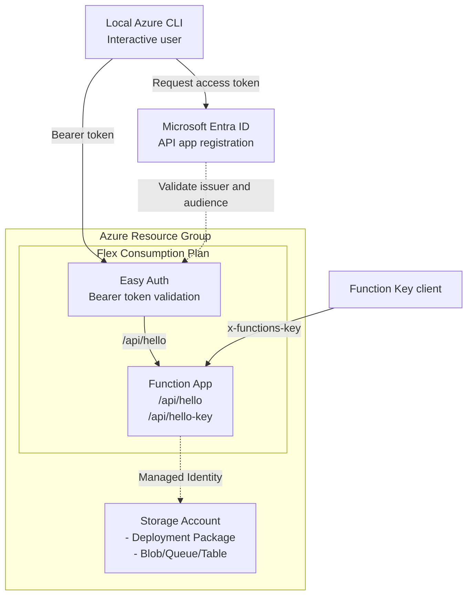

# Azure Functions Flex Consumption Scenario

This scenario deploys an Azure Functions Flex Consumption plan. It creates a minimal serverless function execution environment.

## Overview

This scenario creates the following resources:

* **Resource Group**: Container for all resources
* **Storage Account**: Storage required to run Functions, including a container for deployment packages
* **Service Plan (Flex Consumption)**: Flex Consumption plan with the FC1 SKU
* **Function App**: Function App running on Flex Consumption with a system-assigned managed identity
* **RBAC Role Assignments**: Managed identity permissions for Storage
* Microsoft Entra application registration and service principal for built-in authentication

## Prerequisites

See the shared guidance for [provider authentication](../../../docs/tips/provider-authentication.md),
the [standard Terraform workflow](../../../docs/tips/terraform-workflow.md), and the optional
[Azure Blob remote state](../../../docs/tips/azure-blob-backend.md).

When using the repository Makefile, specify `SCENARIO=azure_functions_flex_consumption`.

The identity that runs Terraform must be allowed to create and manage Microsoft
Entra application registrations. Configuring Azure CLI as a pre-authorized
client can require the Application Administrator or Global Administrator
directory role.

This scenario allows tokens issued to the Microsoft Azure CLI public client.
Use an interactive user sign-in with `az login`; a service principal login uses
a different client application ID and isn't covered by this example.

## Architecture


```mermaid
flowchart TB
  CLI["Local Azure CLI<br/>Interactive user"]
  KeyClient["Function Key client"]
  Entra["Microsoft Entra ID<br/>API app registration"]

    subgraph Azure["Azure Resource Group"]
        subgraph FlexConsumption["Flex Consumption Plan"]
      EasyAuth["Easy Auth<br/>Bearer token validation"]
      FA["Function App<br/>/api/hello<br/>/api/hello-key"]
        end
        ST["Storage Account<br/>- Deployment Package<br/>- Blob/Queue/Table"]
    end

  CLI -->|Request access token| Entra
  CLI -->|Bearer token| EasyAuth
  Entra -.->|Validate issuer and audience| EasyAuth
  EasyAuth -->|/api/hello| FA
  KeyClient -->|x-functions-key| FA
    FA -.->|Managed Identity| ST
```

## Features

* **Flex Consumption Plan**: Cost-effective, consumption-based serverless execution environment
* **Microsoft Entra Built-in Authentication**: Rejects unauthenticated requests
  before they reach the function runtime
* **Keyless HTTP Invocation**: Accepts Azure CLI user tokens instead of
  Function keys
* **Function Key Invocation**: Exposes `/api/hello-key` outside Easy Auth so
  the Functions host can validate a Function key independently
* **System Assigned Managed Identity**: Authenticates outbound Storage access
  without connection strings
* **RBAC-based Access**: Least-privilege access to Storage
* **Zone Redundancy**: Optional zone redundancy
* **No Application Insights**: Minimal configuration without monitoring

## How to use

Follow the [standard Terraform workflow](../../../docs/tips/terraform-workflow.md) and specify
`SCENARIO=azure_functions_flex_consumption`.

### Verify the deployment

```shell
terraform output function_app_url
```

## Variables

<!-- markdownlint-disable MD013 MD060 -->

| Name | Description | Type | Default | Required |
|------|-------------|------|---------|----------|
| `name` | Specifies the base name for resources | `string` | `"azurefuncflex"` | no |
| `location` | Azure region for resources | `string` | `"japaneast"` | no |
| `azure_cli_client_id` | Client ID allowed to call the Easy Auth endpoint as an interactive Azure CLI user | `string` | `"04b07795-8ddb-461a-bbee-02f9e1bf7b46"` | no |
| `tags` | Tags to apply to resources | `map(string)` | See default | no |
| `runtime_name` | The runtime for your app | `string` | `"python"` | no |
| `runtime_version` | The runtime version for your app | `string` | `"3.11"` | no |
| `maximum_instance_count` | The maximum instance count (40-1000) | `number` | `100` | no |
| `instance_memory_in_mb` | Instance memory: 512, 2048, or 4096 | `number` | `2048` | no |
| `zone_redundant` | Whether the app is zone redundant | `bool` | `false` | no |
| `app_settings` | Additional app settings | `map(string)` | `{}` | no |

<!-- markdownlint-enable MD013 MD060 -->

### Azure CLI client ID

The default `04b07795-8ddb-461a-bbee-02f9e1bf7b46` is the Microsoft-published
application ID for Azure CLI. It isn't generated per tenant, subscription,
machine, or Function App. Azure CLI uses this public client ID for interactive
user authentication, and Easy Auth compares it with the access token's `azp`
or `appid` claim.

Set `azure_cli_client_id` only when the calling public client has a different
application ID. Automatic discovery isn't used because it would make a
Terraform plan depend on the workstation's current login method. Supporting a
service principal requires an application permission and app-role design; it
isn't achieved by changing this variable alone.

> [!NOTE]
> The client ID itself isn't tenant-specific. This scenario still targets Azure
> Public because its issuer uses `login.microsoftonline.com`. Moving to a
> sovereign cloud also requires the corresponding authority host and Terraform
> provider environment; changing `azure_cli_client_id` alone isn't sufficient.

### Runtime Options

| runtime_name | Supported runtime_version |
|--------------|---------------------------|
| `dotnet-isolated` | `7.0`, `8.0`, `9.0` |
| `python` | `3.10`, `3.11`, `3.12` |
| `java` | `11`, `17`, `21` |
| `node` | `18`, `20`, `22` |
| `powershell` | `7.4` |

## Outputs

<!-- markdownlint-disable MD013 MD060 -->

| Name | Description |
|------|-------------|
| `resource_group_name` | Name of the resource group |
| `function_app_id` | ID of the Function App |
| `function_app_name` | Name of the Function App |
| `function_app_default_hostname` | Default hostname of the Function App |
| `function_app_url` | Full URL to access the Function App |
| `function_app_principal_id` | Principal ID of the Function App's Managed Identity |
| `function_app_authentication_client_id` | Client ID of the Microsoft Entra authentication application |
| `function_app_authentication_identifier_uri` | Application ID URI used as the access token resource |
| `function_app_authentication_tenant_id` | Microsoft Entra tenant ID used for authentication |
| `service_plan_id` | ID of the Service Plan |
| `service_plan_name` | Name of the Service Plan |
| `storage_account_id` | ID of the Storage Account |
| `storage_account_name` | Name of the Storage Account |

<!-- markdownlint-enable MD013 MD060 -->

## Examples

### Python Function App

```hcl
# terraform.tfvars
name            = "mypythonfunc"
runtime_name    = "python"
runtime_version = "3.11"
```

### .NET Function App

```hcl
# terraform.tfvars
name            = "mydotnetfunc"
runtime_name    = "dotnet-isolated"
runtime_version = "8.0"
```

### Node.js Function App with custom settings

```hcl
# terraform.tfvars
name                   = "mynodefunc"
runtime_name           = "node"
runtime_version        = "20"
maximum_instance_count = 200
instance_memory_in_mb  = 4096
zone_redundant         = true
```

## Deploy Function Code

After deploying the infrastructure with Terraform, deploy the function code using one of the following methods.

> **Note**: Terraform's `zip_deploy_file` does not work correctly with the Azure Functions Flex Consumption plan, so you must deploy the code separately. Flex Consumption uses a dedicated deployment mechanism called "One Deploy."

### Use Azure Functions Core Tools (recommended)

```shell
FUNCTION_APP_NAME=$(terraform output -raw function_app_name)

# Move to the src directory
cd src

# Deploy to the Function App
func azure functionapp publish $FUNCTION_APP_NAME
```

### Use Azure CLI

```shell
# Create a zip archive of the src directory
cd src && zip -r ../function_app.zip . && cd ..

# Deploy with Azure CLI
az functionapp deployment source config-zip \
  --resource-group $(terraform output -raw resource_group_name) \
  --name $(terraform output -raw function_app_name) \
  --src function_app.zip
```

### Verify the deployment

```shell
# Stream the Function App logs
az webapp log tail \
  --name $(terraform output -raw function_app_name) \
  --resource-group $(terraform output -raw resource_group_name)
```

## Verify Function Behavior

### Test Microsoft Entra built-in authentication

```shell
# Get the Function App URL and token audience
FUNCTION_APP_URL=$(terraform output -raw function_app_url)
FUNCTION_APP_AUDIENCE=$(terraform output -raw function_app_authentication_identifier_uri)

# Get an access token for the signed-in Azure CLI user
ACCESS_TOKEN=$(az account get-access-token \
  --resource "$FUNCTION_APP_AUDIENCE" \
  --query accessToken \
  --output tsv)

# Verify that a request without a token returns HTTP 401
curl -i "${FUNCTION_APP_URL}/api/hello"

# Call the HTTP trigger function without a Function key
curl \
  -H "Authorization: Bearer ${ACCESS_TOKEN}" \
  "${FUNCTION_APP_URL}/api/hello?name=Azure"

# Call the function with a POST request
curl -X POST \
  -H "Authorization: Bearer ${ACCESS_TOKEN}" \
  -H "Content-Type: application/json" \
  -d '{"name": "World"}' \
  "${FUNCTION_APP_URL}/api/hello"
```

> [!NOTE]
> Access tokens expire. Run `az account get-access-token` again when a request
> starts returning 401.

### Test Function Key authentication

The `/api/hello-key` path is excluded from Easy Auth. The Functions host, not
Easy Auth, enforces its `function` authorization level.

```shell
FUNCTION_APP_URL=$(terraform output -raw function_app_url)
FUNCTION_APP_NAME=$(terraform output -raw function_app_name)
RESOURCE_GROUP_NAME=$(terraform output -raw resource_group_name)

FUNCTION_KEY=$(az functionapp function keys list \
  --name "$FUNCTION_APP_NAME" \
  --resource-group "$RESOURCE_GROUP_NAME" \
  --function-name hello_world_http_with_function_key \
  --query default \
  --output tsv)

# Verify that a request without a Function key returns HTTP 401
curl -i "${FUNCTION_APP_URL}/api/hello-key"

# A Bearer token alone doesn't satisfy the Function Key endpoint
curl -i \
  -H "Authorization: Bearer ${ACCESS_TOKEN}" \
  "${FUNCTION_APP_URL}/api/hello-key"

# Call the endpoint with a Function key
curl \
  -H "x-functions-key: ${FUNCTION_KEY}" \
  "${FUNCTION_APP_URL}/api/hello-key?name=Azure"
```

<!-- markdownlint-disable MD013 MD060 -->

| Endpoint | Credential | Expected result |
|----------|------------|-----------------|
| `/api/hello` | None | `401 Unauthorized` from Easy Auth |
| `/api/hello` | Azure CLI Bearer token | `200 OK` |
| `/api/hello-key` | None or Bearer token only | `401 Unauthorized` from the Functions host |
| `/api/hello-key` | Function key | `200 OK` |

<!-- markdownlint-enable MD013 MD060 -->

> [!WARNING]
> The Function Key endpoint is excluded from Easy Auth for comparison. Function
> keys are shared secrets and don't identify the caller.

### Verify the timer trigger function

The timer trigger function runs automatically every hour at the top of the hour. You can verify its execution in the logs.

```shell
# Stream the logs and check for "hello world" output
az webapp log tail \
  --name $(terraform output -raw function_app_name) \
  --resource-group $(terraform output -raw resource_group_name)
```

## Known Issues and Troubleshooting

### Terraform code deployment limitation

The Azure Functions Flex Consumption plan **does not support** code deployment through Terraform's `zip_deploy_file` attribute. Attempts return a 404 Not Found error. This limitation exists because Flex Consumption uses the "One Deploy" mechanism instead of the mechanism used by traditional App Service plans.

**Workaround**: After deploying the infrastructure, deploy the code with Azure Functions Core Tools (`func`) or Azure CLI. See the "Deploy Function Code" section above.

### 403 error: "This request is not authorized to perform this operation using this permission."

A 403 error can occur during the initial deployment.

**Cause**: This module sets `shared_access_key_enabled = false` to improve Storage Account security and uses RBAC (Role-Based Access Control) authentication. **Azure RBAC role assignments can take several minutes to propagate.**

**Workaround**: If the error occurs, wait one or two minutes, then run `terraform apply` again.

```shell
# If the first attempt fails, wait briefly and run it again
terraform apply -auto-approve
```

### 401 response with a Bearer token

Confirm that Azure CLI is signed in to the tenant emitted by
`function_app_authentication_tenant_id`. Request the token for the exact
`function_app_authentication_identifier_uri` output, and redeploy the function
code after applying the Terraform changes. The deployed HTTP trigger must use
the `anonymous` Functions authorization level because Easy Auth performs
authentication at the platform boundary.

## References

<!-- markdownlint-disable MD013 -->

### Microsoft and Azure primary sources

* [Authentication and authorization in Azure App Service and Azure Functions](https://learn.microsoft.com/azure/app-service/overview-authentication-authorization). Describes the platform authentication boundary and unauthenticated request handling.
* [Configure Microsoft Entra authentication](https://learn.microsoft.com/azure/app-service/configure-authentication-provider-aad). Defines allowed audiences and states that `allowedApplications` evaluates the access token's `appid` or `azp` claim.
* [Microsoft.Web `authsettingsV2` reference](https://learn.microsoft.com/azure/templates/microsoft.web/sites/config-authsettingsv2). Defines `requireAuthentication`, `unauthenticatedClientAction`, `excludedPaths`, issuer, audience, and allowed applications.
* [Azure Functions HTTP trigger](https://learn.microsoft.com/azure/azure-functions/functions-bindings-http-webhook-trigger#authorization-level). Defines `anonymous` and `function` authorization levels.
* [Work with access keys in Azure Functions](https://learn.microsoft.com/azure/azure-functions/function-keys-how-to#call-endpoints-with-access-keys). Documents `code` and `x-functions-key` invocation.
* [Microsoft first-party application IDs](https://learn.microsoft.com/power-platform/admin/apps-to-allow). Lists Microsoft Azure CLI as `04b07795-8ddb-461a-bbee-02f9e1bf7b46`.
* [Azure CLI authentication source](https://github.com/Azure/azure-cli/blob/dev/src/azure-cli-core/azure/cli/core/auth/constants.py). Defines the same value as `AZURE_CLI_CLIENT_ID` in the official implementation.
* [`az account get-access-token`](https://learn.microsoft.com/cli/azure/account?view=azure-cli-latest#az-account-get-access-token). Documents access-token acquisition for a resource.

### Terraform provider sources

* [`azurerm_function_app_flex_consumption` 5.0.1](https://registry.terraform.io/providers/hashicorp/azurerm/5.0.1/docs/resources/function_app_flex_consumption). Defines `auth_settings_v2` and `active_directory_v2` used by this scenario.
* [`azuread_application` 3.7.0](https://registry.terraform.io/providers/hashicorp/azuread/3.7.0/docs/resources/application). Defines the API application and delegated `user_impersonation` scope.
* [`azuread_application_pre_authorized` 3.7.0](https://registry.terraform.io/providers/hashicorp/azuread/3.7.0/docs/resources/application_pre_authorized). Defines pre-authorization of the Azure CLI client application.

<!-- markdownlint-enable MD013 -->
