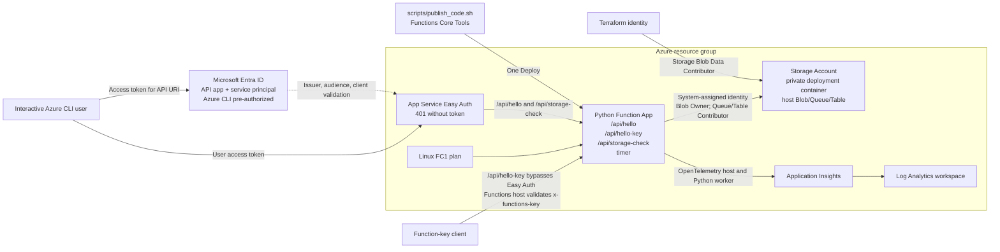

# Azure Functions Flex Consumption (Python)

Deploy a Linux FC1 Flex Consumption Function App, explicitly publish the Python sample, then verify two HTTP authorization paths, managed-identity Storage access, a timer, and OpenTelemetry traces. Terraform provisions infrastructure **only**; a successful apply does not publish functions.

## Architecture


```mermaid
flowchart LR
  User["Interactive Azure CLI user"] -->|Access token for API URI| Entra["Microsoft Entra ID<br/>API app + service principal<br/>Azure CLI pre-authorized"]
  User -->|User access token| Auth
  Entra -.->|Issuer, audience, client validation| Auth
  Key["Function-key client"] -->|/api/hello-key bypasses Easy Auth<br/>Functions host validates x-functions-key| App
  subgraph RG["Azure resource group"]
    Auth["App Service Easy Auth<br/>401 without token"]
    Plan["Linux FC1 plan"] --> App["Python Function App<br/>/api/hello<br/>/api/hello-key<br/>/api/storage-check<br/>timer"]
    Auth -->|/api/hello and /api/storage-check| App
    App -->|System-assigned identity<br/>Blob Owner; Queue/Table Contributor| Storage["Storage Account<br/>private deployment container<br/>host Blob/Queue/Table"]
    App -->|OpenTelemetry host and Python worker| AI["Application Insights"]
    AI --> LA["Log Analytics workspace"]
  end
  Operator["Terraform identity"] -->|Storage Blob Data Contributor| Storage
  Publisher["scripts/publish_code.sh<br/>Functions Core Tools"] -->|One Deploy| App
```

Easy Auth protects `/api/hello` and `/api/storage-check` before the Python runtime. `/api/hello-key` is excluded from Easy Auth deliberately: the Functions host enforces its `function` authorization level instead. The Python timer runs according to the `TIMER_SCHEDULE` app setting. The Storage probe reads the deployment container via `ManagedIdentityCredential`, using the `STORAGE_ACCOUNT_BLOB_ENDPOINT` (Blob service URI) and `STORAGE_CONTAINER_NAME` (deployment container) app settings; it does not expose blobs. The Functions host exports telemetry with `telemetryMode: OpenTelemetry`; `PYTHON_APPLICATIONINSIGHTS_ENABLE_TELEMETRY=true` makes the Python worker initialize the Azure Monitor OpenTelemetry Distro, and `/api/hello` emits a `flex-otel-check` span. The Application Insights connection string carries telemetry only; Storage access uses managed identity, not that connection string.

## Prerequisites

* Azure subscription and Microsoft Entra tenant in Azure Public; use a region that supports **Linux Flex Consumption** and the selected Python runtime (default `japaneast`, Python `3.13`). Check [regional support](https://learn.microsoft.com/azure/azure-functions/flex-consumption-how-to#regional-subscription-quotas) and subscription quota before applying.
* Terraform **1.7+** for the `mock_provider` plan-only tests (the scenario's [`versions.tf`](versions.tf) accepts **1.6+** for deployment), Azure CLI **2.x** (`az`), Azure Functions Core Tools **4.x** (`func`), Python **3.13** for local work, `curl`, and `jq`; `bash` runs the scripts. Provider constraints are in `versions.tf` and pinned selections in [`.terraform.lock.hcl`](.terraform.lock.hcl). Install Core Tools using the [official instructions](https://learn.microsoft.com/azure/azure-functions/functions-run-local#install-the-azure-functions-core-tools). Verify with `terraform version`, `az version`, `func --version`, `python3 --version`, `jq --version`.
* Sign in interactively with `az login`, select the intended subscription with `az account set --subscription <subscription-id>`, and confirm `az account show`. Direct Terraform CLI invocation needs `ARM_SUBSCRIPTION_ID` set below. The identity running Terraform needs permission to create the resource group, plan, storage, monitoring resources, and role assignments (`Microsoft.Authorization/roleAssignments/write`, e.g. Owner or Contributor **plus** Role Based Access Control Administrator at the target scope), and to register the resource providers listed in [`providers.tf`](providers.tf) if not already registered. Entra app registration, service principal creation, and Azure CLI pre-authorization need directory permissions; Application Administrator or Global Administrator may be required by tenant policy. The publisher needs permission to deploy to the Function App. Check the [provider authentication guide](../../../docs/tips/provider-authentication.md).
* Storage uses `shared_access_key_enabled = false`: the Terraform executor is granted Storage Blob Data Contributor on the scenario storage account and the Function App receives Storage Blob Data Owner, Storage Queue Data Contributor, and Storage Table Data Contributor. RBAC propagation can take several minutes. The state backend, if used, is a **separate** storage account: follow the [Azure Blob backend guide](../../../docs/tips/azure-blob-backend.md), including its separate data-plane role.

This example accepts access tokens for the Azure CLI **interactive public client**; service-principal CLI login is not supported for invoking the Entra-protected endpoint.

## Deploy and publish

From the repository root, choose local state for an isolated evaluation or configure the remote backend first. This scenario does **not** create a backend. For existing state, back it up and use `terraform init -migrate-state` when moving backends; never use `-reconfigure` to discard the connection to existing state. Protect state and plan files (they can contain secrets); do not commit them. Avoid a backend stored in the same resource group that you will destroy.

### Check configuration without deployment

From a **separate clean checkout** (not the working directory initialized against deployment state), run the local plan-only mock tests. `-backend=false` prevents initialization of a configured remote backend; it does not migrate or delete existing state. These checks do not publish code or create Azure resources:

```bash
SCENARIO=azure_functions_flex_consumption
cd "infra/scenarios/$SCENARIO"
terraform fmt -check
terraform init -backend=false
terraform validate
terraform test
```

[`azure_functions_flex_consumption.tftest.hcl`](azure_functions_flex_consumption.tftest.hcl) uses mocked providers and `command = plan` for every run. `terraform test` here does not require an applied deployment or produce live infrastructure state. It is different from `terraform plan` against an initialized local/remote state, which reads real Azure configuration and may require Azure credentials, and from the post-deployment scripts, which require applied Terraform outputs and a published Function App.

### Apply infrastructure

```bash
SCENARIO=azure_functions_flex_consumption
cd "infra/scenarios/$SCENARIO"
export ARM_SUBSCRIPTION_ID="$(az account show --query id -o tsv)"
terraform init
umask 077
terraform plan -out=.terraform/flex-plan.tfplan
terraform apply .terraform/flex-plan.tfplan
rm -f .terraform/flex-plan.tfplan
terraform output -raw function_app_name
```

Confirm the selected subscription and check the **saved** plan for unexpected replacements, especially when moving Python 3.11 to 3.13; apply only that reviewed plan. `.terraform/` is gitignored and is created by `terraform init`, so the plan never appears as an unignored root-level `tfplan`. The plan can contain secrets: keep it private and remove it even if apply fails or is cancelled. The tracked `.terraform.lock.hcl` pins provider versions, including AzureRM **5.7.0**; `terraform init` reuses it when constraints match, without imposing `-lockfile=readonly` on a fresh checkout. Query only the non-secret output you need; the verification scripts parse JSON outputs internally without displaying the complete output set. Do not print or publish the full state or all outputs. For remote state, configure the backend as described above *before* `terraform init` and retain the same backend across operations. For a plan-only evaluation without a saved artifact, run `terraform plan` and stop before apply. See the [standard workflow](../../../docs/tips/terraform-workflow.md) for Makefile usage (`SCENARIO=azure_functions_flex_consumption`).

After apply, **publish the Python code separately** from this scenario directory:

```bash
bash scripts/publish_code.sh
```

The script publishes the Python sample using Functions Core Tools (Flex One Deploy). It stages only `function_app.py`, `requirements.txt`, and `host.json` from `src/` before publishing. The remote build installs the single direct observability dependency, `azure-monitor-opentelemetry==1.8.10`; the worker app setting initializes it, so the application does not call `configure_azure_monitor()` a second time. The tracked `src/local.settings.json` is excluded by `src/.funcignore` and is not in the staged allowlist; never add real credentials to this tracked file. Wait for the host to become ready before running verification. Re-publish after changing the Python code; Terraform does not deploy source. Do not substitute `zip_deploy_file` or a generic App Service zip deployment for the Flex publishing workflow.

## Verify

From `infra/scenarios/azure_functions_flex_consumption` with the same initialized state and interactive Azure CLI login, run individually or in order:

```bash
bash scripts/00_validate_prerequisites.sh
bash scripts/01_test_entra_http.sh
bash scripts/02_test_function_key.sh
bash scripts/03_test_storage_identity.sh
bash scripts/04_test_timer.sh
bash scripts/05_test_http_telemetry.sh
```

Alternatively, run all six checks once with `bash scripts/run_all.sh`. `00_validate_prerequisites.sh` checks `az`, `curl`, `terraform`, `jq`, required Terraform outputs, and that the **active default** Azure CLI subscription matches `subscription_id`; it does not check Core Tools or local Python. Publish the Python code before running the remaining scripts. `run_all.sh` runs the checks in sequence without publishing code. Test scripts exit nonzero when an assertion fails; the OpenTelemetry span and timer checks may need a wait for execution/ingestion. The Storage endpoint's JSON response (`{"status":"ok","container":"deploymentpackage"}` by default) confirms the **Function App's** managed identity can reach its deployment container; a 503 indicates the probe failed (inspect telemetry and role propagation). Verification scripts report a summary, not the response JSON, on stdout.

| Check | Credential and expected result |
| --- | --- |
| `/api/hello` without token | HTTP **401** from Easy Auth |
| `/api/hello?name=Azure` with an Azure CLI access token for `function_app_authentication_identifier_uri` | HTTP **200**, body `Hello, Azure!`; no Function key |
| `/api/hello` POST with `{"name":"World"}` and bearer token | HTTP **200**, body `Hello, World!` |
| `/api/hello-key` without a Function key (even with a bearer token) | HTTP **401** from Functions host |
| `/api/hello-key?name=Azure` with `x-functions-key` | HTTP **200**, body `Hello, Azure!` |
| `/api/storage-check` without token / with valid bearer token | HTTP **401** / HTTP **200** with JSON `status: "ok"` and container name |
| Timer | Default `0 * * * * *`: every minute at second zero (UTC by default). The script checks the deployed `%TIMER_SCHEDULE%` binding, the app setting against the Terraform output, and an app-scoped `flex-timer-check: completed` trace from the last 24 hours. Wait for the first run and telemetry ingestion; the query retries for up to 1 minute. |
| OpenTelemetry span | The script sends an authenticated `/api/hello?name=Telemetry` request (HTTP **200**, `Hello, Telemetry!`), then queries the Application Insights `dependencies` table for a `flex-otel-check` span **since that probe**, retrying for up to 1 minute. This verifies telemetry emitted by the Python worker, not only host-generated request telemetry. |

A successful OpenTelemetry check prints `OpenTelemetry span verified for Application Insights app ...`. To inspect the same worker span manually in **Application Insights > Logs**, run:

```kusto
dependencies
| where name == "flex-otel-check"
| project timestamp, name, operation_Id, id, duration, success
| order by timestamp desc
```

The Entra verification script acquires a token for the **exact** Terraform output URI. You can inspect the audience without printing a token:

```bash
terraform output -raw function_app_authentication_identifier_uri
bash scripts/01_test_entra_http.sh
```

Refresh expired tokens with `az account get-access-token`. The key endpoint intentionally bypasses Easy Auth for comparison; Function keys are shared secrets and do not identify a caller.

## Variables and outputs

<!-- markdownlint-disable MD013 MD060 -->

| Variable | Default | Purpose |
| --- | --- | --- |
| `name` | `"azurefuncflex"` | Resource base name (a stable random suffix is held in state) |
| `location` | `"japaneast"` | Azure region; confirm Flex/runtime availability |
| `azure_cli_client_id` | `"04b07795-8ddb-461a-bbee-02f9e1bf7b46"` | Allowed interactive Azure CLI public client |
| `runtime_name` / `runtime_version` | `"python"` / `"3.13"` | Infrastructure runtime; included sample is Python only |
| `timer_schedule` | `"0 * * * * *"` | Six-field NCRONTAB schedule (second, minute, hour, day, month, weekday) |
| `maximum_instance_count` / `instance_memory_in_mb` | `100` / `2048` | Flex scale limit / memory (512, 2048, or 4096 MiB) |
| `zone_redundant` | `false` | Optional plan zone balancing, subject to region support |
| `tags` / `app_settings` | See [`variables.tf`](variables.tf) / `{}` | Resource tags / additional app settings; do not override the timer or identity settings unintentionally |

| Output | Meaning |
| --- | --- |
| `subscription_id`, `resource_group_name` | Target subscription and resource group |
| `function_app_name`, `function_app_id`, `function_app_url`, `function_app_default_hostname`, `function_app_principal_id` | App identity and HTTPS endpoint |
| `function_app_authentication_client_id`, `function_app_authentication_identifier_uri`, `function_app_authentication_tenant_id` | Entra API registration, access-token audience, and tenant |
| `storage_account_name`, `storage_account_id`, `deployment_container_name` | Identity-protected storage and private deployment container |
| `log_analytics_workspace_customer_id`, `log_analytics_workspace_id`, `log_analytics_workspace_name` | Workspace identifier, Azure resource ID, and name |
| `application_insights_app_id`, `application_insights_id`, `application_insights_name` | Application Insights application ID, Azure resource ID, and name |
| `service_plan_id`, `service_plan_name`, `timer_schedule` | FC1 plan and configured timer schedule |

<!-- markdownlint-enable MD013 MD060 -->

### Why `azure_cli_client_id` is fixed

The default `04b07795-8ddb-461a-bbee-02f9e1bf7b46` is the Microsoft-published Azure CLI application ID. It is **not** generated per tenant, subscription, workstation, or Function App. Azure CLI uses this public client ID for interactive user authentication; Easy Auth compares the access token's `azp` or `appid` claim with the configured allowed application.

Change `azure_cli_client_id` only for a different calling public client. Automatic discovery would make plans depend on the workstation's current login method. Supporting a service principal also requires an application permission and app-role design; changing the ID alone is insufficient. The ID is not tenant-specific, but the configured issuer is `login.microsoftonline.com` (Azure Public); sovereign clouds also need the appropriate authority and provider environment.

### Migrating an existing Python 3.11 deployment

The default changed from Python `3.11` to `3.13` for this **Python-only** sample. Check that your target region supports 3.13 and that Python dependencies are compatible. Existing state is not recreated solely by changing a default, but Terraform can update or replace resources based on your configuration: retain the same state/backend, run `terraform plan` and review all proposed changes before applying. If you need to defer the runtime change, set `runtime_version = "3.11"` explicitly in your existing variable file; otherwise apply the reviewed 3.13 plan and run `bash scripts/publish_code.sh` again, followed by the verification scripts. Do not delete state or reinitialize into an empty backend to migrate.

## Troubleshooting, cost, and teardown

* **401 with bearer token:** Confirm interactive Azure CLI login in `function_app_authentication_tenant_id`, request a fresh token for the exact identifier URI, and check that the Python `/api/hello` trigger is anonymous behind Easy Auth. A bearer token does not replace a Function key at `/api/hello-key`.
* **403 or 503 after apply/publish:** RBAC for keyless Storage and the Terraform executor may need several minutes to propagate. Wait and retry; inspect Azure role assignments and Application Insights exceptions. Storage shared-key access is disabled.
* **No functions after apply:** Publish via `scripts/publish_code.sh`. `terraform apply` only provisions the app.
* **No timer/OpenTelemetry span yet:** Timer defaults to once per minute, not once per hour. Verify `timer_schedule`, publish status, `telemetryMode` in `host.json`, the `PYTHON_APPLICATIONINSIGHTS_ENABLE_TELEMETRY` app setting, selected subscription, workspace and App Insights outputs; allow time for telemetry ingestion.
* Flex execution, Storage, Application Insights/Log Analytics ingestion and retention can incur charges even at low traffic. Check [Flex billing](https://learn.microsoft.com/azure/azure-functions/flex-consumption-plan#billing) and [Azure Monitor pricing](https://azure.microsoft.com/pricing/details/monitor/). To remove scenario-managed resources from the **same initialized state**, review and run `terraform plan -destroy` then `terraform destroy`; this removes the resource group and scenario Entra app. Do not destroy a separate backend that still stores live state. Verify removal and keep or dispose of state/backups per policy.

## Primary sources

* [Flex Consumption overview and supported runtimes](https://learn.microsoft.com/azure/azure-functions/flex-consumption-plan), [deploy to Flex](https://learn.microsoft.com/azure/azure-functions/flex-consumption-how-to#deploy-to-flex-consumption), [Python developer guide](https://learn.microsoft.com/azure/azure-functions/functions-reference-python), [timer NCRONTAB](https://learn.microsoft.com/azure/azure-functions/functions-bindings-timer#ncrontab-expressions).
* [App Service authentication](https://learn.microsoft.com/azure/app-service/overview-authentication-authorization), [Entra provider allowed applications](https://learn.microsoft.com/azure/app-service/configure-authentication-provider-aad), [authsettingsV2](https://learn.microsoft.com/azure/templates/microsoft.web/sites/config-authsettingsv2), [HTTP authorization levels](https://learn.microsoft.com/azure/azure-functions/functions-bindings-http-webhook-trigger#authorization-level), [Function keys](https://learn.microsoft.com/azure/azure-functions/function-keys-how-to#call-endpoints-with-access-keys).
* [Identity-based host storage](https://learn.microsoft.com/azure/azure-functions/functions-reference?tabs=blob#connecting-to-host-storage-with-an-identity), [managed identity and Blob SDK](https://learn.microsoft.com/azure/storage/blobs/storage-quickstart-blobs-python), [workspace-based Application Insights](https://learn.microsoft.com/azure/azure-monitor/app/create-workspace-resource), [Azure CLI token command](https://learn.microsoft.com/cli/azure/account#az-account-get-access-token).
* [Use OpenTelemetry with Azure Functions](https://learn.microsoft.com/azure/azure-functions/opentelemetry-howto), [Azure Functions OpenTelemetry distributed tracing tutorial](https://learn.microsoft.com/azure/azure-functions/monitor-functions-opentelemetry-distributed-tracing), and [Azure Monitor OpenTelemetry Distro for Python](https://learn.microsoft.com/python/api/overview/azure/monitor-opentelemetry-readme).
* [Azure CLI public application ID](https://learn.microsoft.com/power-platform/admin/apps-to-allow), [Azure CLI source](https://github.com/Azure/azure-cli/blob/dev/src/azure-cli-core/azure/cli/core/auth/constants.py); [AzureRM provider Flex resource, version 5.7.0](https://registry.terraform.io/providers/hashicorp/azurerm/5.7.0/docs/resources/function_app_flex_consumption), [AzureAD pre-authorized application](https://registry.terraform.io/providers/hashicorp/azuread/latest/docs/resources/application_pre_authorized).
* Primary-source issue/implementation discussions: [Flex zip deployment issue #29630](https://github.com/hashicorp/terraform-provider-azurerm/issues/29630) and [AzureRM Flex identity-based Storage workaround (PR #29099)](https://github.com/hashicorp/terraform-provider-azurerm/pull/29099). Do not assume traditional `zip_deploy_file` behavior applies to Flex.
* [Azure-Samples Flex Consumption Terraform AzureRM example, pinned revision `46c638a8f1053f6863f478e736290ba0646504fa`](https://github.com/Azure-Samples/azure-functions-flex-consumption-samples/tree/46c638a8f1053f6863f478e736290ba0646504fa/IaC/terraformazurerm). Both examples use AzureRM to provision a Flex Function App, deployment container, Application Insights and Log Analytics workspace. This scenario additionally configures AzureAD and Easy Auth, compares Entra tokens with Function keys, verifies managed-identity Storage access and telemetry, and explicitly publishes its Python code with `scripts/publish_code.sh`. The sample's runtime version list reflects its pinned revision and does not list this scenario's Python 3.13 default.
