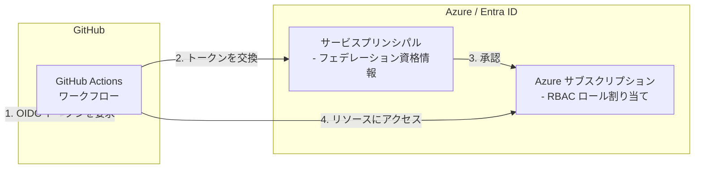

# Azure GitHub OIDC

この Terraform シナリオでは、GitHub Actions が OpenID Connect (OIDC) を使用して Azure で認証できるように、フェデレーション ID 資格情報を持つ Azure サービスプリンシパルを作成します。これにより、有効期間の長い Azure 資格情報を GitHub シークレットとして保存する必要がなくなります。

## アーキテクチャ

## 前提条件

共通ガイダンスの[プロバイダー認証](../../../docs/tips/provider-authentication.ja.md)、
[標準の Terraform ワークフロー](../../../docs/tips/terraform-workflow.ja.md)、およびオプションの
[Azure Blob リモートステート](../../../docs/tips/azure-blob-backend.ja.md)を使用します。

リポジトリの Makefile を使用する場合は、`SCENARIO=azure_github_oidc` を設定します。

## 使用方法

`SCENARIO=azure_github_oidc` を指定して、
[標準の Terraform ワークフロー](../../../docs/tips/terraform-workflow.ja.md)に従います。リモートステートには、シナリオ固有のバックエンド構成をコミットする代わりに、
[Azure Blob バックエンドガイド](../../../docs/tips/azure-blob-backend.ja.md)に従ってください。

## よくある質問

### エラー: Listing service principals for filter "appId eq '00000003-0000-0000-c000-000000000000'"

このエラーは、ログインしているユーザーに Microsoft Entra ID のサービスプリンシパルを一覧表示するための十分なアクセス許可がない場合に発生することがあります。Microsoft Entra ID で、そのユーザーに少なくとも「ディレクトリ閲覧者」ロールが割り当てられていることを確認してください。このロールは、Azure portal または Azure CLI を使用して割り当てられます。Azure portal で「アプリの登録」>「管理」>「API のアクセス許可」に移動し、必要なアクセス許可が付与されていることを確認してください。
