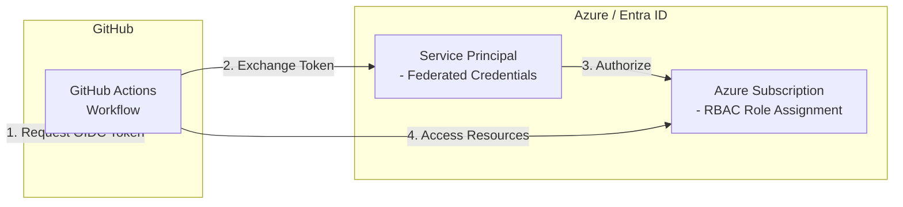

# Azure GitHub OIDC

This Terraform scenario creates an Azure Service Principal with federated identity credentials for GitHub Actions to authenticate with Azure using OpenID Connect (OIDC). This eliminates the need for storing long-lived Azure credentials as GitHub secrets.

## Architecture



## Prerequisites

- Terraform CLI installed
- Azure CLI installed
- Azure subscription

## How to use

```shell
# create backend.tf if needed
cat <<EOF > backend.tf
terraform {
  backend "azurerm" {
    resource_group_name  = "YOUR_RESOURCE_GROUP_NAME"
    storage_account_name = "YOUR_STORAGE_ACCOUNT_NAME"
    container_name       = "YOUR_CONTAINER_NAME"
    key                  = "azure_github_oidc.dev.tfstate"
  }
}
EOF

# Log in to Azure
az login

# (Optional) Confirm the details for the currently logged-in user
az ad signed-in-user show

# Set environment variables
export ARM_SUBSCRIPTION_ID=$(az account show --query id --output tsv)

# Initialize Terraform
terraform init

# Plan the deployment
terraform plan

# Apply the deployment
terraform apply -auto-approve

# Confirm the output
terraform output

# Destroy the deployment
terraform destroy -auto-approve
```

## FAQ

### Error: Listing service principals for filter "appId eq '00000003-0000-0000-c000-000000000000'"

This error may occur if the logged-in user does not have sufficient permissions to list service principals in Microsoft Entra ID. Ensure that the user has at least the "Directory Readers" role assigned in Microsoft Entra ID. You can assign this role using the Azure portal or Azure CLI. Go to the Azure portal, navigate to "App registrations" > "Manage" > "API permissions", and ensure that the necessary permissions are granted.
