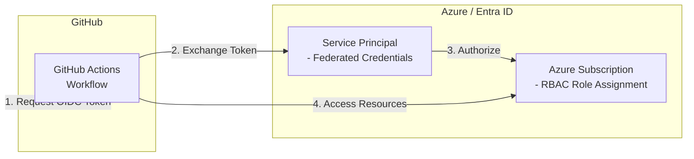

# Azure GitHub OIDC

This Terraform scenario creates an Azure Service Principal with federated identity credentials for GitHub Actions to authenticate with Azure using OpenID Connect (OIDC). This eliminates the need for storing long-lived Azure credentials as GitHub secrets.

## Architecture

```mermaid
flowchart LR
    subgraph GitHub["GitHub"]
        GA["GitHub Actions<br/>Workflow"]
    end

    subgraph Azure["Azure / Entra ID"]
        SP["Service Principal<br/>- Federated Credentials"]
        SUB["Azure Subscription<br/>- RBAC Role Assignment"]
    end

    GA -->|"1. Request OIDC Token"| GitHub
    GA -->|"2. Exchange Token"| SP
    SP -->|"3. Authorize"| SUB
    GA -->|"4. Access Resources"| SUB
```

## Prerequisites

Use the shared guidance for [provider authentication](../../../docs/tips/provider-authentication.md),
the [standard Terraform workflow](../../../docs/tips/terraform-workflow.md), and optional
[Azure Blob remote state](../../../docs/tips/azure-blob-backend.md).

Set `SCENARIO=azure_github_oidc` when using the repository Makefile.

## How to use

Follow the [standard Terraform workflow](../../../docs/tips/terraform-workflow.md) with
`SCENARIO=azure_github_oidc`. For remote state, follow the
[Azure Blob backend guide](../../../docs/tips/azure-blob-backend.md) instead of committing
scenario-specific backend configuration.

## FAQ

### Error: Listing service principals for filter "appId eq '00000003-0000-0000-c000-000000000000'"

This error may occur if the logged-in user does not have sufficient permissions to list service principals in Microsoft Entra ID. Ensure that the user has at least the "Directory Readers" role assigned in Microsoft Entra ID. You can assign this role using the Azure portal or Azure CLI. Go to the Azure portal, navigate to "App registrations" > "Manage" > "API permissions", and ensure that the necessary permissions are granted.
