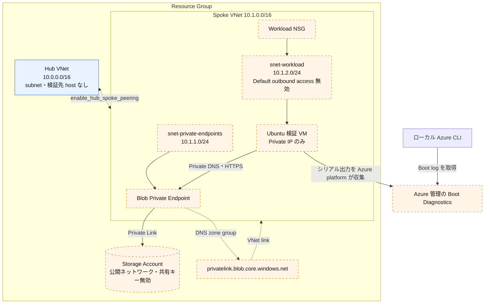

# Azure Hub-Spoke

最小構成の Resource Group、Hub VNet、Spoke VNet を作成し、ピアリング、
Blob Private Endpoint、プライベートな検証 VM を段階的に追加します。
Public IP、Bastion、NAT Gateway、Firewall、VPN Gateway は作成しません。
組織ポリシーの変更も必要ありません。

VM は起動するたびに `getent` と `curl` を自動実行し、結果をシリアルコンソールへ
出力します。Managed Boot Diagnostics からその結果を読み取ります。
SSH、VM Run Command、外部の IP 確認サービス、パッケージのダウンロード、
VM からの一般的なインターネット送信は検証に不要です。

## 構成

青色は既定の要素、オレンジ色は opt-in の要素です。



- **Hub**: 共有サービス用のアドレス空間です。ルーターや検証先 host はありません。
- **Peering**: 両方向を作成します。転送通信と gateway transit は無効です。
  Peering を作っても Private DNS zone は自動でリンクされません。
- **Private Endpoint**: Spoke から Blob Storage への接続口です。Storage 自体は
  VNet 内に配置されません。Private DNS zone は Spoke だけにリンクします。
- **検証 VM**: Private Endpoint の例が必要です。cloud-init で systemd service を
  設定し、起動するたびに Blob のプライベート接続を確認します。
- **Boot Diagnostics**: Azure 管理の Storage を使用し、検証対象の Blob とは
  別です。Azure platform がシリアル出力を収集するため、VM がインターネット
  経由でログをアップロードする必要はありません。

## 前提条件

まず [共通の前提条件](../../../docs/tips/terraform-workflow.ja.md#前提条件)を
確認してください。このシナリオでは、さらに次の条件が必要です。

- Azure サブスクリプションと認証済みの Azure CLI。
- ローカル端末の Terraform と Bash。
- リソース作成権限と VM の Boot Diagnostics 読み取り権限。
  `Microsoft.Compute/virtualMachines/retrieveBootDiagnosticsData/action` を含みます。
- ローカル端末から Azure Resource Manager と診断用 Storage endpoint への接続。
- 対象リージョンで利用可能な Ubuntu 対応 VM SKU。

共通の [Azure 認証](../../../docs/tips/provider-authentication.ja.md)と
[Terraform ワークフロー](../../../docs/tips/terraform-workflow.ja.md)に従ってください。
既定はローカル backend です。共有 state については
[Azure Blob backend ガイド](../../../docs/tips/azure-blob-backend.ja.md)を参照してください。
VM モジュールの SSH 秘密鍵は、このシナリオの output に公開しなくても state に
含まれます。state、診断用 SAS URL、秘密情報を共有しないでください。

## デプロイと動作確認を段階的に進める

すべての **ローカル** コマンドを、リポジトリルートの同じ Bash セッションで
実行します。コマンドが失敗したら、空の変数のまま続行せず原因を解消してください。
Terraform はコマンドラインの `-var` を保持しません。後続の plan/apply にも、
有効にするすべての flag と独自の値を指定するか、commit しない `.tfvars` を使います。

### 1. 2 つの VNet の境界を作る

```bash
export ARM_SUBSCRIPTION_ID="$(az account show --query id -o tsv)"
SCENARIO_DIR=infra/scenarios/azure_hub_spoke
make init SCENARIO=azure_hub_spoke
make plan SCENARIO=azure_hub_spoke
terraform -chdir="$SCENARIO_DIR" apply

RG="$(terraform -chdir="$SCENARIO_DIR" output -raw resource_group_name)"
HUB="$(terraform -chdir="$SCENARIO_DIR" output -raw hub_vnet_name)"
SPOKE="$(terraform -chdir="$SCENARIO_DIR" output -raw spoke_vnet_name)"
az group show -n "$RG" --query properties.provisioningState -o tsv
az network vnet show -g "$RG" -n "$HUB" \
  --query '{addressSpace:addressSpace.addressPrefixes,subnets:subnets[].name}' -o json
az network vnet show -g "$RG" -n "$SPOKE" \
  --query '{addressSpace:addressSpace.addressPrefixes,subnets:subnets[].name}' -o json
az network vnet peering list -g "$RG" --vnet-name "$HUB" -o table
az network vnet peering list -g "$RG" --vnet-name "$SPOKE" -o table
```

**期待値:** Resource Group が `Succeeded`、既定のアドレス空間が
`10.0.0.0/16` と `10.1.0.0/16`、subnet と peering の一覧が空です。
VNet の境界だけでは host は存在せず、2 つのネットワークも接続されません。

### 2. Hub と Spoke を接続する

```bash
terraform -chdir="$SCENARIO_DIR" apply \
  -var='enable_hub_spoke_peering=true'

az network vnet peering list -g "$RG" --vnet-name "$HUB" \
  --query '[].{name:name,state:peeringState,sync:peeringSyncLevel,remote:remoteVirtualNetwork.id,access:allowVirtualNetworkAccess,forwarded:allowForwardedTraffic}' -o json
az network vnet peering list -g "$RG" --vnet-name "$SPOKE" \
  --query '[].{name:name,state:peeringState,sync:peeringSyncLevel,remote:remoteVirtualNetwork.id,access:allowVirtualNetworkAccess,forwarded:allowForwardedTraffic}' -o json
```

**期待値:** 各方向に 1 つの peering があり、両方が `Connected` /
`FullyInSync`、`access=true`、`forwarded=false`、remote ID が相手 VNet です。
これはコントロールプレーンの確認で、Hub 宛の TCP 疎通ではありません。
Hub には検証先 host がありません。

### 3. Blob のプライベート接続を追加する

```bash
terraform -chdir="$SCENARIO_DIR" apply \
  -var='enable_hub_spoke_peering=true' \
  -var='enable_private_endpoint_example=true'

STORAGE="$(terraform -chdir="$SCENARIO_DIR" output -raw storage_account_name)"
PE_ID="$(terraform -chdir="$SCENARIO_DIR" output -raw private_endpoint_blob_id)"
PE_IP="$(terraform -chdir="$SCENARIO_DIR" output -raw private_endpoint_blob_ip)"
az storage account show -g "$RG" -n "$STORAGE" \
  --query '{state:provisioningState,publicNetworkAccess:publicNetworkAccess,sharedKey:allowSharedKeyAccess}' -o json
az network private-endpoint show --ids "$PE_ID" \
  --query '{state:provisioningState,subnet:subnet.id,connections:privateLinkServiceConnections[].privateLinkServiceConnectionState.status}' -o json
az network private-dns link vnet list -g "$RG" \
  -z privatelink.blob.core.windows.net \
  --query '[].{vnet:virtualNetwork.id,state:virtualNetworkLinkState}' -o json
az network private-dns record-set a show -g "$RG" \
  -z privatelink.blob.core.windows.net -n "$STORAGE" \
  --query 'aRecords[].ipv4Address' -o tsv
printf 'Expected private IP: %s\n' "$PE_IP"
```

**期待値:** Storage が `Succeeded`、公開ネットワークが `Disabled`、共有キーが
`false`、PE が `snet-private-endpoints` 内で `Succeeded` / `Approved`、
Spoke DNS link が `Completed`、A record が `PE_IP` と一致します。
ここまでは設定の確認です。Spoke 外のローカル端末で実行した `curl` は、
プライベート経路の疎通を証明しません。

### 4. プライベートな検証 VM を作る

作成前に既定 SKU の利用可否を確認します。

```bash
LOCATION="$(az group show -n "$RG" --query location -o tsv)"
az vm list-skus --location "$LOCATION" --resource-type virtualMachines --all \
  --query "[?name=='Standard_B2s_v2'].{name:name,restrictions:restrictions}" -o json
```

`Location` 制限がある SKU は、そのサブスクリプションの対象リージョンで利用できません。
この VM は zone を指定しませんが、制限一覧が空でも実際の空き容量は保証されません。
`SkuNotAvailable` の場合は、各 plan/apply に `-var='vm_size=<available-size>'`
を追加し、利用可能な size を指定してください。

```bash
terraform -chdir="$SCENARIO_DIR" plan \
  -var='enable_hub_spoke_peering=true' \
  -var='enable_private_endpoint_example=true' \
  -var='enable_test_vm=true'
terraform -chdir="$SCENARIO_DIR" apply \
  -var='enable_hub_spoke_peering=true' \
  -var='enable_private_endpoint_example=true' \
  -var='enable_test_vm=true'

VM="$(terraform -chdir="$SCENARIO_DIR" output -raw vm_name)"
VM_IP="$(terraform -chdir="$SCENARIO_DIR" output -raw vm_private_ip)"
NIC_ID="$(terraform -chdir="$SCENARIO_DIR" output -raw vm_network_interface_id)"
WORKLOAD_SUBNET_ID="$(terraform -chdir="$SCENARIO_DIR" output -raw workload_subnet_id)"
az vm get-instance-view -g "$RG" -n "$VM" \
  --query '{vm:instanceView.statuses,agent:instanceView.vmAgent.statuses}' -o json
az vm show -g "$RG" -n "$VM" --query diagnosticsProfile.bootDiagnostics -o json
az network nic show --ids "$NIC_ID" \
  --query 'ipConfigurations[].{private:privateIPAddress,public:publicIPAddress.id}' -o json
az network vnet subnet show --ids "$WORKLOAD_SUBNET_ID" \
  --query '{defaultOutbound:defaultOutboundAccess,nat:natGateway.id,nsg:networkSecurityGroup.id}' -o json
```

**期待値:** VM が `PowerState/running`、VM Agent が ready、Boot Diagnostics が
`enabled=true` で独自の Storage URI なし、NIC の Private IP が `VM_IP` と一致し
`public=null`、subnet が `defaultOutbound=false`、`nat=null` で NSG ID あり。
VM 作成の成功だけでは疎通確認は完了していません。

### 5. DNS と HTTPS の実通信結果を読む

```bash
az vm boot-diagnostics get-boot-log -g "$RG" -n "$VM"
```

cloud-init がスクリプトを配置し、`validate-private-blob.service` を有効化します。
service が VM 内で実行する確認は次のとおりです。

```bash
getent ahostsv4 <storage-account-name>.blob.core.windows.net
curl --noproxy '*' -sS --connect-timeout 5 --max-time 20 \
  -o /dev/null -w '%{remote_ip} %{http_code}' \
  'https://<storage-account-name>.blob.core.windows.net/?comp=list'
```

これらは VM に組み込まれています。ローカル実行で代用しないでください。
最新の実行に、次の証拠が含まれることを確認します。

```text
PRIVATE_BLOB_CHECK <UTC timestamp> START host=<blob-host> expected_ip=<PE_IP>
PRIVATE_BLOB_CHECK <UTC timestamp> DNS_PASS ip=<PE_IP>
PRIVATE_BLOB_CHECK <UTC timestamp> HTTPS_PASS remote_ip=<PE_IP> http=403 tls=verified
PRIVATE_BLOB_CHECK <UTC timestamp> PASS scope=private_dns_tcp_tls_http
```

**合格条件:**

1. DNS の解決先が、期待する PE の IPv4 アドレスだけである。
2. `curl` の接続先も同じ IP で、証明書検証が有効である。
3. HTTP 応答が返る。`000`、接続エラー、TLS エラーは不合格。
4. 最新の `START` に対応する最後の `PASS` がある。過去の成功結果では判定しない。

#### 結果の読み方

| ログ | 意味・期待値 |
|---|---|
| `START` / `ATTEMPT` | 検証開始。`host` が対象の Blob 名、`expected_ip` が `$PE_IP` と一致する |
| `DNS_PASS` | 名前解決が成功。`ip` が `$PE_IP` と一致する |
| `HTTPS_PASS` | 実接続先 `remote_ip` が `$PE_IP`、`tls=verified`、HTTP 応答あり（`100` ～ `599`） |
| 最終 `PASS` | **疎通は合格**。途中に `RETRY` があっても、最新実行の最終結果で判断する |
| `FAIL` | **不合格**。直前のエラーを確認し、原因を修正して再検証する |
| 開始ログなし、または `ATTEMPT` / `RETRY` で終わる | **未判定**。ログを再取得し、続く場合は VM / service 状態を確認する |

**疎通成功と API 成功は別です。** 例えば正しい PE IP で
`http=409 tls=verified` と最終 `PASS` があれば、
「プライベート経路の DNS・TCP・TLS・HTTP 応答は成功、API はエラー」です。
`400` / `403` / `5xx` も応答到達の証拠ですが、読み書き成功やサービス正常性は
保証しません。`000`、timeout、DNS / TLS エラー、IP 不一致はその試行の失敗です。

`409` の詳細原因はこのログだけでは分かりません。スクリプトは応答ヘッダー・本文を
保存しないため、原因調査には VM 内で `x-ms-error-code` や本文のエラーを取得します。
VM に Managed Identity / Blob データロールはありません。
時刻の `Z` は UTC です。過去の `PASS` ではなく、最新の `START` 以降を判定してください。

Boot log が表示されるまで数分かかる場合があります。スクリプトは 10 秒間隔で
最大 12 回再試行し、HTTPS は 1 回につき最大 20 秒です。失敗理由を毎回記録し、
再試行を使い切ると `FAIL` と非ゼロの service 終了コードを返します。
ツール不足も明示的に失敗します。パッケージインストールは行いません。

再検証は VM を再起動して、ログを再取得します。

```bash
date -u +%FT%TZ
az vm restart -g "$RG" -n "$VM"
az vm boot-diagnostics get-boot-log -g "$RG" -n "$VM"
```

再起動後の新しい `START` が現れるまで待ち、その実行を判定します。
再起動は VM を中断します。ログ取得の成功だけでは検証成功ではありません。

### 6. 経路を確認し、検証範囲を整理する

```bash
NIC="${NIC_ID##*/}"
az network nic show-effective-route-table -g "$RG" -n "$NIC" -o json
az network nic list-effective-nsg -g "$RG" -n "$NIC" -o json
az resource list -g "$RG" \
  --query "[?type=='Microsoft.Network/publicIPAddresses' || type=='Microsoft.Network/natGateways' || type=='Microsoft.Network/bastionHosts'].{name:name,type:type}" -o json
```

**期待値:** Hub 宛の Active な `VNetPeering` route、Spoke 内の route、
PE `/32` 宛の `InterfaceEndpoint` route が存在します。NSG が DNS と PE の HTTPS
を許可していることも確認します。最後の query はこのシナリオでは `[]` です。
`Internet` next hop が表示されても、インターネット送信が成功する証拠にはなりません。

| 確認 | 期待する結果 | 証明する内容 |
|---|---|---|
| 両方向の peering と Hub 宛有効ルート | 両方向 `Connected` / `FullyInSync`、Hub 宛 `Active` / `VNetPeering` | Hub-Spoke のコントロールプレーン設定。Hub host 宛の実通信成功ではない |
| VM の DNS / HTTPS `PASS` | 最新実行の DNS IP と実接続先 IP が `$PE_IP`、`tls=verified`、HTTP 応答あり、最終 `PASS` | Spoke VM → PE → Blob の名前解決・TCP・TLS・HTTP 応答。API の処理成功ではない |
| NIC と private subnet | `public=null`、`defaultOutbound=false`、`nat=null` | VM Public IP と default outbound access、NAT 関連付けがないこと |
| Managed Boot Diagnostics のログ | 対象 VM の最新の `START` と検証結果が読める | Azure platform が VM 内の検証結果を収集したこと。取得成功だけで疎通合格ではない |

Blob 検証は Spoke 内で完結し、Hub を経由しません。Hub の host 宛 TCP 通信、
インターネット送信、認証付きの Blob 操作は検証対象外です。
期待する通信経路は **Spoke VM → PE の Private IP → Azure Private Link →
Blob Storage → HTTP 応答**です。Blob API の処理成功・サービス正常性も、
トランスポートの `PASS` だけでは保証しません。

## トラブルシューティング

| 状況 | 次に確認すること |
|---|---|
| `SkuNotAvailable` | 対象リージョンの SKU 制限と実際の空き容量 |
| ログに `START` がない | VM 状態、cloud-init のシリアル出力、Boot Diagnostics 設定、ログ公開の遅延 |
| `RETRY dns_resolution_failed` または DNS IP が違う | PE 承認、A record、Spoke VNet link、DNS 設定、NSG |
| `RETRY https_connection_failed` | `curl` のエラー、PE IP、NSG、route、TLS 証明書検証 |
| `HTTPS_PASS http=409` と最終 `PASS` | 正しい PE IP と TLS 検証を確認できれば疎通は合格。API エラーの詳細は応答ヘッダー・本文が必要で、このログだけでは原因を断定しない |
| `FAIL missing_tool=...` | VM image 内のツール。指定の Ubuntu image を使用し、実行時のパッケージ取得に依存しない |
| `FAIL attempts=12` | 直前の再試行理由を調べ、原因を解消した後に再起動 |
| Boot log の取得権限エラー | 診断取得権限とローカルから診断用 Storage endpoint への接続 |

`curl -k`、Storage の公開アクセス、共有キー、組織ポリシーの変更で検証を通さないで
ください。プライベートなトランスポートの確認は、Azure RBAC や Blob データアクセス
とは区別します。

## 入力と出力

| 入力 | 既定値・用途 |
|---|---|
| `name`, `location`, `tags` | リソース名、`japaneast`、リソースタグ |
| `enable_hub_spoke_peering` | `false`、両方向の peering |
| `enable_private_endpoint_example` | `false`、プライベートな Blob 構成と DNS |
| `enable_test_vm` | `false`、起動時検証 VM。Blob の例が必要 |
| `hub_vnet_address_space`, `spoke_vnet_address_space` | `10.0.0.0/16`、`10.1.0.0/16` |
| `private_endpoint_subnet_address_prefixes`, `workload_subnet_address_prefixes` | `10.1.1.0/24`、`10.1.2.0/24` |
| `allow_forwarded_traffic` | `false`、router と route table がない場合は無効のままにする |
| `storage_account_tier`, `storage_account_replication_type` | `Standard`、`LRS` |
| `vm_size`, `vm_admin_username` | `Standard_B2s_v2`、`azureuser` |
| `vm_os_disk_size_gb`, `vm_os_disk_type` | `30`、`Standard_LRS` |

出力は Resource Group と VNet の名前・ID、両方向の peering ID、subnet ID、
Storage の名前・ID、PE の ID・IP、VM の ID・名前・Private IP・NIC ID です。
無効な任意機能の出力は null で、`terraform output` に表示されない場合があります。

VM、disk、Storage、Private Endpoint には課金が発生します。検証後は削除し、
destroy plan を確認してから承認してください。

```bash
terraform -chdir="$SCENARIO_DIR" destroy \
  -var='enable_hub_spoke_peering=true' \
  -var='enable_private_endpoint_example=true' \
  -var='enable_test_vm=true'
```

## オフライン検証

Terraform test はすべて mock provider と `command = plan` を使用します。

```bash
terraform -chdir=infra/scenarios/azure_hub_spoke init -backend=false -lockfile=readonly
terraform -chdir=infra/scenarios/azure_hub_spoke validate
terraform -chdir=infra/scenarios/azure_hub_spoke test
bash infra/scenarios/azure_hub_spoke/scripts/tests/test_validation.sh
```

構成、private subnet、Managed Boot Diagnostics、cloud-init の接続、再試行、
DNS・接続先 IP の不一致、TLS エラー、timeout、明示的な失敗結果を確認します。
これらは Azure へのデプロイと Boot log による確認を代替するものではありません。

## 参考資料・出典

- [Azure Storage の Private Endpoint](https://learn.microsoft.com/azure/storage/common/storage-private-endpoints) — プライベート経路と DNS 解決。
- [Azure Boot Diagnostics](https://learn.microsoft.com/azure/virtual-machines/boot-diagnostics) — シリアルログ収集と Managed Storage。
- [Blob Storage のエラーコード](https://learn.microsoft.com/rest/api/storageservices/blob-service-error-codes) — HTTP `409` などの詳細なエラー分類。
- [curl の TLS 証明書検証](https://curl.se/docs/sslcerts.html) — 既定の証明書検証と `--insecure` の注意点。
- [検証スクリプト](./scripts/validate_private_blob.sh) — このシナリオの `PASS` 条件、HTTP code の判定範囲、再試行処理。
