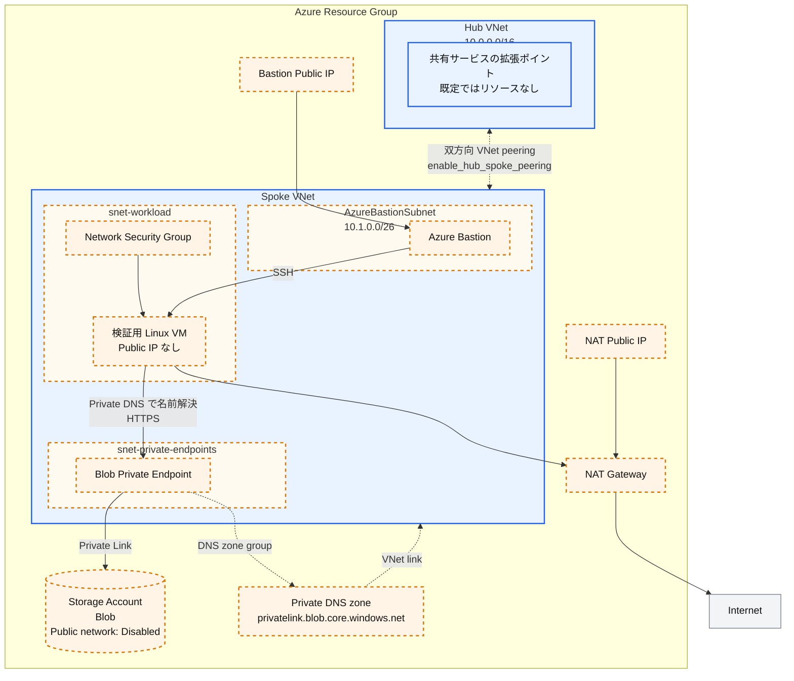

# Azure Hub-Spoke

このシナリオは Azure の
[ハブ スポーク ネットワーク トポロジ](https://learn.microsoft.com/azure/architecture/networking/architecture/hub-spoke)
を学ぶための小さな scaffolding です。既定では、リソース グループ、ハブ VNet、
スポーク VNet だけを作成します。ピアリングや、コストまたはデプロイ時間を増やす
リソースは opt-in です。

## 各要素の役割

- **ハブ VNet**: 将来、共有サービスとルーティングを配置する境界です。この
  scaffolding には Firewall、Gateway、DNS Resolver を含めません。
- **スポーク VNet**: ワークロードの境界です。任意の例を有効にした場合だけ、
  対応するサブネットを追加します。
- **双方向 VNet ピアリング**: ハブとスポークを接続します。Azure のピアリングは
  推移的ではないため、両方向が必要です。
- **Blob Private Endpoint の例**: PaaS のプライベート接続に必要な 3 要素である
  Private Endpoint、サービス固有の Private DNS zone、VNet link を示します。
- **検証用 VM、Bastion、NAT Gateway**: 任意のトラブルシューティング用リソースです。
  最小デプロイには含まれません。

## 構成

青色の要素は既定で作成します。オレンジ色の破線要素は、ラベルに記載した
feature flag を有効にした場合だけ作成します。



- `enable_private_endpoint_example`: Private Endpoint subnet、Storage Account、
  Private Endpoint、Private DNS zone と VNet link をまとめて追加します。
- `enable_test_vm`: Workload subnet、NSG、Public IP を持たない検証用 VM を追加します。
- `enable_bastion`: Bastion subnet、Bastion、専用 Public IP を追加し、VM への SSH
  経路を作ります。
- `enable_nat_gateway`: NAT Gateway と専用 Public IP を追加し、VM の outbound
  インターネット経路を作ります。

Private Endpoint を有効にしても、Storage Account 自体が VNet 内へ移動するわけでは
ありません。VNet 内の Private Endpoint が、Azure Private Link を介して Storage
Account へ接続します。

## 前提条件

- Azure サブスクリプション
- Azure CLI、または AzureRM provider が対応する別の認証方法

共通の [Azure 認証](../../../docs/tips/provider-authentication.ja.md)と
[Terraform ワークフロー](../../../docs/tips/terraform-workflow.ja.md)に従ってください。
リポジトリの Makefile では `SCENARIO=azure_hub_spoke` を指定します。

初期化に既存 Storage Account を要求しないように、既定ではローカル Terraform state
を使用します。共同作業を始める前に、
[Azure Blob Storage backend ガイド](../../../docs/tips/azure-blob-backend.ja.md)
に従って `azurerm` backend を追加してください。`-backend-config` は既存の backend
block を設定するものであり、ローカル backend を単独で Azure backend に変更する
ものではありません。

## 小さな手順でデプロイする

リポジトリ ルートからコマンドを実行します。

Terraform はコマンド間で `-var` の値を保持しません。後続の `apply` では、有効な
状態を維持するすべての feature flag を指定するか、commit しない独自の `.tfvars`
ファイルへ値を保存してください。

### 1. ハブとスポークの VNet だけを作る

```bash
make init SCENARIO=azure_hub_spoke
make plan SCENARIO=azure_hub_spoke
make deploy SCENARIO=azure_hub_spoke
```

最も短時間かつ低コストで開始できる構成です。ピアリングや、時間単位で課金される
Gateway リソースは作成しません。

### 2. ハブとスポークを接続する

```bash
terraform -chdir=infra/scenarios/azure_hub_spoke apply \
  -var='enable_hub_spoke_peering=true'
```

この flag は必ず両方向のピアリングを作成します。この scaffolding には Firewall や
Network Virtual Appliance がないため、`allow_forwarded_traffic` の既定値は `false`
です。ルーティング コンポーネントと route table を追加した後にだけ有効にします。

### 3. Blob Private Endpoint の例を追加する

```bash
terraform -chdir=infra/scenarios/azure_hub_spoke apply \
  -var='enable_hub_spoke_peering=true' \
  -var='enable_private_endpoint_example=true'
```

Storage Account のパブリック ネットワーク アクセスと共有キー認証は無効です。
この例は次の要素を作成します。

1. スポーク内の `snet-private-endpoints`
2. サブネット内の Blob Private Endpoint
3. `privatelink.blob.core.windows.net`
4. スポークへの Private DNS VNet link

プライベート名を解決する必要がある別の VNet にも、同じ Private DNS zone を
リンクしてください。大規模な環境では、スポークごとに zone を作るのではなく、
ハブで zone と DNS 解決を集中管理します。

### 4. 必要なときだけ検証用リソースを追加する

```bash
terraform -chdir=infra/scenarios/azure_hub_spoke apply \
  -var='enable_hub_spoke_peering=true' \
  -var='enable_private_endpoint_example=true' \
  -var='enable_test_vm=true'
```

VM にパブリック IP はありません。対話的な SSH 接続が必要な場合だけ Bastion を
追加します。

```bash
terraform -chdir=infra/scenarios/azure_hub_spoke apply \
  -var='enable_hub_spoke_peering=true' \
  -var='enable_private_endpoint_example=true' \
  -var='enable_test_vm=true' \
  -var='enable_bastion=true'
```

VM から一般的なインターネット向け通信が必要な場合だけ、
`-var='enable_nat_gateway=true'` を追加します。Bastion と NAT Gateway を使うには
`enable_test_vm=true` が必要です。

VM から、Blob の DNS が Private Endpoint のアドレスを返すことを確認します。

```bash
nslookup <storage-account-name>.blob.core.windows.net
curl -I https://<storage-account-name>.blob.core.windows.net/
```

HTTP の認証エラーが返る場合でも、DNS と TLS の接続確認には成功しています。
解決されたアドレスを `terraform output private_endpoint_blob_ip` と比較してください。

## すべての機能を有効にした構成の動作確認

### 1. 全機能を有効にしてデプロイする

リポジトリ ルートの Bash で実行します。ローカルでは Terraform と認証済みの
Azure CLI、VM では標準的な `curl`、`getent`、`ip` を使用します。`jq`、追加の
ネットワーク検証パッケージ、VM への Azure CLI インストールは不要です。
VM 内のツールが不足していた場合は、そのエラーを解消してから続行してください。

```bash
export ARM_SUBSCRIPTION_ID="$(az account show --query id -o tsv)"
make init SCENARIO=azure_hub_spoke
terraform -chdir=infra/scenarios/azure_hub_spoke apply \
  -var='enable_hub_spoke_peering=true' \
  -var='enable_private_endpoint_example=true' \
  -var='enable_test_vm=true' \
  -var='enable_bastion=true' \
  -var='enable_nat_gateway=true'
```

`allow_forwarded_traffic` は `false` のままにします。「全機能」は 5 個の
`enable_*` flag を指し、Firewall やルーターのない構成で転送通信を有効にする
意味ではありません。Bastion と NAT Gateway は検証中も課金されます。

以降の **ローカル** コマンドは同じ Bash セッションで実行します。実際の値は
state から取得し、既定のアドレスをハードコードしません。

```bash
SCENARIO_DIR=infra/scenarios/azure_hub_spoke
RG="$(terraform -chdir="$SCENARIO_DIR" output -raw resource_group_name)"
HUB="$(terraform -chdir="$SCENARIO_DIR" output -raw hub_vnet_name)"
SPOKE="$(terraform -chdir="$SCENARIO_DIR" output -raw spoke_vnet_name)"
VM="$(terraform -chdir="$SCENARIO_DIR" output -raw vm_name)"
VM_IP="$(terraform -chdir="$SCENARIO_DIR" output -raw vm_private_ip)"
BASTION="$(terraform -chdir="$SCENARIO_DIR" output -raw bastion_name)"
STORAGE="$(terraform -chdir="$SCENARIO_DIR" output -raw storage_account_name)"
PE_ID="$(terraform -chdir="$SCENARIO_DIR" output -raw private_endpoint_blob_id)"
PE_IP="$(terraform -chdir="$SCENARIO_DIR" output -raw private_endpoint_blob_ip)"
NAT_IP="$(terraform -chdir="$SCENARIO_DIR" output -raw nat_gateway_public_ip)"
WORKLOAD_SUBNET_ID="$(terraform -chdir="$SCENARIO_DIR" output -raw workload_subnet_id)"
NIC_ID="$(az vm show -g "$RG" -n "$VM" --query 'networkProfile.networkInterfaces[0].id' -o tsv)"
NIC="${NIC_ID##*/}"
BLOB_HOST="$STORAGE.blob.core.windows.net"
printf 'VM=%s\nBlob=%s\nPE=%s\nNAT=%s\n' "$VM_IP" "$BLOB_HOST" "$PE_IP" "$NAT_IP"
```

output 取得が失敗した場合は続行せず、全 flag を指定した apply と対象 state を
確認してください。`terraform output -json` を共有しないでください。機密扱いの
VM SSH 秘密鍵も含まれます。

### 2. 検証する経路と合格条件

| 検証対象 | 疎通経路 | 合格条件・確認範囲 |
|---|---|---|
| Bastion SSH | ブラウザー → Bastion Public IP:443 → Spoke 内の VM:22 | Portal の SSH セッションで VM にログインできる |
| Blob DNS / HTTPS | Spoke VM → Azure DNS → Private DNS zone、VM → Spoke 内の PE:443 → Storage | DNS と `curl` の接続先 IP が `PE_IP` と一致し、TLS 検証付きで HTTP 応答が返る |
| インターネット送信 | Spoke VM → workload subnet の NAT Gateway → インターネット:443 | 外部サービスが観測する送信元 IP が `NAT_IP` と一致する |
| Hub-Spoke | Spoke VM の NIC → VNet peering → Hub アドレス空間 | 両方向 `Connected` / `FullyInSync`、Hub 宛の有効ルートが `VNetPeering` |
| 公開経路の制限 | インターネット → Storage 公開 endpoint / VM | Storage の public access が `Disabled`、VM NIC に Public IP がない |

**Blob と NAT の成功は Hub 経由の通信を証明しません。** Bastion、VM、PE、
NAT の接続先サブネットはすべて Spoke 内です。Hub にはサブネットも検証先も
作成しないため、既存構成だけでは Hub 宛の TCP 疎通や逆方向の実通信を
検証できません。後述の追加検証と区別して記録してください。

### 3. リソースの状態と接続設定を確認する（ローカル）

```bash
az vm get-instance-view -g "$RG" -n "$VM" \
  --query '{vm:instanceView.statuses,agent:instanceView.vmAgent.statuses}' -o json
az network bastion show -g "$RG" -n "$BASTION" \
  --query '{state:provisioningState,sku:sku.name}' -o json
az network nic show --ids "$NIC_ID" \
  --query 'ipConfigurations[].{private:privateIPAddress,public:publicIPAddress.id}' -o json
az network private-endpoint show --ids "$PE_ID" \
  --query '{state:provisioningState,connections:privateLinkServiceConnections[].privateLinkServiceConnectionState.status}' -o json
az storage account show -g "$RG" -n "$STORAGE" \
  --query '{publicNetworkAccess:publicNetworkAccess,sharedKey:allowSharedKeyAccess}' -o json
az network vnet subnet show --ids "$WORKLOAD_SUBNET_ID" \
  --query '{nat:natGateway.id,nsg:networkSecurityGroup.id,routeTable:routeTable.id}' -o json
az network private-dns link vnet list -g "$RG" \
  -z privatelink.blob.core.windows.net \
  --query '[].{vnet:virtualNetwork.id,state:virtualNetworkLinkState}' -o json
az network private-dns record-set a show -g "$RG" \
  -z privatelink.blob.core.windows.net -n "$STORAGE" \
  --query 'aRecords[].ipv4Address' -o tsv
```

期待値は VM が `PowerState/running`、VM Agent が Ready、Bastion が
`Succeeded` / `Basic`（SKU を変更した場合は指定値）、
NIC の `public` が `null`、PE が `Succeeded` / `Approved`、Storage が
`Disabled` / `false` です。workload subnet の NAT と NSG が設定され、
route table は `null`、DNS link は Spoke 向けに `Completed`、A レコードは
`PE_IP` と一致します。Hub 向け DNS link は既定ではありません。

### 4. VM から DNS・Private Link・NAT を確認する

対話的 SSH なしで検証する場合、次の **ローカル** コマンドを実行します。
Azure CLI の Run Command が VM 内でスクリプトを実行します。VM Agent、
Azure 向け outbound HTTPS と `Microsoft.Compute/virtualMachines/runCommands/write`
権限が必要です。Run Command は Bastion を経由しないため、Bastion の合格判定は
次の手順で別途行います。

```bash
az vm run-command invoke -g "$RG" -n "$VM" \
  --command-id RunShellScript \
  --scripts "set -eu
command -v curl
command -v getent
command -v ip
ip -4 address show
ip -4 route show
echo '--- Blob DNS: expected $PE_IP ---'
getent ahostsv4 '$BLOB_HOST'
echo '--- Blob HTTPS: remote_ip must be $PE_IP ---'
curl --noproxy '*' -sS --connect-timeout 5 --max-time 20 \
  -D - -o /dev/null \
  -w '\nhttp=%{http_code} remote_ip=%{remote_ip}\n' \
  'https://$BLOB_HOST/?comp=list'
echo '--- NAT egress: expected $NAT_IP ---'
EGRESS_IP=\$(curl --noproxy '*' -fsS --connect-timeout 5 --max-time 20 https://api.ipify.org)
printf 'egress_ip=%s\n' \"\$EGRESS_IP\"
test \"\$EGRESS_IP\" = '$NAT_IP'
echo NAT_IP_MATCH" \
  --query 'value[].{code:code,message:message}' -o json
```

- `getent` の IPv4 アドレスと `remote_ip` がともに `PE_IP` なら、DNS と
  Private Link 経由の TCP:443 / TLS 接続を確認できています。通常は未認証の
  Blob API に対する `400` / `403` などの応答です。HTTP ステータスだけでは
  プライベート接続を判定せず、必ず接続先 IP と組み合わせます。
- `curl` で証明書検証を無効化する `-k` は使いません。ここでは意図的に Blob
  側に `-f` を指定せず、HTTP エラーも表示します。`http=000`、DNS エラー、
  timeout、TLS エラーは失敗です。
- このシナリオは VM の identity に Blob データ ロールを割り当てません。
  `403` は Blob の読み書き成功を意味しません。データ操作まで検証する場合は、
  別途 Storage Blob Data Reader / Contributor と Entra ID 認証が必要です。
- `api.ipify.org` は送信元 IP を返す外部サービスです。組織のポリシーで利用できない
  場合は、同様の HTTPS サービスに置き換えます。`egress_ip` が `NAT_IP` と一致し、
  `NAT_IP_MATCH` が表示されることを確認します。Bastion の Public IP ではありません。
- Run Command 自体の成功表示だけで合格にしないでください。stderr、HTTP 結果、
  IP の一致と最後のマーカーを確認します。出力は末尾 4 KB に制限されるため、
  欠落した場合は DNS / HTTPS / NAT を個別に実行します。

VM の `ip route` には Azure 仮想ネットワークのゲートウェイが表示されます。
PE、peering、NAT の経路全体はゲスト OS の route table には表示されません。
`ping` / `traceroute` だけで PaaS や Azure の仮想ホップを判定しないでください。

### 5. Bastion の接続を確認する（ローカル → Portal → VM）

既定の Bastion SKU は **Basic** です。追加ソフト不要の Portal 接続を使います。
`az network bastion ssh/tunnel` は Standard 以上と native client 設定が必要で、
この構成の既定手順には使えません。

```bash
VM_USER="$(terraform -chdir="$SCENARIO_DIR" output -raw vm_admin_username)"
KEY_FILE="$(mktemp "${TMPDIR:-/tmp}/azure-hub-spoke-key.XXXXXX")"
chmod 600 "$KEY_FILE"
terraform -chdir="$SCENARIO_DIR" output -raw vm_ssh_private_key > "$KEY_FILE"
printf 'SSH user: %s\nPrivate key file: %s\n' "$VM_USER" "$KEY_FILE"
```

1. Azure Portal で対象 VM → **接続 → Bastion** を開きます。
2. 認証方式 **SSH 秘密キーをローカル ファイルから** を選択し、`VM_USER` と
   `KEY_FILE` のファイルを指定します。必要な VM / NIC / Bastion の Reader 権限も
   確認してください。
3. 接続後、**VM 内**で `hostname; ip -4 address show` を実行し、対象 VM と
   `VM_IP` が一致することを確認します。手順 4 の `getent` / `curl` も実行できます。
   ローカル変数は VM に引き継がれないため、表示した実値を使用します。
4. SSH を切断し、**ローカル**で `rm -f "$KEY_FILE"; unset KEY_FILE` を実行します。
   秘密鍵を README、ログ、チャット、Git に貼り付けないでください。

Bastion から VM:22 への接続は workload NSG の既定の `AllowVnetInBound` により
許可されます。VM に Public IP やインターネット向け SSH 許可ルールは不要です。

### 6. Hub-Spoke のピアリング・有効ルート・NSG を確認する（ローカル）

```bash
az network vnet peering list -g "$RG" --vnet-name "$HUB" \
  --query '[].{name:name,state:peeringState,sync:peeringSyncLevel,access:allowVirtualNetworkAccess,forwarded:allowForwardedTraffic,remote:remoteVirtualNetwork.id}' -o json
az network vnet peering list -g "$RG" --vnet-name "$SPOKE" \
  --query '[].{name:name,state:peeringState,sync:peeringSyncLevel,access:allowVirtualNetworkAccess,forwarded:allowForwardedTraffic,remote:remoteVirtualNetwork.id}' -o json
az network nic show-effective-route-table -g "$RG" -n "$NIC" -o json
az network nic list-effective-nsg -g "$RG" -n "$NIC" -o json
```

両方向で `Connected`、`FullyInSync`、`access=true`、`forwarded=false`、
remote が相手の VNet であることを確認します。VM は起動状態で確認します。
有効ルートの期待値は次のとおりです（アドレスは既定値の場合）。

| 宛先 | Active な next hop | 意味 |
|---|---|---|
| Hub `10.0.0.0/16` | `VNetPeering` | Hub へ向かう peering ルートが存在する |
| Spoke `10.1.0.0/16` | `VnetLocal` | 同一 VNet 内の経路 |
| PE の IP `/32` | `InterfaceEndpoint` | Private Endpoint 向けの経路 |
| `0.0.0.0/0` | `Internet` | NAT を関連付けても next hop 名は NAT Gateway に変わらない |

NAT の実際の利用は手順 4 の送信元 IP で判定します。NSG では既定の
`AllowVnetInBound` / `AllowVnetOutBound`、`AllowInternetOutBound` と、
それより優先度の高い拒否ルールの有無を確認します。peering により Hub の範囲も
`VirtualNetwork` service tag に含まれますが、ルートや NSG 設定だけでは
実パケットの到達を証明できません。

#### 任意: Network Watcher で Hub 宛 next hop を確認する

Network Watcher が VM のリージョンで有効な場合に実行します。このシナリオは
Network Watcher を作成しません。権限・リージョン設定が足りない場合は診断未実施と
記録し、接続失敗とは区別します。

```bash
HUB_PROBE_IP=10.0.0.4
az network watcher show-next-hop -g "$RG" --vm "$VM" --nic "$NIC" \
  --source-ip "$VM_IP" --dest-ip "$HUB_PROBE_IP" -o json
```

`HUB_PROBE_IP` は実際の Hub アドレス範囲内に変更してください。期待値は
`nextHopType=VNetPeering` です。この IP に VM が存在しなくてもルート診断は
可能ですが、TCP 接続成功を意味しません。Network Watcher を追加で有効化する
場合は[公式手順](https://learn.microsoft.com/azure/network-watcher/diagnose-vm-network-routing-problem-cli)
に従い、Terraform 管理外のリソースが増えることに注意してください。

#### 任意: Hub に検証用 VM を追加した場合の実通信

Hub → Spoke のデータプレーンまで確認するには、重複しない Hub subnet と、
その中の VM / NIC / NSG を別途用意する必要があります。この手順では自動作成しません。
Hub VM 内で、手順 1 の実値を使って次を実行します。

```bash
BLOB_HOST='<storage-account-name>.blob.core.windows.net'
PE_IP='<private-endpoint-blob-ip>'
curl --noproxy '*' -sS --connect-timeout 5 --max-time 20 \
  --resolve "$BLOB_HOST:443:$PE_IP" -D - -o /dev/null \
  -w '\nhttp=%{http_code} remote_ip=%{remote_ip}\n' \
  "https://$BLOB_HOST/?comp=list"
```

`remote_ip=PE_IP` と HTTP 応答が得られれば、Hub VM → peering → Spoke PE →
Storage と、その応答経路を確認できます。`--resolve` は名前解決だけを固定し、
TLS のホスト名検証は維持します。**Hub の DNS 検証にはなりません。** Hub からも
通常の FQDN で接続したい場合は、Private DNS zone を Hub にもリンクするか、
DNS Resolver / forwarding を整備してから、`getent` と `--resolve` なしの
`curl` を繰り返してください。peering は DNS zone link を自動的に共有しません。

Spoke → Hub の新規 TCP 接続も確認するには、Hub VM 上の稼働サービスへ Spoke VM
から接続します。Ubuntu VM で SSH サービスが動作している場合、**Spoke VM 内の
Bash** で次を実行すると、追加パッケージや Hub VM の秘密鍵なしで TCP:22 と
SSH バナーを確認できます。`timeout` は VM の標準的な coreutils を使います。

```bash
HUB_VM_IP='<hub-test-vm-private-ip>'
timeout 5 bash -eu -c \
  'exec 3<>"/dev/tcp/$1/22"; head -n 1 <&3' _ "$HUB_VM_IP"
```

5 秒以内に `SSH-2.0-...` が表示されれば合格です。終了コード `124` は timeout、
connection refused は SSH が未起動か拒否されているため不合格です。これは SSH
認証の成功ではありません。Hub VM 内からも、引数を Spoke の `VM_IP` に変えて
同じコマンドを実行すれば、逆方向の新規接続を確認できます。
接続先ポート、双方の NSG と OS firewall、有効ルート、結果を記録します。
Hub 内の未使用 IP への timeout は有効な検証になりません。第二 Spoke、UDR、
Firewall、VPN がないため、Spoke 間の推移的通信や Hub 集中 egress は対象外です。

### 7. 失敗時の切り分けと記録

| 症状 | 確認する箇所 |
|---|---|
| Blob が公開 IP に解決される | VM 内で実行したか、Spoke の DNS zone link / A レコード、カスタム DNS の転送設定 |
| DNS は PE IP だが HTTPS が timeout | PE の Approved 状態、NIC 有効ルート / NSG、OS firewall、プロキシ設定 |
| Blob が `403` | 接続先 IP を確認してネットワーク成功と認可失敗を分離。データ操作には Blob データ ロールが必要 |
| NAT の IP が不一致 / インターネット不可 | workload subnet の NAT 関連付け、NAT Public IP、NSG outbound、UDR、外部サービスの制限 |
| Bastion で SSH 不可 | Bastion の provisioningState、接続ユーザー / 秘密鍵、NSG:22、VM の sshd / OS firewall、Portal 権限 |
| Hub route がない / peering 未同期 | 両方向の peering、相手 VNet ID、重複しないアドレス範囲、VM 起動状態 |
| Run Command が応答しない | VM Agent と Azure 向け outbound:443、実行権限。Bastion から直接確認する |

実行日時、各検証の実行場所、送信元 / 宛先 IP とポート、DNS 結果、
HTTP ステータス / 接続先 IP、NAT 送信元 IP、peering とルートの結果を記録します。
「成功」「失敗」「未実施（追加の Hub VM が必要など）」を分けてください。

検証後は全 flag を指定して削除します。独自の `.tfvars` を利用した場合は、
apply 時と同じ入力も渡してください。追加した Hub VM / DNS link などは、
それらを管理する構成側で別途削除します。

```bash
terraform -chdir="$SCENARIO_DIR" destroy \
  -var='enable_hub_spoke_peering=true' \
  -var='enable_private_endpoint_example=true' \
  -var='enable_test_vm=true' \
  -var='enable_bastion=true' \
  -var='enable_nat_gateway=true'
```

## Feature flag

| 変数 | 既定値 | 追加するリソース |
|---|---:|---|
| `enable_hub_spoke_peering` | `false` | Hub-to-spoke と spoke-to-hub のピアリング |
| `enable_private_endpoint_example` | `false` | Private Endpoint subnet、プライベート Blob Storage、Private Endpoint、Private DNS zone と link |
| `enable_test_vm` | `false` | Workload subnet、NSG、プライベート Linux VM |
| `enable_bastion` | `false` | AzureBastionSubnet、Bastion、Public IP。検証用 VM が必要 |
| `enable_nat_gateway` | `false` | Workload subnet の NAT Gateway と Public IP。検証用 VM が必要 |

この scaffolding では、特に Bastion と NAT Gateway がコストとデプロイ時間を増やします。
短時間のトラブルシューティング以外では無効にしてください。

## 主要なネットワーク入力

| 変数 | 既定値 | 用途 |
|---|---|---|
| `hub_vnet_address_space` | `["10.0.0.0/16"]` | ハブのアドレス空間 |
| `spoke_vnet_address_space` | `["10.1.0.0/16"]` | ハブと重複しないスポークのアドレス空間 |
| `private_endpoint_subnet_address_prefixes` | `["10.1.1.0/24"]` | Private Endpoint subnet |
| `workload_subnet_address_prefixes` | `["10.1.2.0/24"]` | 検証用 VM subnet |
| `bastion_subnet_address_prefixes` | `["10.1.0.0/26"]` | Azure Bastion subnet |
| `allow_forwarded_traffic` | `false` | 将来の router/firewall が転送する通信を許可 |

ハブ、スポーク、各サブネットの範囲は重複させないでください。既存ネットワークへ
導入する前に [variables.tf](./variables.tf) の全変数を確認してください。

## 別の PaaS Private Endpoint を追加する

[private_endpoint.tf](./private_endpoint.tf) が Blob の動作例です。
`azurerm_private_endpoint` だけを追加せず、次のパターンをまとめて適用します。

1. PaaS リソースを追加し、パブリック ネットワーク アクセスを無効にする。
2. 正しい `subresource_names` を使う Private Endpoint を追加する。
3. 対応する Private DNS zone と zone group を追加する。
4. プライベート名を解決するすべての VNet に zone をリンクする。
5. nullable output と、新しい feature flag の mock plan test を追加する。
6. 必要な Azure resource provider を [providers.tf](./providers.tf) に登録する。

| PaaS | Private Link subresource | 一般的な Private DNS zone |
|---|---|---|
| Blob Storage | `blob` | `privatelink.blob.core.windows.net` |
| Key Vault | `vault` | `privatelink.vaultcore.azure.net` |
| Azure SQL logical server | `sqlServer` | `privatelink.database.windows.net` |
| Cosmos DB for NoSQL | `Sql` | `privatelink.documents.azure.com` |
| Azure Container Registry | `registry` | `privatelink.azurecr.io` |

サービスによって複数の Endpoint または zone が必要です。実装前に、対象サービスの
最新ドキュメントで subresource と DNS zone を確認してください。

## 重要な制約

- ピアリングは推移的ではありません。スポークを追加しても、ハブ経由の
  spoke-to-spoke 通信は自動的に有効になりません。
- この scaffolding は集中 egress、パケット検査、ハイブリッド接続、カスタム DNS
  転送を提供しません。
- 要件が生じた場合だけ Azure Firewall または NVA、route table、
  VPN/ExpressRoute Gateway、Azure DNS Private Resolver を追加してください。
- 旧 `azure_spoke_network` からの変更は意図的な破壊的変更です。旧コードで先に
  destroy するか、state を手動で移行してください。

## リソースを削除する

apply 時と同じ feature flag を指定して destroy します。

```bash
terraform -chdir=infra/scenarios/azure_hub_spoke destroy \
  -var='enable_hub_spoke_peering=true' \
  -var='enable_private_endpoint_example=true'
```

## 参考資料

- [Azure のハブ スポーク ネットワーク トポロジ](https://learn.microsoft.com/azure/architecture/networking/architecture/hub-spoke)
- [Azure Private Endpoint の DNS 構成](https://learn.microsoft.com/azure/private-link/private-endpoint-dns)
- [Azure Private Link の可用性](https://learn.microsoft.com/azure/private-link/availability)
- [Azure Bastion のドキュメント](https://learn.microsoft.com/azure/bastion/)
