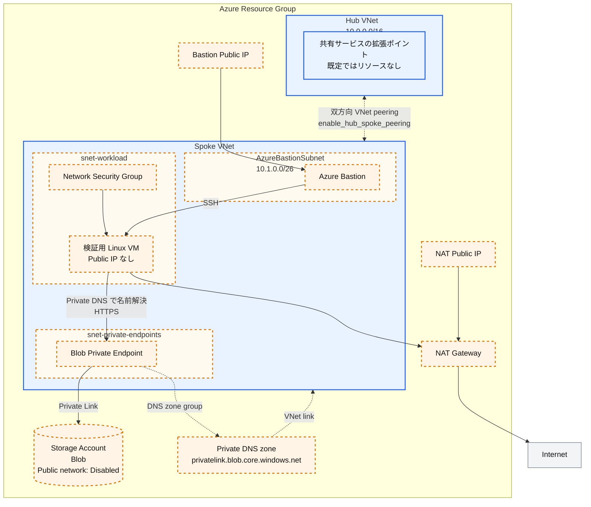

# Azure Hub-Spoke

このシナリオは Azure の
[ハブ スポーク ネットワーク トポロジ](https://learn.microsoft.com/azure/architecture/networking/architecture/hub-spoke)
を学ぶための小さな scaffolding です。既定では、リソース グループ、ハブ VNet、
スポーク VNet だけを作成します。ピアリングや、コストまたはデプロイ時間を増やす
リソースは opt-in です。

## 各要素の役割

- **ハブ VNet**: 将来、共有サービスとルーティングを配置する境界です。この
  scaffolding には Firewall、Gateway、DNS Resolver を含めません。
- **スポーク VNet**: ワークロードの境界です。任意の例を有効にした場合だけ、
  対応するサブネットを追加します。
- **双方向 VNet ピアリング**: ハブとスポークを接続します。Azure のピアリングは
  推移的ではないため、両方向が必要です。
- **Blob Private Endpoint の例**: PaaS のプライベート接続に必要な 3 要素である
  Private Endpoint、サービス固有の Private DNS zone、VNet link を示します。
- **検証用 VM、Bastion、NAT Gateway**: 任意のトラブルシューティング用リソースです。
  最小デプロイには含まれません。

## 構成

青色の要素は既定で作成します。オレンジ色の破線要素は、ラベルに記載した
feature flag を有効にした場合だけ作成します。



- `enable_private_endpoint_example`: Private Endpoint subnet、Storage Account、
  Private Endpoint、Private DNS zone と VNet link をまとめて追加します。
- `enable_test_vm`: Workload subnet、NSG、Public IP を持たない検証用 VM を追加します。
- `enable_bastion`: Bastion subnet、Bastion、専用 Public IP を追加し、VM への SSH
  経路を作ります。
- `enable_nat_gateway`: NAT Gateway と専用 Public IP を追加し、VM の outbound
  インターネット経路を作ります。

Private Endpoint を有効にしても、Storage Account 自体が VNet 内へ移動するわけでは
ありません。VNet 内の Private Endpoint が、Azure Private Link を介して Storage
Account へ接続します。

## 前提条件

- Azure サブスクリプション
- Azure CLI、または AzureRM provider が対応する別の認証方法

共通の [Azure 認証](../../../docs/tips/provider-authentication.ja.md)と
[Terraform ワークフロー](../../../docs/tips/terraform-workflow.ja.md)に従ってください。
リポジトリの Makefile では `SCENARIO=azure_hub_spoke` を指定します。

初期化に既存 Storage Account を要求しないように、既定ではローカル Terraform state
を使用します。共同作業を始める前に、
[Azure Blob Storage backend ガイド](../../../docs/tips/azure-blob-backend.ja.md)
に従って `azurerm` backend を追加してください。`-backend-config` は既存の backend
block を設定するものであり、ローカル backend を単独で Azure backend に変更する
ものではありません。

## 小さな手順でデプロイする

リポジトリ ルートからコマンドを実行します。

Terraform はコマンド間で `-var` の値を保持しません。後続の `apply` では、有効な
状態を維持するすべての feature flag を指定するか、commit しない独自の `.tfvars`
ファイルへ値を保存してください。

### 1. ハブとスポークの VNet だけを作る

```bash
make init SCENARIO=azure_hub_spoke
make plan SCENARIO=azure_hub_spoke
make deploy SCENARIO=azure_hub_spoke
```

最も短時間かつ低コストで開始できる構成です。ピアリングや、時間単位で課金される
Gateway リソースは作成しません。

### 2. ハブとスポークを接続する

```bash
terraform -chdir=infra/scenarios/azure_hub_spoke apply \
  -var='enable_hub_spoke_peering=true'
```

この flag は必ず両方向のピアリングを作成します。この scaffolding には Firewall や
Network Virtual Appliance がないため、`allow_forwarded_traffic` の既定値は `false`
です。ルーティング コンポーネントと route table を追加した後にだけ有効にします。

### 3. Blob Private Endpoint の例を追加する

```bash
terraform -chdir=infra/scenarios/azure_hub_spoke apply \
  -var='enable_hub_spoke_peering=true' \
  -var='enable_private_endpoint_example=true'
```

Storage Account のパブリック ネットワーク アクセスと共有キー認証は無効です。
この例は次の要素を作成します。

1. スポーク内の `snet-private-endpoints`
2. サブネット内の Blob Private Endpoint
3. `privatelink.blob.core.windows.net`
4. スポークへの Private DNS VNet link

プライベート名を解決する必要がある別の VNet にも、同じ Private DNS zone を
リンクしてください。大規模な環境では、スポークごとに zone を作るのではなく、
ハブで zone と DNS 解決を集中管理します。

### 4. 必要なときだけ検証用リソースを追加する

```bash
terraform -chdir=infra/scenarios/azure_hub_spoke apply \
  -var='enable_hub_spoke_peering=true' \
  -var='enable_private_endpoint_example=true' \
  -var='enable_test_vm=true'
```

VM にパブリック IP はありません。対話的な SSH 接続が必要な場合だけ Bastion を
追加します。

```bash
terraform -chdir=infra/scenarios/azure_hub_spoke apply \
  -var='enable_hub_spoke_peering=true' \
  -var='enable_private_endpoint_example=true' \
  -var='enable_test_vm=true' \
  -var='enable_bastion=true'
```

VM から一般的なインターネット向け通信が必要な場合だけ、
`-var='enable_nat_gateway=true'` を追加します。Bastion と NAT Gateway を使うには
`enable_test_vm=true` が必要です。

VM から、Blob の DNS が Private Endpoint のアドレスを返すことを確認します。

```bash
nslookup <storage-account-name>.blob.core.windows.net
curl -I https://<storage-account-name>.blob.core.windows.net/
```

HTTP の認証エラーが返る場合でも、DNS と TLS の接続確認には成功しています。
解決されたアドレスを `terraform output private_endpoint_blob_ip` と比較してください。

## Feature flag

| 変数 | 既定値 | 追加するリソース |
|---|---:|---|
| `enable_hub_spoke_peering` | `false` | Hub-to-spoke と spoke-to-hub のピアリング |
| `enable_private_endpoint_example` | `false` | Private Endpoint subnet、プライベート Blob Storage、Private Endpoint、Private DNS zone と link |
| `enable_test_vm` | `false` | Workload subnet、NSG、プライベート Linux VM |
| `enable_bastion` | `false` | AzureBastionSubnet、Bastion、Public IP。検証用 VM が必要 |
| `enable_nat_gateway` | `false` | Workload subnet の NAT Gateway と Public IP。検証用 VM が必要 |

この scaffolding では、特に Bastion と NAT Gateway がコストとデプロイ時間を増やします。
短時間のトラブルシューティング以外では無効にしてください。

## 主要なネットワーク入力

| 変数 | 既定値 | 用途 |
|---|---|---|
| `hub_vnet_address_space` | `["10.0.0.0/16"]` | ハブのアドレス空間 |
| `spoke_vnet_address_space` | `["10.1.0.0/16"]` | ハブと重複しないスポークのアドレス空間 |
| `private_endpoint_subnet_address_prefixes` | `["10.1.1.0/24"]` | Private Endpoint subnet |
| `workload_subnet_address_prefixes` | `["10.1.2.0/24"]` | 検証用 VM subnet |
| `bastion_subnet_address_prefixes` | `["10.1.0.0/26"]` | Azure Bastion subnet |
| `allow_forwarded_traffic` | `false` | 将来の router/firewall が転送する通信を許可 |

ハブ、スポーク、各サブネットの範囲は重複させないでください。既存ネットワークへ
導入する前に [variables.tf](./variables.tf) の全変数を確認してください。

## 別の PaaS Private Endpoint を追加する

[private_endpoint.tf](./private_endpoint.tf) が Blob の動作例です。
`azurerm_private_endpoint` だけを追加せず、次のパターンをまとめて適用します。

1. PaaS リソースを追加し、パブリック ネットワーク アクセスを無効にする。
2. 正しい `subresource_names` を使う Private Endpoint を追加する。
3. 対応する Private DNS zone と zone group を追加する。
4. プライベート名を解決するすべての VNet に zone をリンクする。
5. nullable output と、新しい feature flag の mock plan test を追加する。
6. 必要な Azure resource provider を [providers.tf](./providers.tf) に登録する。

| PaaS | Private Link subresource | 一般的な Private DNS zone |
|---|---|---|
| Blob Storage | `blob` | `privatelink.blob.core.windows.net` |
| Key Vault | `vault` | `privatelink.vaultcore.azure.net` |
| Azure SQL logical server | `sqlServer` | `privatelink.database.windows.net` |
| Cosmos DB for NoSQL | `Sql` | `privatelink.documents.azure.com` |
| Azure Container Registry | `registry` | `privatelink.azurecr.io` |

サービスによって複数の Endpoint または zone が必要です。実装前に、対象サービスの
最新ドキュメントで subresource と DNS zone を確認してください。

## 重要な制約

- ピアリングは推移的ではありません。スポークを追加しても、ハブ経由の
  spoke-to-spoke 通信は自動的に有効になりません。
- この scaffolding は集中 egress、パケット検査、ハイブリッド接続、カスタム DNS
  転送を提供しません。
- 要件が生じた場合だけ Azure Firewall または NVA、route table、
  VPN/ExpressRoute Gateway、Azure DNS Private Resolver を追加してください。
- 旧 `azure_spoke_network` からの変更は意図的な破壊的変更です。旧コードで先に
  destroy するか、state を手動で移行してください。

## リソースを削除する

apply 時と同じ feature flag を指定して destroy します。

```bash
terraform -chdir=infra/scenarios/azure_hub_spoke destroy \
  -var='enable_hub_spoke_peering=true' \
  -var='enable_private_endpoint_example=true'
```

## 参考資料

- [Azure のハブ スポーク ネットワーク トポロジ](https://learn.microsoft.com/azure/architecture/networking/architecture/hub-spoke)
- [Azure Private Endpoint の DNS 構成](https://learn.microsoft.com/azure/private-link/private-endpoint-dns)
- [Azure Private Link の可用性](https://learn.microsoft.com/azure/private-link/availability)
- [Azure Bastion のドキュメント](https://learn.microsoft.com/azure/bastion/)
