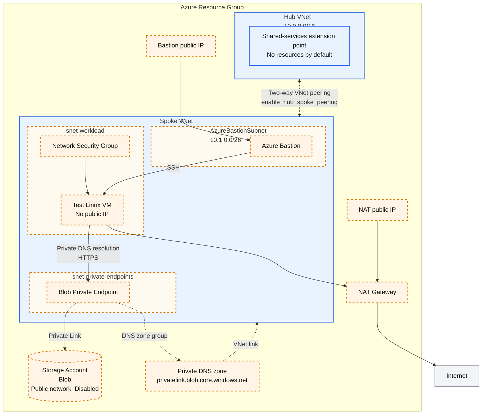

# Azure Hub-Spoke

This scenario is a small, learning-oriented scaffold for the Azure
[hub-spoke network topology](https://learn.microsoft.com/azure/architecture/networking/architecture/hub-spoke).
The default deployment creates only a resource group, one hub VNet, and one
spoke VNet. Peering and resources that add cost or deployment time are opt-in.

## What each part does

- **Hub VNet**: the future shared-services and routing boundary. This scaffold
  intentionally does not add a firewall, gateway, or DNS resolver.
- **Spoke VNet**: the workload boundary. Optional subnets are added only when
  their corresponding examples are enabled.
- **Two-way VNet peering**: connects the hub and spoke. Azure peering is not
  transitive, so both directions are required.
- **Blob Private Endpoint example**: shows the three required pieces for private
  PaaS access: a Private Endpoint, the service's Private DNS zone, and a VNet
  link.
- **Test VM, Bastion, and NAT Gateway**: optional troubleshooting resources.
  They are not part of the minimal deployment.

## Architecture

Blue elements are created by default. Orange elements with dashed borders are
created only when the feature flag shown in the diagram is enabled.



- `enable_private_endpoint_example` adds the Private Endpoint subnet, Storage
  account, Private Endpoint, Private DNS zone, and VNet link together.
- `enable_test_vm` adds the workload subnet, NSG, and a test VM without a
  public IP.
- `enable_bastion` adds the Bastion subnet, Bastion, and its public IP to
  provide an SSH path to the VM.
- `enable_nat_gateway` adds the NAT Gateway and its public IP to provide VM
  outbound internet connectivity.

Enabling the Private Endpoint does not move the Storage account into the VNet.
The Private Endpoint inside the VNet connects to the Storage account through
Azure Private Link.

## Prerequisites

- An Azure subscription
- Azure CLI authentication or another AzureRM provider authentication method

Follow the shared [Azure authentication](../../../docs/tips/provider-authentication.md)
and [Terraform workflow](../../../docs/tips/terraform-workflow.md) guidance.
Use `SCENARIO=azure_hub_spoke` with the repository Makefile.

This scenario uses local Terraform state by default so it can be initialized
without a pre-existing storage account. Before collaborating, add an `azurerm`
backend as described in the
[Azure Blob Storage backend guide](../../../docs/tips/azure-blob-backend.md).
`-backend-config` configures an existing backend block; it does not change a
local backend into an Azure backend by itself.

## Deploy in small steps

Run commands from the repository root.

Terraform does not persist `-var` values between commands. Include every
feature flag that must remain enabled in each later `apply`, or store the
values in your own uncommitted `.tfvars` file.

### 1. Create only the hub and spoke VNets

```bash
make init SCENARIO=azure_hub_spoke
make plan SCENARIO=azure_hub_spoke
make deploy SCENARIO=azure_hub_spoke
```

This is the fastest and lowest-cost starting point. It does not create peering
or any hourly billed gateway resource.

### 2. Connect the hub and spoke

```bash
terraform -chdir=infra/scenarios/azure_hub_spoke apply \
  -var='enable_hub_spoke_peering=true'
```

The flag always creates both peering directions. `allow_forwarded_traffic`
stays `false` because this scaffold has no firewall or network virtual
appliance. Enable it only after adding a routing component and route tables.

### 3. Add the Blob Private Endpoint example

```bash
terraform -chdir=infra/scenarios/azure_hub_spoke apply \
  -var='enable_hub_spoke_peering=true' \
  -var='enable_private_endpoint_example=true'
```

The Storage account has public network access and shared-key authentication
disabled. The example creates:

1. `snet-private-endpoints` in the spoke.
2. A Blob Private Endpoint in that subnet.
3. `privatelink.blob.core.windows.net`.
4. A Private DNS VNet link to the spoke.

Link the same Private DNS zone to any additional VNet whose clients must
resolve the private name. In a larger environment, centralize the zones and
DNS resolution in the hub instead of creating one zone per spoke.

### 4. Add troubleshooting resources only when needed

```bash
terraform -chdir=infra/scenarios/azure_hub_spoke apply \
  -var='enable_hub_spoke_peering=true' \
  -var='enable_private_endpoint_example=true' \
  -var='enable_test_vm=true'
```

The VM has no public IP. Add Bastion only when interactive SSH access is
required:

```bash
terraform -chdir=infra/scenarios/azure_hub_spoke apply \
  -var='enable_hub_spoke_peering=true' \
  -var='enable_private_endpoint_example=true' \
  -var='enable_test_vm=true' \
  -var='enable_bastion=true'
```

Add `-var='enable_nat_gateway=true'` only when the VM needs general outbound
internet access. Bastion and NAT Gateway require `enable_test_vm=true`.

From the VM, verify that Blob DNS returns the Private Endpoint address:

```bash
nslookup <storage-account-name>.blob.core.windows.net
curl -I https://<storage-account-name>.blob.core.windows.net/
```

An HTTP authentication error still confirms DNS and TLS connectivity. Compare
the resolved address with `terraform output private_endpoint_blob_ip`.

## Feature flags

| Variable | Default | Adds |
|---|---:|---|
| `enable_hub_spoke_peering` | `false` | Hub-to-spoke and spoke-to-hub peerings |
| `enable_private_endpoint_example` | `false` | Private Endpoint subnet, private Blob Storage, Private Endpoint, Private DNS zone and link |
| `enable_test_vm` | `false` | Workload subnet, NSG, private Linux VM |
| `enable_bastion` | `false` | AzureBastionSubnet, Bastion, public IP; requires the test VM |
| `enable_nat_gateway` | `false` | NAT Gateway and public IP on the workload subnet; requires the test VM |

Bastion and NAT Gateway usually have the greatest cost and deployment-time
impact in this scaffold. Keep them disabled outside short troubleshooting
sessions.

## Core network inputs

| Variable | Default | Purpose |
|---|---|---|
| `hub_vnet_address_space` | `["10.0.0.0/16"]` | Hub address space |
| `spoke_vnet_address_space` | `["10.1.0.0/16"]` | Non-overlapping spoke address space |
| `private_endpoint_subnet_address_prefixes` | `["10.1.1.0/24"]` | Private Endpoint subnet |
| `workload_subnet_address_prefixes` | `["10.1.2.0/24"]` | Test VM subnet |
| `bastion_subnet_address_prefixes` | `["10.1.0.0/26"]` | Azure Bastion subnet |
| `allow_forwarded_traffic` | `false` | Peering support for traffic forwarded by a future router/firewall |

The hub, spoke, and subnet ranges must not overlap. Review all variables in
[variables.tf](./variables.tf) before using the scaffold in an existing
network.

## Add another PaaS Private Endpoint

[private_endpoint.tf](./private_endpoint.tf) is the concrete Blob example.
Copy its pattern rather than only adding an `azurerm_private_endpoint`:

1. Add the PaaS resource with public network access disabled.
2. Add its Private Endpoint and correct `subresource_names`.
3. Add the matching Private DNS zone and zone group.
4. Link the zone to every VNet that must resolve the private name.
5. Add nullable outputs and a mock plan test for the new feature flag.
6. Register any additional Azure resource provider in
   [providers.tf](./providers.tf).

| PaaS | Private Link subresource | Common Private DNS zone |
|---|---|---|
| Blob Storage | `blob` | `privatelink.blob.core.windows.net` |
| Key Vault | `vault` | `privatelink.vaultcore.azure.net` |
| Azure SQL logical server | `sqlServer` | `privatelink.database.windows.net` |
| Cosmos DB for NoSQL | `Sql` | `privatelink.documents.azure.com` |
| Azure Container Registry | `registry` | `privatelink.azurecr.io` |

Confirm the current subresource and DNS zone in the service documentation
before implementation; some services require multiple endpoints or zones.

## Important limits

- Peering is non-transitive. Adding another spoke does not make
  spoke-to-spoke traffic work through the hub.
- This scaffold does not provide centralized egress, packet inspection, hybrid
  connectivity, or custom DNS forwarding.
- Add Azure Firewall or an NVA, route tables, VPN/ExpressRoute Gateway, and
  Azure DNS Private Resolver only when those requirements exist.
- Changing from the former `azure_spoke_network` scenario is intentionally
  breaking. Destroy resources with the old code first or migrate state
  manually.

## Remove the resources

Use the same feature flags that were used for apply, then destroy:

```bash
terraform -chdir=infra/scenarios/azure_hub_spoke destroy \
  -var='enable_hub_spoke_peering=true' \
  -var='enable_private_endpoint_example=true'
```

## References

- [Hub-spoke network topology in Azure](https://learn.microsoft.com/azure/architecture/networking/architecture/hub-spoke)
- [Azure Private Endpoint DNS configuration](https://learn.microsoft.com/azure/private-link/private-endpoint-dns)
- [Azure Private Link availability](https://learn.microsoft.com/azure/private-link/availability)
- [Azure Bastion documentation](https://learn.microsoft.com/azure/bastion/)
