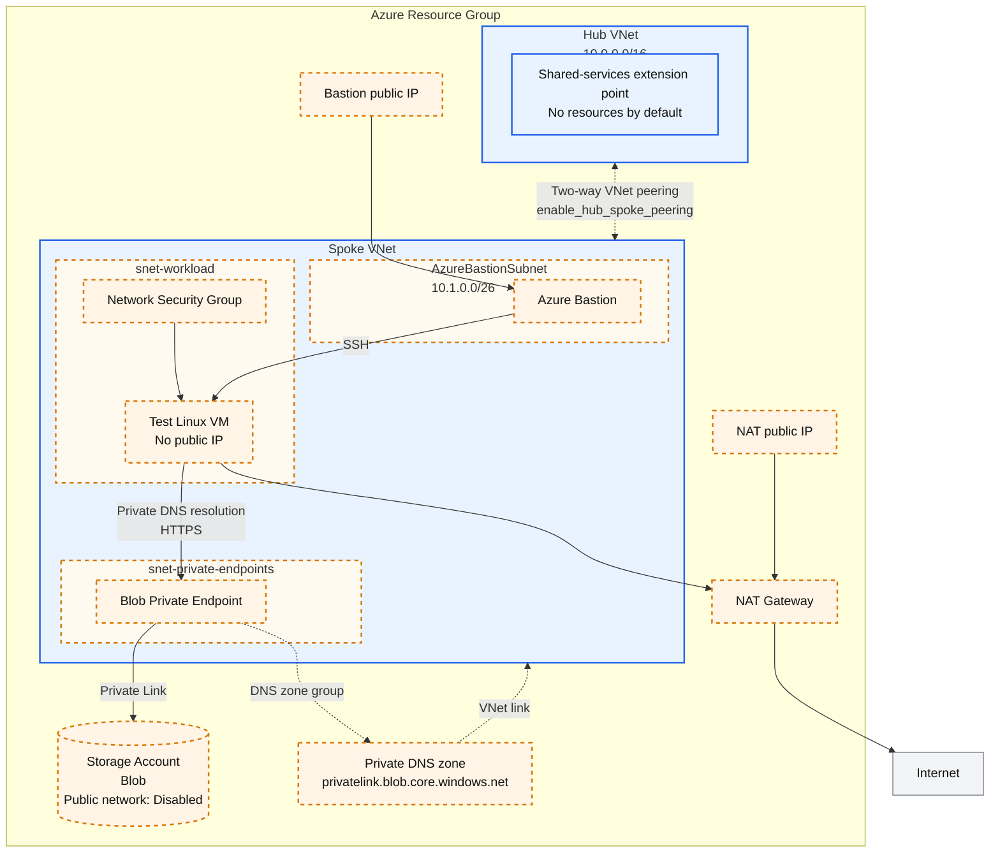

# Azure Hub-Spoke

This scenario is a small, learning-oriented scaffold for the Azure
[hub-spoke network topology](https://learn.microsoft.com/azure/architecture/networking/architecture/hub-spoke).
The default deployment creates only a resource group, one hub VNet, and one
spoke VNet. Peering and resources that add cost or deployment time are opt-in.

## What each part does

- **Hub VNet**: the future shared-services and routing boundary. This scaffold
  intentionally does not add a firewall, gateway, or DNS resolver.
- **Spoke VNet**: the workload boundary. Optional subnets are added only when
  their corresponding examples are enabled.
- **Two-way VNet peering**: connects the hub and spoke. Azure peering is not
  transitive, so both directions are required.
- **Blob Private Endpoint example**: shows the three required pieces for private
  PaaS access: a Private Endpoint, the service's Private DNS zone, and a VNet
  link.
- **Test VM, Bastion, and NAT Gateway**: optional troubleshooting resources.
  They are not part of the minimal deployment.

## Architecture

Blue elements are created by default. Orange elements with dashed borders are
created only when the feature flag shown in the diagram is enabled.



- `enable_private_endpoint_example` adds the Private Endpoint subnet, Storage
  account, Private Endpoint, Private DNS zone, and VNet link together.
- `enable_test_vm` adds the workload subnet, NSG, and a test VM without a
  public IP.
- `enable_bastion` adds the Bastion subnet, Bastion, and its public IP to
  provide an SSH path to the VM.
- `enable_nat_gateway` adds the NAT Gateway and its public IP to provide VM
  outbound internet connectivity.

Enabling the Private Endpoint does not move the Storage account into the VNet.
The Private Endpoint inside the VNet connects to the Storage account through
Azure Private Link.

## Prerequisites

- An Azure subscription
- Azure CLI authentication or another AzureRM provider authentication method

Follow the shared [Azure authentication](../../../docs/tips/provider-authentication.md)
and [Terraform workflow](../../../docs/tips/terraform-workflow.md) guidance.
Use `SCENARIO=azure_hub_spoke` with the repository Makefile.

This scenario uses local Terraform state by default so it can be initialized
without a pre-existing storage account. Before collaborating, add an `azurerm`
backend as described in the
[Azure Blob Storage backend guide](../../../docs/tips/azure-blob-backend.md).
`-backend-config` configures an existing backend block; it does not change a
local backend into an Azure backend by itself.

## Deploy in small steps

Run commands from the repository root.

Terraform does not persist `-var` values between commands. Include every
feature flag that must remain enabled in each later `apply`, or store the
values in your own uncommitted `.tfvars` file.

### 1. Create only the hub and spoke VNets

```bash
make init SCENARIO=azure_hub_spoke
make plan SCENARIO=azure_hub_spoke
make deploy SCENARIO=azure_hub_spoke
```

This is the fastest and lowest-cost starting point. It does not create peering
or any hourly billed gateway resource.

### 2. Connect the hub and spoke

```bash
terraform -chdir=infra/scenarios/azure_hub_spoke apply \
  -var='enable_hub_spoke_peering=true'
```

The flag always creates both peering directions. `allow_forwarded_traffic`
stays `false` because this scaffold has no firewall or network virtual
appliance. Enable it only after adding a routing component and route tables.

### 3. Add the Blob Private Endpoint example

```bash
terraform -chdir=infra/scenarios/azure_hub_spoke apply \
  -var='enable_hub_spoke_peering=true' \
  -var='enable_private_endpoint_example=true'
```

The Storage account has public network access and shared-key authentication
disabled. The example creates:

1. `snet-private-endpoints` in the spoke.
2. A Blob Private Endpoint in that subnet.
3. `privatelink.blob.core.windows.net`.
4. A Private DNS VNet link to the spoke.

Link the same Private DNS zone to any additional VNet whose clients must
resolve the private name. In a larger environment, centralize the zones and
DNS resolution in the hub instead of creating one zone per spoke.

### 4. Add troubleshooting resources only when needed

```bash
terraform -chdir=infra/scenarios/azure_hub_spoke apply \
  -var='enable_hub_spoke_peering=true' \
  -var='enable_private_endpoint_example=true' \
  -var='enable_test_vm=true'
```

The VM has no public IP. Add Bastion only when interactive SSH access is
required:

```bash
terraform -chdir=infra/scenarios/azure_hub_spoke apply \
  -var='enable_hub_spoke_peering=true' \
  -var='enable_private_endpoint_example=true' \
  -var='enable_test_vm=true' \
  -var='enable_bastion=true'
```

Add `-var='enable_nat_gateway=true'` only when the VM needs general outbound
internet access. Bastion and NAT Gateway require `enable_test_vm=true`.

From the VM, verify that Blob DNS returns the Private Endpoint address:

```bash
nslookup <storage-account-name>.blob.core.windows.net
curl -I https://<storage-account-name>.blob.core.windows.net/
```

An HTTP authentication error still confirms DNS and TLS connectivity. Compare
the resolved address with `terraform output private_endpoint_blob_ip`.

## Validate a deployment with all features enabled

### 1. Deploy all features

Run in Bash from the repository root. Locally, use Terraform and an authenticated
Azure CLI; on the VM, use standard `curl`, `getent`, and `ip` commands. No `jq`,
additional network testing packages, or Azure CLI installation on the VM is
required. If a VM tool is missing, resolve that error before continuing.

```bash
export ARM_SUBSCRIPTION_ID="$(az account show --query id -o tsv)"
make init SCENARIO=azure_hub_spoke
terraform -chdir=infra/scenarios/azure_hub_spoke apply \
  -var='enable_hub_spoke_peering=true' \
  -var='enable_private_endpoint_example=true' \
  -var='enable_test_vm=true' \
  -var='enable_bastion=true' \
  -var='enable_nat_gateway=true'
```

Keep `allow_forwarded_traffic=false`. "All features" means the five `enable_*`
flags, not enabling forwarded traffic without a firewall or router. Bastion
and NAT Gateway incur charges throughout validation.

Run subsequent **local** commands in the same Bash session. Read actual values
from state rather than hard-coding the default addresses.

```bash
SCENARIO_DIR=infra/scenarios/azure_hub_spoke
RG="$(terraform -chdir="$SCENARIO_DIR" output -raw resource_group_name)"
HUB="$(terraform -chdir="$SCENARIO_DIR" output -raw hub_vnet_name)"
SPOKE="$(terraform -chdir="$SCENARIO_DIR" output -raw spoke_vnet_name)"
VM="$(terraform -chdir="$SCENARIO_DIR" output -raw vm_name)"
VM_IP="$(terraform -chdir="$SCENARIO_DIR" output -raw vm_private_ip)"
BASTION="$(terraform -chdir="$SCENARIO_DIR" output -raw bastion_name)"
STORAGE="$(terraform -chdir="$SCENARIO_DIR" output -raw storage_account_name)"
PE_ID="$(terraform -chdir="$SCENARIO_DIR" output -raw private_endpoint_blob_id)"
PE_IP="$(terraform -chdir="$SCENARIO_DIR" output -raw private_endpoint_blob_ip)"
NAT_IP="$(terraform -chdir="$SCENARIO_DIR" output -raw nat_gateway_public_ip)"
WORKLOAD_SUBNET_ID="$(terraform -chdir="$SCENARIO_DIR" output -raw workload_subnet_id)"
NIC_ID="$(az vm show -g "$RG" -n "$VM" --query 'networkProfile.networkInterfaces[0].id' -o tsv)"
NIC="${NIC_ID##*/}"
BLOB_HOST="$STORAGE.blob.core.windows.net"
printf 'VM=%s\nBlob=%s\nPE=%s\nNAT=%s\n' "$VM_IP" "$BLOB_HOST" "$PE_IP" "$NAT_IP"
```

Stop if an output command fails; check the apply with all flags and the target
state. Do not share `terraform output -json`: it includes the sensitive VM SSH
private key.

### 2. Paths and acceptance criteria

| Check | Traffic path | Acceptance criteria / scope |
|---|---|---|
| Bastion SSH | Browser → Bastion public IP:443 → VM:22 inside Spoke | Log in to the VM through a Portal SSH session |
| Blob DNS / HTTPS | Spoke VM → Azure DNS → Private DNS zone; VM → PE:443 inside Spoke → Storage | DNS and the `curl` connection IP match `PE_IP`, with an HTTP response and TLS verification |
| Internet egress | Spoke VM → workload subnet NAT Gateway → internet:443 | Source IP observed by an external service matches `NAT_IP` |
| Hub-Spoke | Spoke VM NIC → VNet peering → Hub address space | Both peerings are `Connected` / `FullyInSync`, and the effective Hub route uses `VNetPeering` |
| Public access restrictions | Internet → Storage public endpoint / VM | Storage public access is `Disabled`, and the VM NIC has no public IP |

**Successful Blob and NAT checks do not prove transit through Hub.** Bastion,
VM, PE, and the subnet attached to NAT are all in Spoke. No subnet or test
destination is created in Hub, so this deployment alone cannot test TCP
connectivity to Hub or reverse-direction traffic. Record that separately from
the additional checks below.

### 3. Check resource health and connections (local)

```bash
az vm get-instance-view -g "$RG" -n "$VM" \
  --query '{vm:instanceView.statuses,agent:instanceView.vmAgent.statuses}' -o json
az network bastion show -g "$RG" -n "$BASTION" \
  --query '{state:provisioningState,sku:sku.name}' -o json
az network nic show --ids "$NIC_ID" \
  --query 'ipConfigurations[].{private:privateIPAddress,public:publicIPAddress.id}' -o json
az network private-endpoint show --ids "$PE_ID" \
  --query '{state:provisioningState,connections:privateLinkServiceConnections[].privateLinkServiceConnectionState.status}' -o json
az storage account show -g "$RG" -n "$STORAGE" \
  --query '{publicNetworkAccess:publicNetworkAccess,sharedKey:allowSharedKeyAccess}' -o json
az network vnet subnet show --ids "$WORKLOAD_SUBNET_ID" \
  --query '{nat:natGateway.id,nsg:networkSecurityGroup.id,routeTable:routeTable.id}' -o json
az network private-dns link vnet list -g "$RG" \
  -z privatelink.blob.core.windows.net \
  --query '[].{vnet:virtualNetwork.id,state:virtualNetworkLinkState}' -o json
az network private-dns record-set a show -g "$RG" \
  -z privatelink.blob.core.windows.net -n "$STORAGE" \
  --query 'aRecords[].ipv4Address' -o tsv
```

Expect VM `PowerState/running`, a Ready VM Agent, Bastion `Succeeded` / `Basic`
(or your explicitly selected SKU), NIC `public=null`, PE
`Succeeded` / `Approved`, and Storage `Disabled` / `false`. The workload subnet
must have NAT and NSG associations and `routeTable=null`. The DNS link to
Spoke must be `Completed`, and the A record must match `PE_IP`. There is no DNS
link to Hub by default.

### 4. Check DNS, Private Link, and NAT from the VM

For validation without interactive SSH, run the following **local** command.
Azure CLI Run Command executes the script inside the VM. It requires the VM
Agent, outbound HTTPS to Azure, and
`Microsoft.Compute/virtualMachines/runCommands/write` permission. Run Command
does not use Bastion; validate Bastion separately in the next step.

```bash
az vm run-command invoke -g "$RG" -n "$VM" \
  --command-id RunShellScript \
  --scripts "set -eu
command -v curl
command -v getent
command -v ip
ip -4 address show
ip -4 route show
echo '--- Blob DNS: expected $PE_IP ---'
getent ahostsv4 '$BLOB_HOST'
echo '--- Blob HTTPS: remote_ip must be $PE_IP ---'
curl --noproxy '*' -sS --connect-timeout 5 --max-time 20 \
  -D - -o /dev/null \
  -w '\nhttp=%{http_code} remote_ip=%{remote_ip}\n' \
  'https://$BLOB_HOST/?comp=list'
echo '--- NAT egress: expected $NAT_IP ---'
EGRESS_IP=\$(curl --noproxy '*' -fsS --connect-timeout 5 --max-time 20 https://api.ipify.org)
printf 'egress_ip=%s\n' \"\$EGRESS_IP\"
test \"\$EGRESS_IP\" = '$NAT_IP'
echo NAT_IP_MATCH" \
  --query 'value[].{code:code,message:message}' -o json
```

- If the IPv4 address from `getent` and `remote_ip` both match `PE_IP`, DNS
  and TCP:443 / TLS connectivity through Private Link work. An unauthenticated
  Blob API request typically returns an error such as `400` / `403`. Do not
  infer private connectivity from HTTP status alone; also check the connection IP.
- Do not disable certificate verification with `-k`. The Blob request
  intentionally omits `-f` to display HTTP errors. `http=000`, DNS errors,
  timeouts, and TLS errors are failures.
- This scenario does not assign a Blob data role to the VM identity.
  `403` does not mean Blob reads or writes succeed. Data operations require
  a separate Storage Blob Data Reader / Contributor role and Entra ID
  authentication.
- `api.ipify.org` is an external service that returns the source IP. Replace
  it with an equivalent HTTPS service if organizational policy prevents its
  use. Confirm that `egress_ip` equals `NAT_IP` and `NAT_IP_MATCH` is printed.
  This is not the Bastion public IP.
- Do not accept the Run Command operation's success status alone. Inspect
  stderr, HTTP results, matching IPs, and the final marker. Output is limited
  to the last 4 KB; if truncated, run DNS / HTTPS / NAT checks separately.

The VM's `ip route` shows the Azure virtual network gateway, not the complete
PE, peering, or NAT paths. Do not use only `ping` / `traceroute` to judge PaaS
reachability or Azure virtual hops.

### 5. Check Bastion access (local → Portal → VM)

The default Bastion SKU is **Basic**. Use the Portal connection, which needs
no additional software. `az network bastion ssh/tunnel` requires Standard or
higher and native client configuration; it is not available in this scenario's
default configuration.

```bash
VM_USER="$(terraform -chdir="$SCENARIO_DIR" output -raw vm_admin_username)"
KEY_FILE="$(mktemp "${TMPDIR:-/tmp}/azure-hub-spoke-key.XXXXXX")"
chmod 600 "$KEY_FILE"
terraform -chdir="$SCENARIO_DIR" output -raw vm_ssh_private_key > "$KEY_FILE"
printf 'SSH user: %s\nPrivate key file: %s\n' "$VM_USER" "$KEY_FILE"
```

1. In Azure Portal, open the target VM → **Connect → Bastion**.
2. Select **SSH Private Key from Local File**, using `VM_USER` and the file at
   `KEY_FILE`. Check the required Reader permissions on the VM, NIC, and
   Bastion as well.
3. After connecting, run `hostname; ip -4 address show` **inside the VM**.
   Confirm the target VM and `VM_IP`. You can also repeat the `getent` / `curl`
   checks from step 4. Local variables are not inherited by the VM; use the
   actual values printed earlier.
4. Disconnect SSH, then run `rm -f "$KEY_FILE"; unset KEY_FILE` **locally**.
   Never paste the private key into a README, logs, chat, or Git.

The workload NSG's default `AllowVnetInBound` rule permits Bastion → VM:22.
The VM needs neither a public IP nor an internet-facing SSH allow rule.

### 6. Check Hub-Spoke peerings, effective routes, and NSGs (local)

```bash
az network vnet peering list -g "$RG" --vnet-name "$HUB" \
  --query '[].{name:name,state:peeringState,sync:peeringSyncLevel,access:allowVirtualNetworkAccess,forwarded:allowForwardedTraffic,remote:remoteVirtualNetwork.id}' -o json
az network vnet peering list -g "$RG" --vnet-name "$SPOKE" \
  --query '[].{name:name,state:peeringState,sync:peeringSyncLevel,access:allowVirtualNetworkAccess,forwarded:allowForwardedTraffic,remote:remoteVirtualNetwork.id}' -o json
az network nic show-effective-route-table -g "$RG" -n "$NIC" -o json
az network nic list-effective-nsg -g "$RG" -n "$NIC" -o json
```

For both directions, expect `Connected`, `FullyInSync`, `access=true`,
`forwarded=false`, and the other VNet as the remote. Check while the VM is
running. Expected effective routes are below (addresses assume defaults).

| Destination | Active next hop | Meaning |
|---|---|---|
| Hub `10.0.0.0/16` | `VNetPeering` | A peering route toward Hub exists |
| Spoke `10.1.0.0/16` | `VnetLocal` | Same-VNet route |
| PE IP `/32` | `InterfaceEndpoint` | Private Endpoint route |
| `0.0.0.0/0` | `Internet` | Attaching NAT does not rename the next hop to NAT Gateway |

Verify actual NAT use with the source IP in step 4. For NSGs, inspect default
`AllowVnetInBound` / `AllowVnetOutBound` and `AllowInternetOutBound` rules,
and any higher-priority deny rules. Peering includes the Hub range in the
`VirtualNetwork` service tag, but routes and NSG configuration alone do not
prove packet delivery.

#### Optional: Inspect the next hop toward Hub with Network Watcher

Run if Network Watcher is enabled in the VM's region. This scenario does not
create Network Watcher. Missing permissions or regional setup mean the
diagnostic was not performed, not that connectivity failed.

```bash
HUB_PROBE_IP=10.0.0.4
az network watcher show-next-hop -g "$RG" --vm "$VM" --nic "$NIC" \
  --source-ip "$VM_IP" --dest-ip "$HUB_PROBE_IP" -o json
```

Change `HUB_PROBE_IP` to an address in your actual Hub range. Expect
`nextHopType=VNetPeering`. Route diagnostics work even without a VM at this
address; that does not mean TCP connectivity succeeds. If enabling Network
Watcher separately, follow the
[official procedure](https://learn.microsoft.com/azure/network-watcher/diagnose-vm-network-routing-problem-cli)
and account for resources outside this Terraform configuration.

#### Optional: Test actual traffic after adding a Hub VM

To test the Hub → Spoke data plane, separately provision a non-overlapping Hub
subnet and a VM / NIC / NSG in it. These steps do not create them automatically.
Run the following inside the Hub VM, using the actual values from step 1.

```bash
BLOB_HOST='<storage-account-name>.blob.core.windows.net'
PE_IP='<private-endpoint-blob-ip>'
curl --noproxy '*' -sS --connect-timeout 5 --max-time 20 \
  --resolve "$BLOB_HOST:443:$PE_IP" -D - -o /dev/null \
  -w '\nhttp=%{http_code} remote_ip=%{remote_ip}\n' \
  "https://$BLOB_HOST/?comp=list"
```

An HTTP response with `remote_ip=PE_IP` validates Hub VM → peering → Spoke PE →
Storage and the response path. `--resolve` pins only name resolution and
preserves TLS hostname verification. **This does not validate Hub DNS.** For
normal FQDN access from Hub, also link the Private DNS zone to Hub or configure
DNS Resolver / forwarding, then repeat `getent` and `curl` without `--resolve`.
Peering does not automatically share DNS zone links.

To also test a new Spoke → Hub TCP connection, connect from the Spoke VM to a
running service on the Hub VM. If the Ubuntu VM runs an SSH service, execute
the following in **Bash inside the Spoke VM** to check TCP:22 and the SSH banner
without additional packages or the Hub VM's private key. `timeout` uses the VM's
standard coreutils.

```bash
HUB_VM_IP='<hub-test-vm-private-ip>'
timeout 5 bash -eu -c \
  'exec 3<>"/dev/tcp/$1/22"; head -n 1 <&3' _ "$HUB_VM_IP"
```

Pass if `SSH-2.0-...` appears within five seconds. Exit code `124` is a timeout;
connection refused means SSH is not running or the connection is rejected.
Neither is a pass. This does not validate SSH authentication. Run the same
command inside the Hub VM, replacing the argument with Spoke's `VM_IP`, to test
a new connection in the reverse direction.
Record the destination port, both NSGs, OS firewalls, effective routes, and
result. A timeout to an unused Hub IP is not
a valid test. With no second Spoke, UDR, firewall, or VPN, transitive
spoke-to-spoke traffic and centralized Hub egress remain out of scope.

### 7. Troubleshoot and record results

| Symptom | Check |
|---|---|
| Blob resolves to a public IP | Execute inside the VM; check Spoke DNS zone link / A record and custom DNS forwarding |
| DNS returns PE IP, but HTTPS times out | PE Approved status, NIC effective routes / NSGs, OS firewall, and proxy settings |
| Blob returns `403` | Separate network success from authorization failure using the connection IP; data operations need a Blob data role |
| NAT IP mismatch / no internet | Workload subnet NAT association, NAT public IP, outbound NSGs, UDRs, and external service restrictions |
| Bastion SSH fails | Bastion provisioningState, user / private key, NSG:22, VM sshd / OS firewall, and Portal permissions |
| Missing Hub route / unsynchronized peering | Both peerings, remote VNet IDs, non-overlapping ranges, and VM running state |
| Run Command does not respond | VM Agent, outbound:443 to Azure, and execution permission; check directly through Bastion |

Record time, execution location, source / destination IPs and ports, DNS
results, HTTP status / connection IP, NAT source IP, peerings, and routes.
Distinguish "passed", "failed", and "not performed (requires an additional Hub
VM, for example)".

After validation, destroy with every feature flag. If using your own `.tfvars`,
also pass the same inputs used for apply. Remove separately added Hub VMs /
DNS links through the configuration managing those resources.

```bash
terraform -chdir="$SCENARIO_DIR" destroy \
  -var='enable_hub_spoke_peering=true' \
  -var='enable_private_endpoint_example=true' \
  -var='enable_test_vm=true' \
  -var='enable_bastion=true' \
  -var='enable_nat_gateway=true'
```

## Feature flags

| Variable | Default | Adds |
|---|---:|---|
| `enable_hub_spoke_peering` | `false` | Hub-to-spoke and spoke-to-hub peerings |
| `enable_private_endpoint_example` | `false` | Private Endpoint subnet, private Blob Storage, Private Endpoint, Private DNS zone and link |
| `enable_test_vm` | `false` | Workload subnet, NSG, private Linux VM |
| `enable_bastion` | `false` | AzureBastionSubnet, Bastion, public IP; requires the test VM |
| `enable_nat_gateway` | `false` | NAT Gateway and public IP on the workload subnet; requires the test VM |

Bastion and NAT Gateway usually have the greatest cost and deployment-time
impact in this scaffold. Keep them disabled outside short troubleshooting
sessions.

## Core network inputs

| Variable | Default | Purpose |
|---|---|---|
| `hub_vnet_address_space` | `["10.0.0.0/16"]` | Hub address space |
| `spoke_vnet_address_space` | `["10.1.0.0/16"]` | Non-overlapping spoke address space |
| `private_endpoint_subnet_address_prefixes` | `["10.1.1.0/24"]` | Private Endpoint subnet |
| `workload_subnet_address_prefixes` | `["10.1.2.0/24"]` | Test VM subnet |
| `bastion_subnet_address_prefixes` | `["10.1.0.0/26"]` | Azure Bastion subnet |
| `allow_forwarded_traffic` | `false` | Peering support for traffic forwarded by a future router/firewall |

The hub, spoke, and subnet ranges must not overlap. Review all variables in
[variables.tf](./variables.tf) before using the scaffold in an existing
network.

## Add another PaaS Private Endpoint

[private_endpoint.tf](./private_endpoint.tf) is the concrete Blob example.
Copy its pattern rather than only adding an `azurerm_private_endpoint`:

1. Add the PaaS resource with public network access disabled.
2. Add its Private Endpoint and correct `subresource_names`.
3. Add the matching Private DNS zone and zone group.
4. Link the zone to every VNet that must resolve the private name.
5. Add nullable outputs and a mock plan test for the new feature flag.
6. Register any additional Azure resource provider in
   [providers.tf](./providers.tf).

| PaaS | Private Link subresource | Common Private DNS zone |
|---|---|---|
| Blob Storage | `blob` | `privatelink.blob.core.windows.net` |
| Key Vault | `vault` | `privatelink.vaultcore.azure.net` |
| Azure SQL logical server | `sqlServer` | `privatelink.database.windows.net` |
| Cosmos DB for NoSQL | `Sql` | `privatelink.documents.azure.com` |
| Azure Container Registry | `registry` | `privatelink.azurecr.io` |

Confirm the current subresource and DNS zone in the service documentation
before implementation; some services require multiple endpoints or zones.

## Important limits

- Peering is non-transitive. Adding another spoke does not make
  spoke-to-spoke traffic work through the hub.
- This scaffold does not provide centralized egress, packet inspection, hybrid
  connectivity, or custom DNS forwarding.
- Add Azure Firewall or an NVA, route tables, VPN/ExpressRoute Gateway, and
  Azure DNS Private Resolver only when those requirements exist.
- Changing from the former `azure_spoke_network` scenario is intentionally
  breaking. Destroy resources with the old code first or migrate state
  manually.

## Remove the resources

Use the same feature flags that were used for apply, then destroy:

```bash
terraform -chdir=infra/scenarios/azure_hub_spoke destroy \
  -var='enable_hub_spoke_peering=true' \
  -var='enable_private_endpoint_example=true'
```

## References

- [Hub-spoke network topology in Azure](https://learn.microsoft.com/azure/architecture/networking/architecture/hub-spoke)
- [Azure Private Endpoint DNS configuration](https://learn.microsoft.com/azure/private-link/private-endpoint-dns)
- [Azure Private Link availability](https://learn.microsoft.com/azure/private-link/availability)
- [Azure Bastion documentation](https://learn.microsoft.com/azure/bastion/)
