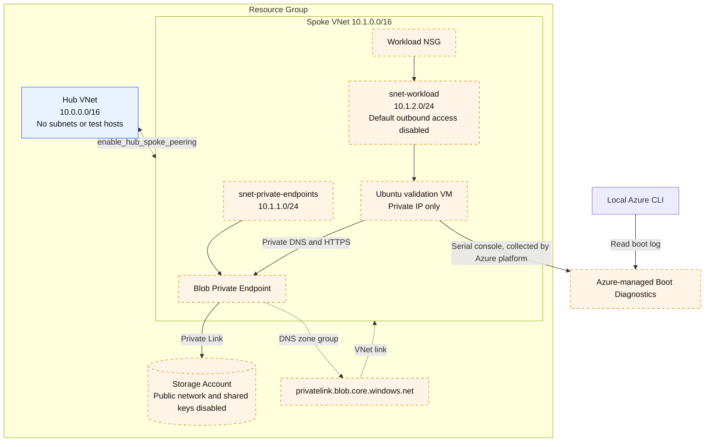

# Azure Hub-Spoke

Build a minimal resource group, Hub VNet, and Spoke VNet, then add peering,
Blob Private Endpoint, and a private validation VM in small steps. This
scenario creates no Public IP, Bastion, NAT Gateway, firewall, or VPN gateway.
It does not require changes to organizational policies.

The VM runs `getent` and `curl` automatically on every boot. It writes the
results to its serial console, which you read through Managed Boot Diagnostics.
The checks do not need SSH, VM Run Command, external IP-check services, package
downloads, or general VM internet egress.

## Architecture

Blue elements exist by default; orange elements are opt-in.



- **Hub** reserves space for shared services. There is no router or test host.
- **Peering** creates both directions with forwarded traffic and gateway transit
  disabled. Peering does not automatically link private DNS zones.
- **Private Endpoint** connects the Spoke to Blob Storage; Storage itself is
  not placed inside the VNet. Its Private DNS zone is linked only to Spoke.
- **Validation VM** requires the Private Endpoint example. Cloud-init installs
  a systemd service that checks private Blob connectivity on each boot.
- **Boot Diagnostics** uses Azure-managed storage, separate from the private
  Blob example. The Azure platform collects the serial output; the VM does not
  upload it through an internet connection.

## Prerequisites

Check the [shared prerequisites](../../../docs/tips/terraform-workflow.md#prerequisites)
first. This scenario also requires the following:

- Azure subscription and authenticated Azure CLI.
- Terraform and Bash on the local workstation.
- Permission to create the scenario resources and read VM boot diagnostics,
  including `Microsoft.Compute/virtualMachines/retrieveBootDiagnosticsData/action`.
- Local access to Azure Resource Manager and the diagnostics storage endpoint.
- An available Ubuntu-compatible VM SKU in the selected region.

Follow the shared [Azure authentication](../../../docs/tips/provider-authentication.md)
and [Terraform workflow](../../../docs/tips/terraform-workflow.md) guides.
The default backend is local; use the
[Azure Blob backend guide](../../../docs/tips/azure-blob-backend.md) for shared state.
State contains the VM module's SSH private key even though this scenario does
not expose it as an output. Do not share state, diagnostics SAS URLs, or secrets.

## Deploy and verify step by step

Run all **local** commands in the same Bash session from the repository root.
Stop on command errors rather than continuing with empty variables.
Terraform does not retain command-line `-var` values: specify all enabled flags
and any custom values on every subsequent plan/apply, or use an uncommitted
`.tfvars` file.

### 1. Create the two VNet boundaries

```bash
export ARM_SUBSCRIPTION_ID="$(az account show --query id -o tsv)"
SCENARIO_DIR=infra/scenarios/azure_hub_spoke
make init SCENARIO=azure_hub_spoke
make plan SCENARIO=azure_hub_spoke
terraform -chdir="$SCENARIO_DIR" apply

RG="$(terraform -chdir="$SCENARIO_DIR" output -raw resource_group_name)"
HUB="$(terraform -chdir="$SCENARIO_DIR" output -raw hub_vnet_name)"
SPOKE="$(terraform -chdir="$SCENARIO_DIR" output -raw spoke_vnet_name)"
az group show -n "$RG" --query properties.provisioningState -o tsv
az network vnet show -g "$RG" -n "$HUB" \
  --query '{addressSpace:addressSpace.addressPrefixes,subnets:subnets[].name}' -o json
az network vnet show -g "$RG" -n "$SPOKE" \
  --query '{addressSpace:addressSpace.addressPrefixes,subnets:subnets[].name}' -o json
az network vnet peering list -g "$RG" --vnet-name "$HUB" -o table
az network vnet peering list -g "$RG" --vnet-name "$SPOKE" -o table
```

**Expected:** Resource group `Succeeded`; default address spaces
`10.0.0.0/16` and `10.1.0.0/16`; empty subnet and peering lists.
VNet boundaries alone do not create hosts or connect the two networks.

### 2. Connect Hub and Spoke

```bash
terraform -chdir="$SCENARIO_DIR" apply \
  -var='enable_hub_spoke_peering=true'

az network vnet peering list -g "$RG" --vnet-name "$HUB" \
  --query '[].{name:name,state:peeringState,sync:peeringSyncLevel,remote:remoteVirtualNetwork.id,access:allowVirtualNetworkAccess,forwarded:allowForwardedTraffic}' -o json
az network vnet peering list -g "$RG" --vnet-name "$SPOKE" \
  --query '[].{name:name,state:peeringState,sync:peeringSyncLevel,remote:remoteVirtualNetwork.id,access:allowVirtualNetworkAccess,forwarded:allowForwardedTraffic}' -o json
```

**Expected:** One peering in each direction, both `Connected` /
`FullyInSync`, `access=true`, `forwarded=false`, and remote IDs pointing to
the other VNet. This verifies the control plane, not TCP connectivity to Hub:
there is no Hub destination host.

### 3. Add private Blob connectivity

```bash
terraform -chdir="$SCENARIO_DIR" apply \
  -var='enable_hub_spoke_peering=true' \
  -var='enable_private_endpoint_example=true'

STORAGE="$(terraform -chdir="$SCENARIO_DIR" output -raw storage_account_name)"
PE_ID="$(terraform -chdir="$SCENARIO_DIR" output -raw private_endpoint_blob_id)"
PE_IP="$(terraform -chdir="$SCENARIO_DIR" output -raw private_endpoint_blob_ip)"
az storage account show -g "$RG" -n "$STORAGE" \
  --query '{state:provisioningState,publicNetworkAccess:publicNetworkAccess,sharedKey:allowSharedKeyAccess}' -o json
az network private-endpoint show --ids "$PE_ID" \
  --query '{state:provisioningState,subnet:subnet.id,connections:privateLinkServiceConnections[].privateLinkServiceConnectionState.status}' -o json
az network private-dns link vnet list -g "$RG" \
  -z privatelink.blob.core.windows.net \
  --query '[].{vnet:virtualNetwork.id,state:virtualNetworkLinkState}' -o json
az network private-dns record-set a show -g "$RG" \
  -z privatelink.blob.core.windows.net -n "$STORAGE" \
  --query 'aRecords[].ipv4Address' -o tsv
printf 'Expected private IP: %s\n' "$PE_IP"
```

**Expected:** Storage `Succeeded`, public network `Disabled`, shared keys
`false`; PE `Succeeded` / `Approved` in `snet-private-endpoints`; Spoke DNS
link `Completed`; A record equal to `PE_IP`.
These are configuration checks. A `curl` from a workstation outside Spoke
does not prove private connectivity.

### 4. Create the private validation VM

Check the default SKU before provisioning:

```bash
LOCATION="$(az group show -n "$RG" --query location -o tsv)"
az vm list-skus --location "$LOCATION" --resource-type virtualMachines --all \
  --query "[?name=='Standard_B2s_v2'].{name:name,restrictions:restrictions}" -o json
```

A `Location` restriction means the SKU is unavailable for the subscription in
that region. This VM does not select a zone, but an empty restriction list
still does not guarantee live capacity. For `SkuNotAvailable`, choose an
available size with `-var='vm_size=<available-size>'` on each plan/apply.

```bash
terraform -chdir="$SCENARIO_DIR" plan \
  -var='enable_hub_spoke_peering=true' \
  -var='enable_private_endpoint_example=true' \
  -var='enable_test_vm=true'
terraform -chdir="$SCENARIO_DIR" apply \
  -var='enable_hub_spoke_peering=true' \
  -var='enable_private_endpoint_example=true' \
  -var='enable_test_vm=true'

VM="$(terraform -chdir="$SCENARIO_DIR" output -raw vm_name)"
VM_IP="$(terraform -chdir="$SCENARIO_DIR" output -raw vm_private_ip)"
NIC_ID="$(terraform -chdir="$SCENARIO_DIR" output -raw vm_network_interface_id)"
WORKLOAD_SUBNET_ID="$(terraform -chdir="$SCENARIO_DIR" output -raw workload_subnet_id)"
az vm get-instance-view -g "$RG" -n "$VM" \
  --query '{vm:instanceView.statuses,agent:instanceView.vmAgent.statuses}' -o json
az vm show -g "$RG" -n "$VM" --query diagnosticsProfile.bootDiagnostics -o json
az network nic show --ids "$NIC_ID" \
  --query 'ipConfigurations[].{private:privateIPAddress,public:publicIPAddress.id}' -o json
az network vnet subnet show --ids "$WORKLOAD_SUBNET_ID" \
  --query '{defaultOutbound:defaultOutboundAccess,nat:natGateway.id,nsg:networkSecurityGroup.id}' -o json
```

**Expected:** VM `PowerState/running`, VM Agent ready, boot diagnostics
`enabled=true` with no custom storage URI, NIC private address equal to `VM_IP`
and `public=null`, subnet `defaultOutbound=false`, `nat=null`, and an NSG ID.
Successful provisioning is not yet a successful connectivity check.

### 5. Read the actual DNS and HTTPS test results

```bash
az vm boot-diagnostics get-boot-log -g "$RG" -n "$VM"
```

Cloud-init writes the script and enables `validate-private-blob.service`.
The service executes these guest-side checks:

```bash
getent ahostsv4 <storage-account-name>.blob.core.windows.net
curl --noproxy '*' -sS --connect-timeout 5 --max-time 20 \
  -o /dev/null -w '%{remote_ip} %{http_code}' \
  'https://<storage-account-name>.blob.core.windows.net/?comp=list'
```

They are embedded in the VM; do not run them locally as a substitute.
The latest run must contain the following evidence:

```text
PRIVATE_BLOB_CHECK <UTC timestamp> START host=<blob-host> expected_ip=<PE_IP>
PRIVATE_BLOB_CHECK <UTC timestamp> DNS_PASS ip=<PE_IP>
PRIVATE_BLOB_CHECK <UTC timestamp> HTTPS_PASS remote_ip=<PE_IP> http=403 tls=verified
PRIVATE_BLOB_CHECK <UTC timestamp> PASS scope=private_dns_tcp_tls_http
```

**Acceptance criteria:**

1. DNS resolves only to the expected PE IPv4 address.
2. `curl` connects to that same address with certificate verification enabled.
3. An HTTP response arrives; `000`, connection errors, and TLS errors fail.
4. The latest `START` is followed by its final `PASS`, not a historical success.

#### Interpret the result

| Record | Meaning / expected value |
|---|---|
| `START` / `ATTEMPT` | Validation started; `host` is the target Blob name and `expected_ip` matches `$PE_IP` |
| `DNS_PASS` | DNS succeeded; `ip` matches `$PE_IP` |
| `HTTPS_PASS` | Actual `remote_ip` matches `$PE_IP`, `tls=verified`, and an HTTP response arrived (`100` through `599`) |
| Final `PASS` | **Transport passed**; evaluate the latest run's final result even if earlier attempts retried |
| `FAIL` | **Failed**; inspect preceding errors, correct the cause, and repeat |
| No start, or ends with `ATTEMPT` / `RETRY` | **Undetermined**; retrieve again and check VM / service state if it persists |

**Transport success is not API success.** For example, `http=409 tls=verified`
at the correct PE IP with a final `PASS` means private DNS, TCP, TLS, and HTTP
response passed, but the API returned an error. `400` / `403` / `5xx` also
prove a response arrived, not successful read/write or healthy service operation.
`000`, timeout, DNS / TLS errors, or IP mismatches fail that attempt.

This log cannot establish the detailed cause of `409`: the script does not
save headers or body. Investigate guest-side `x-ms-error-code` or body errors
to determine the cause. The VM has no managed identity or Blob data role.
`Z` denotes UTC; evaluate the latest `START` onward, not a historical `PASS`.

Boot logs can take several minutes to appear. The script retries up to 12 times
with 10-second pauses and a 20-second limit per HTTPS attempt. Each failure is
logged; exhausted retries produce `FAIL` and a nonzero service exit code.
Missing tools fail explicitly; no package installation is attempted.

To repeat the test, restart the VM and read the log again:

```bash
date -u +%FT%TZ
az vm restart -g "$RG" -n "$VM"
az vm boot-diagnostics get-boot-log -g "$RG" -n "$VM"
```

Wait for a new `START` timestamp after the restart and evaluate that run.
Restarting interrupts the VM. Log retrieval success alone is not test success.

### 6. Inspect routes and record the scope of validation

```bash
NIC="${NIC_ID##*/}"
az network nic show-effective-route-table -g "$RG" -n "$NIC" -o json
az network nic list-effective-nsg -g "$RG" -n "$NIC" -o json
az resource list -g "$RG" \
  --query "[?type=='Microsoft.Network/publicIPAddresses' || type=='Microsoft.Network/natGateways' || type=='Microsoft.Network/bastionHosts'].{name:name,type:type}" -o json
```

**Expected:** An active Hub route with next hop `VNetPeering`, a Spoke-local
route, and a PE `/32` route with next hop `InterfaceEndpoint`. NSG rules must
allow DNS and PE HTTPS traffic. The last query returns `[]` for this scenario.
An `Internet` next hop does not prove working internet egress.

| Check | Expected result | What it proves |
|---|---|---|
| Both peerings and the effective Hub route | Both `Connected` / `FullyInSync`, Hub route `Active` / `VNetPeering` | Hub-Spoke control-plane configuration, not successful traffic to a Hub host |
| DNS / HTTPS `PASS` from the VM | Latest run's DNS and connection IP equal `$PE_IP`, `tls=verified`, an HTTP response, and final `PASS` | Spoke VM → PE → Blob DNS, TCP, TLS, and HTTP response, not successful API processing |
| NIC and private subnet | `public=null`, `defaultOutbound=false`, `nat=null` | No VM Public IP, default outbound access, or NAT association |
| Managed Boot Diagnostics log | The intended VM's latest `START` and check results are readable | Azure platform collected guest-side test output; retrieval alone is not a connectivity pass |

The Blob test stays inside Spoke and does not traverse Hub. Hub-host TCP
traffic, internet egress, and authenticated Blob operations are not tested.
The expected path is **Spoke VM → PE private IP → Azure Private Link →
Blob Storage → HTTP response**. A transport `PASS` also does not guarantee
successful Blob API processing or service health.

## Troubleshooting

| Observation | Check next |
|---|---|
| `SkuNotAvailable` | SKU restrictions and live capacity in the selected region |
| No `START` in the log | VM state, cloud-init serial output, boot diagnostics setting, and log publication delay |
| `RETRY dns_resolution_failed` or wrong DNS IP | PE approval, A record, Spoke VNet link, DNS settings and NSG |
| `RETRY https_connection_failed` | `curl` error, PE IP, NSG, routes and TLS certificate validation |
| `HTTPS_PASS http=409` and final `PASS` | With the correct PE IP and TLS verification, transport passed. API error details require response headers/body; this log alone cannot establish the cause |
| `FAIL missing_tool=...` | VM image contents; use the supplied Ubuntu image without runtime package downloads |
| `FAIL attempts=12` | Diagnose the preceding retry messages, then restart after correcting the cause |
| Boot-log access denied | Diagnostics retrieval permission and local connectivity to its storage endpoint |

Do not use `curl -k`, public Storage access, shared keys, or policy changes to
make the connectivity check pass. Private transport verification is distinct
from Azure RBAC and Blob data access.

## Inputs and outputs

| Input | Default / purpose |
|---|---|
| `name`, `location`, `tags` | Resource naming, `japaneast`, resource tags |
| `enable_hub_spoke_peering` | `false`; both peering directions |
| `enable_private_endpoint_example` | `false`; private Blob resources and DNS |
| `enable_test_vm` | `false`; boot validation VM, requires the Blob example |
| `hub_vnet_address_space`, `spoke_vnet_address_space` | `10.0.0.0/16`, `10.1.0.0/16` |
| `private_endpoint_subnet_address_prefixes`, `workload_subnet_address_prefixes` | `10.1.1.0/24`, `10.1.2.0/24` |
| `allow_forwarded_traffic` | `false`; keep disabled without a router and route tables |
| `storage_account_tier`, `storage_account_replication_type` | `Standard`, `LRS` |
| `vm_size`, `vm_admin_username` | `Standard_B2s_v2`, `azureuser` |
| `vm_os_disk_size_gb`, `vm_os_disk_type` | `30`, `Standard_LRS` |

Outputs include resource-group and VNet names/IDs, both peering IDs, subnet IDs,
Storage name/ID, PE ID/IP, and VM ID/name/private IP/NIC ID. Disabled optional
outputs are null and may be absent from `terraform output`.

The VM, disk, Storage and Private Endpoint incur charges. Remove the deployment
when finished; inspect the destroy plan before approving it.

```bash
terraform -chdir="$SCENARIO_DIR" destroy \
  -var='enable_hub_spoke_peering=true' \
  -var='enable_private_endpoint_example=true' \
  -var='enable_test_vm=true'
```

## Offline validation

All Terraform test runs use mock providers and `command = plan`:

```bash
terraform -chdir=infra/scenarios/azure_hub_spoke init -backend=false -lockfile=readonly
terraform -chdir=infra/scenarios/azure_hub_spoke validate
terraform -chdir=infra/scenarios/azure_hub_spoke test
bash infra/scenarios/azure_hub_spoke/scripts/tests/test_validation.sh
```

Offline tests check configuration, private subnets, managed diagnostics,
cloud-init wiring, retries, DNS mismatches, connection IP mismatches, TLS errors,
timeouts, and explicit failure results. They do not replace Azure deployment
and boot-log verification.

## References and sources

- [Azure Storage private endpoints](https://learn.microsoft.com/azure/storage/common/storage-private-endpoints) — Private connectivity and DNS resolution.
- [Azure boot diagnostics](https://learn.microsoft.com/azure/virtual-machines/boot-diagnostics) — Serial log collection and managed storage.
- [Blob Storage error codes](https://learn.microsoft.com/rest/api/storageservices/blob-service-error-codes) — Detailed error classifications, including HTTP `409`.
- [curl TLS certificate verification](https://curl.se/docs/sslcerts.html) — Default verification and cautions about `--insecure`.
- [Validation script](./scripts/validate_private_blob.sh) — This scenario's `PASS` conditions, accepted HTTP codes, and retries.
