# azure_inclusive_ai_labs

This Terraform scenario deploys the azure_inclusive_ai_labs application to Azure Container Apps. It combines speech recognition (STT), AI conversation (GenAI), and speech synthesis (TTS) to build an **inclusive AI conversation system**.

## 🎯 What This Scenario Provides

* **Speech-to-Text conversion**: Converts the user's speech to text
* **AI conversation** (Generative AI): Generates an AI response from the text
* **Text-to-Speech conversion**: Reads the AI response aloud

This creates an accessible system that enables people with visual impairments or people who cannot use their hands to interact with AI through speech.

## 📦 Deployed Components

| Component                      | Role                                        | External access                                                                                         |
|--------------------------------|---------------------------------------------|---------------------------------------------------------------------------------------------------------|
| **azure_inclusive_ai_labs**    | Main API server (conversation orchestrator) | ✅ Available                                                                                             |
| **voicevox**                   | Japanese speech synthesis engine            | ❌ Internal only                                                                                         |
| **ollama**                     | Local LLM runtime engine                    | ❌ Internal only (configurable)                                                                          |
| **PostgreSQL Flexible Server** | Chatlog database (`chatlog`)                 | ✅ Available (public network) / ⚠️ Not created by default (enable with `postgresql_enabled = true`)      |

## 🏗️ System Architecture

### Overall Architecture

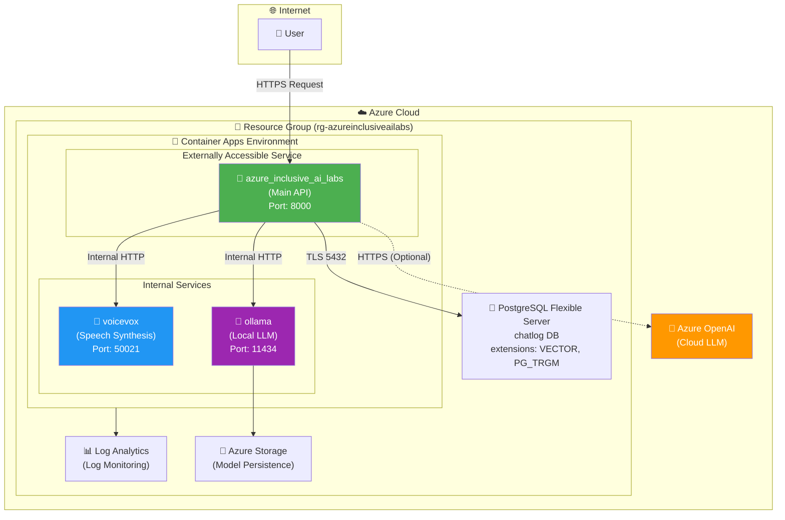

### Azure Resource Architecture

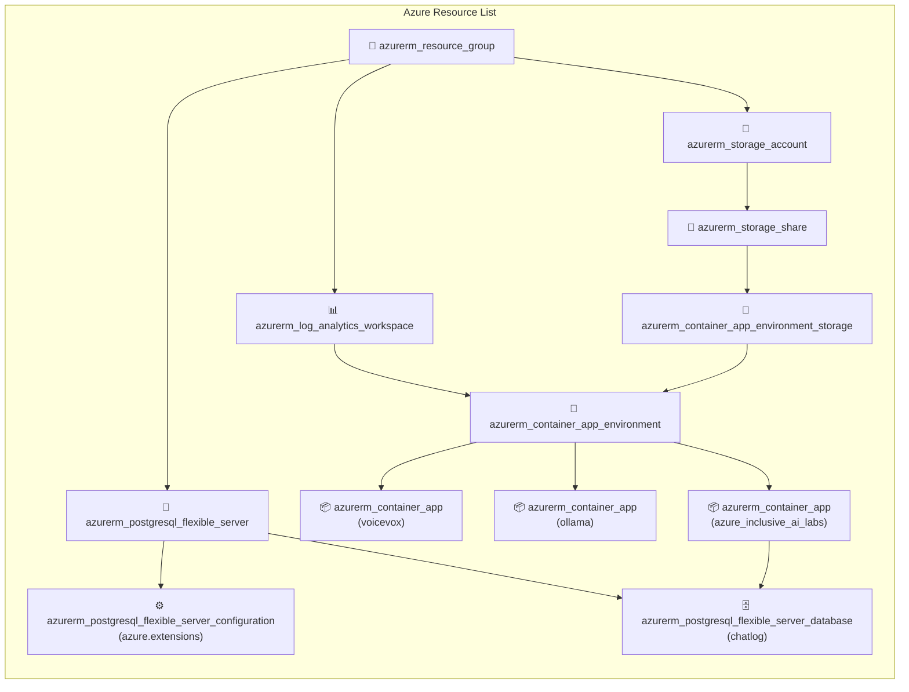

## 🔄 Processing Flow

### Voice Conversation Flow

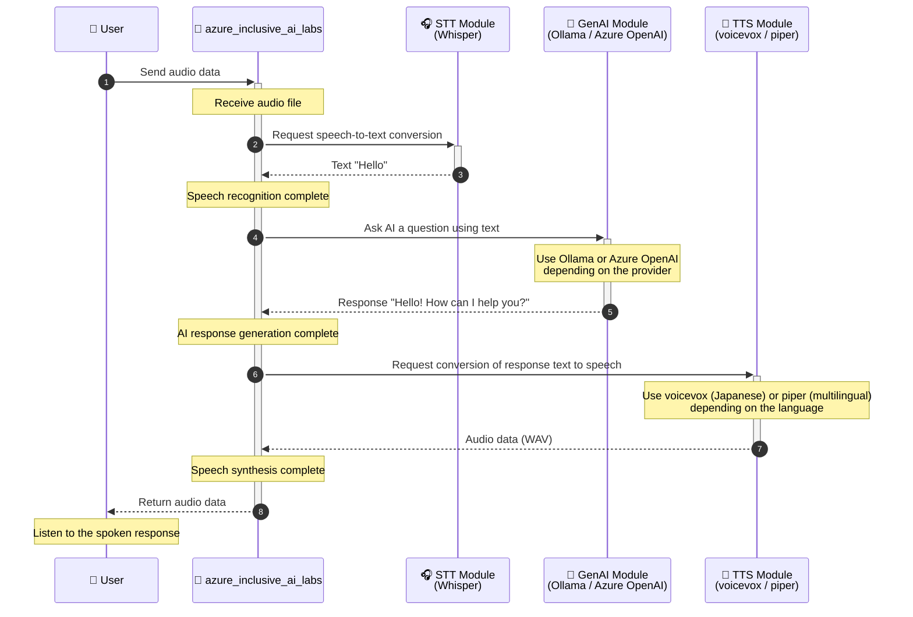

### API Request Processing Details

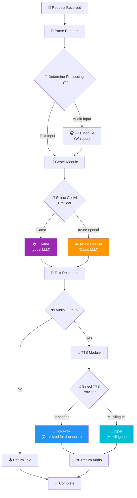

## 🔀 Multiple Provider Support

azure_inclusive_ai_labs is designed to **switch between multiple providers** for each **STT (speech recognition)**, **GenAI (generative AI)**, and **TTS (speech synthesis)** module. You can select the provider that best fits your use case and requirements.

### Supported Providers

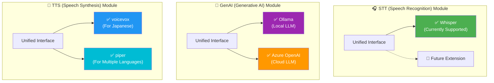

### Module Details

| Module    | Provider     | Supported languages and uses | Features                                                        |
|-----------|--------------|------------------------------|-----------------------------------------------------------------|
| **STT**   | Whisper      | Multilingual (100+ languages) | High-accuracy speech recognition model developed by OpenAI      |
| **GenAI** | Ollama       | Multilingual                 | Runs locally, keeps data from leaving the environment, and free |
| **GenAI** | Azure OpenAI | Multilingual                 | High-performance models such as GPT-4o and enterprise support   |
| **TTS**   | voicevox     | 🇯🇵 **Optimized for Japanese** | High-quality Japanese speech and character voices               |
| **TTS**   | piper        | 🌍 **Multilingual support**   | Lightweight and fast support for English, German, French, and more |

### Provider Selection Flow

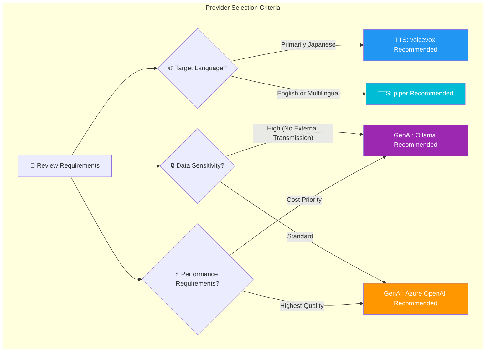

### Switching Providers with Environment Variables

| Environment variable     | Value                     | Description                                                |
|--------------------------|---------------------------|------------------------------------------------------------|
| `GENAI_DEFAULT_PROVIDER` | `ollama` / `azure-openai` | LLM provider to use                                        |
| `TTS_DEFAULT_PROVIDER`   | `voicevox` / `piper`      | Speech synthesis provider to use                           |
| `STT_DEFAULT_PROVIDER`   | `whisper`                 | Speech recognition provider to use                         |
| `CHATLOG_ENABLED`        | `true` / `false`          | Enables the Chatlog feature                                |
| `CHATLOG_AUTH_MODE`      | `password` / `entra`      | Chatlog authentication mode                                |
| `CHATLOG_DSN`            | Secret reference          | PostgreSQL connection DSN (through a Container Apps Secret) |

## 🔗 Inter-Container Communication

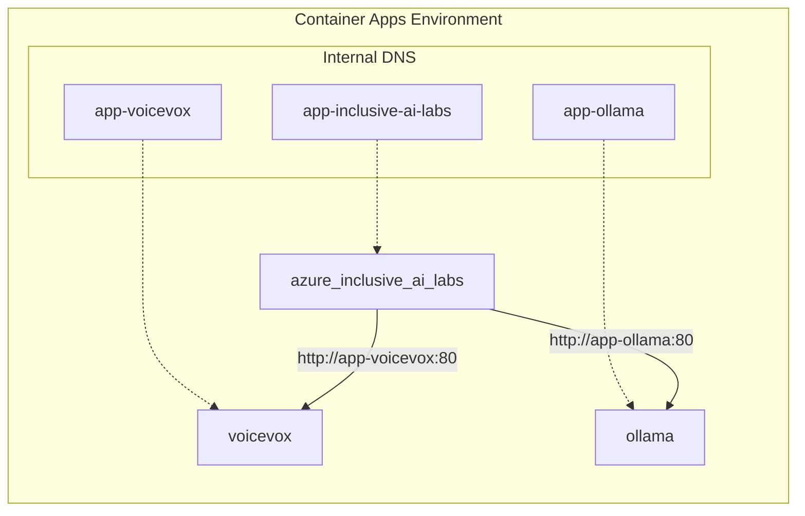

Within the same Container Apps environment, applications can communicate directly by application name.

* `http://app-voicevox` → voicevox container
* `http://app-ollama` → ollama container

## 📊 Monitoring and Logs

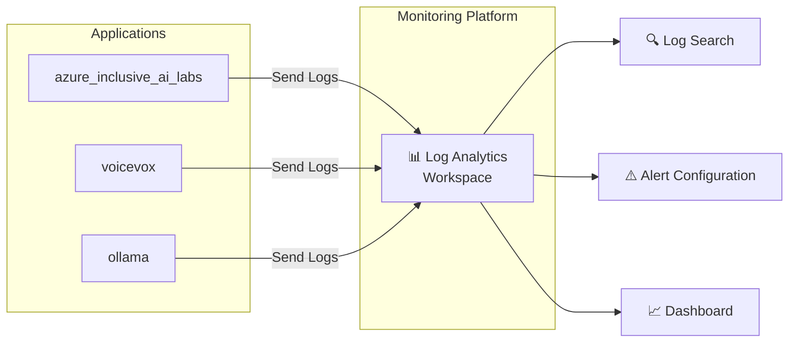

## ⚙️ Prerequisites

* Azure subscription
* Azure OpenAI resource with a deployed model (when using Azure OpenAI)

Configure the common [Azure authentication](../../../docs/tips/provider-authentication.md),
[Terraform workflow](../../../docs/tips/terraform-workflow.md), and, when needed,
[Azure Blob Storage backend](../../../docs/tips/azure-blob-backend.md).
Specify `SCENARIO=azure_inclusive_ai_labs` when running Makefile commands for this scenario.

## 🚀 Quick Start

1. **Create a `terraform.tfvars` file**

   ```hcl
   name     = "azureinclusiveailabs"
   location = "japaneast"

    # Azure OpenAI settings (required when using Azure OpenAI)
   genai_azure_openai_endpoint = "https://your-openai-resource.openai.azure.com/"
   genai_azure_openai_api_key  = "your-api-key-here"
   genai_azure_openai_deployment_name = "gpt-4o"

    # Use the local LLM (Ollama) by default
   genai_default_provider = "ollama"
    ollama_model = "gemma3:270m"  # Default model

    # Chatlog (PostgreSQL) settings: entra (passwordless) mode by default
    # Chatlog (PostgreSQL) settings
    # PostgreSQL Flexible Server is not created by default (postgresql_enabled = false)
    # To use chatlog, explicitly specify the following settings
   # postgresql_enabled                = true
   # chatlog_enabled                   = true
   #
    # To use password mode, override the settings as follows
   # postgresql_administrator_password = "YourSecurePassword123!"
   # chatlog_auth_mode                 = "password"
   ```

2. **Deploy**

    Follow the [standard Terraform workflow](../../../docs/tips/terraform-workflow.md) to deploy
    `SCENARIO=azure_inclusive_ai_labs`.

3. **Access the application**

    The URL is available as an output after deployment completes.

   ```bash
   terraform output azure_inclusive_ai_labs_url
   ```

### Enable PostgreSQL (chatlog)

To reduce costs and the initial deployment footprint, **PostgreSQL Flexible Server is not created by default** (`postgresql_enabled = false`). Enable it explicitly in `terraform.tfvars` as shown below only when using the chatlog feature.

```hcl
# Create PostgreSQL Flexible Server and its related resources (chatlog DB, extensions, and Entra administrator)
postgresql_enabled = true

# Also enable the application's chatlog feature (requires postgresql_enabled = true)
chatlog_enabled = true
```

When `postgresql_enabled = false`, none of the following resources are created, and `CHATLOG_DSN` is set to an empty string.

* `module.postgresql` (the `azurerm_postgresql_flexible_server` resource and firewall rule)
* `azurerm_postgresql_flexible_server_configuration.azure_extensions`
* `azurerm_postgresql_flexible_server_database.chatlog`
* `azurerm_postgresql_flexible_server_active_directory_administrator.chatlog`

> [!IMPORTANT]
> Setting `chatlog_enabled = true` also requires `postgresql_enabled = true` (otherwise validation fails).

### Deploy with Password Authentication

To use `chatlog_auth_mode = "password"`, add the following settings.

```hcl
chatlog_auth_mode                 = "password"
postgresql_administrator_password = "YourSecurePassword123!"
```

### Deploy with Entra Authentication

The default is `chatlog_auth_mode = "entra"`. To set it explicitly, use the following configuration.

```hcl
chatlog_auth_mode = "entra"
tenant_id         = "<your-entra-tenant-id>" # When omitted, uses the current Azure CLI sign-in tenant
```

> [!IMPORTANT]
> In `entra` mode, you must separately bootstrap the login role in PostgreSQL (grant membership in the `azure_ad_user` role). The initial phase assumes that you perform this step manually by connecting as the PostgreSQL administrator after `terraform apply`.
>
> Example:
>
> ```sql
> CREATE ROLE "app-inclusive-ai-labs" WITH LOGIN IN ROLE azure_ad_user;
> GRANT ALL PRIVILEGES ON DATABASE chatlog TO "app-inclusive-ai-labs";
> ```
>
> To run the commands, connect using a command such as `psql "host=<postgresql_server_fqdn> dbname=postgres user=<postgres_admin> sslmode=require"`, then execute the SQL above.

## 📋 Variables

### Required Variables

| Name                          | Description                          |
|-------------------------------|--------------------------------------|
| `genai_azure_openai_api_key` | Azure OpenAI API key (sensitive data) |

### Basic Settings

| Name       | Default value           | Description        |
|------------|-------------------------|--------------------|
| `name`     | `azureinclusiveailabs` | Base resource name |
| `location` | `japaneast`            | Azure region       |

### PostgreSQL / Chatlog Settings

> [!WARNING]
> **PostgreSQL Flexible Server is not created by default.** To use it, explicitly set `postgresql_enabled = true`. For details, see [Enable PostgreSQL (chatlog)](#enable-postgresql-chatlog).

| Name                                | Default value      | Description                                                                                                        |
|-------------------------------------|--------------------|--------------------------------------------------------------------------------------------------------------------|
| `postgresql_enabled`                | `false`            | Whether to create PostgreSQL Flexible Server. When `true`, creates all chatlog resources (server, DB, extensions, and Entra administrator) |
| `postgresql_administrator_login`    | `psqladmin`        | PostgreSQL administrator user                                                                                      |
| `postgresql_administrator_password` | `null`             | PostgreSQL administrator password (required and must be non-empty when `chatlog_auth_mode=password`)               |
| `postgresql_database_name`          | `chatlog`          | Application database name                                                                                          |
| `postgresql_sku_name`               | `B_Standard_B1ms`  | PostgreSQL SKU                                                                                                     |
| `postgresql_version`                | `17`               | PostgreSQL version                                                                                                 |
| `chatlog_auth_mode`                 | `entra`            | Chatlog authentication mode (`password` / `entra`)                                                                 |
| `chatlog_enabled`                   | `false`            | Enables the application's Chatlog feature (`postgresql_enabled = true` is required when set to `true`)             |
| `tenant_id`                         | `""`               | Entra tenant ID (automatically retrieved from the current Azure client when empty)                                 |

### azure_inclusive_ai_labs Container Settings

| Name                                    | Default value                         | Description      |
|-----------------------------------------|---------------------------------------|------------------|
| `azure_inclusive_ai_labs_image`         | `ks6088ts/inclusive-ai-labs:latest` | Docker image     |
| `azure_inclusive_ai_labs_cpu`           | `2.0`                                 | Number of CPU cores |
| `azure_inclusive_ai_labs_memory`        | `4Gi`                                 | Memory           |
| `azure_inclusive_ai_labs_min_replicas`  | `1`                                   | Minimum replicas |
| `azure_inclusive_ai_labs_max_replicas`  | `3`                                   | Maximum replicas |

### voicevox Container Settings

| Name                    | Default value                                     | Description         |
|-------------------------|---------------------------------------------------|---------------------|
| `voicevox_image`        | `voicevox/voicevox_engine:cpu-ubuntu20.04-latest` | Docker image        |
| `voicevox_cpu`          | `2.0`                                             | Number of CPU cores |
| `voicevox_memory`       | `4Gi`                                             | Memory              |
| `voicevox_min_replicas` | `1`                                               | Minimum replicas    |
| `voicevox_max_replicas` | `3`                                               | Maximum replicas    |

### Ollama Container Settings

| Name                      | Default value            | Description                    |
|---------------------------|--------------------------|--------------------------------|
| `ollama_image`            | `ollama/ollama:latest` | Docker image                   |
| `ollama_model`            | `gemma3:270m`          | Model to download at startup   |
| `ollama_cpu`              | `2.0`                  | Number of CPU cores            |
| `ollama_memory`           | `4Gi`                  | Memory                         |
| `ollama_storage_quota_gb` | `10`                   | Storage capacity (GB)          |
| `ollama_external_enabled` | `false`                | Whether to expose externally   |

### AI / Speech Processing Settings

| Name                                  | Default value                   | Description                                  |
|---------------------------------------|---------------------------------|----------------------------------------------|
| `genai_default_provider`              | `ollama`                        | LLM provider (`ollama` or `azure-openai`)    |
| `genai_system_prompt`                 | `You are a helpful assistant.`  | System prompt for the GenAI provider         |
| `genai_azure_openai_endpoint`         | ``                              | Azure OpenAI endpoint URL                    |
| `genai_azure_openai_deployment_name`  | `gpt-4o`                        | Deployment name                              |
| `genai_azure_openai_api_version`      | `2024-02-15-preview`            | Azure OpenAI API version                     |
| `stt_default_provider`                | `whisper`                       | Speech recognition provider                  |
| `stt_whisper_model_size`              | `small`                         | Whisper model size                           |
| `stt_whisper_device`                  | `cpu`                           | Whisper device (`cpu` / `cuda`)              |
| `stt_whisper_compute_type`            | `int8`                          | Whisper compute type                         |
| `stt_hf_home`                         | ``                              | Hugging Face model cache directory           |
| `tts_default_provider`                | `voicevox`                      | Speech synthesis provider                    |
| `tts_default_voice`                   | `en_US-lessac-medium`           | Default voice (for piper)                    |
| `tts_voicevox_default_speaker`        | `1`                             | voicevox speaker ID                          |
| `tts_voicevox_timeout`                | `30.0`                          | voicevox request timeout (seconds)            |
| `tts_piper_voices_dir`                | ``                              | Piper voice model directory                  |

For details, see [variables.tf](variables.tf).

## 📤 Outputs

| Name                            | Description                                     |
|---------------------------------|-------------------------------------------------|
| `azure_inclusive_ai_labs_url`   | Public URL of the azure_inclusive_ai_labs API   |
| `azure_inclusive_ai_labs_fqdn`  | FQDN of the Container App                       |
| `voicevox_internal_fqdn`        | Internal FQDN of voicevox                       |
| `ollama_internal_fqdn`          | Internal FQDN of ollama                         |
| `ollama_url`                    | ollama URL (external / internal)                |
| `postgresql_server_fqdn`        | FQDN of PostgreSQL Flexible Server              |
| `postgresql_database_name`      | Database name for Chatlog                       |
| `chatlog_dsn`                   | DSN for the Chatlog connection (sensitive)      |

## 🔗 Internal Communication

The `azure_inclusive_ai_labs` container communicates with the other containers through internal DNS in the Container Apps environment.

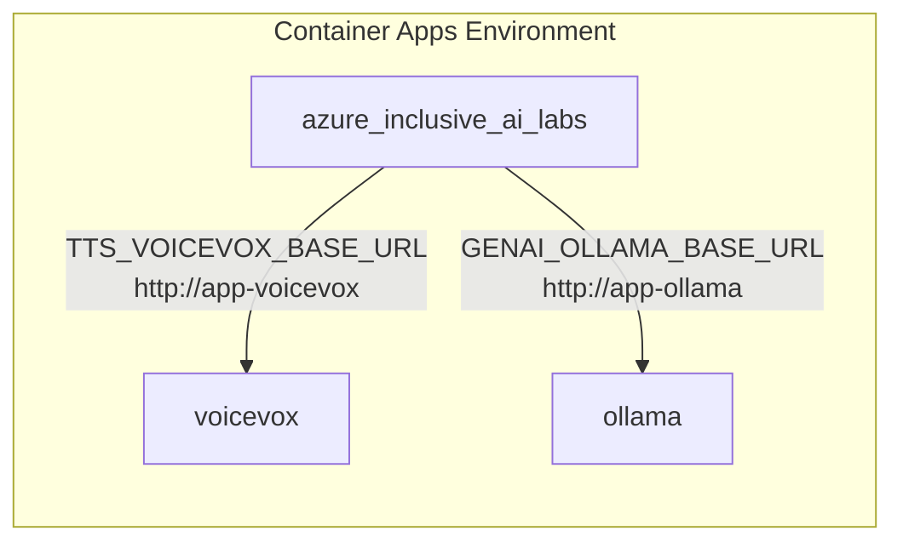

These values are configured automatically through environment variables.

* `TTS_VOICEVOX_BASE_URL=http://app-voicevox`
* `GENAI_OLLAMA_BASE_URL=http://app-ollama`

## 🗑️ Delete Resources

Specify `SCENARIO=azure_inclusive_ai_labs` and follow the
[standard Terraform workflow](../../../docs/tips/terraform-workflow.md) to delete the resources.

## 💡 Use Cases

### Use Case 1: Accessible AI Assistant

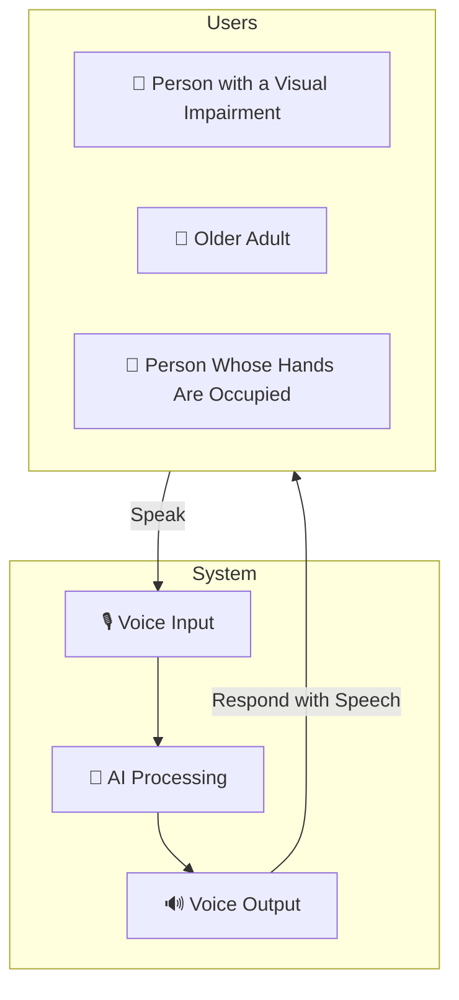

### Use Case 2: Multilingual Conversation System

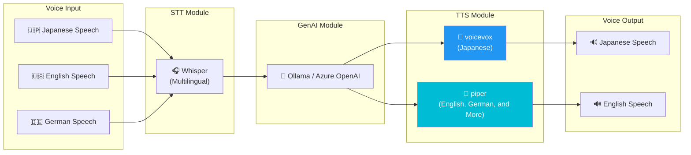

## ⚠️ Important Notes

* **voicevox** may take 1 to 2 minutes to start because it loads a language model
* **ollama** takes additional time during its first startup because it downloads the model
* The minimum replica count is set to 1 to avoid cold starts
* To optimize costs in a development environment, you can set `min_replicas` to 0
* Ollama model data is persisted in Azure Storage and remains available after container restarts
* PostgreSQL Flexible Server may need to restart after applying the `azure.extensions` configuration (`VECTOR,PG_TRGM`)
* ⚠️ **Important**: The PostgreSQL module creates an `AllowAll` firewall rule (`0.0.0.0-255.255.255.255`). This configuration is intended for testing. Always add access restrictions in production (for example, restrict `azurerm_postgresql_flexible_server_firewall_rule` to specific IP ranges, or implement the planned VNet / Private Endpoint support).

## 📚 Related Resources

* [Azure Container Apps documentation](https://learn.microsoft.com/ja-jp/azure/container-apps/)
* [voicevox engine](https://github.com/VOICEVOX/voicevox_engine)
* [Ollama](https://ollama.ai/)
* [OpenAI Whisper](https://github.com/openai/whisper)
* [Azure OpenAI Service](https://learn.microsoft.com/ja-jp/azure/ai-services/openai/)

## 🔧 Troubleshooting

### Container Fails to Start

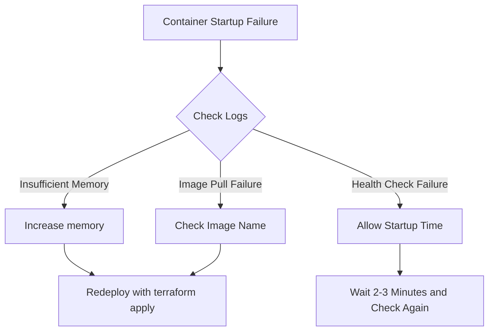

### Check Logs

```bash
# Check logs with Azure CLI
az containerapp logs show \
  --name app-inclusive-ai-labs \
  --resource-group rg-azureinclusiveailabs \
  --type console
```
