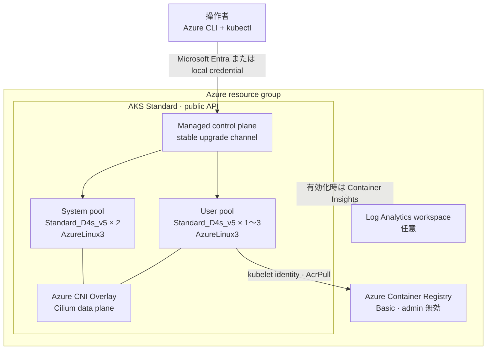

# Azure Kubernetes Playground シナリオ

リポジトリの再利用可能な Terraform module を組み合わせ、再現可能な Azure Kubernetes Service (AKS) Standard 学習環境をデプロイします。

[English](./README.md)

## 作成するもの

- リソースグループ。
- 既定で Basic SKU と Microsoft Entra 認証を使用する Azure Container Registry (ACR)。
- AKS 管理 VNet を使用する、パブリック API の AKS Standard クラスター。
- 重要な add-on 専用の固定 2 ノード system pool。
- 1～3 ノードで自動スケールする独立した user pool。
- AKS kubelet identity に対する ACR の `AcrPull` role assignment。
- 任意で Log Analytics workspace と Container Insights。

学習対象を明確にするため、private cluster、custom VNet、Managed Prometheus、Azure Managed Grafana、Defender for Containers、Azure Policy、Key Vault CSI は作成しません。

## 既定構成の判断

| 領域 | 既定値 | 理由 |
| --- | --- | --- |
| AKS mode | Standard | node pool、identity、network、lifecycle の制御を学習できます。 |
| Control-plane tier | Free | 破棄前提の playground で control plane SLA の料金を抑えます。Node VM などは引き続き課金されます。 |
| Kubernetes version | AKS が推奨 GA version を選択 | `kubernetes_version = null` とし、作成時に古い patch version を固定しません。 |
| Upgrade lifecycle | cluster は `stable`、node OS は `NodeImage` | 作成後も control plane と node image を保守します。 |
| System pool | `Standard_D4s_v5` × 2、`AzureLinux3` | 対応済みの汎用 SKU を使用し、system add-on の可用性を確保します。 |
| User pool | `Standard_D4s_v5` × 1～3、`AzureLinux3` | workload を重要な add-on から分離し、Cluster Autoscaler を学習できます。 |
| Node surge | 両 pool で `33%` | upgrade 用容量を確保し、一時的な料金と quota の要件を明示します。 |
| Network | Cilium を data plane とする Azure CNI Overlay | 推奨される eBPF data plane を使用し、廃止予定の kubenet を避けます。 |
| Egress | Standard Load Balancer、managed outbound IP | パブリック学習シナリオの network を AKS 管理に保ちます。 |
| Workload identity | OIDC issuer と Workload Identity を有効化 | legacy pod identity を使わず、workload の keyless 認証を実現できます。 |
| Cluster authentication | Kubernetes RBAC、local account は維持 | 初回接続を簡単にします。local account を無効化する前に managed Microsoft Entra integration を設定できます。 |
| Image hygiene | Image Cleaner を 168 時間ごとに実行 | 未使用 image を週次で削除します。 |
| Monitoring | Container Insights は無効 | 明示的に有効化するまで ingestion 料金を発生させません。 |

## アーキテクチャ



## 前提条件

- Terraform `>= 1.6.0`。
- Azure CLI と `kubectl`。
- 対象リソースと role assignment を作成できる Azure subscription と認証済み identity。
- `Standard_D4s_v5` 3 ノード分 (12 vCPU) 以上のリージョン quota、および upgrade 時の一時的な surge 容量。

共通ガイダンスの [Azure 認証](../../../docs/tips/provider-authentication.ja.md)、[Terraform ワークフロー](../../../docs/tips/terraform-workflow.ja.md)、および任意の [Azure Blob Storage backend](../../../docs/tips/azure-blob-backend.ja.md) に従ってください。Makefile を使用する場合は `SCENARIO=azure_kubernetes_playground` を設定します。

## デプロイ

リポジトリ root から実行します。

```shell
cd infra/scenarios/azure_kubernetes_playground
terraform init
terraform plan -out=tfplan
terraform apply tfplan
```

lock file は、再現可能な初期化のため AzureRM `5.3.0` と random `3.9.0` を選択します。

### kubectl で接続する

```shell
az aks get-credentials \
  --resource-group "$(terraform output -raw resource_group_name)" \
  --name "$(terraform output -raw aks_name)"

kubectl get nodes \
  -L kubernetes.azure.com/mode,kubernetes.azure.com/os-sku
kubectl get pods --all-namespaces
```

Terraform output から raw kubeconfig や client certificate は公開しません。現在有効な credential は Azure CLI 経由で取得してください。

### Lifecycle と network を確認する

```shell
az aks show \
  --resource-group "$(terraform output -raw resource_group_name)" \
  --name "$(terraform output -raw aks_name)" \
  --query '{kubernetesVersion:kubernetesVersion,currentKubernetesVersion:currentKubernetesVersion,upgradeChannel:autoUpgradeProfile.upgradeChannel,nodeOsChannel:autoUpgradeProfile.nodeOSUpgradeChannel,networkPlugin:networkProfile.networkPlugin,networkPluginMode:networkProfile.networkPluginMode,networkDataPlane:networkProfile.networkDataplane,workloadIdentity:securityProfile.workloadIdentity.enabled}' \
  --output yaml

kubectl get nodes -o wide
```

## 任意設定

上書きには local の `terraform.tfvars` を作成します。tenant 固有 ID や internal network range は commit しないでください。

### Public API の接続元を制限する

既定の public API は、認証可能な任意の接続元から到達できます。共有環境や長期利用では制限してください。

```hcl
api_server_authorized_ip_ranges = [
  "203.0.113.10/32", # 操作者または egress の public IP に置き換えます。
]
```

### Managed Microsoft Entra 認証を使用して local account を無効化する

```hcl
entra_id = {
  tenant_id = "00000000-0000-0000-0000-000000000000"
  admin_group_object_ids = [
    "11111111-1111-1111-1111-111111111111",
  ]
  azure_rbac_enabled = true
}

local_account_disabled = true
```

Kubernetes RBAC と Entra admin group を設定せずに `local_account_disabled = true` にすると、module が拒否します。

### Container Insights を有効化する

```hcl
container_insights_enabled       = true
log_analytics_retention_in_days = 30
```

既存の再利用可能な Log Analytics module を作成し、AKS monitoring add-on の managed identity 認証を有効にします。Managed Prometheus と control-plane diagnostic setting は有効化しません。

### Maintenance window を指定する

```hcl
maintenance_window_auto_upgrade = {
  day_of_week = "Sunday"
  start_time  = "03:00"
  duration    = 4
  utc_offset  = "+09:00"
}

maintenance_window_node_os = {
  day_of_week = "Sunday"
  start_time  = "07:00"
  duration    = 4
  utc_offset  = "+09:00"
}
```

## OpenTelemetry の例

- [Docker Compose の observability stack](./examples/otel_local/README.ja.md)
- [制限付き Kubernetes observability manifest](./examples/otel_k8s/README.ja.md)

system pool は重要な add-on のみを受け付けるため、Kubernetes の例は autoscaling user pool 上で動作します。

## 主な変数

| 名前 | 型 | 既定値 |
| --- | --- | --- |
| `name` | `string` | `"azurekubernetesplayground"` |
| `location` | `string` | `"japaneast"` |
| `acr_sku` | `string` | `"Basic"` |
| `acr_admin_enabled` | `bool` | `false` |
| `kubernetes_version` | `string` | `null` |
| `sku_tier` | `string` | `"Free"` |
| `oidc_issuer_enabled` | `bool` | `true` |
| `workload_identity_enabled` | `bool` | `true` |
| `local_account_disabled` | `bool` | `false` |
| `entra_id` | `object` | `null` |
| `api_server_authorized_ip_ranges` | `set(string)` | `[]` |
| `automatic_upgrade_channel` | `string` | `"stable"` |
| `node_os_upgrade_channel` | `string` | `"NodeImage"` |
| `image_cleaner_enabled` | `bool` | `true` |
| `image_cleaner_interval_hours` | `number` | `168` |
| `system_node_pool` | `object` | 固定 2 ノードの `Standard_D4s_v5` Azure Linux 3 |
| `user_node_pools` | `map(object)` | 1～3 ノードで自動スケールする `user` pool |
| `network_profile` | `object` | Azure CNI Overlay + Cilium、明示的な IPv4 CIDR |
| `maintenance_window_auto_upgrade` | `object` | `null` |
| `maintenance_window_node_os` | `object` | `null` |
| `container_insights_enabled` | `bool` | `false` |
| `log_analytics_retention_in_days` | `number` | `30` |

すべての nested profile field と validation は [variables.tf](./variables.tf) を参照してください。

## 出力

resource group と ACR の identifier、AKS の ID/name/FQDN/current version/OIDC issuer、managed node resource group、user pool metadata、任意の Log Analytics identifier を出力します。credential を含む kubeconfig は意図的に出力しません。

## 料金と運用上の注意

> [!WARNING]
> AKS の `Free` tier は control plane のみに適用されます。既定の `Standard_D4s_v5` VM 3 台、managed disk、outbound public IP/load balancer、ACR、任意の Log Analytics ingestion は課金対象です。

- User pool は 3 ノードまで拡張され、compute 料金が増加します。
- `33%` surge により、upgrade 中は各 pool に一時的に 1 ノード追加される場合があります。quota と予算に余裕を持たせてください。
- Availability Zone は region と VM SKU ごとに対応状況が異なるため、既定では無効です。対応状況を確認してから pool の `zones` を設定してください。
- Public API と public ACR endpoint は学習用の意図的な trade-off であり、本番 network baseline ではありません。
- ACR admin 認証は無効のままにしてください。AKS は kubelet managed identity で image を pull します。
- Workload Identity を有効にしても、各 workload には federated identity credential、service account annotation、least-privilege の Azure role assignment が必要です。

## クリーンアップ

```shell
terraform plan -destroy -out=destroy.tfplan
terraform apply destroy.tfplan
```

## 参考資料

- [AKS best practices](https://learn.microsoft.com/azure/aks/best-practices)
- [System pool と user pool](https://learn.microsoft.com/azure/aks/use-system-pools)
- [Azure CNI Overlay](https://learn.microsoft.com/azure/aks/concepts-network-azure-cni-overlay)
- [Azure CNI powered by Cilium](https://learn.microsoft.com/azure/aks/azure-cni-powered-by-cilium)
- [Microsoft Entra Workload ID](https://learn.microsoft.com/azure/aks/workload-identity-overview)
- [AKS cluster の automatic upgrade](https://learn.microsoft.com/azure/aks/auto-upgrade-cluster)
- [AKS node OS の automatic upgrade](https://learn.microsoft.com/azure/aks/auto-upgrade-node-os-image)
- [ACR と AKS の統合](https://learn.microsoft.com/azure/aks/cluster-container-registry-integration)
- [AKS monitoring の有効化](https://learn.microsoft.com/azure/azure-monitor/containers/kubernetes-monitoring-enable)
- [AzureRM 5.3.0 AKS resource](https://registry.terraform.io/providers/hashicorp/azurerm/5.3.0/docs/resources/kubernetes_cluster)
