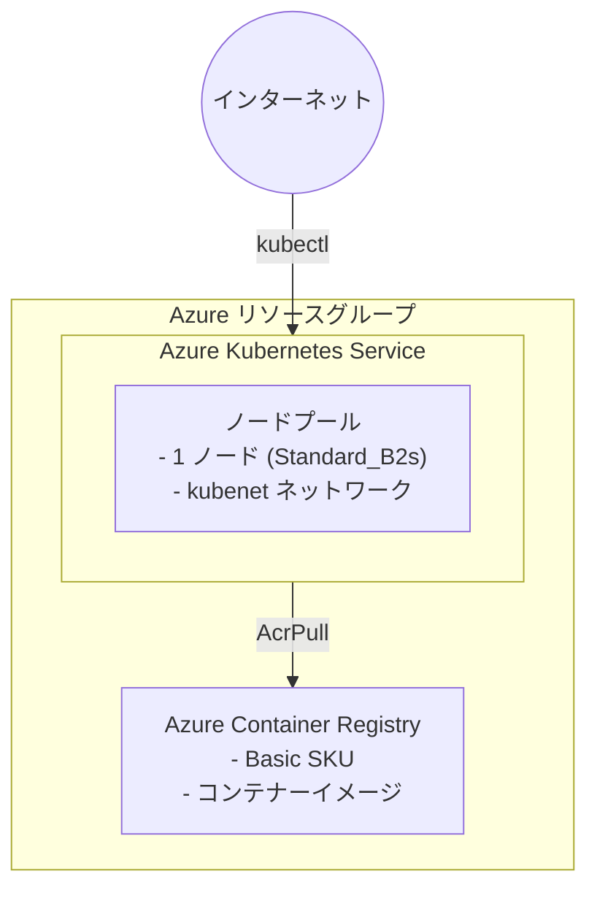

# Azure Kubernetes Playground シナリオ

基本的なコンテナーワークロードのテスト用に、Azure Container Registry (ACR) と Azure Kubernetes Service (AKS) をデプロイします。

## 概要

このシナリオでは、次のリソースを作成します。

- **リソースグループ**: すべてのリソースを格納します
- **Azure Container Registry (ACR)**: コンテナーイメージを保存する Basic レベルのコンテナーレジストリです
- **Azure Kubernetes Service (AKS)**: ACR からイメージをプルするように kubelet ID を構成した Basic Kubernetes クラスターです

## 前提条件

- リソースを作成するためのアクセス許可を持つ Azure サブスクリプション

共通ガイダンスの [Azure 認証](../../../docs/tips/provider-authentication.ja.md)、
[Terraform ワークフロー](../../../docs/tips/terraform-workflow.ja.md)、およびオプションの
[Azure Blob Storage バックエンド](../../../docs/tips/azure-blob-backend.ja.md)に従います。
リポジトリの Makefile を使用する場合は、`SCENARIO=azure_kubernetes_playground` を設定します。

## アーキテクチャ



## 使用方法

共通ワークフローと `SCENARIO=azure_kubernetes_playground` を使用してインフラストラクチャをデプロイします。次に、シナリオ固有の操作を実行します。

```bash
# AKS 資格情報を取得
az aks get-credentials \
    --resource-group $(terraform output -raw resource_group_name) \
    --name $(terraform output -raw aks_name)

# クラスターへのアクセスを確認
kubectl get nodes

# イメージをビルドして ACR にプッシュ
ACR_NAME=$(terraform output -raw acr_name)
az acr login --name $ACR_NAME
docker build -t $ACR_NAME.azurecr.io/myapp:v1 .
docker push $ACR_NAME.azurecr.io/myapp:v1

# AKS にデプロイ
kubectl create deployment myapp --image=$ACR_NAME.azurecr.io/myapp:v1
```

## 変数

| 名前                | 説明                                  | 型            | 既定値                           | 必須   |
|---------------------|---------------------------------------|---------------|----------------------------------|--------|
| `name`              | リソースのベース名                    | `string`      | `"azurekubernetesplayground"`   | いいえ |
| `location`          | リソースの Azure リージョン           | `string`      | `"japaneast"`                   | いいえ |
| `tags`              | リソースに適用するタグ                | `map(string)` | variables.tf を参照              | いいえ |
| `acr_sku`           | Azure Container Registry の SKU       | `string`      | `"Basic"`                       | いいえ |
| `acr_admin_enabled` | ACR の管理者ユーザーを有効にする      | `bool`        | `false`                          | いいえ |
| `kubernetes_version` | Kubernetes バージョン (null の場合は最新) | `string`   | `null`                           | いいえ |
| `oidc_issuer_enabled` | AKS OIDC issuer を有効にする          | `bool`        | `false`                          | いいえ |
| `vm_size`           | AKS ノードの VM サイズ                | `string`      | `"Standard_B2s"`                | いいえ |
| `node_count`        | 既定のノードプールのノード数          | `number`      | `1`                              | いいえ |
| `os_disk_size_gb`   | AKS ノードの OS ディスクサイズ (GB)   | `number`      | `30`                             | いいえ |
| `network_plugin`    | ネットワークプラグイン (kubenet または azure) | `string` | `"kubenet"`                 | いいえ |

## 出力

| 名前                      | 説明                                           |
|---------------------------|------------------------------------------------|
| `resource_group_name`     | リソースグループの名前                         |
| `resource_group_id`       | リソースグループの ID                          |
| `acr_id`                  | Azure Container Registry の ID                 |
| `acr_name`                | Azure Container Registry の名前                |
| `acr_login_server`        | ACR のログインサーバー URL                     |
| `aks_id`                  | AKS クラスターの ID                            |
| `aks_name`                | AKS クラスターの名前                           |
| `aks_fqdn`                | AKS クラスターの FQDN                          |
| `aks_kube_config_raw`     | AKS クラスターの未加工 kubeconfig (機密)       |
| `aks_node_resource_group` | AKS ノードを含むリソースグループの名前         |

## コストの最適化

このシナリオは、費用対効果の高いテスト向けに設計されています。

- **ACR Basic SKU**: 最も低コストのレベルで、開発とテストに適しています
- **Standard_B2s を使用する AKS**: 非本番ワークロードに適した、低コストのバースト可能 VM です
- **単一ノード**: コンピューティングリソースを最小限に抑えます
- **kubenet ネットワーク**: Azure CNI の追加コストが発生しません

## 注意事項

- AKS kubelet ID には、ACR に対する `AcrPull` ロールが自動的に付与されます
- プライベートエンドポイントや VNet 統合はありません (簡略化のためパブリックアクセスを使用します)
- 自動スケーリングは既定で無効です
