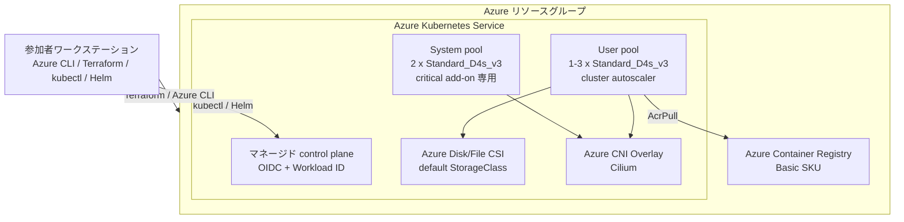

# Azure Kubernetes Playground シナリオ

このシナリオは、Kubernetes の基礎演習と [workshop-kubernetes](https://github.com/ks6088ts-labs/workshop-kubernetes/tree/main/docs/scenarios) の各シナリオを実施するための Azure Kubernetes Service (AKS) クラスターをデプロイします。

> [!IMPORTANT]
> これは破棄を前提とした学習環境であり、本番環境のベースラインではありません。学習を簡潔にするため、API server はパブリックのままとし、プライベートネットワーク、Microsoft Entra 管理者グループ、Azure Policy、Defender for Containers、マネージド監視は構成しません。本番利用へ展開する前に [AKS ベースラインアーキテクチャ](https://learn.microsoft.com/azure/architecture/reference-architectures/containers/aks/baseline-aks)を確認してください。

## 作成するリソース

- シナリオ内の全リソースを格納するリソースグループ
- 管理者アカウントを無効化した Basic SKU の Azure Container Registry (ACR)
- サポート対象の 2 ノード system pool を持つ AKS クラスター
- ハンズオンワークロード専用の自動スケーリング user pool
- Cilium data plane と NetworkPolicy を使用する Azure CNI Overlay
- `LoadBalancer` Service 用の Standard Azure Load Balancer
- OIDC issuer と Microsoft Entra Workload ID
- シークレットローテーションを有効にした Azure Key Vault Secrets Store CSI driver
- AKS kubelet ID に対する ACR の `AcrPull` ロール割り当て
- PersistentVolume を動的に作成する AKS 組み込み CSI StorageClass

既定の system pool は `Standard_D4s_v3` を 2 台使用します。AKS の system pool は B-series VM をサポートせず、各ノードに 4 vCPU 以上と 4 GB 以上のメモリが必要です。user pool は `Standard_D4s_v3` 1 台から開始し、1～3 台で自動スケーリングします。これにより、重要な system Pod からハンズオンワークロードを分離しながら、OpenTelemetry Demo の公式要件である空きメモリ 6 GB 以上を確保できます。

## アーキテクチャ



## 前提条件

| ツール | 最小要件または用途 |
| --- | --- |
| Azure CLI | サインインと AKS 資格情報の取得 |
| Terraform | 1.6 以降 |
| kubectl | クラスターと 1 minor version 以内 |
| Helm | ハンズオンアプリケーションのインストール |
| Docker | ACR の push/pull 経路の演習 |
| jq | 検証スクリプトの実行 |

外部シナリオの一部では、`kubens`、`k9s`、`argocd`、`argo` も使用します。preflight スクリプトは、基本環境の検証を失敗させずに、不足しているオプションツールを警告します。

共通の [Azure 認証](../../../docs/tips/provider-authentication.ja.md)、
[Terraform ワークフロー](../../../docs/tips/terraform-workflow.ja.md)、および必要に応じて
[Azure Blob Storage バックエンド](../../../docs/tips/azure-blob-backend.ja.md)のガイダンスに従ってください。
リポジトリの Makefile を使用する場合は、`SCENARIO=azure_kubernetes_playground` を設定します。

プロビジョニング前にサインインし、対象サブスクリプションを選択します。

```bash
az login
az account set --subscription <subscription-id-or-name>

./infra/scenarios/azure_kubernetes_playground/scripts/00_validate_prerequisites.sh
```

preflight は、必須コマンド、Terraform のバージョン、Azure CLI セッション、VM SKU の利用可否、初期構成である system node 2 台と user node 1 台に必要な regional/family vCPU quota を確認します。構成を変更した場合は、`LOCATION`、`SYSTEM_VM_SIZE`、`USER_VM_SIZE`、`SYSTEM_NODE_COUNT`、`USER_NODE_MIN_COUNT` を上書きして検証してください。

## デプロイ

共通ワークフローと `SCENARIO=azure_kubernetes_playground` を使用してインフラストラクチャをデプロイし、
続いて、以下のシナリオ固有の接続・検証手順を実行します。

3 台以上のノードのプロビジョニングには数分かかります。ノード作成が進まない場合は、Azure リージョンの vCPU クォータを確認してください。

## 接続と検証

資格情報を取得し、デプロイ後の検証を実行します。

```bash
./infra/scenarios/azure_kubernetes_playground/scripts/10_get_credentials.sh
./infra/scenarios/azure_kubernetes_playground/scripts/20_validate_cluster.sh
```

cluster check は Azure CNI Overlay/Cilium、OIDC と Workload Identity、Key Vault CSI、Ready 状態の system/user node、user pool の allocatable memory 8 GiB 以上、default StorageClass、Metrics API の準備状態を確認します。

## Kubernetes 基礎演習

大規模なプラットフォームをインストールする前に、自己完結型の基礎演習を実行します。

```bash
./infra/scenarios/azure_kubernetes_playground/scripts/30_run_kubernetes_basics.sh
```

ConfigMap、生成される Secret、ServiceAccount、Role/RoleBinding、Deployment、Service、probe、requests/limits、PodDisruptionBudget、HPA、StatefulSet、PVC、DaemonSet、Job、CronJob、NetworkPolicy を扱います。確認方法と削除方法は [examples/kubernetes_basics/README.ja.md](examples/kubernetes_basics/README.ja.md)を参照してください。

生成される Secret は演習専用のダミーデータです。実際の資格情報はコミットしないでください。Azure に接続するアプリケーションでは、manifest 内の API key や接続文字列ではなく、Workload Identity と Key Vault を使用します。

## ACR 統合の検証

このシナリオはアプリケーションの Dockerfile を前提にしません。固定バージョンの公開イメージを使い、ACR の pull 経路全体を検証します。

```bash
SCENARIO_DIR=infra/scenarios/azure_kubernetes_playground
ACR_NAME=$(terraform -chdir="$SCENARIO_DIR" output -raw acr_name)
ACR_LOGIN_SERVER=$(terraform -chdir="$SCENARIO_DIR" output -raw acr_login_server)

az acr login --name "$ACR_NAME"
docker pull nginx:1.27.4-alpine
docker tag nginx:1.27.4-alpine "$ACR_LOGIN_SERVER/workshop/nginx:1.27.4"
docker push "$ACR_LOGIN_SERVER/workshop/nginx:1.27.4"

kubectl create namespace acr-demo
kubectl create deployment acr-nginx \
  --namespace acr-demo \
  --image "$ACR_LOGIN_SERVER/workshop/nginx:1.27.4"
kubectl rollout status deployment/acr-nginx --namespace acr-demo --timeout=5m
kubectl delete namespace acr-demo
```

## OpenTelemetry の例

- [examples/otel_k8s/README.ja.md](examples/otel_k8s/README.ja.md) は、小規模な Collector、Jaeger、Prometheus stack を AKS で実行します。
- [examples/otel_local/README.ja.md](examples/otel_local/README.ja.md) は、同等の stack を Docker Compose で実行します。

コンテナーイメージのタグは固定しています。更新時は意図的にバージョンを変更し、Kubernetes 版と Compose 版を同時に検証してください。

## 外部ワークショップシナリオの対応状況

この Terraform シナリオが提供するのはインフラストラクチャです。次のアプリケーション manifest は別の [workshop-kubernetes リポジトリ](https://github.com/ks6088ts-labs/workshop-kubernetes)にあるため、実行前に clone してください。負荷の高いプラットフォームは一度に 1 つだけ実行し、次へ進む前に削除します。

上限なしの latest chart をインストールせず、profile に記録した日付で検証済みの chart version を読み込みます。

```bash
SCENARIO_DIR=infra/scenarios/azure_kubernetes_playground
. "$SCENARIO_DIR/profiles/workshop-versions.env"
```

各 `helm upgrade --install` に対応する変数を `--version` で渡します。たとえば、外部モデル endpoint を使う CPU-only Open WebUI profile は次のように適用します。

```bash
helm repo add open-webui https://open-webui.github.io/helm-charts
helm repo update

helm upgrade --install openwebui open-webui/open-webui \
  --namespace genai \
  --create-namespace \
  --version "$OPEN_WEBUI_CHART_VERSION" \
  --values "$SCENARIO_DIR/profiles/open-webui-values.yaml"
```

この profile は同梱 Ollama、Pipelines、Redis を意図的に無効化します。インストール後にモデル endpoint を設定し、必要な資格情報は Kubernetes Secret または外部シークレットプロバイダーから注入してください。

| シナリオ | 対応状態 | 必要な対応 |
| --- | --- | --- |
| 0. AKS setup | 対応済み | 外部リポジトリのクラスター作成スクリプトではなく、この Terraform を使用します。 |
| 1. HTTP publishing | Gateway が必要 | ローカルアクセスには port-forward、HTTP 公開には保守中の Gateway API 実装を使用します。ingress-nginx は導入しません。 |
| 2. Prometheus/Grafana | cleanup 前提で対応 | `KUBE_PROMETHEUS_STACK_CHART_VERSION` を使います。単体 Grafana は追加の public LoadBalancer を作るため port-forward を優先し、Ingress 名を重複させません。 |
| 3. Argo CD/Workflows | CLI 導入後に対応 | `argocd` と `argo` を導入し、固定した Argo chart version を使って、次の大規模シナリオ前に両 release を削除します。 |
| 4. Keycloak | cleanup 前提で対応 | `KEYCLOAK_CHART_VERSION` を使い、PVC が Bound であることを確認します。Docker Hub 認証により pull 制限を緩和できます。 |
| 5. Open WebUI | 外部モデルが必要 | 外部 OpenAI 互換/Azure OpenAI endpoint を設定するか GPU pool を用意します。この CPU 専用クラスターでは同梱 Ollama を無効にし、資格情報を Helm values に保存しません。 |
| 6. Dify | manifest の置換が必要 | 可変 manifest は固定パスワード、過剰な RBAC、node-local `hostPath` を含むため、そのまま使いません。Secret/PVC と明示的な resource limit を使うレビュー済み manifest に置き換えます。 |
| 7. Kubecost | cleanup 前提で対応 | `KUBECOST_CHART_VERSION` を使い、requests/limits を設定して、他の監視系シナリオ前にアンインストールします。Azure の cloud-cost 配賦には別途構成が必要です。 |
| 8. OpenTelemetry Demo | 単独実行で対応 | `OTEL_DEMO_CHART_VERSION` を使います。空き RAM 6 GB が必要なため、他の大規模 stack を削除してから実行します。 |
| 9. cert-manager | 独自ドメインが必要 | `CERT_MANAGER_CHART_VERSION` を使い、固定ドメインとメールを置き換え、public DNS record と port 80 へ到達できる Gateway/Ingress を用意します。 |
| 10. TiDB | チュートリアルが未完成 | 基盤は Kubernetes 1.24+、RBAC、DNS、Helm、PV を提供しますが、固定版 Operator CRD、`TidbCluster`、storage sizing、cleanup の追加が必要です。 |

### Ingress と Gateway API

このシナリオは ingress controller をインストールしません。ローカル限定の演習では `kubectl port-forward` を使用します。HTTP を公開する場合は、保守中の Gateway API 実装を導入し、必要な `Gateway` と `HTTPRoute` を定義してください。

同じ namespace に複数の controller を導入しないでください。外部サンプルには host を指定しない同一 `/` route も複数あるため、同時実行できません。

### 容量と実行順序

cluster autoscaler は、要求リソース不足により Pod をスケジュールできない場合にノードを追加します。container requests/limits や HPA の代替ではありません。大規模な Helm インストールの前に確認します。

```bash
kubectl top nodes
kubectl get pods -A --field-selector=status.phase=Pending
kubectl describe pod <pending-pod> -n <namespace>
```

推奨順序:

1. Kubernetes 基礎演習と小規模なローカル OpenTelemetry stack
2. HTTP 公開、ID/GitOps プラットフォームのいずれか 1 つ
3. 監視または AI プラットフォームを一度に 1 つ
4. DNS と保守中の ingress/Gateway 経路を用意した後に cert-manager
5. storage/resource profile を定義した後に TiDB

## クリーンアップ

cleanup script が管理する namespace を確認します。

```bash
./infra/scenarios/azure_kubernetes_playground/scripts/99_cleanup_workloads.sh
```

一覧を確認してから削除します。

```bash
./infra/scenarios/azure_kubernetes_playground/scripts/99_cleanup_workloads.sh --yes
```

可能な場合は、先に各 chart の `helm uninstall` を実行してください。namespace の削除後も cluster-scoped CRD が残る場合があります。この破棄可能な環境を最も確実に削除する方法は次のとおりです。

```bash
make destroy SCENARIO=azure_kubernetes_playground
```

ワークショップ終了前に、state と課金対象リソースが残っていないことを確認してください。

## 変数

| 名前 | 既定値 | 用途 |
| --- | ---: | --- |
| `name` | `azurekubernetesplayground` | リソースのベース名 |
| `location` | `japaneast` | Azure リージョン |
| `acr_sku` / `acr_admin_enabled` | `Basic` / `false` | Registry tier とローカル資格情報 |
| `kubernetes_version` | `null` | 作成時に AKS が推奨する最新バージョン |
| `automatic_upgrade_channel` | `patch` | control plane の patch 更新 |
| `node_os_upgrade_channel` | `NodeImage` | node image のセキュリティ更新 |
| `oidc_issuer_enabled` | `true` | federated identity 用 OIDC issuer |
| `workload_identity_enabled` | `true` | Microsoft Entra Workload ID |
| `key_vault_secrets_provider_enabled` | `true` | Key Vault Secrets Store CSI driver |
| `vm_size` / `node_count` | `Standard_D4s_v3` / `2` | system pool の容量 |
| `os_disk_size_gb` | `128` | system node の OS disk |
| `auto_scaling_enabled` | `false` | system pool autoscaler |
| `min_count` / `max_count` | `2` / `3` | system pool autoscaler の範囲 |
| `network_plugin` / `network_plugin_mode` | `azure` / `overlay` | Azure CNI Overlay |
| `network_data_plane` / `network_policy` | `cilium` / `cilium` | Cilium data plane と policy |
| `user_node_pool_enabled` | `true` | 専用 workload pool |
| `user_node_pool_vm_size` | `Standard_D4s_v3` | workload node SKU |
| `user_node_pool_auto_scaling_enabled` | `true` | workload pool autoscaler |
| `user_node_pool_min_count` / `user_node_pool_max_count` | `1` / `3` | workload pool の範囲 |
| `user_node_pool_os_disk_size_gb` | `128` | workload node の OS disk |

容量を変更する前に [terraform.tfvars.example](terraform.tfvars.example)を確認し、リージョン内の SKU とサブスクリプションのクォータを確認してください。

## 出力

リソースグループ、ACR、AKS、kubeconfig、node resource group、user node pool の識別子を出力します。`aks_kube_config_raw` は機密値です。表示や保存を避け、`az aks get-credentials` を使用してください。

## トラブルシューティング

### Terraform 初期化で lock file が更新される

意図的に `terraform init -upgrade` を実行し、`.terraform.lock.hcl` の差分をレビューして provider の選択をコミットします。CI では upgrade せず、コミット済み lock file を使用します。

### node が Provisioning のまま、または Pod が Pending のままになる

リージョンの SKU 制限と vCPU クォータを確認し、Pod の scheduling event を調査します。requests を削除したり、critical system pool へ workload を配置したりして容量不足を回避しないでください。

### PVC が Pending のままになる

`kubectl get storageclass` で default StorageClass を確認します。AKS の既定 `managed-csi` class は Azure Disk を動的に作成します。Disk は `ReadWriteOnce` です。複数ノードから同時アクセスする場合は Azure Files を使用します。

### HPA の metrics が unknown になる

AKS Metrics API の準備を待ち、`kubectl top nodes` と `kubectl top pods -A` を実行します。metrics の起動中は cluster validation script が警告を出します。

### LoadBalancer の external IP が Pending のままになる

Service event、Azure public IP クォータ、`Microsoft.Network` provider の登録を確認します。各 `LoadBalancer` Service は課金対象の Azure リソースを作成する可能性があります。公開が演習目的でなければ port-forward を優先してください。

## 参考資料

- [AKS の system node pool の管理](https://learn.microsoft.com/azure/aks/use-system-pools)
- [Azure CNI Overlay](https://learn.microsoft.com/azure/aks/concepts-network-azure-cni-overlay)
- [AKS cluster autoscaler](https://learn.microsoft.com/azure/aks/cluster-autoscaler)
- [AKS のストレージオプション](https://learn.microsoft.com/azure/aks/concepts-storage)
- [AKS の Ingress](https://learn.microsoft.com/azure/aks/concepts-network-ingress)
- [AKS の Microsoft Entra Workload ID](https://learn.microsoft.com/azure/aks/workload-identity-overview)
- [Azure Key Vault provider for Secrets Store CSI Driver](https://learn.microsoft.com/azure/aks/csi-secrets-store-driver)
- [OpenTelemetry Demo の Kubernetes 前提条件](https://opentelemetry.io/docs/demo/kubernetes-deployment/)
- [TiDB Operator の前提条件](https://docs.pingcap.com/tidb-in-kubernetes/stable/deploy-tidb-operator/)
- [cert-manager HTTP-01](https://cert-manager.io/docs/configuration/acme/http01/)
