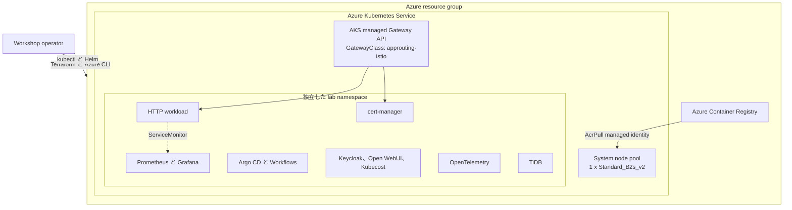

# Azure Kubernetes Playground シナリオ

このシナリオは Azure Container Registry (ACR) と Azure Kubernetes Service
(AKS) をデプロイし、セルフペースの Kubernetes ハンズオンを実行する連番の
POSIX shell script を提供します。アプリケーションコードは追加せず、
[`workshop-kubernetes`](https://github.com/ks6088ts-labs/workshop-kubernetes/tree/main/docs/scenarios)
の教材を移植し、現在の仕様に合わせて更新しています。

対象者はコンテナーと Kubernetes の基礎知識を持つ初中級のエンジニアです。
コアの学習経路は約 1 日、任意の発展 lab をすべて実施する場合は 1 から 2 日を
想定します。

## 学習目標

必要な lab を完了すると、次のことを説明・実践できる状態を目指します。

- Terraform が管理する Azure 基盤と、post-deployment script が管理する
  Kubernetes resource / AKS add-on を区別する
- AKS への接続、状態確認、デバッグ、停止、起動を行う
- container image を ACR に import し、image pull Secret を使わず AKS で実行する
- Kubernetes Gateway API で HTTP workload を公開する
- monitoring、GitOps、workflow、identity、GenAI UI、FinOps、observability、
  certificate、distributed database の各 component を導入・検証する
- lab の終了後に残る persistent data と cluster-scoped CRD を特定する
- 学習用構成を本番設計へ置き換える必要がある境界を判断する

## このシナリオが対象としないもの

このシナリオは public endpoint を使用する開発・学習環境であり、本番向け AKS
baseline ではありません。Private network、system/user node pool の分離、
autoscaling、availability zone、backup、alert、policy enforcement、application
用 workload identity、本番 SSO は構成しません。本番へ応用する前に
[AKS baseline architecture](https://learn.microsoft.com/azure/architecture/reference-architectures/containers/aks/baseline-aks)
を確認してください。

管理 UI は既定で `kubectl port-forward` を使用します。Public な Layer 7 entry
point を作るのは HTTP lab と certificate lab だけです。

## 管理責任の境界

| Layer | 管理主体 | Resource |
| --- | --- | --- |
| Azure infrastructure | Terraform | Resource group、ACR、AKS、managed identity、`AcrPull` role assignment |
| AKS platform extension | Script `03` と `99 platform` | Managed Gateway API CRD、Application Routing Gateway API implementation |
| Workshop workload | Script `04` から `15` | Namespace、Helm release、Operator、Deployment、Service、Gateway resource、PVC |
| Persistent workshop data | Operator の明示判断 | Open WebUI、Kubecost、TiDB の PVC/PV |

AzureRM provider は、この workshop で使用する AKS managed Gateway API と
Application Routing Istio の組み合わせを現在公開していません。そのため add-on
lifecycle は script `03` が Azure CLI で明示的に管理します。管理境界を変更する
前に、同じ resource を別 tool で管理しないでください。

## アーキテクチャ



この scenario は、既存の workshop 既定値である `Standard_B2s_v2` 1 node を
維持します。デプロイ前に、この VM SKU と node 数が target subscription、region、
Kubernetes version の AKS system pool 要件を満たすことを確認してください。Target
環境で別の構成が必要な場合は、`vm_size` と `node_count` を明示的に上書きします。
一次情報は
[AKS で system node pool を使用する](https://learn.microsoft.com/azure/aks/use-system-pools)
を参照してください。

## 前提条件

- Scenario resource と `AcrPull` role assignment を作成できる Azure subscription
- Azure CLI、Terraform、`kubectl`、Helm、`jq`、`curl`、OpenSSL
- 任意の full OpenTelemetry Demo では Helm 4
- Certificate lab では `dig`、public DNS 名、および DNS record の管理権限
- TiDB の local SQL 演習では MySQL compatible client

共通の [Azure 認証](../../../docs/tips/provider-authentication.ja.md)、
[Terraform ワークフロー](../../../docs/tips/terraform-workflow.ja.md)、および任意の
[Azure Blob Storage backend](../../../docs/tips/azure-blob-backend.ja.md)に従います。

## Infrastructure のデプロイ

この directory で次を実行します。

```bash
terraform init
terraform fmt -check
terraform validate
terraform plan -out main.tfplan
terraform apply main.tfplan
```

Repository の Makefile を使う場合は
`SCENARIO=azure_kubernetes_playground` を設定します。

### Cluster sizing

この scenario は `Standard_B2s_v2` 1 node を既定値として維持するため、今回の
workshop 変更だけを理由とした node pool sizing の移行は不要です。既存 state で
`vm_size` を明示的に上書きする場合、AzureRM は一時 pool を経由して default node
pool を rotation します。この operation では AKS が workload を cordon / drain
しないため、永続 data の backup と workshop workload の cleanup を行い、Terraform
plan を review してから apply してください。

## Cluster の準備

基盤 script を順番に実行します。

```bash
./scripts/00_validate_prerequisites.sh
./scripts/01_connect_aks_cluster.sh
./scripts/02_manage_cluster.sh status
./scripts/03_enable_gateway_api.sh
```

Script `01` は credential の取得、1 node 以上の Ready 待機、node pool と
StorageClass の表示、metrics-server、`az aks check-acr` を検証します。ACR
integration は AKS kubelet managed identity と `AcrPull` role を使用します。
[ACR と AKS の統合](https://learn.microsoft.com/azure/aks/cluster-container-registry-integration)
も参照してください。

Script `03` は Azure CLI 2.86.0 以降を要求し、AKS 管理の standard Gateway API
CRD、`approuting-istio` GatewayClass、共有 HTTP Gateway を作成します。詳細は
[Managed Gateway API installation](https://learn.microsoft.com/azure/aks/managed-gateway-api)
と
[Application Routing Gateway API](https://learn.microsoft.com/azure/aks/app-routing-gateway-api)
を参照してください。

移植元が使用していた community ingress-nginx は 2026 年 3 月に retire され、
security fix が提供されません。Kubernetes の Ingress API も frozen で、新規開発には
Gateway API が推奨されます。この移植では ingress-nginx を導入しません。
[Ingress NGINX retirement](https://kubernetes.io/blog/2025/11/11/ingress-nginx-retirement/)
と [Gateway API](https://kubernetes.io/docs/concepts/services-networking/gateway/)
を参照してください。

## Workshop の学習経路

依存関係が記載されていない lab は独立しています。Resource-intensive な lab は
同時に実行せず、次の lab の前に cleanup してください。

| 移植元 | Lab | Script | 時間 | Resource profile | 依存関係 |
| --- | --- | --- | ---: | --- | --- |
| 0 | AKS operation と debug | `00`-`03` | 30 分 | Foundation | Terraform apply |
| 1 | HTTP service の公開 | `04` | 30 分 | Light | Shared Gateway |
| 2 | Prometheus と Grafana | `05` | 45-60 分 | Medium | HTTP 推奨 |
| 3 | Argo CD GitOps | `06` | 45 分 | Medium | なし |
| 3 | Workflow execution | `07` | 30 分 | Medium | なし |
| 4 | Keycloak identity | `08` | 45-60 分 | Medium | なし |
| 5 | Open WebUI GenAI UI | `09` | 30 分 | Medium、永続 data | 外部 model provider |
| 6 | Dify | 対象外 | - | Heavy | 後述 |
| 7 | Kubecost cost visibility | `10` | 45 分 | Heavy、永続 data | なし |
| 8 | Lightweight OpenTelemetry | `11` | 45 分 | Medium | なし |
| 8 | Full OpenTelemetry Demo | `12` | 60-90 分 | Heavy | Helm 4、6 GiB free memory |
| 9 | cert-manager と HTTPS | `13`、`14` | 45-90 分 | Medium、public DNS | Gateway と DNS |
| 10 | TiDB Operator | `15` | 60 分 | Heavy、永続 data | Default StorageClass |

### Lab 0: AKS の操作とデバッグ

```bash
# Power state の確認
./scripts/02_manage_cluster.sh status

# Active な演習を cleanup してから停止
CONFIRM_STOP=stop-aks-workshop-cluster \
  ./scripts/02_manage_cluster.sh stop

# 起動して再接続
./scripts/02_manage_cluster.sh start
./scripts/01_connect_aks_cluster.sh

# Workload の調査
kubectl get pods --all-namespaces
kubectl describe pod <pod-name> --namespace <namespace>
kubectl logs <pod-name> --namespace <namespace>
kubectl debug -it <pod-name> --image=busybox:1.37.0 --profile=general
```

AKS stop/start は対応する Kubernetes object を保持しますが、controller が管理しない
standalone Pod は削除されます。停止中の cluster は起動するまで scale / upgrade
できません。
[AKS cluster の停止と起動](https://learn.microsoft.com/azure/aks/start-stop-cluster)
と
[Running Pod の debug](https://kubernetes.io/docs/tasks/debug/debug-application/debug-running-pod/)
を参照してください。

### Lab 1: HTTP service を公開する

```bash
./scripts/04_deploy_http_service.sh
```

Script は `ks6088ts/workshop-kubernetes:0.0.5` を scenario ACR へ import し、
2 replica の Deployment と共有 Gateway に接続する `HTTPRoute` を作成します。
Rollout、route の `Accepted` / `ResolvedRefs`、`/healthz`、`/metrics` がすべて
成功した場合だけ完了します。

学習事項: Deployment / ReplicaSet / Pod の ownership、ClusterIP Service と DNS、
probe、resource request/limit、managed identity による ACR pull、Gateway と
HTTPRoute の role、public route と port-forward の違い。

```bash
CONFIRM_CLEANUP=delete-kubernetes-workshop-resources \
  ./scripts/99_cleanup.sh http
```

### Lab 2: Prometheus と Grafana で監視する

```bash
./scripts/05_deploy_monitoring.sh
```

Pinned `kube-prometheus-stack` chart を導入し、Lab 1 が存在する場合は HTTP
`ServiceMonitor` を追加します。Script は両 UI の port-forward command を表示します。
Lab profile は Prometheus retention 2 時間、Grafana data は ephemeral です。

学習事項: Helm release、Prometheus Operator CRD、`ServiceMonitor` discovery、
PromQL、Kubernetes metrics、Grafana dashboard。
[kube-prometheus-stack](https://github.com/prometheus-community/helm-charts/tree/main/charts/kube-prometheus-stack)
も参照してください。

```bash
CONFIRM_CLEANUP=delete-kubernetes-workshop-resources \
  ./scripts/99_cleanup.sh monitoring
```

### Lab 3: GitOps と workflow

```bash
./scripts/06_deploy_argocd.sh
./scripts/07_deploy_argo_workflows.sh
```

Argo CD は公式 guestbook example を Git revision
`8088f4c0d970abb09e250248cc97e35623447cb5` に固定してデプロイし、
`Synced` / `Healthy` を待ちます。生成された administrator credential は
`argocd-initial-admin-secret` から取得し、password の変更後に initial Secret を
削除してください。

Argo Workflows は local の pinned-image `hello-world` Workflow を実行し、
`Succeeded` を待ちます。`argo` CLI は任意で、Kubernetes status が script の
verification gate です。

学習事項: Git の desired state、reconciliation、drift correction、sync health、
CRD、workflow execution、RBAC。
[Argo CD getting started](https://argo-cd.readthedocs.io/en/stable/getting_started/)
と
[Argo Workflows quick start](https://argo-workflows.readthedocs.io/en/latest/quick-start/)
を参照してください。

```bash
CONFIRM_CLEANUP=delete-kubernetes-workshop-resources ./scripts/99_cleanup.sh workflows
CONFIRM_CLEANUP=delete-kubernetes-workshop-resources ./scripts/99_cleanup.sh argocd
```

### Lab 4: 公式 Operator で Keycloak を実行する

```bash
./scripts/08_deploy_keycloak.sh
```

Keycloak Operator `26.7.2` を導入し、database password を生成して ephemeral
PostgreSQL、development-only Keycloak CR、sample realm import を作成します。
Keycloak `Ready` と realm import `Done` を待ちます。表示された port-forward を
使用し、`workshop-keycloak-initial-admin` から初期 administrator を取得します。

Operator は本番 database を管理しません。HTTP と strict hostname を緩和しているのは
port-forward 用の学習構成だけです。
[Keycloak Operator installation](https://www.keycloak.org/operator/installation)、
[basic deployment](https://www.keycloak.org/operator/basic-deployment)、
[advanced configuration](https://www.keycloak.org/operator/advanced-configuration)
を参照してください。

```bash
CONFIRM_CLEANUP=delete-kubernetes-workshop-resources \
  ./scripts/99_cleanup.sh keycloak
```

### Lab 5: Open WebUI を実行する

```bash
./scripts/09_deploy_open_webui.sh
```

Random `WEBUI_SECRET_KEY`、2 GiB PVC、公式 chart を使用します。Workshop baseline
に収めるため bundled Ollama、Pipelines、Redis は無効です。初回 login 後に外部
model provider を設定します。この scenario は model、GPU node pool、API credential
を作成しません。

学習事項: Stateful application storage、runtime Secret、Helm values、Service
access、chat UI と model endpoint の責務分離。
[Open WebUI quick start](https://docs.openwebui.com/getting-started/quick-start/)
と [公式 Helm chart](https://github.com/open-webui/helm-charts)を参照してください。

```bash
# 既定では PVC と namespace を保持
CONFIRM_CLEANUP=delete-kubernetes-workshop-resources \
  ./scripts/99_cleanup.sh open-webui
```

### Scenario 6 の除外: Dify

Dify は意図的にデプロイしません。公式 self-hosted distribution は Docker Compose
で、複数の core/dependent service を起動します。移植元が使う GPL-3.0 の第三者
Kubernetes manifest には fixed credential、広すぎる namespace RBAC、`hostPath`
storage、古い image が含まれます。その manifest の vendoring / 実行は、この
scenario の security と reproducibility の目標に合いません。
[Dify Docker Compose deployment](https://docs.dify.ai/en/self-host/quick-start/docker-compose)
と移植元の記述を参照してください。

### Lab 7: Kubecost で cost allocation を確認する

```bash
./scripts/10_deploy_kubecost.sh
```

Kubecost `3.2.4` を使用します。Aggregator database を 128 GiB から 8 GiB、
local store を 2 GiB、retention を 2 日に縮小し、forecasting、network costs、
cluster-controller を無効にします。Data の蓄積には時間が必要です。Cloud billing
integration は対象外で、cluster 内 data と list-price behavior を中心に確認します。

[Kubecost installation](https://github.com/kubecost/kubecost#installation)と
[Kubecost Self Hosted](https://www.ibm.com/docs/en/kubecost/self-hosted/3.x)
を参照してください。

```bash
# 既定では PVC と namespace を保持
CONFIRM_CLEANUP=delete-kubernetes-workshop-resources \
  ./scripts/99_cleanup.sh kubecost
```

### Lab 8: OpenTelemetry を学ぶ

最初に local manifest の lightweight stack を実行します。

```bash
./scripts/11_deploy_otel_lightweight.sh
```

OpenTelemetry Collector、Jaeger、Prometheus、5 分間の telemetrygen Job 2 つを
実行します。両 Job の完了後、Kubernetes API server 経由で Jaeger / Prometheus
API を検証します。詳細は
[lightweight exercise](examples/otel_k8s/README.ja.md)を参照してください。

公式 full Demo は任意で、Helm 4 と cluster の free memory 6 GiB 以上が必要です。

```bash
CONFIRM_RESOURCE_INTENSIVE=deploy-full-otel-demo \
  ./scripts/12_deploy_otel_demo.sh
```

Full Demo と他の heavy lab を同時に実行しないでください。多数の microservice に
加え、Collector、Jaeger、Prometheus、Grafana、OpenSearch を含みます。
[OpenTelemetry Demo on Kubernetes](https://opentelemetry.io/docs/demo/kubernetes-deployment/)
を参照してください。

```bash
CONFIRM_CLEANUP=delete-kubernetes-workshop-resources ./scripts/99_cleanup.sh otel-demo
CONFIRM_CLEANUP=delete-kubernetes-workshop-resources ./scripts/99_cleanup.sh otel-lightweight
```

### Lab 9: HTTPS certificate を発行する

最初に cert-manager と専用 HTTP Gateway を準備します。

```bash
./scripts/13_install_cert_manager.sh
```

Script が表示した address を使い、test hostname の public DNS A record を作成します。
DNS propagation 後、Let's Encrypt staging を実行します。

```bash
ACME_EMAIL="operator@example.com" \
DNS_NAME="tls.example.com" \
./scripts/14_issue_certificate.sh
```

Script `14` は A record が Gateway address を解決するまで処理を拒否します。
Gateway API HTTP-01 solver、ClusterIssuer、Certificate、HTTPS listener、HTTPRoute
を作成し、`Certificate Ready` を待ちます。Staging certificate は browser に
trust されません。Let's Encrypt は rate limit を避けるため、production より先に
staging で検証することを強く推奨しています。

Staging 成功後、production は明示的 opt-in が必要です。

```bash
ACME_ENV=production \
CONFIRM_PRODUCTION_CERTIFICATE=issue-production-certificate \
ACME_EMAIL="operator@example.com" \
DNS_NAME="tls.example.com" \
./scripts/14_issue_certificate.sh
```

[cert-manager Helm installation](https://cert-manager.io/docs/installation/helm/)、
[Gateway HTTP-01](https://cert-manager.io/docs/configuration/acme/http01/)、
[Let's Encrypt staging](https://letsencrypt.org/docs/staging-environment/)
を参照してください。

```bash
CONFIRM_CLEANUP=delete-kubernetes-workshop-resources \
  ./scripts/99_cleanup.sh cert-manager
```

### Lab 10: TiDB test cluster を実行する

```bash
CONFIRM_STATEFUL_WORKLOAD=deploy-tidb-test-cluster \
  ./scripts/15_deploy_tidb.sh
```

公式 TiDB Operator `v1.6.6` と、PD / TiKV / TiDB 各 1 replica の非本番 TiDB
`v8.5.7` topology を導入します。PD と TiKV は default StorageClass から各 1 GiB
を要求します。表示された port-forward と MySQL compatible client で接続します。

この cluster は high availability ではありません。PV reclaim policy は `Retain`
なので、TiDB CR の削除では data は消えません。
[TiDB on Kubernetes getting started](https://docs.pingcap.com/tidb-in-kubernetes/stable/get-started/)
と
[TiDB cluster の破棄](https://docs.pingcap.com/tidb-in-kubernetes/stable/destroy-a-tidb-cluster/)
を参照してください。

移植元が紹介する local `tiup playground` は AKS script に含めず、local process と
Operator の比較演習として手動実行します。

```bash
tiup playground v8.5.7
```

```bash
# 既定では TiDB PVC/PV と tidb-cluster namespace を保持
CONFIRM_CLEANUP=delete-kubernetes-workshop-resources \
  ./scripts/99_cleanup.sh tidb
```

## Cleanup と infrastructure の破棄

すべての cleanup は正確な confirmation 値を要求します。

```bash
CONFIRM_CLEANUP=delete-kubernetes-workshop-resources \
  ./scripts/99_cleanup.sh <target>
```

Target は `http`、`monitoring`、`argocd`、`workflows`、`keycloak`、
`open-webui`、`kubecost`、`otel-lightweight`、`otel-demo`、`cert-manager`、
`tidb`、`all`、`platform` です。

`all` は workshop compute resource を逆順で削除しますが、次を保持します。

- Terraform 管理の Azure resource
- Operator / chart が導入した cluster-scoped CRD
- Open WebUI、Kubecost、TiDB の persistent data
- Import 済み `workshop-kubernetes` ACR repository
- AKS managed Gateway API platform

Persistent workshop data は review 後にだけ削除します。

```bash
CONFIRM_CLEANUP=delete-kubernetes-workshop-resources \
CONFIRM_DELETE_DATA=delete-persistent-workshop-data \
  ./scripts/99_cleanup.sh tidb
```

Import 済み ACR repository も別の opt-in で削除します。

```bash
CONFIRM_CLEANUP=delete-kubernetes-workshop-resources \
CONFIRM_DELETE_ACR_IMAGE=delete-workshop-acr-image \
  ./scripts/99_cleanup.sh http
```

Gateway / HTTPRoute がすべて削除された後だけ platform を無効化します。

```bash
CONFIRM_CLEANUP=delete-kubernetes-workshop-resources \
CONFIRM_PLATFORM_CLEANUP=disable-aks-gateway-platform \
  ./scripts/99_cleanup.sh platform
```

最後に review 済み destroy plan で Terraform 管理 resource を削除します。

```bash
terraform plan -destroy -out destroy.tfplan
terraform apply destroy.tfplan
```

## Cost management

既定の `Standard_B2s_v2` node には compute 費用が発生します。価格は region と
契約で異なるため、固定月額は記載しません。

```bash
make cost SCENARIO=azure_kubernetes_playground
```

[Azure Pricing Calculator](https://azure.microsoft.com/pricing/calculator/)も確認して
ください。不要な lab LoadBalancer / PVC を cleanup し、近いうちに再利用する cluster
は stop、不要な scenario は destroy します。Compute を stop しても storage / network
resource に料金が発生する場合があります。

## Script の設定

主な上書き用 environment variable は次のとおりです。

| Variable | 既定値 | 用途 |
| --- | --- | --- |
| `DRY_RUN` | `false` | 対応する mutation command を表示する |
| `MIN_READY_NODES` | `1` | AKS connection check で必要な Ready node の最小数 |
| `KUBECTL_WAIT_TIMEOUT` | `5m` | Kubernetes rollout timeout |
| `HELM_WAIT_TIMEOUT` | `15m` | Helm / long-running workload timeout |
| `KUBE_PROMETHEUS_STACK_VERSION` | `88.5.4` | Monitoring chart |
| `ARGOCD_CHART_VERSION` | `10.4.0` | Argo CD chart |
| `ARGO_WORKFLOWS_CHART_VERSION` | `2.0.2` | Argo Workflows chart |
| `KEYCLOAK_OPERATOR_VERSION` | `26.7.2` | Keycloak Operator distribution |
| `OPEN_WEBUI_CHART_VERSION` | `16.0.0` | Open WebUI chart |
| `KUBECOST_CHART_VERSION` | `3.2.4` | Kubecost chart |
| `OTEL_DEMO_CHART_VERSION` | `0.41.0` | OpenTelemetry Demo chart |
| `CERT_MANAGER_CHART_VERSION` | `v1.21.1` | cert-manager chart |
| `TIDB_OPERATOR_VERSION` | `v1.6.6` | TiDB Operator / CRD |

Major chart version を変更する前に upstream upgrade note を確認してください。

## 変数

| 名前 | 説明 | 型 | 既定値 | 必須 |
| --- | --- | --- | --- | --- |
| `name` | Resource の base name | `string` | `"azurekubernetesplayground"` | いいえ |
| `location` | Azure region | `string` | `"japaneast"` | いいえ |
| `tags` | Resource tag | `map(string)` | `variables.tf` を参照 | いいえ |
| `acr_sku` | ACR SKU | `string` | `"Basic"` | いいえ |
| `acr_admin_enabled` | ACR admin account の有効化 | `bool` | `false` | いいえ |
| `kubernetes_version` | AKS version (`null` は service default) | `string` | `null` | いいえ |
| `oidc_issuer_enabled` | AKS OIDC issuer の有効化 | `bool` | `false` | いいえ |
| `vm_size` | Default system-pool VM size | `string` | `"Standard_B2s_v2"` | いいえ |
| `node_count` | Default system-pool node 数 | `number` | `1` | いいえ |
| `os_disk_size_gb` | Node OS disk size | `number` | `30` | いいえ |
| `network_plugin` | `kubenet` または `azure` | `string` | `"kubenet"` | いいえ |

## 出力

| 名前 | 説明 |
| --- | --- |
| `resource_group_name` / `resource_group_id` | Scenario resource group |
| `acr_id` / `acr_name` / `acr_login_server` | Container registry identifier |
| `aks_id` / `aks_name` / `aks_fqdn` | AKS identifier |
| `aks_kube_config_raw` | 未加工 kubeconfig。機密であり script は読み込まない |
| `aks_node_resource_group` | AKS 管理の node resource group |

## Troubleshooting

```bash
# 変更前に target を確認
az account show --output table
kubectl config current-context

# Foundation check を再実行
./scripts/00_validate_prerequisites.sh
./scripts/01_connect_aks_cluster.sh

# Scheduling failure と event を調査
kubectl get pods --all-namespaces
kubectl get events --all-namespaces --sort-by=.lastTimestamp
kubectl describe pod <pod-name> --namespace <namespace>

# Heavy lab 前に capacity を確認
kubectl top nodes
kubectl top pods --all-namespaces
```

`kubectl port-forward` は TCP のみを扱い、`pods/portforward` subresource の権限が
必要です。通常の network entry point を迂回できるため、共有 cluster では RBAC を
制限してください。
[Port forwarding](https://kubernetes.io/docs/tasks/access-application-cluster/port-forward-access-application-cluster/)
も参照してください。

## References

### Microsoft 公式ドキュメント

- [AKS core concepts](https://learn.microsoft.com/azure/aks/core-aks-concepts)
- [Terraform で AKS をデプロイする](https://learn.microsoft.com/azure/aks/learn/quick-kubernetes-deploy-terraform)
- [System node pool](https://learn.microsoft.com/azure/aks/use-system-pools)
- [ACR と AKS の統合](https://learn.microsoft.com/azure/aks/cluster-container-registry-integration)
- [Managed Gateway API installation](https://learn.microsoft.com/azure/aks/managed-gateway-api)
- [Application Routing Gateway API](https://learn.microsoft.com/azure/aks/app-routing-gateway-api)
- [AKS cluster の停止と起動](https://learn.microsoft.com/azure/aks/start-stop-cluster)

### Kubernetes と各 project の公式ドキュメント

- [Kubernetes Gateway API](https://kubernetes.io/docs/concepts/services-networking/gateway/)
- [Helm](https://helm.sh/docs/)
- [Prometheus Operator](https://prometheus-operator.dev/docs/getting-started/introduction/)
- [Argo CD](https://argo-cd.readthedocs.io/en/stable/getting_started/)
- [Argo Workflows](https://argo-workflows.readthedocs.io/en/latest/quick-start/)
- [Keycloak Operator](https://www.keycloak.org/operator/installation)
- [Open WebUI Helm charts](https://github.com/open-webui/helm-charts)
- [Kubecost](https://github.com/kubecost/kubecost)
- [OpenTelemetry Demo](https://opentelemetry.io/docs/demo/kubernetes-deployment/)
- [cert-manager](https://cert-manager.io/docs/installation/helm/)
- [TiDB Operator](https://docs.pingcap.com/tidb-in-kubernetes/stable/get-started/)
