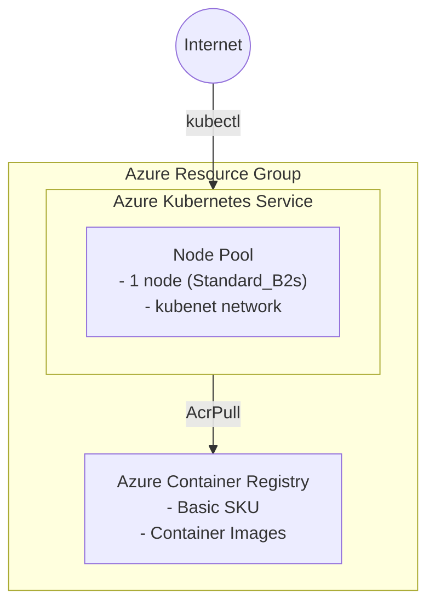

# Azure Kubernetes Playground Scenario

Deploy Azure Container Registry (ACR) and Azure Kubernetes Service (AKS) for basic container workload testing.

## Overview

This scenario creates:

- **Resource Group**: Container for all resources
- **Azure Container Registry (ACR)**: Basic tier container registry for storing container images
- **Azure Kubernetes Service (AKS)**: Basic Kubernetes cluster with kubelet identity configured to pull images from ACR

## Prerequisites

- Terraform CLI installed (>= 1.6.0)
- Azure CLI installed and logged in (`az login`)
- Azure subscription with permissions to create resources

## Architecture



## How to use

```shell
# Login to Azure
az login

# Initialize Terraform
terraform init

# Plan the deployment
terraform plan

# Apply the deployment
terraform apply -auto-approve

# Get AKS credentials
az aks get-credentials \
    --resource-group $(terraform output -raw resource_group_name) \
    --name $(terraform output -raw aks_name)

# Verify cluster access
kubectl get nodes

# Build and push an image to ACR
ACR_NAME=$(terraform output -raw acr_name)
az acr login --name $ACR_NAME
docker build -t $ACR_NAME.azurecr.io/myapp:v1 .
docker push $ACR_NAME.azurecr.io/myapp:v1

# Deploy to AKS
kubectl create deployment myapp --image=$ACR_NAME.azurecr.io/myapp:v1

# Destroy the deployment
terraform destroy -auto-approve
```

## Variables

| Name | Description | Type | Default | Required |
|------|-------------|------|---------|----------|
| `name` | Base name for resources | `string` | `"akubeplayground"` | no |
| `location` | Azure region for resources | `string` | `"japaneast"` | no |
| `tags` | Tags to apply to resources | `map(string)` | see variables.tf | no |
| `acr_sku` | SKU for Azure Container Registry | `string` | `"Basic"` | no |
| `acr_admin_enabled` | Enable admin user for ACR | `bool` | `false` | no |
| `kubernetes_version` | Kubernetes version (null for latest) | `string` | `null` | no |
| `vm_size` | VM size for AKS nodes | `string` | `"Standard_B2s"` | no |
| `node_count` | Number of nodes in default node pool | `number` | `1` | no |
| `os_disk_size_gb` | OS disk size in GB for AKS nodes | `number` | `30` | no |
| `network_plugin` | Network plugin (kubenet or azure) | `string` | `"kubenet"` | no |

## Outputs

| Name | Description |
|------|-------------|
| `resource_group_name` | Name of the resource group |
| `resource_group_id` | ID of the resource group |
| `acr_id` | ID of the Azure Container Registry |
| `acr_name` | Name of the Azure Container Registry |
| `acr_login_server` | Login server URL of ACR |
| `aks_id` | ID of the AKS cluster |
| `aks_name` | Name of the AKS cluster |
| `aks_fqdn` | FQDN of the AKS cluster |
| `aks_kube_config_raw` | Raw kubeconfig for the AKS cluster (sensitive) |
| `aks_node_resource_group` | Name of the resource group containing AKS nodes |

## Cost Optimization

This scenario is designed for cost-effective testing:

- **ACR Basic SKU**: Lowest cost tier, suitable for development/testing
- **AKS with Standard_B2s**: Burstable VM, economical for non-production workloads
- **Single node**: Minimal compute resources
- **kubenet networking**: No additional Azure CNI costs

## Notes

- AKS kubelet identity is automatically granted `AcrPull` role on the ACR
- No private endpoints or VNet integration (public access for simplicity)
- Auto-scaling is disabled by default
