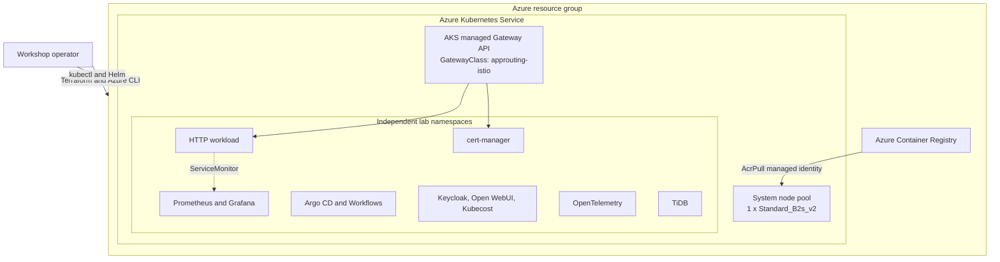

# Azure Kubernetes Playground Scenario

This scenario deploys Azure Container Registry (ACR) and Azure Kubernetes Service
(AKS), then provides numbered POSIX shell scripts for self-paced Kubernetes labs.
The labs port and update the material from
[`workshop-kubernetes`](https://github.com/ks6088ts-labs/workshop-kubernetes/tree/main/docs/scenarios)
without adding application source code.

The expected audience is an engineer with basic container and Kubernetes
knowledge. The core path takes about one day. Completing every optional lab takes
one to two days.

## Learning goals

After completing the relevant labs, you should be able to:

- distinguish Azure infrastructure managed by Terraform from Kubernetes and AKS
  add-on resources managed by post-deployment scripts;
- connect to, inspect, debug, stop, and restart an AKS cluster;
- import a container image into ACR and run it on AKS without an image pull secret;
- expose HTTP workloads with Kubernetes Gateway API;
- install and validate monitoring, GitOps, workflow, identity, GenAI UI, FinOps,
  observability, certificate, and distributed database components;
- identify the persistent data and cluster-scoped CRDs that remain after a lab;
- choose when a learning configuration must be replaced by a production design.

## What this scenario is not

This is a public-endpoint, development and learning environment. It is not a
production AKS baseline. It does not configure private networking, separate
system and user node pools, autoscaling, availability zones, backup, alerting,
policy enforcement, workload identity for applications, or production SSO.
Review the
[AKS baseline architecture](https://learn.microsoft.com/azure/architecture/reference-architectures/containers/aks/baseline-aks)
before adapting it for production.

Administrative web interfaces use `kubectl port-forward` by default. Only the
HTTP and certificate labs create public Layer 7 entry points.

## Ownership boundary

| Layer | Owner | Resources |
| --- | --- | --- |
| Azure infrastructure | Terraform | Resource group, ACR, AKS, managed identities, `AcrPull` role assignment |
| AKS platform extensions | Scripts `03` and `99 platform` | Managed Gateway API CRDs and Application Routing Gateway API implementation |
| Workshop workloads | Scripts `04` through `15` | Namespaces, Helm releases, Operators, Deployments, Services, Gateway resources, PVCs |
| Persistent workshop data | Explicit operator decision | Open WebUI, Kubecost, and TiDB PVCs/PVs |

The AzureRM provider does not currently expose the AKS managed Gateway API and
Application Routing Istio combination used by this workshop. Script `03` manages
that add-on lifecycle explicitly with Azure CLI. Do not add the same resources
to another tool without first changing this ownership boundary.

## Architecture


```mermaid
flowchart TB
    User[Workshop operator]

    subgraph Azure[Azure resource group]
        ACR[Azure Container Registry]

        subgraph AKS[Azure Kubernetes Service]
          Nodes[System node pool<br/>1 x Standard_B2s_v2]
            Gateway[AKS managed Gateway API<br/>GatewayClass: approuting-istio]

            subgraph Labs[Independent lab namespaces]
                HTTP[HTTP workload]
                Monitoring[Prometheus and Grafana]
                Delivery[Argo CD and Workflows]
                Platforms[Keycloak, Open WebUI, Kubecost]
                Observability[OpenTelemetry]
                TLS[cert-manager]
                Data[TiDB]
            end
        end
    end

    User -->|Terraform and Azure CLI| Azure
    User -->|kubectl and Helm| AKS
    ACR -->|AcrPull managed identity| Nodes
    Gateway --> HTTP
    Gateway --> TLS
    HTTP -.->|ServiceMonitor| Monitoring
```

The scenario preserves its existing workshop defaults: one `Standard_B2s_v2`
node. Confirm that this VM SKU and node count satisfy the AKS system-pool
requirements for the target subscription, region, and Kubernetes version before
deployment. Override `vm_size` and `node_count` explicitly when the target
environment requires a different supported configuration. See
[Use system node pools in AKS](https://learn.microsoft.com/azure/aks/use-system-pools).

## Prerequisites

- An Azure subscription and permission to create the scenario resources and the
  `AcrPull` role assignment.
- Azure CLI, Terraform, `kubectl`, Helm, `jq`, `curl`, and OpenSSL.
- Helm 4 for the optional full OpenTelemetry Demo.
- `dig` and control of a public DNS name for the certificate lab.
- A MySQL-compatible client for the optional local TiDB SQL exercise.

Follow the shared [Azure authentication](../../../docs/tips/provider-authentication.md),
[Terraform workflow](../../../docs/tips/terraform-workflow.md), and optional
[Azure Blob Storage backend](../../../docs/tips/azure-blob-backend.md) guidance.

## Deploy the infrastructure

From this directory:

```bash
terraform init
terraform fmt -check
terraform validate
terraform plan -out main.tfplan
terraform apply main.tfplan
```

Or use the repository Makefile with
`SCENARIO=azure_kubernetes_playground`.

### Cluster sizing

The scenario continues to default to one `Standard_B2s_v2` node, so these
workshop changes do not require a node-pool sizing migration. If you explicitly
override `vm_size` for an existing state, AzureRM rotates the default node pool
through a temporary pool. Back up persistent data, clean up workshop workloads,
and review the Terraform plan before applying that rotation because AKS does not
cordon and drain workloads during this operation.

## Prepare the cluster

Run the foundation scripts in order:

```bash
./scripts/00_validate_prerequisites.sh
./scripts/01_connect_aks_cluster.sh
./scripts/02_manage_cluster.sh status
./scripts/03_enable_gateway_api.sh
```

Script `01` retrieves credentials, waits for at least one Ready node, lists the
node-pool shape and StorageClasses, verifies metrics-server, and runs
`az aks check-acr`. The ACR integration uses the AKS kubelet managed identity and
the `AcrPull` role; see
[Integrate ACR with AKS](https://learn.microsoft.com/azure/aks/cluster-container-registry-integration).

Script `03` requires Azure CLI 2.86.0 or later. It installs AKS-managed standard
Gateway API CRDs, enables the `approuting-istio` GatewayClass, and creates one
shared HTTP Gateway. See
[Managed Gateway API installation](https://learn.microsoft.com/azure/aks/managed-gateway-api)
and
[Application Routing with Gateway API](https://learn.microsoft.com/azure/aks/app-routing-gateway-api).

The community ingress-nginx controller used by the source workshop was retired
in March 2026 and no longer receives security fixes. Kubernetes also freezes the
Ingress API and recommends Gateway API for new development. This port therefore
does not install ingress-nginx. See
[Ingress NGINX retirement](https://kubernetes.io/blog/2025/11/11/ingress-nginx-retirement/)
and [Gateway API](https://kubernetes.io/docs/concepts/services-networking/gateway/).

## Workshop path

Labs are independent unless a dependency is shown. Clean up a resource-intensive
lab before starting another one.

| Source scenario | Lab | Script | Time | Resource profile | Dependency |
| --- | --- | --- | ---: | --- | --- |
| 0 | AKS operation and debugging | `00`-`03` | 30 min | Foundation | Terraform apply |
| 1 | Publish an HTTP service | `04` | 30 min | Light | Shared Gateway |
| 2 | Prometheus and Grafana | `05` | 45-60 min | Medium | HTTP recommended |
| 3 | GitOps with Argo CD | `06` | 45 min | Medium | None |
| 3 | Workflow execution | `07` | 30 min | Medium | None |
| 4 | Identity with Keycloak | `08` | 45-60 min | Medium | None |
| 5 | GenAI UI with Open WebUI | `09` | 30 min | Medium, persistent | External model provider |
| 6 | Dify | Excluded | - | Heavy | See exclusion below |
| 7 | Cost visibility with Kubecost | `10` | 45 min | Heavy, persistent | None |
| 8 | Lightweight OpenTelemetry | `11` | 45 min | Medium | None |
| 8 | Full OpenTelemetry Demo | `12` | 60-90 min | Heavy | Helm 4, 6 GiB free memory |
| 9 | cert-manager and HTTPS | `13`, `14` | 45-90 min | Medium, public DNS | Gateway and DNS |
| 10 | TiDB Operator | `15` | 60 min | Heavy, persistent | Default StorageClass |

### Lab 0: Operate and debug AKS

```bash
# Inspect power state
./scripts/02_manage_cluster.sh status

# Stop only after cleaning up active exercises
CONFIRM_STOP=stop-aks-workshop-cluster \
  ./scripts/02_manage_cluster.sh stop

# Start and reconnect
./scripts/02_manage_cluster.sh start
./scripts/01_connect_aks_cluster.sh

# Inspect and debug workloads
kubectl get pods --all-namespaces
kubectl describe pod <pod-name> --namespace <namespace>
kubectl logs <pod-name> --namespace <namespace>
kubectl debug -it <pod-name> --image=busybox:1.37.0 --profile=general
```

AKS stop/start retains supported Kubernetes objects but removes unmanaged
standalone Pods, and a stopped cluster cannot be scaled or upgraded until it is
started. Review
[Stop and start an AKS cluster](https://learn.microsoft.com/azure/aks/start-stop-cluster)
and [Debug running Pods](https://kubernetes.io/docs/tasks/debug/debug-application/debug-running-pod/).

### Lab 1: Publish an HTTP service

```bash
./scripts/04_deploy_http_service.sh
```

The script imports `ks6088ts/workshop-kubernetes:0.0.5` into the scenario ACR,
deploys two replicas, and creates an `HTTPRoute` attached to the shared Gateway.
It succeeds only after the rollout, `Accepted` and `ResolvedRefs` route
conditions, `/healthz`, and `/metrics` checks pass.

Learning points: Deployment/ReplicaSet/Pod ownership, ClusterIP Service and DNS,
probes, resources, ACR managed-identity pulls, Gateway/HTTPRoute roles, and the
difference between public routing and port forwarding.

```bash
CONFIRM_CLEANUP=delete-kubernetes-workshop-resources \
  ./scripts/99_cleanup.sh http
```

### Lab 2: Monitor with Prometheus and Grafana

```bash
./scripts/05_deploy_monitoring.sh
```

The script installs the pinned `kube-prometheus-stack` chart and adds the HTTP
`ServiceMonitor` when Lab 1 exists. It prints port-forward commands for both UIs.
The lab profile uses two-hour Prometheus retention and ephemeral Grafana data.

Learning points: Helm releases, Prometheus Operator CRDs, target discovery with
`ServiceMonitor`, PromQL, Kubernetes metrics, and Grafana dashboards. The chart
and its remaining CRDs are documented at
[kube-prometheus-stack](https://github.com/prometheus-community/helm-charts/tree/main/charts/kube-prometheus-stack).

```bash
CONFIRM_CLEANUP=delete-kubernetes-workshop-resources \
  ./scripts/99_cleanup.sh monitoring
```

### Lab 3: GitOps and workflows

```bash
./scripts/06_deploy_argocd.sh
./scripts/07_deploy_argo_workflows.sh
```

Argo CD deploys the official guestbook example from pinned Git revision
`8088f4c0d970abb09e250248cc97e35623447cb5`. The script waits for `Synced` and
`Healthy`. Retrieve the generated administrator credentials from
`argocd-initial-admin-secret`, change the password, and delete that initial
Secret after the exercise.

Argo Workflows submits a local, pinned-image `hello-world` Workflow and waits for
`Succeeded`. The `argo` CLI is optional; Kubernetes status remains the script's
verification gate.

Learning points: desired state in Git, reconciliation, drift correction, sync
health, Kubernetes CRDs, workflow DAG execution, and RBAC. See
[Argo CD getting started](https://argo-cd.readthedocs.io/en/stable/getting_started/)
and
[Argo Workflows quick start](https://argo-workflows.readthedocs.io/en/latest/quick-start/).

```bash
CONFIRM_CLEANUP=delete-kubernetes-workshop-resources ./scripts/99_cleanup.sh workflows
CONFIRM_CLEANUP=delete-kubernetes-workshop-resources ./scripts/99_cleanup.sh argocd
```

### Lab 4: Run Keycloak with the official Operator

```bash
./scripts/08_deploy_keycloak.sh
```

The lab installs Keycloak Operator `26.7.2`, generates a database password,
runs an ephemeral PostgreSQL database, creates a development-only Keycloak CR,
and imports a sample realm. It waits for Keycloak `Ready` and realm import
`Done`. Use the printed port-forward command and retrieve the generated initial
administrator from `workshop-keycloak-initial-admin`.

The Operator does not manage a production database. HTTP and strict hostname
checks are relaxed only for this port-forwarded learning deployment. See
[Keycloak Operator installation](https://www.keycloak.org/operator/installation),
[basic deployment](https://www.keycloak.org/operator/basic-deployment), and
[advanced configuration](https://www.keycloak.org/operator/advanced-configuration).

```bash
CONFIRM_CLEANUP=delete-kubernetes-workshop-resources \
  ./scripts/99_cleanup.sh keycloak
```

### Lab 5: Run Open WebUI

```bash
./scripts/09_deploy_open_webui.sh
```

The script creates a random `WEBUI_SECRET_KEY`, installs the official chart with
a 2 GiB PVC, and disables bundled Ollama, Pipelines, and Redis to fit the
workshop baseline. Configure an external model provider after the first login.
This scenario does not deploy a model, GPU node pool, or API credential.

Learning points: Stateful application storage, runtime Secrets, Helm values,
service access, and the separation between a chat UI and a model endpoint. See
[Open WebUI quick start](https://docs.openwebui.com/getting-started/quick-start/)
and [the official Helm chart](https://github.com/open-webui/helm-charts).

```bash
# Keeps the PVC and namespace by default
CONFIRM_CLEANUP=delete-kubernetes-workshop-resources \
  ./scripts/99_cleanup.sh open-webui
```

### Scenario 6 exclusion: Dify

Dify is intentionally not deployed. Dify's official self-hosted distribution is
Docker Compose and currently starts multiple core and dependent services. The
source workshop uses a GPL-3.0 third-party Kubernetes manifest containing fixed
credentials, broad namespace RBAC, `hostPath` storage, and outdated images.
Vendoring or executing that manifest would conflict with this scenario's
security and reproducibility goals. See
[Dify Docker Compose deployment](https://docs.dify.ai/en/self-host/quick-start/docker-compose)
and the source workshop for the original discussion.

### Lab 7: Inspect cost allocation with Kubecost

```bash
./scripts/10_deploy_kubecost.sh
```

The lab uses Kubecost `3.2.4`. Its profile reduces the aggregator database from
128 GiB to 8 GiB, local store to 2 GiB, retention to two days, and disables
forecasting, network costs, and cluster-controller. Data needs time to
accumulate. Cloud billing integration is outside scope, so allocation uses the
data available inside the cluster and list-price behavior.

See [Kubecost installation](https://github.com/kubecost/kubecost#installation)
and [Kubecost Self Hosted documentation](https://www.ibm.com/docs/en/kubecost/self-hosted/3.x).

```bash
# Keeps PVCs and namespace by default
CONFIRM_CLEANUP=delete-kubernetes-workshop-resources \
  ./scripts/99_cleanup.sh kubecost
```

### Lab 8: Learn OpenTelemetry

Start with the lightweight, local manifest stack:

```bash
./scripts/11_deploy_otel_lightweight.sh
```

It runs OpenTelemetry Collector, Jaeger, Prometheus, and two five-minute
telemetrygen Jobs. The script waits for both Jobs and verifies the Jaeger and
Prometheus APIs through the Kubernetes API server. Continue with the detailed
[lightweight exercise](examples/otel_k8s/README.md).

The full official Demo is optional and needs Helm 4 and at least 6 GiB of free
cluster memory:

```bash
CONFIRM_RESOURCE_INTENSIVE=deploy-full-otel-demo \
  ./scripts/12_deploy_otel_demo.sh
```

Do not run the full Demo at the same time as other heavy labs. The Demo bundles
many microservices plus Collector, Jaeger, Prometheus, Grafana, and OpenSearch.
See
[OpenTelemetry Demo on Kubernetes](https://opentelemetry.io/docs/demo/kubernetes-deployment/).

```bash
CONFIRM_CLEANUP=delete-kubernetes-workshop-resources ./scripts/99_cleanup.sh otel-demo
CONFIRM_CLEANUP=delete-kubernetes-workshop-resources ./scripts/99_cleanup.sh otel-lightweight
```

### Lab 9: Issue an HTTPS certificate

First install cert-manager and allocate a dedicated HTTP Gateway:

```bash
./scripts/13_install_cert_manager.sh
```

Create a public DNS A record for your test hostname using the address printed by
the script. After DNS propagation, use the Let's Encrypt staging environment:

```bash
ACME_EMAIL="operator@example.com" \
DNS_NAME="tls.example.com" \
./scripts/14_issue_certificate.sh
```

Script `14` refuses to continue until the A record resolves to the Gateway. It
creates a Gateway API HTTP-01 solver, ClusterIssuer, Certificate, HTTPS listener,
and HTTPRoute, then waits for `Certificate Ready`. Staging certificates are not
trusted by browsers. Let's Encrypt strongly recommends staging before
production to avoid rate limits.

After staging succeeds, production requires explicit opt-in:

```bash
ACME_ENV=production \
CONFIRM_PRODUCTION_CERTIFICATE=issue-production-certificate \
ACME_EMAIL="operator@example.com" \
DNS_NAME="tls.example.com" \
./scripts/14_issue_certificate.sh
```

See [cert-manager Helm installation](https://cert-manager.io/docs/installation/helm/),
[Gateway HTTP-01](https://cert-manager.io/docs/configuration/acme/http01/), and
[Let's Encrypt staging](https://letsencrypt.org/docs/staging-environment/).

```bash
CONFIRM_CLEANUP=delete-kubernetes-workshop-resources \
  ./scripts/99_cleanup.sh cert-manager
```

### Lab 10: Run a TiDB test cluster

```bash
CONFIRM_STATEFUL_WORKLOAD=deploy-tidb-test-cluster \
  ./scripts/15_deploy_tidb.sh
```

The script installs official TiDB Operator `v1.6.6` and a non-production TiDB
`v8.5.7` topology with one PD, one TiKV, and one TiDB replica. PD and TiKV each
request 1 GiB from the default StorageClass. Connect through the printed
port-forward command with a MySQL-compatible client.

The cluster is not highly available. Its PV reclaim policy is `Retain`, so
deleting the TiDB CR does not delete data. See
[Get started with TiDB on Kubernetes](https://docs.pingcap.com/tidb-in-kubernetes/stable/get-started/)
and
[Destroy TiDB clusters](https://docs.pingcap.com/tidb-in-kubernetes/stable/destroy-a-tidb-cluster/).

The source workshop also introduces local `tiup playground`. Run that manually
outside AKS when comparing a local process-based playground with an Operator:

```bash
tiup playground v8.5.7
```

```bash
# Keeps TiDB PVCs/PVs and the tidb-cluster namespace by default
CONFIRM_CLEANUP=delete-kubernetes-workshop-resources \
  ./scripts/99_cleanup.sh tidb
```

## Cleanup and destruction

Every cleanup requires the exact confirmation value:

```bash
CONFIRM_CLEANUP=delete-kubernetes-workshop-resources \
  ./scripts/99_cleanup.sh <target>
```

Supported targets are `http`, `monitoring`, `argocd`, `workflows`, `keycloak`,
`open-webui`, `kubecost`, `otel-lightweight`, `otel-demo`, `cert-manager`,
`tidb`, `all`, and `platform`.

`all` removes workshop compute resources in reverse order but retains:

- Terraform-managed Azure resources;
- cluster-scoped CRDs installed by Operators and charts;
- Open WebUI, Kubecost, and TiDB persistent data;
- the imported `workshop-kubernetes` ACR repository;
- the AKS-managed Gateway API platform.

Delete persistent workshop data only after reviewing it:

```bash
CONFIRM_CLEANUP=delete-kubernetes-workshop-resources \
CONFIRM_DELETE_DATA=delete-persistent-workshop-data \
  ./scripts/99_cleanup.sh tidb
```

Delete the imported ACR repository separately:

```bash
CONFIRM_CLEANUP=delete-kubernetes-workshop-resources \
CONFIRM_DELETE_ACR_IMAGE=delete-workshop-acr-image \
  ./scripts/99_cleanup.sh http
```

Disable the Gateway platform only after every Gateway and HTTPRoute is gone:

```bash
CONFIRM_CLEANUP=delete-kubernetes-workshop-resources \
CONFIRM_PLATFORM_CLEANUP=disable-aks-gateway-platform \
  ./scripts/99_cleanup.sh platform
```

Finally remove Terraform-managed infrastructure with a reviewed destroy plan:

```bash
terraform plan -destroy -out destroy.tfplan
terraform apply destroy.tfplan
```

## Cost management

The default `Standard_B2s_v2` node incurs compute cost. Prices vary by region and
agreement, so this document does not hard-code a monthly estimate.

Before deployment, use:

```bash
make cost SCENARIO=azure_kubernetes_playground
```

Also review the [Azure Pricing Calculator](https://azure.microsoft.com/pricing/calculator/).
Clean up lab LoadBalancers and PVCs, stop a cluster that will be reused soon,
and destroy the scenario when it is no longer needed. Storage and network
resources can continue to incur charges while compute is stopped.

## Script configuration

Important environment overrides include:

| Variable | Default | Purpose |
| --- | --- | --- |
| `DRY_RUN` | `false` | Print mutating commands where supported |
| `MIN_READY_NODES` | `1` | Minimum Ready nodes required by the AKS connection check |
| `KUBECTL_WAIT_TIMEOUT` | `5m` | Kubernetes rollout timeout |
| `HELM_WAIT_TIMEOUT` | `15m` | Helm and long-running workload timeout |
| `KUBE_PROMETHEUS_STACK_VERSION` | `88.5.4` | Monitoring chart |
| `ARGOCD_CHART_VERSION` | `10.4.0` | Argo CD chart |
| `ARGO_WORKFLOWS_CHART_VERSION` | `2.0.2` | Argo Workflows chart |
| `KEYCLOAK_OPERATOR_VERSION` | `26.7.2` | Keycloak Operator distribution |
| `OPEN_WEBUI_CHART_VERSION` | `16.0.0` | Open WebUI chart |
| `KUBECOST_CHART_VERSION` | `3.2.4` | Kubecost chart |
| `OTEL_DEMO_CHART_VERSION` | `0.41.0` | OpenTelemetry Demo chart |
| `CERT_MANAGER_CHART_VERSION` | `v1.21.1` | cert-manager chart |
| `TIDB_OPERATOR_VERSION` | `v1.6.6` | TiDB Operator and CRDs |

Keep overrides explicit and review upstream upgrade notes before changing a
major chart version.

## Variables

| Name | Description | Type | Default | Required |
| --- | --- | --- | --- | --- |
| `name` | Base name for resources | `string` | `"azurekubernetesplayground"` | no |
| `location` | Azure region | `string` | `"japaneast"` | no |
| `tags` | Resource tags | `map(string)` | See `variables.tf` | no |
| `acr_sku` | ACR SKU | `string` | `"Basic"` | no |
| `acr_admin_enabled` | Enable ACR admin account | `bool` | `false` | no |
| `kubernetes_version` | AKS version (`null` selects the service default) | `string` | `null` | no |
| `oidc_issuer_enabled` | Enable AKS OIDC issuer | `bool` | `false` | no |
| `vm_size` | Default system-pool VM size | `string` | `"Standard_B2s_v2"` | no |
| `node_count` | Default system-pool node count | `number` | `1` | no |
| `os_disk_size_gb` | Node OS disk size | `number` | `30` | no |
| `network_plugin` | `kubenet` or `azure` | `string` | `"kubenet"` | no |

## Outputs

| Name | Description |
| --- | --- |
| `resource_group_name` / `resource_group_id` | Scenario resource group |
| `acr_id` / `acr_name` / `acr_login_server` | Container registry identifiers |
| `aks_id` / `aks_name` / `aks_fqdn` | AKS identifiers |
| `aks_kube_config_raw` | Raw kubeconfig; sensitive and not loaded by workshop scripts |
| `aks_node_resource_group` | AKS-managed node resource group |

## Troubleshooting

```bash
# Confirm the selected targets before changing anything
az account show --output table
kubectl config current-context

# Re-run the foundation checks
./scripts/00_validate_prerequisites.sh
./scripts/01_connect_aks_cluster.sh

# Inspect scheduling failures and recent events
kubectl get pods --all-namespaces
kubectl get events --all-namespaces --sort-by=.lastTimestamp
kubectl describe pod <pod-name> --namespace <namespace>

# Inspect capacity before a heavy lab
kubectl top nodes
kubectl top pods --all-namespaces
```

`kubectl port-forward` is TCP-only and requires permission on the
`pods/portforward` subresource. It can bypass normal network entry points, so
restrict its RBAC in shared clusters. See
[Use port forwarding](https://kubernetes.io/docs/tasks/access-application-cluster/port-forward-access-application-cluster/).

## References

### Official Microsoft documentation

- [AKS core concepts](https://learn.microsoft.com/azure/aks/core-aks-concepts)
- [Deploy AKS with Terraform](https://learn.microsoft.com/azure/aks/learn/quick-kubernetes-deploy-terraform)
- [Use system node pools](https://learn.microsoft.com/azure/aks/use-system-pools)
- [Integrate ACR with AKS](https://learn.microsoft.com/azure/aks/cluster-container-registry-integration)
- [Managed Gateway API installation](https://learn.microsoft.com/azure/aks/managed-gateway-api)
- [Application Routing Gateway API](https://learn.microsoft.com/azure/aks/app-routing-gateway-api)
- [Stop and start an AKS cluster](https://learn.microsoft.com/azure/aks/start-stop-cluster)

### Kubernetes and project documentation

- [Kubernetes Gateway API](https://kubernetes.io/docs/concepts/services-networking/gateway/)
- [Helm documentation](https://helm.sh/docs/)
- [Prometheus Operator](https://prometheus-operator.dev/docs/getting-started/introduction/)
- [Argo CD](https://argo-cd.readthedocs.io/en/stable/getting_started/)
- [Argo Workflows](https://argo-workflows.readthedocs.io/en/latest/quick-start/)
- [Keycloak Operator](https://www.keycloak.org/operator/installation)
- [Open WebUI Helm charts](https://github.com/open-webui/helm-charts)
- [Kubecost](https://github.com/kubecost/kubecost)
- [OpenTelemetry Demo](https://opentelemetry.io/docs/demo/kubernetes-deployment/)
- [cert-manager](https://cert-manager.io/docs/installation/helm/)
- [TiDB Operator](https://docs.pingcap.com/tidb-in-kubernetes/stable/get-started/)
