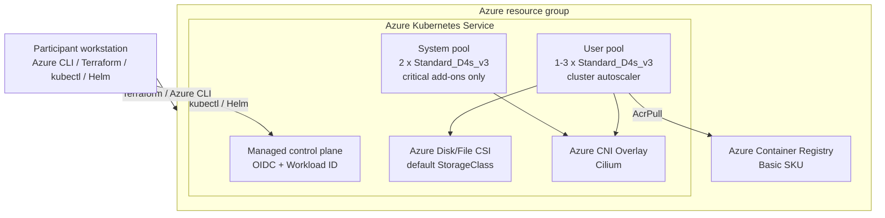

# Azure Kubernetes Playground Scenario

This scenario deploys an Azure Kubernetes Service (AKS) cluster for Kubernetes fundamentals and the scenarios in [workshop-kubernetes](https://github.com/ks6088ts-labs/workshop-kubernetes/tree/main/docs/scenarios).

> [!IMPORTANT]
> This is a disposable learning environment, not a production baseline. It deliberately keeps a public API endpoint and omits private networking, Microsoft Entra administrator groups, Azure Policy, Defender for Containers, and managed monitoring. Review the [AKS baseline architecture](https://learn.microsoft.com/azure/architecture/reference-architectures/containers/aks/baseline-aks) before adapting it for production.

## What this scenario creates

- A resource group for all scenario resources.
- An Azure Container Registry (ACR) Basic registry with the admin account disabled.
- An AKS cluster with a supported two-node system pool.
- A separate auto-scaling user node pool for workshop workloads.
- Azure CNI Overlay networking with the Cilium data plane and network policy enforcement.
- A Standard Azure Load Balancer for `LoadBalancer` Services.
- OIDC issuer and Microsoft Entra Workload ID.
- Azure Key Vault Secrets Store CSI driver with secret rotation.
- An `AcrPull` role assignment for the AKS kubelet identity.
- AKS built-in CSI storage classes for dynamic PersistentVolume provisioning.

The default system pool uses two `Standard_D4s_v3` nodes. AKS system pools don't support B-series VMs and require at least four vCPUs and 4 GB of memory per node. The user pool starts at one `Standard_D4s_v3` node and scales from one to three nodes. This gives the OpenTelemetry Demo more than its documented requirement of 6 GB of free memory while keeping workshop workloads isolated from critical system Pods.

## Architecture


```mermaid
flowchart TB
    Operator["Participant workstation<br/>Azure CLI / Terraform / kubectl / Helm"]

    subgraph Azure["Azure resource group"]
        ACR["Azure Container Registry<br/>Basic SKU"]

        subgraph AKS["Azure Kubernetes Service"]
            ControlPlane["Managed control plane<br/>OIDC + Workload ID"]
            SystemPool["System pool<br/>2 x Standard_D4s_v3<br/>critical add-ons only"]
            UserPool["User pool<br/>1-3 x Standard_D4s_v3<br/>cluster autoscaler"]
            CSI["Azure Disk/File CSI<br/>default StorageClass"]
            Cilium["Azure CNI Overlay<br/>Cilium"]
        end
    end

    Operator -->|Terraform / Azure CLI| Azure
    Operator -->|kubectl / Helm| ControlPlane
    UserPool -->|AcrPull| ACR
    UserPool --> CSI
    SystemPool --> Cilium
    UserPool --> Cilium
```

## Prerequisites

| Tool | Minimum or purpose |
| --- | --- |
| Azure CLI | Sign in and retrieve AKS credentials |
| Terraform | 1.6 or later |
| kubectl | Use a version within one minor release of the cluster |
| Helm | Install workshop applications |
| Docker | Exercise the ACR push/pull path |
| jq | Run the validation scripts |

Some upstream scenarios also require `kubens`, `k9s`, `argocd`, or `argo`. The preflight script reports missing optional tools without failing the base environment.

Follow the shared [Azure authentication](../../../docs/tips/provider-authentication.md),
[Terraform workflow](../../../docs/tips/terraform-workflow.md), and optional
[Azure Blob Storage backend](../../../docs/tips/azure-blob-backend.md) guidance.
Set `SCENARIO=azure_kubernetes_playground` when using the repository Makefile.

Sign in and select the intended subscription before provisioning:

```bash
az login
az account set --subscription <subscription-id-or-name>

./infra/scenarios/azure_kubernetes_playground/scripts/00_validate_prerequisites.sh
```

The preflight checks the required commands, Terraform version, Azure CLI session, VM SKU availability, and regional/family vCPU quota for the initial two system nodes and one user node. Override `LOCATION`, `SYSTEM_VM_SIZE`, `USER_VM_SIZE`, `SYSTEM_NODE_COUNT`, or `USER_NODE_MIN_COUNT` when validating a customized configuration.

## Deploy

Deploy the infrastructure with the shared workflow and
`SCENARIO=azure_kubernetes_playground`, then complete the scenario-specific
connection and validation steps below.

Provisioning three or more nodes can take several minutes. Check Azure regional vCPU quota if node creation remains pending.

## Connect and validate

Retrieve credentials and run the post-deployment checks:

```bash
./infra/scenarios/azure_kubernetes_playground/scripts/10_get_credentials.sh
./infra/scenarios/azure_kubernetes_playground/scripts/20_validate_cluster.sh
```

The cluster check verifies Azure CNI Overlay/Cilium, OIDC and Workload Identity, Key Vault CSI, Ready system/user nodes, at least 8 GiB of allocatable user-pool memory, a default StorageClass, and Metrics API readiness.

## Kubernetes fundamentals exercise

Run the self-contained fundamentals exercise before installing larger platforms:

```bash
./infra/scenarios/azure_kubernetes_playground/scripts/30_run_kubernetes_basics.sh
```

It covers ConfigMap, generated Secret, ServiceAccount, Role/RoleBinding, Deployment, Service, probes, requests/limits, PodDisruptionBudget, HPA, StatefulSet, PVC, DaemonSet, Job, CronJob, and NetworkPolicy. See [examples/kubernetes_basics/README.md](examples/kubernetes_basics/README.md) for inspection and cleanup commands.

The generated Secret contains training-only data. Never commit real credentials. Azure-connected applications should use Workload Identity and Key Vault rather than API keys or connection strings in manifests.

## Verify ACR integration

The scenario doesn't assume an application Dockerfile. Use a pinned public image to test the complete ACR pull path:

```bash
SCENARIO_DIR=infra/scenarios/azure_kubernetes_playground
ACR_NAME=$(terraform -chdir="$SCENARIO_DIR" output -raw acr_name)
ACR_LOGIN_SERVER=$(terraform -chdir="$SCENARIO_DIR" output -raw acr_login_server)

az acr login --name "$ACR_NAME"
docker pull nginx:1.27.4-alpine
docker tag nginx:1.27.4-alpine "$ACR_LOGIN_SERVER/workshop/nginx:1.27.4"
docker push "$ACR_LOGIN_SERVER/workshop/nginx:1.27.4"

kubectl create namespace acr-demo
kubectl create deployment acr-nginx \
  --namespace acr-demo \
  --image "$ACR_LOGIN_SERVER/workshop/nginx:1.27.4"
kubectl rollout status deployment/acr-nginx --namespace acr-demo --timeout=5m
kubectl delete namespace acr-demo
```

## OpenTelemetry examples

- [examples/otel_k8s/README.md](examples/otel_k8s/README.md) runs a small Collector, Jaeger, and Prometheus stack in AKS.
- [examples/otel_local/README.md](examples/otel_local/README.md) runs the equivalent stack with Docker Compose.

Container image tags are pinned. Update them intentionally and validate both Kubernetes and Compose variants together.

## External workshop scenario readiness

The Terraform scenario supplies infrastructure. The application manifests remain in the separate [workshop-kubernetes repository](https://github.com/ks6088ts-labs/workshop-kubernetes); clone it before running them. Run one heavy platform at a time and clean it up before moving to the next.

Load the chart versions verified on the date recorded in the profile instead of installing an unbounded latest chart:

```bash
SCENARIO_DIR=infra/scenarios/azure_kubernetes_playground
. "$SCENARIO_DIR/profiles/workshop-versions.env"
```

Pass the matching variable to each `helm upgrade --install` command with `--version`. For example, use the CPU-only Open WebUI profile with an external model endpoint:

```bash
helm repo add open-webui https://open-webui.github.io/helm-charts
helm repo update

helm upgrade --install openwebui open-webui/open-webui \
  --namespace genai \
  --create-namespace \
  --version "$OPEN_WEBUI_CHART_VERSION" \
  --values "$SCENARIO_DIR/profiles/open-webui-values.yaml"
```

This profile deliberately disables the bundled Ollama, Pipelines, and Redis workloads. Configure a model endpoint after installation and inject any required credential from a Kubernetes Secret or external secret provider.

| Scenario | Readiness | Required action |
| --- | --- | --- |
| 0. AKS setup | Ready | Use this Terraform deployment instead of the upstream cluster creation script. |
| 1. HTTP publishing | Gateway required | Use port-forward for local access or a maintained Gateway API implementation for HTTP publishing. Don't deploy ingress-nginx. |
| 2. Prometheus/Grafana | Ready with cleanup | Use `KUBE_PROMETHEUS_STACK_CHART_VERSION`. Prefer port-forward; standalone Grafana creates another public LoadBalancer. Use distinct Ingress names. |
| 3. Argo CD/Workflows | Ready with tools | Install `argocd` and `argo`, use the pinned Argo chart versions, and remove both releases before the next heavy scenario. |
| 4. Keycloak | Ready with cleanup | Use `KEYCLOAK_CHART_VERSION` and verify PVC binding. Docker Hub authentication can reduce pull throttling. |
| 5. Open WebUI | External model required | Configure an external OpenAI-compatible/Azure OpenAI endpoint or provide a GPU pool. Disable bundled Ollama on this CPU-only cluster and keep credentials out of Helm values. |
| 6. Dify | Replace manifest | Don't use the mutable manifest as-is: it contains fixed passwords, wildcard RBAC, and node-local `hostPath` data. Use reviewed manifests with Secrets, PVCs, and explicit limits. |
| 7. Kubecost | Ready with cleanup | Use `KUBECOST_CHART_VERSION`, set requests/limits, and uninstall it before another monitoring-heavy scenario. Azure cloud-cost allocation needs separate configuration. |
| 8. OpenTelemetry Demo | Ready in isolation | Use `OTEL_DEMO_CHART_VERSION`. It requires 6 GB of free RAM, so remove other large stacks before running it. |
| 9. cert-manager | Domain required | Use `CERT_MANAGER_CHART_VERSION`, replace hard-coded domain/email values, create public DNS records, and use a maintained Gateway/Ingress path reachable on port 80. |
| 10. TiDB | Tutorial incomplete | The cluster provides Kubernetes 1.24+, RBAC, DNS, Helm, and PVs; the upstream tutorial still needs pinned Operator CRDs, a `TidbCluster`, storage sizing, and cleanup. |

### Ingress and Gateway API

This scenario doesn't install an ingress controller. Use `kubectl port-forward` for local-only exercises or deploy a maintained Gateway API implementation and define the required `Gateway` and `HTTPRoute` resources.

Don't install multiple controllers into the same namespace. Several upstream examples also use the same hostless `/` route and must not run concurrently.

### Capacity and ordering

The cluster autoscaler adds nodes only when Pods are unschedulable because of requested resources. It doesn't replace container requests/limits or the HPA. Before a large Helm installation, check:

```bash
kubectl top nodes
kubectl get pods -A --field-selector=status.phase=Pending
kubectl describe pod <pending-pod> -n <namespace>
```

Recommended order:

1. Kubernetes fundamentals and the small local OpenTelemetry stack.
2. HTTP exposure or one identity/GitOps platform.
3. One monitoring or AI platform at a time.
4. cert-manager only after DNS and a maintained ingress/Gateway path exist.
5. TiDB only after defining its storage and resource profile.

## Cleanup

Preview the workshop namespaces selected for cleanup:

```bash
./infra/scenarios/azure_kubernetes_playground/scripts/99_cleanup_workloads.sh
```

Delete them only after reviewing the list:

```bash
./infra/scenarios/azure_kubernetes_playground/scripts/99_cleanup_workloads.sh --yes
```

Use each chart's `helm uninstall` first when possible. Namespace deletion might leave cluster-scoped CRDs. The most reliable cleanup for this disposable environment is:

```bash
make destroy SCENARIO=azure_kubernetes_playground
```

Verify that no state or billable resource remains before closing the workshop.

## Variables

| Name | Default | Purpose |
| --- | ---: | --- |
| `name` | `azurekubernetesplayground` | Base resource name |
| `location` | `japaneast` | Azure region |
| `acr_sku` / `acr_admin_enabled` | `Basic` / `false` | Registry tier and local credentials |
| `kubernetes_version` | `null` | Latest AKS-recommended version at creation |
| `automatic_upgrade_channel` | `patch` | Control-plane patch upgrades |
| `node_os_upgrade_channel` | `NodeImage` | Node image security updates |
| `oidc_issuer_enabled` | `true` | OIDC issuer for federated identity |
| `workload_identity_enabled` | `true` | Microsoft Entra Workload ID |
| `key_vault_secrets_provider_enabled` | `true` | Key Vault Secrets Store CSI driver |
| `vm_size` / `node_count` | `Standard_D4s_v3` / `2` | System pool capacity |
| `os_disk_size_gb` | `128` | System node OS disk |
| `auto_scaling_enabled` | `false` | System-pool autoscaler |
| `min_count` / `max_count` | `2` / `3` | System-pool autoscaler bounds |
| `network_plugin` / `network_plugin_mode` | `azure` / `overlay` | Azure CNI Overlay |
| `network_data_plane` / `network_policy` | `cilium` / `cilium` | Cilium data plane and policy |
| `user_node_pool_enabled` | `true` | Dedicated workload pool |
| `user_node_pool_vm_size` | `Standard_D4s_v3` | Workload node SKU |
| `user_node_pool_auto_scaling_enabled` | `true` | Workload-pool autoscaler |
| `user_node_pool_min_count` / `user_node_pool_max_count` | `1` / `3` | Workload-pool bounds |
| `user_node_pool_os_disk_size_gb` | `128` | Workload node OS disk |

Review [terraform.tfvars.example](terraform.tfvars.example) before changing capacity, and confirm regional SKU availability and quota.

## Outputs

Outputs include resource group, ACR, AKS, kubeconfig, node resource group, and user node pool identifiers. `aks_kube_config_raw` is sensitive; prefer `az aks get-credentials` instead of printing or storing it.

## Troubleshooting

### Terraform initialization rewrites the lock file

Run `terraform init -upgrade` intentionally, review `.terraform.lock.hcl`, and commit the updated provider selections. CI should use the committed lock file without upgrading.

### Nodes remain provisioning or Pods remain Pending

Check regional SKU restrictions and vCPU quota, then inspect Pod scheduling events. Don't remove requests or schedule workloads on the critical system pool to hide capacity failures.

### PVC remains Pending

Confirm a default StorageClass with `kubectl get storageclass`. AKS `managed-csi` dynamically provisions an Azure Disk. A disk is `ReadWriteOnce`; use Azure Files for concurrent access from multiple nodes.

### HPA reports unknown metrics

Wait for the AKS Metrics API, then run `kubectl top nodes` and `kubectl top pods -A`. The cluster validation script warns while metrics are warming up.

### LoadBalancer external IP remains Pending

Check Service events, Azure public IP quota, and `Microsoft.Network` registration. Each `LoadBalancer` Service can create billable resources; prefer port-forward unless public exposure is part of the exercise.

## References

- [Manage system node pools in AKS](https://learn.microsoft.com/azure/aks/use-system-pools)
- [Azure CNI Overlay](https://learn.microsoft.com/azure/aks/concepts-network-azure-cni-overlay)
- [AKS cluster autoscaler](https://learn.microsoft.com/azure/aks/cluster-autoscaler)
- [Storage options for AKS](https://learn.microsoft.com/azure/aks/concepts-storage)
- [Ingress in AKS](https://learn.microsoft.com/azure/aks/concepts-network-ingress)
- [Microsoft Entra Workload ID on AKS](https://learn.microsoft.com/azure/aks/workload-identity-overview)
- [Azure Key Vault provider for Secrets Store CSI Driver](https://learn.microsoft.com/azure/aks/csi-secrets-store-driver)
- [OpenTelemetry Demo Kubernetes prerequisites](https://opentelemetry.io/docs/demo/kubernetes-deployment/)
- [TiDB Operator prerequisites](https://docs.pingcap.com/tidb-in-kubernetes/stable/deploy-tidb-operator/)
- [cert-manager HTTP-01](https://cert-manager.io/docs/configuration/acme/http01/)
