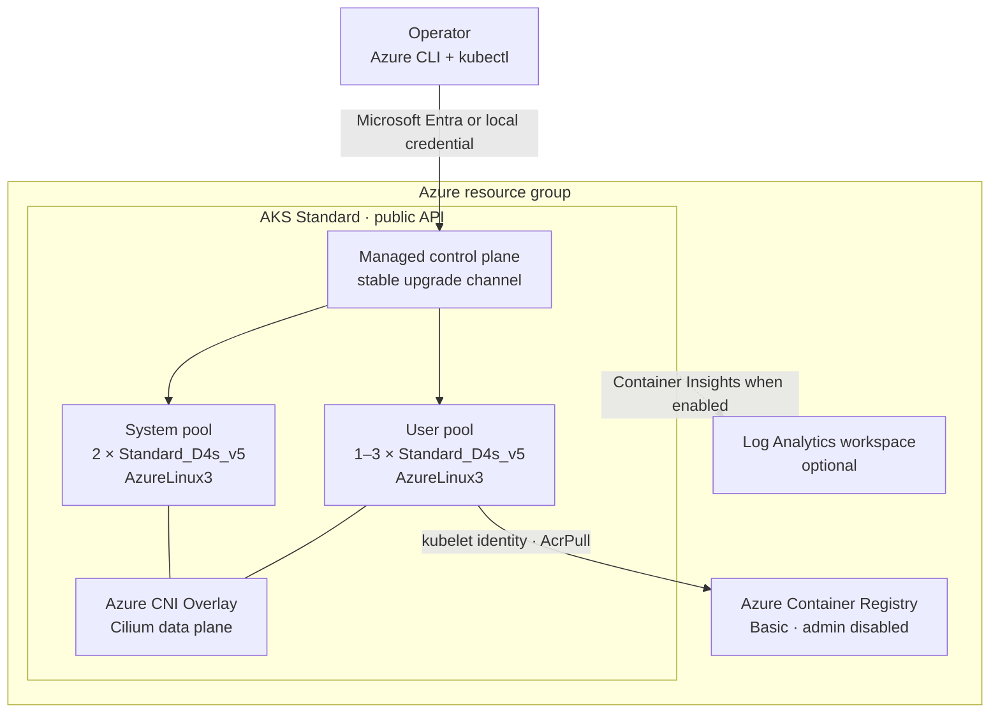

# Azure Kubernetes Playground Scenario

Deploy a reproducible Azure Kubernetes Service (AKS) Standard learning environment using the repository's reusable Terraform modules.

[日本語](./README.ja.md)

## What this scenario creates

- A resource group.
- An Azure Container Registry (ACR), using the Basic SKU and Microsoft Entra authentication by default.
- A public AKS Standard cluster with an AKS-managed virtual network.
- A fixed two-node system pool reserved for critical add-ons.
- A separate user pool that autos-scales from one to three nodes.
- An `AcrPull` role assignment for the AKS kubelet identity.
- Optionally, a Log Analytics workspace and Container Insights.

The baseline intentionally stays focused. It does not provision a private cluster, custom virtual network, Managed Prometheus, Azure Managed Grafana, Defender for Containers, Azure Policy, or Key Vault CSI.

## Baseline decisions

| Area | Default | Rationale |
| --- | --- | --- |
| AKS mode | Standard | Exposes the node-pool, identity, networking, and lifecycle controls useful for learning. |
| Control-plane tier | Free | Avoids an AKS control-plane SLA charge for a disposable playground. Node VMs and other resources are still billed. |
| Kubernetes version | AKS-selected recommended GA version | `kubernetes_version = null` avoids pinning an obsolete patch at creation time. |
| Upgrade lifecycle | `stable` cluster channel and `NodeImage` OS channel | Keeps the control plane and node images maintained after creation. |
| System pool | 2 × `Standard_D4s_v5`, `AzureLinux3` | Uses a supported general-purpose SKU and preserves system add-on availability. |
| User pool | 1–3 × `Standard_D4s_v5`, `AzureLinux3` | Isolates workloads from critical add-ons and demonstrates Cluster Autoscaler. |
| Node surge | `33%` on both pools | Provides upgrade capacity while making the temporary cost/quota requirement explicit. |
| Networking | Azure CNI Overlay powered by Cilium | Uses the recommended eBPF data plane and avoids the retiring kubenet baseline. |
| Egress | Standard Load Balancer, managed outbound IP | Keeps networking managed by AKS for this public learning scenario. |
| Workload identity | OIDC issuer and Workload Identity enabled | Provides keyless workload authentication without enabling legacy pod identity. |
| Cluster authentication | Kubernetes RBAC; local account retained | Keeps initial access simple. Managed Microsoft Entra integration can be enabled before disabling local accounts. |
| Image hygiene | Image Cleaner every 168 hours | Removes stale images on a weekly cadence. |
| Monitoring | Container Insights disabled | Avoids ingestion charges until explicitly enabled. |

## Architecture


```mermaid
flowchart TB
    Operator["Operator<br/>Azure CLI + kubectl"]

    subgraph RG["Azure resource group"]
        ACR["Azure Container Registry<br/>Basic · admin disabled"]
        LAW["Log Analytics workspace<br/>optional"]

        subgraph AKS["AKS Standard · public API"]
            API["Managed control plane<br/>stable upgrade channel"]
            SYS["System pool<br/>2 × Standard_D4s_v5<br/>AzureLinux3"]
            USER["User pool<br/>1–3 × Standard_D4s_v5<br/>AzureLinux3"]
            CILIUM["Azure CNI Overlay<br/>Cilium data plane"]
        end
    end

    Operator -->|Microsoft Entra or local credential| API
    API --> SYS
    API --> USER
    SYS --- CILIUM
    USER --- CILIUM
    USER -->|kubelet identity · AcrPull| ACR
    AKS -.->|Container Insights when enabled| LAW
```

## Prerequisites

- Terraform `>= 1.6.0`.
- Azure CLI and `kubectl`.
- An Azure subscription and an authenticated identity that can create the listed resources and role assignments.
- Regional availability and quota for at least three `Standard_D4s_v5` nodes (12 vCPUs), plus temporary surge capacity during upgrades.

Follow the shared [Azure authentication](../../../docs/tips/provider-authentication.md), [Terraform workflow](../../../docs/tips/terraform-workflow.md), and optional [Azure Blob Storage backend](../../../docs/tips/azure-blob-backend.md) guidance. Set `SCENARIO=azure_kubernetes_playground` when using the repository Makefile.

## Deploy

From the repository root:

```shell
cd infra/scenarios/azure_kubernetes_playground
terraform init
terraform plan -out=tfplan
terraform apply tfplan
```

The lock file selects AzureRM `5.3.0` and random `3.9.0` for reproducible initialization.

### Connect with kubectl

```shell
az aks get-credentials \
  --resource-group "$(terraform output -raw resource_group_name)" \
  --name "$(terraform output -raw aks_name)"

kubectl get nodes \
  -L kubernetes.azure.com/mode,kubernetes.azure.com/os-sku
kubectl get pods --all-namespaces
```

The Terraform outputs deliberately do not expose a raw kubeconfig or client certificates. Retrieve current credentials through Azure CLI instead.

### Verify lifecycle and networking

```shell
az aks show \
  --resource-group "$(terraform output -raw resource_group_name)" \
  --name "$(terraform output -raw aks_name)" \
  --query '{kubernetesVersion:kubernetesVersion,currentKubernetesVersion:currentKubernetesVersion,upgradeChannel:autoUpgradeProfile.upgradeChannel,nodeOsChannel:autoUpgradeProfile.nodeOSUpgradeChannel,networkPlugin:networkProfile.networkPlugin,networkPluginMode:networkProfile.networkPluginMode,networkDataPlane:networkProfile.networkDataplane,workloadIdentity:securityProfile.workloadIdentity.enabled}' \
  --output yaml

kubectl get nodes -o wide
```

## Optional configurations

Create a local `terraform.tfvars` for overrides. Do not commit tenant-specific IDs or internal network ranges.

### Restrict the public API

The default public API is reachable from any source that can authenticate. Restrict it for shared or long-lived environments:

```hcl
api_server_authorized_ip_ranges = [
  "203.0.113.10/32", # Replace with the operator or egress public IP.
]
```

### Use managed Microsoft Entra authentication and disable local accounts

```hcl
entra_id = {
  tenant_id = "00000000-0000-0000-0000-000000000000"
  admin_group_object_ids = [
    "11111111-1111-1111-1111-111111111111",
  ]
  azure_rbac_enabled = true
}

local_account_disabled = true
```

The module rejects `local_account_disabled = true` unless Kubernetes RBAC and an Entra admin group are configured.

### Enable Container Insights

```hcl
container_insights_enabled       = true
log_analytics_retention_in_days = 30
```

This creates the existing reusable Log Analytics module and enables managed-identity authentication for the AKS monitoring add-on. It does not enable Managed Prometheus or control-plane diagnostic settings.

### Define maintenance windows

```hcl
maintenance_window_auto_upgrade = {
  day_of_week = "Sunday"
  start_time  = "03:00"
  duration    = 4
  utc_offset  = "+09:00"
}

maintenance_window_node_os = {
  day_of_week = "Sunday"
  start_time  = "07:00"
  duration    = 4
  utc_offset  = "+09:00"
}
```

## OpenTelemetry examples

- [Docker Compose observability stack](./examples/otel_local/README.md)
- [Restricted Kubernetes observability manifests](./examples/otel_k8s/README.md)

The Kubernetes example runs application workloads on the autoscaling user pool because the system pool accepts only critical add-ons.

## Key variables

| Name | Type | Default |
| --- | --- | --- |
| `name` | `string` | `"azurekubernetesplayground"` |
| `location` | `string` | `"japaneast"` |
| `acr_sku` | `string` | `"Basic"` |
| `acr_admin_enabled` | `bool` | `false` |
| `kubernetes_version` | `string` | `null` |
| `sku_tier` | `string` | `"Free"` |
| `oidc_issuer_enabled` | `bool` | `true` |
| `workload_identity_enabled` | `bool` | `true` |
| `local_account_disabled` | `bool` | `false` |
| `entra_id` | `object` | `null` |
| `api_server_authorized_ip_ranges` | `set(string)` | `[]` |
| `automatic_upgrade_channel` | `string` | `"stable"` |
| `node_os_upgrade_channel` | `string` | `"NodeImage"` |
| `image_cleaner_enabled` | `bool` | `true` |
| `image_cleaner_interval_hours` | `number` | `168` |
| `system_node_pool` | `object` | 2 fixed `Standard_D4s_v5` Azure Linux 3 nodes |
| `user_node_pools` | `map(object)` | `user` pool, autoscaling 1–3 |
| `network_profile` | `object` | Azure CNI Overlay + Cilium, explicit IPv4 CIDRs |
| `maintenance_window_auto_upgrade` | `object` | `null` |
| `maintenance_window_node_os` | `object` | `null` |
| `container_insights_enabled` | `bool` | `false` |
| `log_analytics_retention_in_days` | `number` | `30` |

See [variables.tf](./variables.tf) for every nested profile field and its validation.

## Outputs

The scenario exposes resource group and ACR identifiers, AKS ID/name/FQDN/current version/OIDC issuer, the managed node resource group, user pool metadata, and optional Log Analytics identifiers. Credential-bearing kubeconfig values are intentionally absent.

## Cost and operational notes

> [!WARNING]
> The `Free` AKS tier applies only to the control plane. The default three `Standard_D4s_v5` VMs, managed disks, outbound public IP/load balancer, ACR, and optional Log Analytics ingestion are billed.

- The user pool can scale to three nodes, increasing compute cost.
- `33%` surge can temporarily add one node per upgrading pool; ensure quota and budget headroom.
- Availability zones are not enabled by default because supported zones vary by region and VM SKU. Set pool `zones` only after checking regional support.
- The public API and public ACR endpoint are intentional learning trade-offs, not a production network baseline.
- Keep ACR admin authentication disabled. AKS pulls images with its kubelet managed identity.
- Workload Identity enables keyless Azure access for pods, but each workload still needs a federated identity credential, service account annotation, and least-privilege Azure role assignment.

## Clean up

```shell
terraform plan -destroy -out=destroy.tfplan
terraform apply destroy.tfplan
```

## References

- [AKS best practices](https://learn.microsoft.com/azure/aks/best-practices)
- [System and user node pools](https://learn.microsoft.com/azure/aks/use-system-pools)
- [Azure CNI Overlay](https://learn.microsoft.com/azure/aks/concepts-network-azure-cni-overlay)
- [Azure CNI powered by Cilium](https://learn.microsoft.com/azure/aks/azure-cni-powered-by-cilium)
- [Microsoft Entra Workload ID](https://learn.microsoft.com/azure/aks/workload-identity-overview)
- [AKS automatic cluster upgrades](https://learn.microsoft.com/azure/aks/auto-upgrade-cluster)
- [AKS node OS automatic upgrades](https://learn.microsoft.com/azure/aks/auto-upgrade-node-os-image)
- [Integrate ACR with AKS](https://learn.microsoft.com/azure/aks/cluster-container-registry-integration)
- [Enable monitoring for AKS](https://learn.microsoft.com/azure/azure-monitor/containers/kubernetes-monitoring-enable)
- [AzureRM 5.3.0 AKS resource](https://registry.terraform.io/providers/hashicorp/azurerm/5.3.0/docs/resources/kubernetes_cluster)
