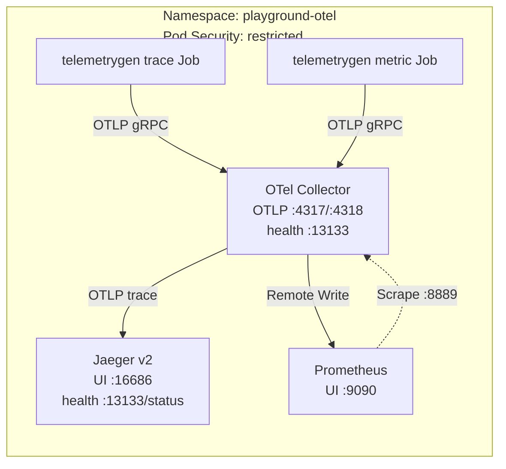

# Kubernetes 上の OpenTelemetry observability stack

Playground の AKS user pool に小規模な trace、metric、log 学習 stack をデプロイします。[ローカル Docker Compose stack](../otel_local/README.ja.md) と同じ flow を再現しながら、Kubernetes の設定、health check、security context、service discovery を学びます。

[English](./README.md)

## コンポーネントと version

| コンポーネント | 固定した image | Kubernetes resource | 用途 |
| --- | --- | --- | --- |
| Jaeger v2 | `jaegertracing/jaeger:2.20.0` | Deployment + Service | In-memory trace backend と UI |
| Prometheus | `prom/prometheus:v3.14.0` | ConfigMap + Deployment + Service | Scrape/Remote Write ingestion と PromQL |
| OpenTelemetry Collector Contrib | `otel/opentelemetry-collector-contrib:0.159.0` | ConfigMap + Deployment + Service | OTLP の受信、batch、export |
| telemetrygen | `ghcr.io/open-telemetry/opentelemetry-collector-contrib/telemetrygen:v0.159.0` | 2 つの Job | Trace と metrics を 5 分間生成 |

Manifest では可変の `latest` tag を使用しません。

## アーキテクチャ



Metric pipeline は pull と push の両方を示します。Prometheus は Collector の `:8889` endpoint を scrape し、`/api/v1/write` で Remote Write を受信します。実環境では series の重複を避ける ingestion strategy を選択してください。

## Security baseline

Namespace は Kubernetes の `restricted` Pod Security Standard を enforce します。すべての Pod は次を満たします。

- Image 固有の数値 non-root UID/GID と runtime-default seccomp profile で実行。
- privilege escalation を無効化し、Linux capability をすべて drop。
- read-only root filesystem を使用。
- service account token の自動 mount を無効化。
- CPU と memory の requests/limits を指定。

Writable な `emptyDir` は Prometheus、Jaeger、Collector が必要とする path のみに mount します。Service は `ClusterIP` のままで、UI を public に公開しません。

## 前提条件

1. [Azure Kubernetes Playground](../../README.ja.md) をデプロイします。
2. Azure CLI と `kubectl` をインストールします。
3. Cluster credential を取得します。

```shell
cd infra/scenarios/azure_kubernetes_playground
az aks get-credentials \
  --resource-group "$(terraform output -raw resource_group_name)" \
  --name "$(terraform output -raw aks_name)"
kubectl get nodes -L kubernetes.azure.com/mode
```

## デプロイ

Kubernetes example directory から実行します。

```shell
cd examples/otel_k8s

# 1. Restricted Namespace を作成します。
kubectl apply -f namespace.yaml

# 2. 設定と長時間稼働する workload を適用します。
kubectl apply \
  -f configmap-otel-collector.yaml \
  -f configmap-prometheus.yaml \
  -f jaeger.yaml \
  -f prometheus.yaml \
  -f otel-collector.yaml

# 3. 各 backend が telemetry を受信可能になるまで待機します。
kubectl rollout status deployment/jaeger -n playground-otel --timeout=3m
kubectl rollout status deployment/prometheus -n playground-otel --timeout=3m
kubectl rollout status deployment/otel-collector -n playground-otel --timeout=3m

# 4. Collector が ready になった後に sample telemetry を開始します。
kubectl apply \
  -f job-telemetrygen-traces.yaml \
  -f job-telemetrygen-metrics.yaml
```

状態を確認します。

```shell
kubectl get all,configmap -n playground-otel
kubectl get pods -n playground-otel -o wide
kubectl get events -n playground-otel --sort-by=.lastTimestamp
kubectl logs deployment/otel-collector -n playground-otel
```

Job は 5 分間実行され、`ttlSecondsAfterFinished: 300` が設定されています。完了から 5 分後に Kubernetes が Job object と Pod を削除します。

## UI へアクセスする

Service は cluster 内部専用です。Terminal ごとに 1 つの port-forward を実行します。

```shell
kubectl port-forward service/jaeger -n playground-otel 16686:16686
```

<http://localhost:16686> を開き、`telemetrygen` を選択して trace を検索します。

```shell
kubectl port-forward service/prometheus -n playground-otel 9090:9090
```

<http://localhost:9090> を開き、次を試します。

```promql
up{job="otel-collector"}
```

Expression browser で生成された metrics を検索します。

## Health endpoint を確認する

Health port は cluster service のみに公開しています。Application container に shell tool を追加せず、port-forward して確認します。

Collector、terminal 1:

```shell
kubectl port-forward service/otel-collector -n playground-otel 13133:13133
```

Collector、terminal 2:

```shell
curl --fail http://localhost:13133/
```

Jaeger v2、terminal 1:

```shell
kubectl port-forward service/jaeger -n playground-otel 13134:13133
```

Jaeger v2、terminal 2:

```shell
curl --fail http://localhost:13134/status
```

Jaeger v2 は port `13133` の `/status` を使用します。UI root は readiness endpoint ではありません。

## Application から telemetry を送信する

同じ Namespace の application は短い service name、別の Namespace では完全修飾 service name を使用します。

| Protocol | 同じ Namespace | 別の Namespace |
| --- | --- | --- |
| OTLP/gRPC | `http://otel-collector:4317` | `http://otel-collector.playground-otel.svc.cluster.local:4317` |
| OTLP/HTTP | `http://otel-collector:4318` | `http://otel-collector.playground-otel.svc.cluster.local:4318` |

環境変数の例:

```yaml
env:
  - name: OTEL_EXPORTER_OTLP_ENDPOINT
    value: http://otel-collector.playground-otel.svc.cluster.local:4317
  - name: OTEL_EXPORTER_OTLP_PROTOCOL
    value: grpc
  - name: OTEL_SERVICE_NAME
    value: my-application
```

Collector は trace を Jaeger、metrics を Prometheus、3 種類すべての telemetry を `debug` exporter に送信します。Log は Collector stdout で確認できますが、永続化しません。

## Telemetry generation を再実行する

Job が残っている場合は削除し、固定 version の manifest を再度適用します。

```shell
kubectl delete job telemetrygen-traces telemetrygen-metrics \
  -n playground-otel --ignore-not-found
kubectl apply \
  -f job-telemetrygen-traces.yaml \
  -f job-telemetrygen-metrics.yaml
```

Throughput を試す場合は Job manifest の `--duration` と `--rate` を変更します。生成負荷に合わせて requests/limits も調整してください。

## Collector pipeline を確認する

ConfigMap は次を定義します。

```yaml
service:
  extensions: [health_check]
  pipelines:
    traces:
      receivers: [otlp]
      processors: [batch]
      exporters: [otlp/jaeger, debug]
    metrics:
      receivers: [otlp]
      processors: [batch]
      exporters: [prometheus, prometheusremotewrite, debug]
    logs:
      receivers: [otlp]
      processors: [batch]
      exporters: [debug]
```

Batch 設定を試す場合は `configmap-otel-collector.yaml` を編集して適用し、Deployment を再起動します。

```shell
kubectl apply -f configmap-otel-collector.yaml
kubectl rollout restart deployment/otel-collector -n playground-otel
kubectl rollout status deployment/otel-collector -n playground-otel --timeout=3m
```

起動 error と export された telemetry を確認します。

```shell
kubectl logs deployment/otel-collector -n playground-otel --since=10m
```

## ファイル

| ファイル | 内容 |
| --- | --- |
| `namespace.yaml` | Restricted `playground-otel` Namespace |
| `configmap-otel-collector.yaml` | Collector pipeline と health extension |
| `configmap-prometheus.yaml` | Collector scrape target |
| `jaeger.yaml` | Jaeger v2 Deployment と Service |
| `prometheus.yaml` | Remote Write receiver 付き Prometheus Deployment と Service |
| `otel-collector.yaml` | Health port を含む Collector Deployment と Service |
| `job-telemetrygen-traces.yaml` | Trace generator Job |
| `job-telemetrygen-metrics.yaml` | Metric generator Job |

## 制限事項

> [!CAUTION]
> これは学習用 stack であり、本番 observability platform ではありません。

- Jaeger は in-memory storage を使用します。
- Prometheus は `emptyDir` を使用するため、Pod の置換時に全 data が失われます。
- 各 Deployment は 1 replica で、disruption budget はありません。
- Ingress、TLS、認証、persistent storage、backup、NetworkPolicy、multi-zone 構成は含みません。
- Collector の `debug` exporter は出力量が多くなるため、高 volume の本番 traffic には使用しないでください。

## クリーンアップ

Namespace を削除すると example resource をすべて削除できます。

```shell
kubectl delete namespace playground-otel
```

不要になった Azure scenario は別途 destroy してください。

## 参考資料

- [OpenTelemetry Collector](https://opentelemetry.io/docs/collector/)
- [Collector configuration](https://opentelemetry.io/docs/collector/configuration/)
- [telemetrygen](https://github.com/open-telemetry/opentelemetry-collector-contrib/tree/main/cmd/telemetrygen)
- [Jaeger v2 deployment](https://www.jaegertracing.io/docs/latest/deployment/)
- [Prometheus Remote Write receiver](https://prometheus.io/docs/prometheus/latest/feature_flags/#remote-write-receiver)
- [Kubernetes Pod Security Standards](https://kubernetes.io/docs/concepts/security/pod-security-standards/)
- [Kubernetes probes](https://kubernetes.io/docs/tasks/configure-pod-container/configure-liveness-readiness-startup-probes/)
- [Kubernetes resource management](https://kubernetes.io/docs/concepts/configuration/manage-resources-containers/)
