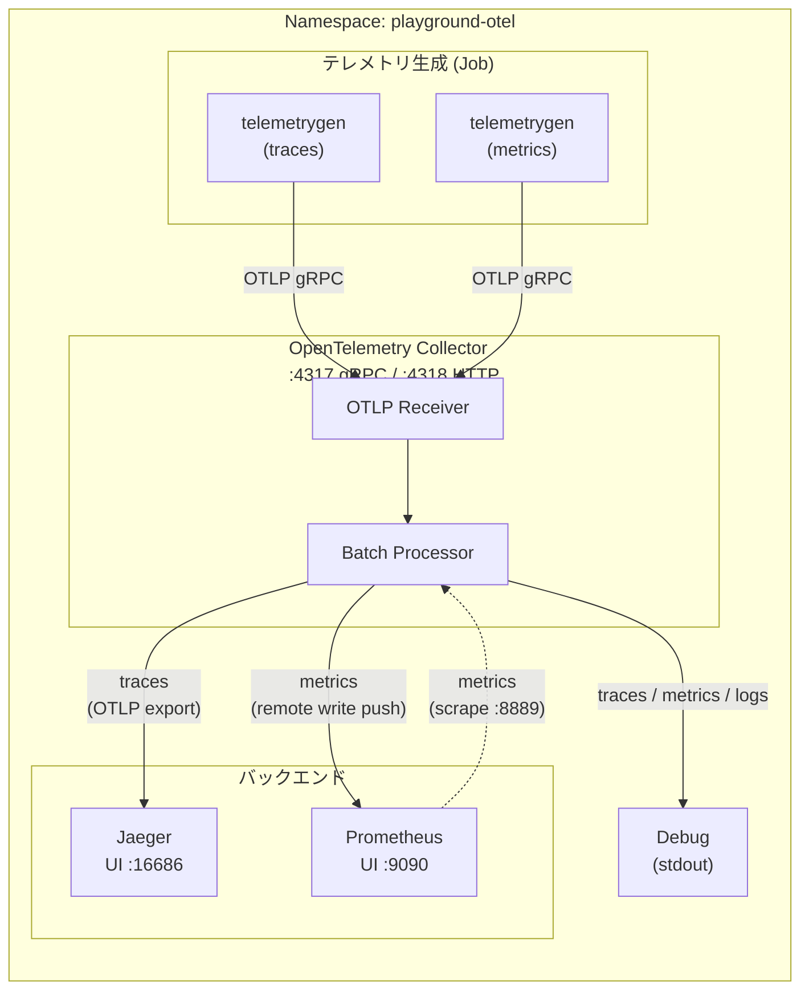

# OpenTelemetry Observability Stack on Kubernetes

Kubernetes 上に構成された OpenTelemetry ベースのオブザーバビリティスタックです。[ローカル版 (Docker Compose)](../otel_local/) と同等の構成をマニフェストで再現しています。

## アーキテクチャ



### コンポーネント一覧

| コンポーネント | イメージ | K8s リソース | 役割 |
|---|---|---|---|
| **Jaeger** | `jaegertracing/all-in-one` | Deployment + Service | 分散トレーシングバックエンド＆UI |
| **Prometheus** | `prom/prometheus` | Deployment + Service | メトリクス収集・クエリエンジン |
| **OpenTelemetry Collector** | `otel/opentelemetry-collector-contrib` | Deployment + Service | テレメトリの受信・処理・エクスポート |
| **telemetrygen (traces)** | `opentelemetry-collector-contrib/telemetrygen` | Job | サンプルトレースを生成（5 分間） |
| **telemetrygen (metrics)** | `opentelemetry-collector-contrib/telemetrygen` | Job | サンプルメトリクスを生成（5 分間） |

### ファイル構成

| ファイル | 内容 |
|---|---|
| `namespace.yaml` | `playground-otel` Namespace |
| `configmap-otel-collector.yaml` | OTel Collector 設定 (ConfigMap) |
| `configmap-prometheus.yaml` | Prometheus 設定 (ConfigMap) |
| `jaeger.yaml` | Jaeger Deployment + Service |
| `prometheus.yaml` | Prometheus Deployment + Service |
| `otel-collector.yaml` | OTel Collector Deployment + Service |
| `job-telemetrygen-traces.yaml` | トレース生成 Job |
| `job-telemetrygen-metrics.yaml` | メトリクス生成 Job |

## データフロー

### トレース

```
アプリ / telemetrygen → OTLP (gRPC :4317) → OTel Collector → Jaeger
```

### メトリクス

```
アプリ / telemetrygen → OTLP (gRPC :4317) → OTel Collector → Prometheus (Remote Write + Scrape)
```

### ログ

```
アプリ → OTLP (gRPC :4317) → OTel Collector → Debug (stdout)
```

## 利用方法

### デプロイ

```shell
# 全マニフェストを一括適用
kubectl apply -f .
```

### Pod の状態確認

```shell
kubectl get all -n playground-otel
```

### UI へのアクセス (port-forward)

| サービス | コマンド | URL |
|---|---|---|
| Jaeger UI | `kubectl port-forward -n playground-otel svc/jaeger 16686:16686` | http://localhost:16686 |
| Prometheus UI | `kubectl port-forward -n playground-otel svc/prometheus 9090:9090` | http://localhost:9090 |

### 動作確認

デプロイ後、`telemetrygen` Job が自動的にサンプルデータ（トレース・メトリクス）を 5 分間、1 req/s のレートで OpenTelemetry Collector へ送信します。

1. **トレースの確認**: [Jaeger UI](http://localhost:16686) を開き、Service ドロップダウンから `telemetrygen` を選択して Search をクリック
2. **メトリクスの確認**: [Prometheus UI](http://localhost:9090) を開き、クエリ入力欄に `gen` と入力して候補からメトリクスを選択

### 自分のアプリケーションからテレメトリを送信する

同一クラスタ内のアプリケーションから、以下のエンドポイントへテレメトリを送信できます。

| プロトコル | エンドポイント (同一 Namespace) | エンドポイント (他 Namespace) |
|---|---|---|
| OTLP gRPC | `otel-collector:4317` | `otel-collector.playground-otel.svc.cluster.local:4317` |
| OTLP HTTP | `otel-collector:4318` | `otel-collector.playground-otel.svc.cluster.local:4318` |

環境変数の設定例:

```shell
export OTEL_EXPORTER_OTLP_ENDPOINT="http://otel-collector.playground-otel.svc.cluster.local:4317"
```

### テレメトリ生成 Job の再実行

Job は完了後に再実行できません。再度テレメトリを生成したい場合は、既存の Job を削除してから再作成してください。

```shell
kubectl delete job telemetrygen-traces telemetrygen-metrics -n playground-otel
kubectl apply -f job-telemetrygen-traces.yaml -f job-telemetrygen-metrics.yaml
```

### クリーンアップ

```shell
# 全リソースを削除
kubectl delete -f .
```
