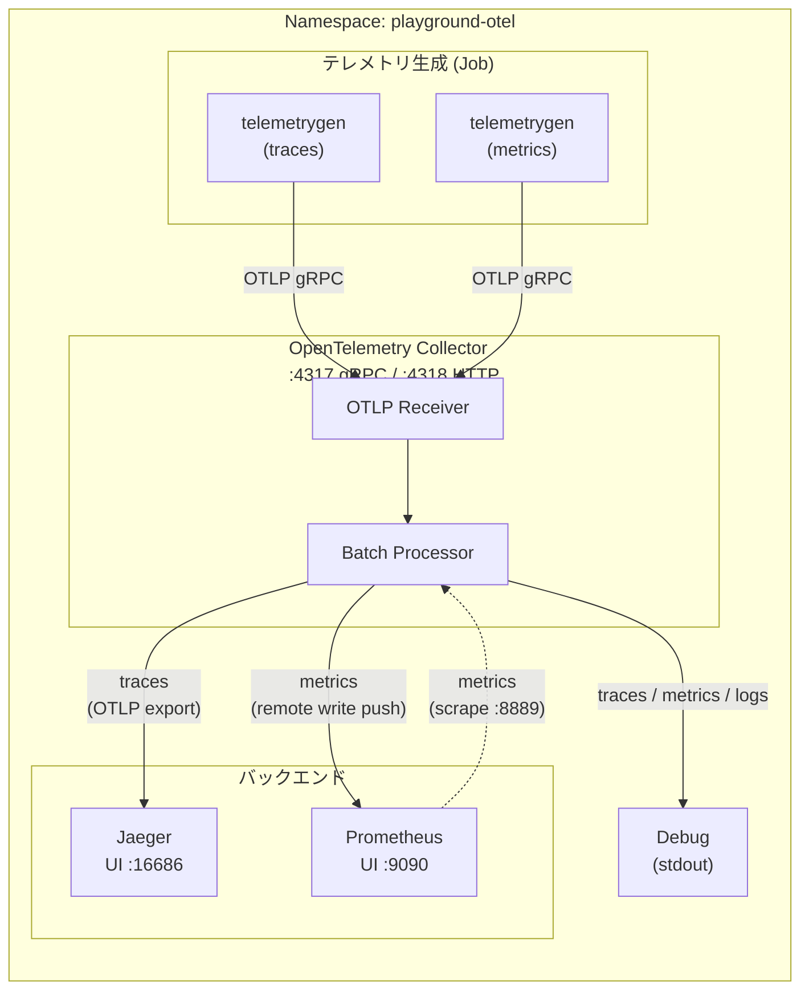

# OpenTelemetry Observability Stack on Kubernetes

Kubernetes 上に構成された OpenTelemetry ベースのオブザーバビリティスタックです。[ローカル版 (Docker Compose)](../otel_local/) と同等の構成をマニフェストで再現しています。

## このシナリオで学べること

このハンズオンを通じて、**Kubernetes** と **OpenTelemetry** の両方を実践的に学ぶことができます。

### Kubernetes の基礎

| トピック | 学べるファイル | 解説 |
|---|---|---|
| **Namespace** | `namespace.yaml` | リソースの論理的な分離単位。`playground-otel` Namespace を作成し、全リソースをこの中に配置する |
| **Deployment** | `jaeger.yaml`, `prometheus.yaml`, `otel-collector.yaml` | Pod のレプリカ管理。`replicas`, `selector`, `template` の構造を理解する |
| **Service (ClusterIP)** | 各 `---` 以降の Service 定義 | クラスタ内 DNS によるサービスディスカバリ。`otel-collector:4317` のように名前でアクセスできる仕組み |
| **ConfigMap** | `configmap-otel-collector.yaml`, `configmap-prometheus.yaml` | 設定ファイルを Pod から分離して管理する方法。`volumeMounts` + `subPath` でファイルとしてマウント |
| **Job** | `job-telemetrygen-traces.yaml`, `job-telemetrygen-metrics.yaml` | 一度きりのバッチ処理。`backoffLimit` によるリトライ制御、`restartPolicy: Never` の意味 |
| **Label / Selector** | 全ファイル | `app.kubernetes.io/name`, `app.kubernetes.io/part-of` などの推奨ラベル規約と、`selector.matchLabels` による Pod の紐付け |
| **Resource Requests / Limits** | 全 Deployment / Job | CPU・メモリのリソース管理。`requests` (最低保証) と `limits` (上限) の違い |
| **Readiness Probe** | `otel-collector.yaml`, `jaeger.yaml`, `prometheus.yaml` | Pod がトラフィックを受け入れ可能かのヘルスチェック。`httpGet` による HTTP ベースのプローブ |
| **Port Forward** | README の利用方法 | `kubectl port-forward` によるローカルからクラスタ内サービスへのアクセス |
| **一時 Pod (kubectl run)** | README の動作確認 | `kubectl run --rm -it` でデバッグ用の使い捨て Pod を起動する手法 |

### OpenTelemetry の基礎

| トピック | 学べるファイル | 解説 |
|---|---|---|
| **テレメトリの 3 本柱** | 全体構成 | トレース (Traces)、メトリクス (Metrics)、ログ (Logs) の 3 種類のテレメトリデータを実際に扱う |
| **OTLP プロトコル** | `configmap-otel-collector.yaml` | OpenTelemetry 標準の通信プロトコル。gRPC (`:4317`) と HTTP (`:4318`) の 2 種類 |
| **Collector パイプライン** | `configmap-otel-collector.yaml` | `receivers → processors → exporters` のパイプライン構造を理解する |
| **Receiver** | `configmap-otel-collector.yaml` | `otlp` receiver による gRPC/HTTP でのデータ受信 |
| **Processor** | `configmap-otel-collector.yaml` | `batch` processor によるデータのバッファリングと一括送信 |
| **Exporter** | `configmap-otel-collector.yaml` | `otlp/jaeger` (トレース)、`prometheus` / `prometheusremotewrite` (メトリクス)、`debug` (stdout) の使い分け |
| **Extension** | `configmap-otel-collector.yaml` | `health_check` extension によるヘルスチェックエンドポイントの提供 |
| **telemetrygen** | `job-telemetrygen-*.yaml` | 公式テストツールによるサンプルテレメトリの生成方法 |

### 分散トレーシング (Jaeger)

| トピック | 解説 |
|---|---|
| **Trace / Span の概念** | Jaeger UI でトレースを検索し、Span のツリー構造を確認する |
| **Service Name** | `service.name` 属性によるサービスの識別方法 |
| **OTLP によるエクスポート** | OTel Collector から Jaeger への OTLP gRPC エクスポートの設定 |

### メトリクス (Prometheus)

| トピック | 解説 |
|---|---|
| **Scrape と Remote Write** | Prometheus がメトリクスを取得する 2 つの方法を体験する |
| **PromQL** | Prometheus UI でクエリを書いてメトリクスを可視化する |
| **scrape_configs** | `configmap-prometheus.yaml` で OTel Collector のメトリクスエンドポイント (`:8889`) をスクレイプ対象に設定 |

---

## アーキテクチャ



### コンポーネント一覧

| コンポーネント | イメージ | K8s リソース | 役割 |
|---|---|---|---|
| **Jaeger** | `jaegertracing/all-in-one` | Deployment + Service | 分散トレーシングバックエンド＆UI |
| **Prometheus** | `prom/prometheus` | Deployment + Service | メトリクス収集・クエリエンジン |
| **OpenTelemetry Collector** | `otel/opentelemetry-collector-contrib` | Deployment + Service | テレメトリの受信・処理・エクスポート |
| **telemetrygen (traces)** | `ghcr.io/open-telemetry/opentelemetry-collector-contrib/telemetrygen` | Job | サンプルトレースを生成（5 分間） |
| **telemetrygen (metrics)** | `ghcr.io/open-telemetry/opentelemetry-collector-contrib/telemetrygen` | Job | サンプルメトリクスを生成（5 分間） |

### ファイル構成

| ファイル | 内容 |
|---|---|
| `namespace.yaml` | `playground-otel` Namespace |
| `configmap-otel-collector.yaml` | OTel Collector 設定 (ConfigMap) |
| `configmap-prometheus.yaml` | Prometheus 設定 (ConfigMap) |
| `jaeger.yaml` | Jaeger Deployment + Service |
| `prometheus.yaml` | Prometheus Deployment + Service |
| `otel-collector.yaml` | OTel Collector Deployment + Service |
| `job-telemetrygen-traces.yaml` | トレース生成 Job |
| `job-telemetrygen-metrics.yaml` | メトリクス生成 Job |

> **注意**: 全マニフェストのイメージタグは `:latest` を使用しています。本番環境では再現性・安定性のために特定バージョンへのピン留め（例: `jaegertracing/all-in-one:1.62`）を推奨します。

## データフロー

### トレース

```
アプリ / telemetrygen → OTLP (gRPC :4317) → OTel Collector → Jaeger
```

### メトリクス

```
アプリ / telemetrygen → OTLP (gRPC :4317) → OTel Collector → Prometheus (Remote Write + Scrape)
```

### ログ

```
アプリ → OTLP (gRPC :4317) → OTel Collector → Debug (stdout)
```

## 利用方法

### デプロイ

```shell
# Namespace を先に作成（他リソースが参照するため）
kubectl apply -f namespace.yaml

# 残りのマニフェストを一括適用
kubectl apply -f .
```

### Pod の状態確認

```shell
kubectl get all -n playground-otel
```

### UI へのアクセス (port-forward)

| サービス | コマンド | URL |
|---|---|---|
| Jaeger UI | `kubectl port-forward -n playground-otel svc/jaeger 16686:16686` | http://localhost:16686 |
| Prometheus UI | `kubectl port-forward -n playground-otel svc/prometheus 9090:9090` | http://localhost:9090 |

### 動作確認

デプロイ後、`telemetrygen` Job が自動的にサンプルデータ（トレース・メトリクス）を 5 分間、1 req/s のレートで OpenTelemetry Collector へ送信します。

1. **トレースの確認**: [Jaeger UI](http://localhost:16686) を開き、Service ドロップダウンから `telemetrygen` を選択して Search をクリック
2. **メトリクスの確認**: [Prometheus UI](http://localhost:9090) を開き、クエリ入力欄に `gen` と入力して候補からメトリクスを選択

### 自分のアプリケーションからテレメトリを送信する

同一クラスタ内のアプリケーションから、以下のエンドポイントへテレメトリを送信できます。

| プロトコル | エンドポイント (同一 Namespace) | エンドポイント (他 Namespace) |
|---|---|---|
| OTLP gRPC | `otel-collector:4317` | `otel-collector.playground-otel.svc.cluster.local:4317` |
| OTLP HTTP | `otel-collector:4318` | `otel-collector.playground-otel.svc.cluster.local:4318` |

環境変数の設定例:

```shell
export OTEL_EXPORTER_OTLP_ENDPOINT="http://otel-collector.playground-otel.svc.cluster.local:4317"
```

#### kubectl から CLI でテレメトリを送信する

クラスタ内に一時的な Pod を起動し、CLI でテレメトリを送信して動作確認できます。

**1. telemetrygen でトレースを送信する**

```shell
kubectl run telemetrygen-test --rm -it --restart=Never \
  -n playground-otel \
  --image=ghcr.io/open-telemetry/opentelemetry-collector-contrib/telemetrygen:latest \
  -- traces --otlp-endpoint otel-collector:4317 --otlp-insecure --traces 5 --service my-test-service
```

**2. telemetrygen でメトリクスを送信する**

```shell
kubectl run telemetrygen-metrics-test --rm -it --restart=Never \
  -n playground-otel \
  --image=ghcr.io/open-telemetry/opentelemetry-collector-contrib/telemetrygen:latest \
  -- metrics --otlp-endpoint otel-collector:4317 --otlp-insecure --metrics 5 --service my-test-service
```

**3. telemetrygen でログを送信する**

```shell
kubectl run telemetrygen-logs-test --rm -it --restart=Never \
  -n playground-otel \
  --image=ghcr.io/open-telemetry/opentelemetry-collector-contrib/telemetrygen:latest \
  -- logs --otlp-endpoint otel-collector:4317 --otlp-insecure --logs 5 --service my-test-service
```

**4. curl で OTLP HTTP エンドポイントにトレースを送信する**

```shell
kubectl run curl-test --rm -it --restart=Never \
  -n playground-otel \
  --image=curlimages/curl:latest \
  -- curl -X POST http://otel-collector:4318/v1/traces \
    -H "Content-Type: application/json" \
    -d '{
      "resourceSpans": [{
        "resource": {
          "attributes": [{"key": "service.name", "value": {"stringValue": "curl-test"}}]
        },
        "scopeSpans": [{
          "scope": {"name": "manual-test"},
          "spans": [{
            "traceId": "01020304050607080102040810203040",
            "spanId": "0102040810203040",
            "name": "hello-from-curl",
            "kind": 1,
            "startTimeUnixNano": "1000000000",
            "endTimeUnixNano": "2000000000",
            "status": {}
          }]
        }]
      }]
    }'
```

> **ヒント**: `kubectl run --rm -it` を使うと、コマンド終了後に Pod が自動的に削除されます。送信後に Jaeger UI や Prometheus UI で `my-test-service` や `curl-test` をサービス名として検索すると結果を確認できます。

### テレメトリ生成 Job の再実行

Job は完了後に再実行できません。再度テレメトリを生成したい場合は、既存の Job を削除してから再作成してください。

```shell
kubectl delete job telemetrygen-traces telemetrygen-metrics -n playground-otel
kubectl apply -f job-telemetrygen-traces.yaml -f job-telemetrygen-metrics.yaml
```

### クリーンアップ

```shell
# 全リソースを削除
kubectl delete -f .
```

---

## ハンズオン演習

以下の演習を順番に進めることで、このスタックの仕組みをより深く理解できます。

### 演習 1: Kubernetes マニフェストを読み解く

各マニフェストを読みながら以下を確認してください。

1. **Namespace**: `namespace.yaml` を開き、`metadata.labels` に設定されている `app.kubernetes.io/part-of: otel-stack` が他のリソースにも共通して付与されていることを確認する
2. **Deployment と Service の関係**: `otel-collector.yaml` を例に、Deployment の `spec.selector.matchLabels` と Service の `spec.selector` が同じラベルで紐付いていることを確認する
3. **ConfigMap のマウント**: `otel-collector.yaml` の `volumeMounts` と `volumes` セクションを見て、ConfigMap の内容がコンテナのどのパスにマウントされるか確認する

```shell
# ConfigMap の中身を確認
kubectl get configmap otel-collector-config -n playground-otel -o yaml

# Pod 内のマウントされたファイルを直接確認
kubectl exec -n playground-otel deploy/otel-collector -- cat /etc/otelcol-contrib/config.yaml
```

### 演習 2: デプロイとリソース状態の確認

```shell
# 1. Namespace を作成
kubectl apply -f namespace.yaml

# 2. 全リソースをデプロイ
kubectl apply -f .

# 3. 全リソースの状態を確認
kubectl get all -n playground-otel

# 4. Pod のログを確認（OTel Collector の debug exporter 出力が見える）
kubectl logs -n playground-otel deploy/otel-collector --follow

# 5. Pod の詳細を確認（Events セクションでスケジューリングやプローブの成否がわかる）
kubectl describe pod -n playground-otel -l app.kubernetes.io/name=otel-collector

# 6. ConfigMap の一覧を確認
kubectl get configmap -n playground-otel
```

### 演習 3: OTel Collector パイプラインを理解する

`configmap-otel-collector.yaml` を読み、パイプラインの流れを追います。

```yaml
# パイプライン構造
service:
  pipelines:
    traces:
      receivers: [otlp]       # ← gRPC/HTTP で受信
      processors: [batch]      # ← バッチ処理でまとめる
      exporters: [otlp/jaeger, debug]  # ← Jaeger + stdout に送信
    metrics:
      receivers: [otlp]
      processors: [batch]
      exporters: [prometheus, prometheusremotewrite, debug]
    logs:
      receivers: [otlp]
      processors: [batch]
      exporters: [debug]       # ← ログは現在 stdout のみ
```

**確認ポイント**:

- `traces` パイプラインは `otlp/jaeger` エクスポーターで Jaeger に送信される
- `metrics` パイプラインは `prometheus` (スクレイプ用エンドポイント公開) と `prometheusremotewrite` (プッシュ) の 2 つの方法でメトリクスを Prometheus に送っている
- `debug` エクスポーターにより、全テレメトリが Collector の stdout にも出力される

```shell
# Collector のログで debug exporter の出力を確認
kubectl logs -n playground-otel deploy/otel-collector | head -100
```

### 演習 4: トレースの送信と Jaeger での確認

```shell
# 1. Jaeger UI にアクセス
kubectl port-forward -n playground-otel svc/jaeger 16686:16686 &

# 2. telemetrygen でトレースを手動送信
kubectl run trace-test --rm -it --restart=Never \
  -n playground-otel \
  --image=ghcr.io/open-telemetry/opentelemetry-collector-contrib/telemetrygen:latest \
  -- traces --otlp-endpoint otel-collector:4317 --otlp-insecure --traces 10 --service my-app

# 3. http://localhost:16686 を開く
# 4. Service ドロップダウンから「my-app」を選択して Search をクリック
# 5. トレースをクリックして Span のツリー構造を確認
```

**学びのポイント**:

- 1 つの Trace は複数の Span で構成される
- `service.name` がサービスの識別に使われる
- Span には開始時刻・終了時刻・ステータスなどの属性がある

### 演習 5: メトリクスの送信と Prometheus での確認

```shell
# 1. Prometheus UI にアクセス
kubectl port-forward -n playground-otel svc/prometheus 9090:9090 &

# 2. telemetrygen でメトリクスを手動送信
kubectl run metrics-test --rm -it --restart=Never \
  -n playground-otel \
  --image=ghcr.io/open-telemetry/opentelemetry-collector-contrib/telemetrygen:latest \
  -- metrics --otlp-endpoint otel-collector:4317 --otlp-insecure --metrics 10 --service my-app

# 3. http://localhost:9090 を開く
# 4. クエリ入力欄に以下を入力して Execute
```

**試してみる PromQL クエリ**:

```promql
# telemetrygen が生成したメトリクスを検索
{job="otel-collector"}

# 特定のメトリクス名で検索
gen

# Prometheus 自身のメトリクス（例: スクレイプの成功数）
up
```

**学びのポイント**:

- Prometheus ではラベルベースでメトリクスをフィルタする
- OTel Collector は `:8889` ポートでメトリクスをエクスポートし、Prometheus がスクレイプする
- Remote Write により Collector からプッシュでもメトリクスが送信される
- Prometheus が Remote Write を受け付けるには `--web.enable-remote-write-receiver` フラグが必要（`prometheus.yaml` の `args` で有効化済み）

### 演習 6: ログの送信と確認

現在のスタックではログは `debug` エクスポーター (stdout) のみに出力されます。

```shell
# 1. telemetrygen でログを送信
kubectl run logs-test --rm -it --restart=Never \
  -n playground-otel \
  --image=ghcr.io/open-telemetry/opentelemetry-collector-contrib/telemetrygen:latest \
  -- logs --otlp-endpoint otel-collector:4317 --otlp-insecure --logs 5 --service my-app

# 2. OTel Collector のログで受信されたログデータを確認
kubectl logs -n playground-otel deploy/otel-collector | grep -A 5 "LogRecord"
```

**学びのポイント**:

- OpenTelemetry ではログもトレース・メトリクスと同じ OTLP プロトコルで送信できる
- 現在の構成ではログバックエンドがないため `debug` exporter で stdout に出力される
- Loki などのバックエンドを追加すれば、ログの永続化・検索が可能になる

### 演習 7: OTLP HTTP API を直接叩く

curl でトレースデータの JSON を直接送信し、OTLP プロトコルの構造を理解します。

```shell
kubectl run curl-trace --rm -it --restart=Never \
  -n playground-otel \
  --image=curlimages/curl:latest \
  -- curl -X POST http://otel-collector:4318/v1/traces \
    -H "Content-Type: application/json" \
    -d '{
      "resourceSpans": [{
        "resource": {
          "attributes": [{"key": "service.name", "value": {"stringValue": "curl-handson"}}]
        },
        "scopeSpans": [{
          "scope": {"name": "manual-test"},
          "spans": [{
            "traceId": "aaaabbbbccccddddeeee111122223333",
            "spanId": "aaaa111122223333",
            "name": "my-handson-span",
            "kind": 1,
            "startTimeUnixNano": "1700000000000000000",
            "endTimeUnixNano": "1700000001000000000",
            "status": {}
          }]
        }]
      }]
    }'
```

Jaeger UI で `curl-handson` サービスを検索し、`my-handson-span` という Span が表示されることを確認します。

**学びのポイント**:

- OTLP HTTP は JSON 形式でテレメトリを送信できる
- `traceId` と `spanId` は 16 進数の一意な識別子
- `resourceSpans` > `scopeSpans` > `spans` という階層構造
- `startTimeUnixNano` / `endTimeUnixNano` で Span の時間範囲を指定

### 演習 8: Kubernetes のリソース管理を確認する

各 Pod のリソース使用状況を確認します。

```shell
# Pod のリソース requests/limits を確認
kubectl get pods -n playground-otel -o custom-columns=\
NAME:.metadata.name,\
CPU_REQ:.spec.containers[0].resources.requests.cpu,\
CPU_LIM:.spec.containers[0].resources.limits.cpu,\
MEM_REQ:.spec.containers[0].resources.requests.memory,\
MEM_LIM:.spec.containers[0].resources.limits.memory

# metrics-server が有効な場合、実際の使用量を確認（AKS ではデフォルトで有効）
kubectl top pods -n playground-otel
```

**学びのポイント**:

- `requests` はスケジューリング時に保証される最低リソース量
- `limits` はコンテナが使用できる上限。超えると OOMKilled (メモリ) やスロットリング (CPU) が発生する
- 本番環境では適切な値を設定することが安定稼働の鍵

### 演習 9: Readiness Probe の動作を確認する

```shell
# OTel Collector の Readiness Probe エンドポイントに直接アクセス
kubectl run probe-test --rm -it --restart=Never \
  -n playground-otel \
  --image=curlimages/curl:latest \
  -- curl -s http://otel-collector:13133/

# Jaeger の Readiness Probe
kubectl run probe-test-jaeger --rm -it --restart=Never \
  -n playground-otel \
  --image=curlimages/curl:latest \
  -- curl -s http://jaeger:16686/ | head -5

# Probe の設定と状態を確認
kubectl describe deploy otel-collector -n playground-otel | grep -A 5 "Readiness"
```

> **補足**: `jaegertracing/all-in-one` や `otel/opentelemetry-collector-contrib` イメージには `wget` や `curl` が含まれていない場合があるため、一時 Pod を使ってクラスタ内からエンドポイントにアクセスしています。

**学びのポイント**:

- Readiness Probe が失敗すると、Service のエンドポイントから除外されトラフィックが送られなくなる
- `initialDelaySeconds` でコンテナ起動後のウォームアップ時間を確保
- `periodSeconds` でチェック間隔を制御

### 演習 10: Service Discovery とクラスタ内 DNS を体験する

```shell
# 一時 Pod からクラスタ内 DNS を確認
kubectl run dns-test --rm -it --restart=Never \
  -n playground-otel \
  --image=busybox:latest \
  -- nslookup otel-collector

# 別の Namespace からのアクセスには FQDN が必要
kubectl run dns-test --rm -it --restart=Never \
  -n default \
  --image=busybox:latest \
  -- nslookup otel-collector.playground-otel.svc.cluster.local

# Service のエンドポイント（紐付いた Pod の IP）を確認
kubectl get endpoints -n playground-otel
```

**学びのポイント**:

- Kubernetes の Service は `<service-name>.<namespace>.svc.cluster.local` の DNS レコードを自動作成する
- 同一 Namespace 内では `<service-name>` だけでアクセスできる
- `kubectl get endpoints` で Service にどの Pod が紐付いているか確認できる

### 演習 11: Job のライフサイクルを理解する

```shell
# Job の状態を確認
kubectl get jobs -n playground-otel

# Job が作成した Pod のログを確認
kubectl logs -n playground-otel -l app.kubernetes.io/name=telemetrygen-traces

# Job の詳細情報（完了状態、再試行回数など）を確認
kubectl describe job telemetrygen-traces -n playground-otel

# Job の再実行: 完了した Job は再利用できないため、削除して再作成
kubectl delete job telemetrygen-traces -n playground-otel
kubectl apply -f job-telemetrygen-traces.yaml
```

**学びのポイント**:

- Job は Deployment と異なり「完了」を目指すワークロード
- `backoffLimit: 2` により、最大 2 回まで再試行される
- `restartPolicy: Never` により、失敗した Pod は再起動されず新しい Pod が作成される
- 同名の完了済み Job は削除しないと再作成できない

### 演習 12: OTel Collector の設定を変更する

ConfigMap を変更して OTel Collector の動作を変えてみます。

**例: batch processor にタイムアウトを設定する**

`configmap-otel-collector.yaml` の `processors` セクションを以下のように変更します:

```yaml
processors:
  batch:
    timeout: 5s
    send_batch_size: 512
```

```shell
# 1. 変更した ConfigMap を適用
kubectl apply -f configmap-otel-collector.yaml

# 2. Collector を再起動して設定を反映
kubectl rollout restart deploy/otel-collector -n playground-otel

# 3. 再起動後の状態を確認
kubectl rollout status deploy/otel-collector -n playground-otel
```

> **補足**: `kubectl edit` で直接編集する方法もありますが、マニフェストファイルを編集して `kubectl apply -f` で適用する方法を推奨します。変更がファイルとして残るため、Git での管理や変更履歴の追跡が容易になります。

**学びのポイント**:

- ConfigMap の変更だけでは Pod 内のファイルは即座に更新されない場合がある
- `kubectl rollout restart` で Deployment の Pod を再作成して設定を反映
- OTel Collector のパイプラインは設定ファイルで柔軟にカスタマイズできる
- マニフェストファイルを直接編集し `kubectl apply -f` で適用する方法は、GitOps の観点からも望ましい

---

## 発展的な学習

このスタックを拡張して、さらに理解を深めることができます。

| テーマ | ヒント |
|---|---|
| **ログバックエンドの追加** | Loki を追加し、OTel Collector の `logs` パイプラインにエクスポーターを追加する |
| **Grafana ダッシュボード** | Grafana を追加し、Prometheus/Jaeger/Loki をデータソースとして統合ダッシュボードを作成する |
| **HPA によるオートスケール** | OTel Collector の Deployment に HorizontalPodAutoscaler を設定し、負荷に応じたスケーリングを試す |
| **Ingress の設定** | Jaeger/Prometheus の UI を Ingress 経由で公開する |
| **NetworkPolicy** | Namespace 内の通信を制限し、必要なポートのみ許可する |
| **実アプリのインストルメンテーション** | 自作アプリに OpenTelemetry SDK を組み込み、テレメトリを送信する |
| **Helm Chart 化** | このマニフェスト群を Helm Chart としてパッケージングする |
| **Azure Monitor 連携** | OTel Collector から Azure Monitor Exporter でテレメトリを Azure に送信する |

## 参考リンク

- [OpenTelemetry Collector 公式ドキュメント](https://opentelemetry.io/docs/collector/)
- [OpenTelemetry Collector Configuration](https://opentelemetry.io/docs/collector/configuration/)
- [Jaeger 公式ドキュメント](https://www.jaegertracing.io/docs/)
- [Prometheus 公式ドキュメント](https://prometheus.io/docs/)
- [Kubernetes ドキュメント - ConfigMap](https://kubernetes.io/docs/concepts/configuration/configmap/)
- [Kubernetes ドキュメント - Probe](https://kubernetes.io/docs/tasks/configure-pod-container/configure-liveness-readiness-startup-probes/)
- [Kubernetes 推奨ラベル](https://kubernetes.io/docs/concepts/overview/working-with-objects/common-labels/)
- [telemetrygen ツール](https://github.com/open-telemetry/opentelemetry-collector-contrib/tree/main/cmd/telemetrygen)
