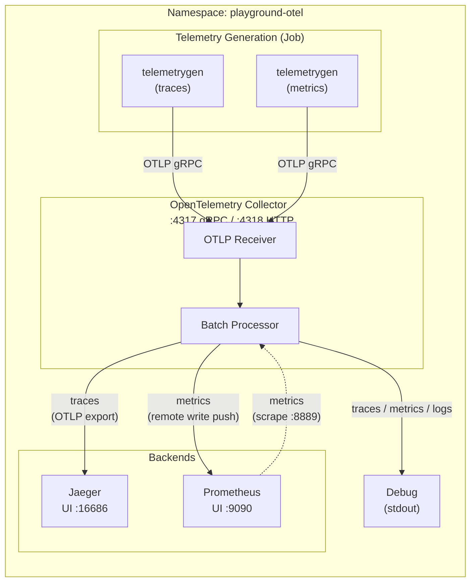

# OpenTelemetry Observability Stack on Kubernetes

This OpenTelemetry observability stack runs on Kubernetes. Its manifests reproduce the configuration of the [local version (Docker Compose)](../otel_local/README.md).

## What You Will Learn

This hands-on scenario provides practical experience with both **Kubernetes** and **OpenTelemetry**.

### Kubernetes Fundamentals

| Topic                          | Files                                                | Description                                                                                                               |
|--------------------------------|------------------------------------------------------|---------------------------------------------------------------------------------------------------------------------------|
| **Namespace**                  | `namespace.yaml`                                     | Creates the `playground-otel` Namespace as a logical boundary and places all resources inside it                          |
| **Deployment**                 | `jaeger.yaml`, `prometheus.yaml`, `otel-collector.yaml` | Manages Pod replicas and demonstrates the `replicas`, `selector`, and `template` structure                              |
| **Service (ClusterIP)**        | Service definitions after each `---`                 | Provides in-cluster DNS service discovery, including name-based access such as `otel-collector:4317`                      |
| **ConfigMap**                  | `configmap-otel-collector.yaml`, `configmap-prometheus.yaml` | Separates configuration from Pods and mounts files with `volumeMounts` and `subPath`                                |
| **Job**                        | `job-telemetrygen-traces.yaml`, `job-telemetrygen-metrics.yaml` | Runs one-time batch processing with `backoffLimit` retry control and `restartPolicy: Never`                       |
| **Label / Selector**           | All files                                            | Uses recommended labels such as `app.kubernetes.io/name` and `app.kubernetes.io/part-of` with `selector.matchLabels`      |
| **Resource Requests / Limits** | All Deployments and Jobs                             | Manages CPU and memory and shows the difference between guaranteed `requests` and maximum `limits`                        |
| **Readiness Probe**            | `otel-collector.yaml`, `jaeger.yaml`, `prometheus.yaml` | Checks whether Pods can accept traffic with HTTP-based `httpGet` probes                                                |
| **Port Forward**               | README usage instructions                            | Accesses in-cluster services locally with `kubectl port-forward`                                                          |
| **Temporary Pod (kubectl run)** | README verification instructions                    | Starts disposable debugging Pods with `kubectl run --rm -it`                                                             |

### OpenTelemetry Fundamentals

| Topic                          | Files                               | Description                                                                                                             |
|--------------------------------|-------------------------------------|-------------------------------------------------------------------------------------------------------------------------|
| **Three pillars of telemetry** | Overall architecture                | Works with the three telemetry data types: traces, metrics, and logs                                                    |
| **OTLP protocol**              | `configmap-otel-collector.yaml`     | Uses the standard OpenTelemetry protocol over gRPC (`:4317`) and HTTP (`:4318`)                                         |
| **Collector pipeline**         | `configmap-otel-collector.yaml`     | Demonstrates the `receivers → processors → exporters` pipeline structure                                                |
| **Receiver**                   | `configmap-otel-collector.yaml`     | Receives data over gRPC and HTTP with the `otlp` receiver                                                               |
| **Processor**                  | `configmap-otel-collector.yaml`     | Buffers and batches data with the `batch` processor                                                                     |
| **Exporter**                   | `configmap-otel-collector.yaml`     | Uses `otlp/jaeger` for traces, `prometheus` / `prometheusremotewrite` for metrics, and `debug` for stdout                |
| **Extension**                  | `configmap-otel-collector.yaml`     | Provides a health-check endpoint with the `health_check` extension                                                       |
| **telemetrygen**               | `job-telemetrygen-*.yaml`           | Generates sample telemetry with the official test tool                                                                  |

### Distributed Tracing (Jaeger)

| Topic                     | Description                                                                        |
|---------------------------|------------------------------------------------------------------------------------|
| **Trace / Span concepts** | Search traces in the Jaeger UI and inspect the Span tree                            |
| **Service Name**          | Identify services with the `service.name` attribute                                |
| **Export over OTLP**      | Configure OTLP gRPC export from the OTel Collector to Jaeger                        |

### Metrics (Prometheus)

| Topic                       | Description                                                                                                  |
|-----------------------------|--------------------------------------------------------------------------------------------------------------|
| **Scrape and Remote Write** | Experience the two methods Prometheus uses to acquire metrics                                                |
| **PromQL**                  | Write queries in the Prometheus UI to visualize metrics                                                     |
| **scrape_configs**          | Configure the OTel Collector metrics endpoint (`:8889`) as a scrape target in `configmap-prometheus.yaml`    |

---

## Architecture


```mermaid
flowchart LR
    subgraph ns["Namespace: playground-otel"]
        subgraph Generators["Telemetry Generation (Job)"]
            GenTraces["telemetrygen<br/>(traces)"]
            GenMetrics["telemetrygen<br/>(metrics)"]
        end

        subgraph Collector["OpenTelemetry Collector<br/>:4317 gRPC / :4318 HTTP"]
            direction TB
            OTLP_IN["OTLP Receiver"]
            Batch["Batch Processor"]
            OTLP_IN --> Batch
        end

        subgraph Backends["Backends"]
            Jaeger["Jaeger<br/>UI :16686"]
            Prometheus["Prometheus<br/>UI :9090"]
        end

        GenTraces -- "OTLP gRPC" --> OTLP_IN
        GenMetrics -- "OTLP gRPC" --> OTLP_IN

        Batch -- "traces<br/>(OTLP export)" --> Jaeger
        Batch -- "metrics<br/>(remote write push)" --> Prometheus
        Prometheus -. "metrics<br/>(scrape :8889)" .-> Batch
        Batch -- "traces / metrics / logs" --> Debug["Debug<br/>(stdout)"]
    end
```

### Components

| Component                   | Image                                                                      | K8s resource          | Role                                       |
|-----------------------------|----------------------------------------------------------------------------|-----------------------|--------------------------------------------|
| **Jaeger**                  | `jaegertracing/all-in-one`                                                 | Deployment + Service  | Distributed tracing backend and UI         |
| **Prometheus**              | `prom/prometheus`                                                          | Deployment + Service  | Metrics collection and query engine        |
| **OpenTelemetry Collector** | `otel/opentelemetry-collector-contrib`                                     | Deployment + Service  | Receives, processes, and exports telemetry |
| **telemetrygen (traces)**   | `ghcr.io/open-telemetry/opentelemetry-collector-contrib/telemetrygen`       | Job                   | Generates sample traces for 5 minutes      |
| **telemetrygen (metrics)**  | `ghcr.io/open-telemetry/opentelemetry-collector-contrib/telemetrygen`       | Job                   | Generates sample metrics for 5 minutes     |

### Files

| File                            | Contents                                  |
|---------------------------------|-------------------------------------------|
| `namespace.yaml` | `playground-otel` Namespace |
| `configmap-otel-collector.yaml` | OTel Collector configuration (ConfigMap) |
| `configmap-prometheus.yaml` | Prometheus configuration (ConfigMap) |
| `jaeger.yaml` | Jaeger Deployment + Service |
| `prometheus.yaml` | Prometheus Deployment + Service |
| `otel-collector.yaml` | OTel Collector Deployment + Service |
| `job-telemetrygen-traces.yaml` | Trace generation Job |
| `job-telemetrygen-metrics.yaml` | Metrics generation Job |

> [!CAUTION]
> All manifests use the `:latest` image tag. Pin specific versions in production, such as `jaegertracing/all-in-one:1.62`, for reproducibility and stability.

## Data Flow

### Traces

```text
Application / telemetrygen → OTLP (gRPC :4317) → OTel Collector → Jaeger
```

### Metrics

```text
Application / telemetrygen → OTLP (gRPC :4317) → OTel Collector → Prometheus (Remote Write + Scrape)
```

### Logs

```text
Application → OTLP (gRPC :4317) → OTel Collector → Debug (stdout)
```

## Usage

### Deploy

```shell
# Create the Namespace first because other resources reference it
kubectl apply -f namespace.yaml

# Apply the remaining manifests together
kubectl apply -f .
```

### Check Pod status

```shell
kubectl get all -n playground-otel
```

### Access the UIs (port-forward)

| Service | Command | URL |
|---|---|---|
| Jaeger UI | `kubectl port-forward -n playground-otel svc/jaeger 16686:16686` | http://localhost:16686 |
| Prometheus UI | `kubectl port-forward -n playground-otel svc/prometheus 9090:9090` | http://localhost:9090 |

### Verify the stack

After deployment, the `telemetrygen` Jobs automatically send sample data (traces and metrics) to the OpenTelemetry Collector at a rate of 1 req/s for 5 minutes.

1. **Verify traces**: Open the [Jaeger UI](http://localhost:16686), select `telemetrygen` from the Service dropdown, and click Search.
2. **Verify metrics**: Open the [Prometheus UI](http://localhost:9090), enter `gen` in the query field, and select a metric from the suggestions.

### Send telemetry from your application

Applications in the same cluster can send telemetry to the following endpoints.

| Protocol | Endpoint (same Namespace) | Endpoint (another Namespace) |
|---|---|---|
| OTLP gRPC | `otel-collector:4317` | `otel-collector.playground-otel.svc.cluster.local:4317` |
| OTLP HTTP | `otel-collector:4318` | `otel-collector.playground-otel.svc.cluster.local:4318` |

Example environment variable:

```shell
export OTEL_EXPORTER_OTLP_ENDPOINT="http://otel-collector.playground-otel.svc.cluster.local:4317"
```

#### Send telemetry from the CLI with kubectl

Start a temporary Pod in the cluster and send telemetry from the CLI to verify the stack.

**1. Send traces with telemetrygen**

```shell
kubectl run telemetrygen-test --rm -it --restart=Never \
  -n playground-otel \
  --image=ghcr.io/open-telemetry/opentelemetry-collector-contrib/telemetrygen:latest \
  -- traces --otlp-endpoint otel-collector:4317 --otlp-insecure --traces 5 --service my-test-service
```

**2. Send metrics with telemetrygen**

```shell
kubectl run telemetrygen-metrics-test --rm -it --restart=Never \
  -n playground-otel \
  --image=ghcr.io/open-telemetry/opentelemetry-collector-contrib/telemetrygen:latest \
  -- metrics --otlp-endpoint otel-collector:4317 --otlp-insecure --metrics 5 --service my-test-service
```

**3. Send logs with telemetrygen**

```shell
kubectl run telemetrygen-logs-test --rm -it --restart=Never \
  -n playground-otel \
  --image=ghcr.io/open-telemetry/opentelemetry-collector-contrib/telemetrygen:latest \
  -- logs --otlp-endpoint otel-collector:4317 --otlp-insecure --logs 5 --service my-test-service
```

**4. Send a trace to the OTLP HTTP endpoint with curl**

```shell
kubectl run curl-test --rm -it --restart=Never \
  -n playground-otel \
  --image=curlimages/curl:latest \
  -- curl -X POST http://otel-collector:4318/v1/traces \
    -H "Content-Type: application/json" \
    -d '{
      "resourceSpans": [{
        "resource": {
          "attributes": [{"key": "service.name", "value": {"stringValue": "curl-test"}}]
        },
        "scopeSpans": [{
          "scope": {"name": "manual-test"},
          "spans": [{
            "traceId": "01020304050607080102040810203040",
            "spanId": "0102040810203040",
            "name": "hello-from-curl",
            "kind": 1,
            "startTimeUnixNano": "1000000000",
            "endTimeUnixNano": "2000000000",
            "status": {}
          }]
        }]
      }]
    }'
```

> [!TIP]
> With `kubectl run --rm -it`, the Pod is deleted automatically after the command exits. After sending telemetry, search for `my-test-service` or `curl-test` as the service name in the Jaeger UI or Prometheus UI.

### Rerun the telemetry generation Jobs

Jobs cannot run again after completion. To generate telemetry again, delete the existing Jobs and recreate them.

```shell
kubectl delete job telemetrygen-traces telemetrygen-metrics -n playground-otel
kubectl apply -f job-telemetrygen-traces.yaml -f job-telemetrygen-metrics.yaml
```

### Clean up

```shell
# Delete all resources
kubectl delete -f .
```

---

## Hands-on Exercises

Complete these exercises in order to develop a deeper understanding of the stack.

### Exercise 1: Read Kubernetes Manifests

Review each manifest and verify the following points.

1. **Namespace**: Open `namespace.yaml` and verify that the `app.kubernetes.io/part-of: otel-stack` value in `metadata.labels` is also applied to the other resources.
2. **Deployment and Service relationship**: In `otel-collector.yaml`, verify that the Deployment's `spec.selector.matchLabels` and the Service's `spec.selector` use the same labels.
3. **ConfigMap mount**: Review the `volumeMounts` and `volumes` sections in `otel-collector.yaml` and identify where the ConfigMap contents are mounted in the container.

```shell
# Inspect the ConfigMap contents
kubectl get configmap otel-collector-config -n playground-otel -o yaml

# Inspect the mounted file directly in the Pod
kubectl exec -n playground-otel deploy/otel-collector -- cat /etc/otelcol-contrib/config.yaml
```

### Exercise 2: Deploy and Check Resource Status

```shell
# 1. Create the Namespace
kubectl apply -f namespace.yaml

# 2. Deploy all resources
kubectl apply -f .

# 3. Check the status of all resources
kubectl get all -n playground-otel

# 4. Check Pod logs for output from the OTel Collector debug exporter
kubectl logs -n playground-otel deploy/otel-collector --follow

# 5. Inspect Pod details for scheduling and probe results in the Events section
kubectl describe pod -n playground-otel -l app.kubernetes.io/name=otel-collector

# 6. List ConfigMaps
kubectl get configmap -n playground-otel
```

### Exercise 3: Understand the OTel Collector Pipeline

Read `configmap-otel-collector.yaml` and follow the pipeline flow.

```yaml
# Pipeline structure
service:
  pipelines:
    traces:
      receivers: [otlp]       # Receive over gRPC/HTTP
      processors: [batch]      # Combine data into batches
      exporters: [otlp/jaeger, debug]  # Send to Jaeger and stdout
    metrics:
      receivers: [otlp]
      processors: [batch]
      exporters: [prometheus, prometheusremotewrite, debug]
    logs:
      receivers: [otlp]
      processors: [batch]
      exporters: [debug]       # Logs currently go only to stdout
```

**Verification points**:

* The `traces` pipeline sends data to Jaeger through the `otlp/jaeger` exporter
* The `metrics` pipeline sends metrics to Prometheus in two ways: `prometheus` exposes a scrape endpoint, and `prometheusremotewrite` pushes data
* The `debug` exporter also writes all telemetry to the Collector's stdout

```shell
# Check debug exporter output in the Collector logs
kubectl logs -n playground-otel deploy/otel-collector | head -100
```

### Exercise 4: Send Traces and Verify Them in Jaeger

```shell
# 1. Access the Jaeger UI
kubectl port-forward -n playground-otel svc/jaeger 16686:16686 &

# 2. Send traces manually with telemetrygen
kubectl run trace-test --rm -it --restart=Never \
  -n playground-otel \
  --image=ghcr.io/open-telemetry/opentelemetry-collector-contrib/telemetrygen:latest \
  -- traces --otlp-endpoint otel-collector:4317 --otlp-insecure --traces 10 --service my-app

# 3. Open http://localhost:16686
# 4. Select "my-app" from the Service dropdown and click Search
# 5. Click a trace and inspect its Span tree
```

**Key takeaways**:

* One Trace consists of multiple Spans
* `service.name` identifies the service
* Spans have attributes such as start time, end time, and status

### Exercise 5: Send Metrics and Verify Them in Prometheus

```shell
# 1. Access the Prometheus UI
kubectl port-forward -n playground-otel svc/prometheus 9090:9090 &

# 2. Send metrics manually with telemetrygen
kubectl run metrics-test --rm -it --restart=Never \
  -n playground-otel \
  --image=ghcr.io/open-telemetry/opentelemetry-collector-contrib/telemetrygen:latest \
  -- metrics --otlp-endpoint otel-collector:4317 --otlp-insecure --metrics 10 --service my-app

# 3. Open http://localhost:9090
# 4. Enter the following in the query field and click Execute
```

**PromQL queries to try**:

```promql
# Search for metrics generated by telemetrygen
{job="otel-collector"}

# Search for a specific metric name
gen

# Query Prometheus metrics, such as successful scrapes
up
```

**Key takeaways**:

* Prometheus filters metrics by label
* The OTel Collector exports metrics on port `:8889`, which Prometheus scrapes
* Remote Write also pushes metrics from the Collector
* Prometheus requires the `--web.enable-remote-write-receiver` flag to accept Remote Write; `prometheus.yaml` enables it in `args`

### Exercise 6: Send and Verify Logs

The current stack sends logs only to the `debug` exporter (stdout).

```shell
# 1. Send logs with telemetrygen
kubectl run logs-test --rm -it --restart=Never \
  -n playground-otel \
  --image=ghcr.io/open-telemetry/opentelemetry-collector-contrib/telemetrygen:latest \
  -- logs --otlp-endpoint otel-collector:4317 --otlp-insecure --logs 5 --service my-app

# 2. Check the received log data in the OTel Collector logs
kubectl logs -n playground-otel deploy/otel-collector | grep -A 5 "LogRecord"
```

**Key takeaways**:

* OpenTelemetry can send logs over the same OTLP protocol as traces and metrics
* The current configuration has no log backend, so the `debug` exporter writes logs to stdout
* Adding a backend such as Loki enables log persistence and search

### Exercise 7: Call the OTLP HTTP API Directly

Send trace data directly as JSON with curl to understand the OTLP protocol structure.

```shell
kubectl run curl-trace --rm -it --restart=Never \
  -n playground-otel \
  --image=curlimages/curl:latest \
  -- curl -X POST http://otel-collector:4318/v1/traces \
    -H "Content-Type: application/json" \
    -d '{
      "resourceSpans": [{
        "resource": {
          "attributes": [{"key": "service.name", "value": {"stringValue": "curl-handson"}}]
        },
        "scopeSpans": [{
          "scope": {"name": "manual-test"},
          "spans": [{
            "traceId": "aaaabbbbccccddddeeee111122223333",
            "spanId": "aaaa111122223333",
            "name": "my-handson-span",
            "kind": 1,
            "startTimeUnixNano": "1700000000000000000",
            "endTimeUnixNano": "1700000001000000000",
            "status": {}
          }]
        }]
      }]
    }'
```

Search for the `curl-handson` service in the Jaeger UI and verify that a Span named `my-handson-span` appears.

**Key takeaways**:

* OTLP HTTP can send telemetry in JSON format
* `traceId` and `spanId` are unique hexadecimal identifiers
* The data uses a `resourceSpans` > `scopeSpans` > `spans` hierarchy
* `startTimeUnixNano` and `endTimeUnixNano` define the Span's time range

### Exercise 8: Inspect Kubernetes Resource Management

Check resource usage for each Pod.

```shell
# Check Pod resource requests and limits
kubectl get pods -n playground-otel -o custom-columns=\
NAME:.metadata.name,\
CPU_REQ:.spec.containers[0].resources.requests.cpu,\
CPU_LIM:.spec.containers[0].resources.limits.cpu,\
MEM_REQ:.spec.containers[0].resources.requests.memory,\
MEM_LIM:.spec.containers[0].resources.limits.memory

# Check actual usage when metrics-server is enabled; AKS enables it by default
kubectl top pods -n playground-otel
```

**Key takeaways**:

* `requests` are the minimum resources guaranteed during scheduling
* `limits` are the maximum resources a container can use; exceeding them causes OOMKilled for memory or throttling for CPU
* Appropriate production values are essential for stable operation

### Exercise 9: Verify Readiness Probe Behavior

```shell
# Access the OTel Collector Readiness Probe endpoint directly
kubectl run probe-test --rm -it --restart=Never \
  -n playground-otel \
  --image=curlimages/curl:latest \
  -- curl -s http://otel-collector:13133/

# Check the Jaeger Readiness Probe
kubectl run probe-test-jaeger --rm -it --restart=Never \
  -n playground-otel \
  --image=curlimages/curl:latest \
  -- curl -s http://jaeger:16686/ | head -5

# Check Probe configuration and status
kubectl describe deploy otel-collector -n playground-otel | grep -A 5 "Readiness"
```

> [!NOTE]
> The `jaegertracing/all-in-one` and `otel/opentelemetry-collector-contrib` images might not include `wget` or `curl`, so a temporary Pod accesses the endpoints from inside the cluster.

**Key takeaways**:

* When a Readiness Probe fails, the Pod is removed from Service endpoints and no longer receives traffic
* `initialDelaySeconds` provides warm-up time after container startup
* `periodSeconds` controls the check interval

### Exercise 10: Explore Service Discovery and In-cluster DNS

```shell
# Check in-cluster DNS from a temporary Pod
kubectl run dns-test --rm -it --restart=Never \
  -n playground-otel \
  --image=busybox:latest \
  -- nslookup otel-collector

# Access from another Namespace requires the FQDN
kubectl run dns-test --rm -it --restart=Never \
  -n default \
  --image=busybox:latest \
  -- nslookup otel-collector.playground-otel.svc.cluster.local

# Check Service endpoints, which are the associated Pod IPs
kubectl get endpoints -n playground-otel
```

**Key takeaways**:

* A Kubernetes Service automatically creates a `<service-name>.<namespace>.svc.cluster.local` DNS record
* Within the same Namespace, the Service is accessible using only `<service-name>`
* `kubectl get endpoints` shows which Pods are associated with a Service

### Exercise 11: Understand the Job Lifecycle

```shell
# Check Job status
kubectl get jobs -n playground-otel

# Check logs from the Pod created by the Job
kubectl logs -n playground-otel -l app.kubernetes.io/name=telemetrygen-traces

# Inspect Job details such as completion status and retry count
kubectl describe job telemetrygen-traces -n playground-otel

# Rerun the Job by deleting and recreating it because completed Jobs cannot be reused
kubectl delete job telemetrygen-traces -n playground-otel
kubectl apply -f job-telemetrygen-traces.yaml
```

**Key takeaways**:

* Unlike a Deployment, a Job is a workload that aims for completion
* `backoffLimit: 2` permits up to two retries
* With `restartPolicy: Never`, failed Pods do not restart; the Job creates new Pods
* A completed Job must be deleted before another Job with the same name can be created

### Exercise 12: Change the OTel Collector Configuration

Change the ConfigMap to modify the OTel Collector's behavior.

**Example: Set a timeout for the batch processor**

Change the `processors` section in `configmap-otel-collector.yaml` as follows:

```yaml
processors:
  batch:
    timeout: 5s
    send_batch_size: 512
```

```shell
# 1. Apply the modified ConfigMap
kubectl apply -f configmap-otel-collector.yaml

# 2. Restart the Collector to apply the configuration
kubectl rollout restart deploy/otel-collector -n playground-otel

# 3. Check status after the restart
kubectl rollout status deploy/otel-collector -n playground-otel
```

> [!NOTE]
> You can edit the resource directly with `kubectl edit`, but editing the manifest file and applying it with `kubectl apply -f` is recommended. The change remains in the file, which makes Git management and history tracking easier.

**Key takeaways**:

* Changing a ConfigMap might not update the file in a Pod immediately
* `kubectl rollout restart` recreates the Deployment's Pods and applies the configuration
* The OTel Collector pipeline can be customized through its configuration file
* Editing manifest files and applying them with `kubectl apply -f` is also preferable from a GitOps perspective

---

## Advanced Learning

Extend the stack to explore these topics in greater depth.

| Topic | Hint |
|---|---|
| **Add a log backend**          | Add Loki and configure an exporter in the OTel Collector `logs` pipeline                                            |
| **Grafana dashboards**         | Add Grafana and create an integrated dashboard with Prometheus, Jaeger, and Loki as data sources                    |
| **Autoscale with HPA**         | Add a HorizontalPodAutoscaler to the OTel Collector Deployment and test load-based scaling                         |
| **Configure Ingress**          | Expose the Jaeger and Prometheus UIs through Ingress                                                                |
| **NetworkPolicy**              | Restrict traffic inside the Namespace and allow only required ports                                                 |
| **Instrument a real application** | Add an OpenTelemetry SDK to your application and send telemetry                                                 |
| **Create a Helm Chart**        | Package these manifests as a Helm Chart                                                                             |
| **Integrate Azure Monitor**    | Send telemetry from the OTel Collector to Azure with Azure Monitor Exporter                                         |

## References

* [Official OpenTelemetry Collector documentation](https://opentelemetry.io/docs/collector/)
* [OpenTelemetry Collector configuration](https://opentelemetry.io/docs/collector/configuration/)
* [Official Jaeger documentation](https://www.jaegertracing.io/docs/)
* [Official Prometheus documentation](https://prometheus.io/docs/)
* [Kubernetes documentation: ConfigMap](https://kubernetes.io/docs/concepts/configuration/configmap/)
* [Kubernetes documentation: Probe](https://kubernetes.io/docs/tasks/configure-pod-container/configure-liveness-readiness-startup-probes/)
* [Recommended Kubernetes labels](https://kubernetes.io/docs/concepts/overview/working-with-objects/common-labels/)
* [telemetrygen tool](https://github.com/open-telemetry/opentelemetry-collector-contrib/tree/main/cmd/telemetrygen)
